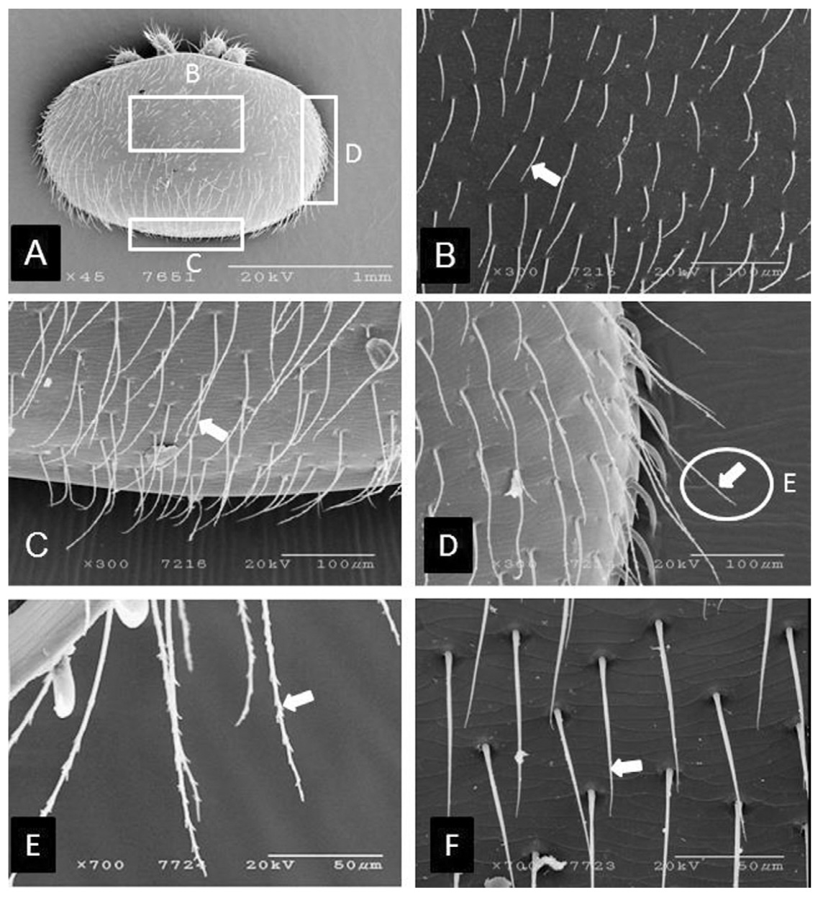
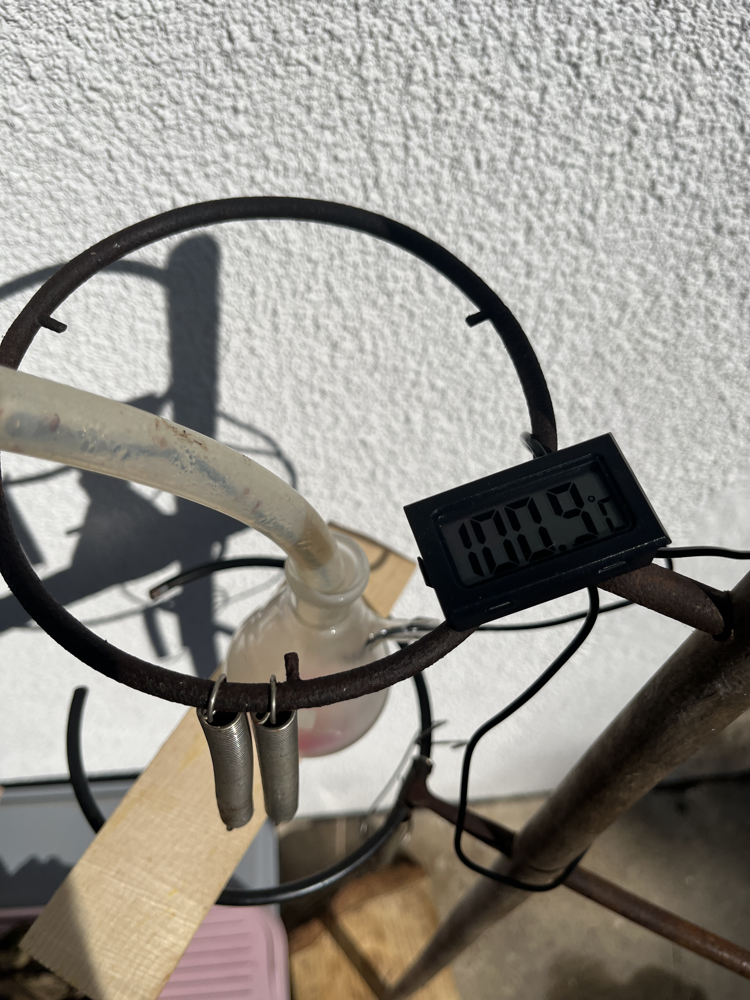

# Badanie skutków prażenia kwasu szczawiowego
Ryszard Styczyński, wrzesień 2024, rstyczynski@gmail.com, wersja 0.1

## Wstęp

Jedną technik walki z dręczem pszczelim jest sublimacja dwuwodnego kwasu szczawiowego. Proces ten polega na prażeniu 1-4g dwuwodnego kwasu szczawiowego w temperaturze 230°C.

## Teoria

Kwas szczawiowy dwuwodny jest silnym kwasem organicznym o symbolu H2C2O4'2H2O o temperaturze przejścia do formy gazowej 100°C. W temperaturze tej dochodzi do utraty cząstek wody z dwuwodnego kwasu szczawiowego.

Pozbawiony wody kwas szczawiowy sublimuje (przejście do formy gazowej) w 157°C, natomiast w temperaturze 189°C dochodzi do jego dekompozycji, w trakcie której rozpada się na kwas mrówkowy HCOOH oraz dwutlenek węgla CO2. W temperaturze 200°C kwas mrówkowy rozpada się na wodę H2O, oraz tlenek węgla CO.

Teoria prowadzi więc do wniosku, że w trakcie prażenia dwuwodnego kwasu szczawiowego dochodzi do powstania pary wodnej oraz dekompozycji bezwodnego już kwasu szczawiowego do HCOOH, H2O, CO, oraz CO2.

### Ilość kwasu szczawiowego w dwuwodnym kwasie szczawiowym

Dwuwodna postać kwasu szczawiowego zawiera w sobie 2 cząsteczki wody na każdą cząsteczkę kwasu szczawiowego. Aby dowiedzieć się ile w każdym gramie tego związku jest wody policzymy używając równań molowych.

Masa molowa kwasu szczawiowego (C₂H₂O₄): 90.03 g/mol, masa molowa wody (H₂O): 18.016 g/mol, zatem masa molowa kwasu szczawiowego dwuwodnego to: 126.06 g/mol. Mając te informacje policzę skład procentowy.

Udział kwasu szczawiowego: 90.03 / 126.06 * 100 = 71%
Udział wody: 2 * 18.016 / 126.06 * 100 = 29 %

Sprawdzenie: 29 + 71 = 100. Obliczenie są prawidłowe.

Oznacza to, że 30% dwuwodnego kwasu szczawiowego to woda, a 70% to bezwodny kwas szczawiowy.

### para wodna

Wiedząc, że 30% dwuwodnego kwasu szczawiowego to woda, mamy pewność, że w trakcie prażenia tego związku otrzymujemy z co najmniej 30% wagi gorącą parę wodną.

Dodatkowa para wodna powstaje wskutek dekompozycji bezwodnego kwasu szczawiowego do kwasu mrówkowego, który dekomponuje się do wody oraz tlenku węgla. Obliczenia idealnej dekompozycji 1g bezwodnego kwasu szczawiowego wskazują, że jest to 0.2 g wody.

### tlenki węgla

Obliczenia idealnej dekompozycji 1g bezwodnego kwasu szczawiowego wskazują, że powstaje 0.488g dwutlenku węgla

Dodatkowy tlenek węgla powstaje wskutek dekompozycji bezwodnego kwasu szczawiowego do kwasu mrówkowego, który dekomponuje się do wody oraz tlenku węgla. Wskutek tej reakcji powstaje 0.311g tlenku węgla.

W sumie w wyniku dekompozycji 1g bezwodnego kwasu szczawiowego powstaje 0.8g tlenków węgla, w tym 0.488g dwutlenku węgla oraz 0.311g tlenku węgla.

> [!CAUTION]
> Tlenek węgla to silnie trujący gaz. Zachowaj ostrożność!

### Rzeczywistość

Ilości wody, bezwodnego kwasu mrówkowego oraz tlenków węgla powstałych z dekompozycji bezwodnego kwasu szczawiowego są wartościami wynikającymi z całkowitego rozkładu, która w rzeczywistości nie wystąpi. Ile kwasu szczawiowego ulegnie dekompozycji, a ile przedostanie się do ula wraz z parą wodną? Odpowiedź na to pytanie była celem niniejszego badania doświadczalnego.

## Praktyka

Pszczelarze stosują kilka urządzeń służących gazowaniu dwuwodnego kwasu szczawiowego:

1. tygiel otwarty grzany spiralą elektryczną
2. tygiel zamknięty grzany gazem
3. zamgławiacz prażący w spirali podgrzewanej gazem
4. tygiel zamknięty grzany elektrycznie z dynamiczną kontrolą temperatury

Oprócz tego na rynku dostępne sa inne urządzenia:

1. tygiel otwarty grzany gorącym powietrzem
2. tygiel otwarty grzany świeczką
3. zamgławiacz prażący nośnik pary z dodaniem czynnika przez zwężkę na wylocie pary

Urządzenia kosztują od 50 zł do blisko dwóch tysięcy złotych. Rozbieżność jest gigantyczna; warto więc zrozumieć czy niezbędne jest inwestowanie z najdroższe urządzenia.

Celem praktycznym pszczelarza jest szybkie wprowadzenie par zawierających kwas szczawiowy do ula. Ekonomika podpowiada, że operacja ta powinna być wykonana możliwie szybko przy zachowanej skuteczności.

## Sublimacja

Teoria mówi, że idealna sublimacja zachodzi w temperaturze 157°C - 189°C. Praktyka mówi natomiast, że w tych temperaturach proces zachodzi niezwykle powoli, co jest nie akceptowalne z uwago na przyjętą technikę zagazowywania ula z zewnątrz.

> [!Note]
> Tylko jedna z technik (nie stosowana jednak w Polsce) wykorzystuje powolne parowanie w podwyższonej temperaturze - jest to technika z tyglem ogrzewanym świeczką.

### Prażenie czystego dwuwodnego kwasu szczawiowego

Temperatura praktykowana przez pszczelarzy to 230°C, albo jak najwyższa dostępna dla danego urządzenia. W tej sytuacji nie jest to jednak sublimacja, ale prażenie, które możemy porównać do wylania wody na gorącą blachę. Woda podskakuje, paruje, wędruję bo gorącej blasze.

Prażenie dwuwodnego kwasu szczawiowego na rozgrzanym do temperatury 230°C palenisku jest procesem daleko wychodzącym poza proces sublimacji. Z uwagi, że mówimy o związku chemicznym składającym się w 30% z wody, mamy operację gwałtownego powstania pary wodnej

### Prażenie roztworu dwuwodnego kwasu szczawiowego

Część technik wykorzystuje roztwór dwuwodnego kwasu szczawiowego w alkoholu, glicerynie lub też wodzie. Roztwór taki podawany jest na spiralę rozpalaną gazem, gdzie następuje dekompozycja roztworu kwasu szczawiowego.

Technika ta jest podobna to tygla - występuję w niej prażenie roztworu kwasu szczawiowego, jest jednak od tygla o tyle doskonalsza, że znacznie większa jest powierzchnia prażenia. Skutki chemiczna są jednak identyczne - następuje lawinowa dekompozycja temperaturowa kwasu szczawiowego do mieszaniny pary wodnej, tlenków węgla, kwasu szczawiowego, oraz nieokreślonej ilości kwasu mrówkowego.

### Dodawanie roztworu dwuwodnego kwasu szczawiowego do pary wodnej

W innej technice - znanej bardziej z sektora walki z robactwem - roztwór podawany jest za pomocą zwężki Venturiego do strumienia gorącej pary wodnej.

Rozwiązania to jest rozwiązaniem idealnym, ponieważ nie powoduje rozpadu temperaturowego kwasu szczawiowego, w związku z czym nie powstają tlenki węgla nie kwas mrówkowy.

Pomimo, że technika ta nie jest aktualnie wykorzystywana w pszczelarstwie, jest to metoda atrakcyjna dla pasiek przemysłowych z uwagi na ekonomikę oraz pewność aplikacji. Podobny jest także nośnik - gorąca para wodna; nie występują jednak tlenki węgla oraz nieokreślona ilość kwasu mrówkowego.

## Działanie na pszczoły i dręcza

Zadymianie ula oparami powstałymi z rozpadu termicznego dwuwodnego kwasu szczawiowego powoduje wprowadzenie do ula mieszaninę gorących tlenków węgla, pary wodnej oraz pewnej (aczkolwiek nieznanej) ilości kwasu mrówkowego.

### Stężenie

30% dwuwodnego kwasu szczawiowego z definicji zmienia się w parę wodną. Z pozostałych 70%, tylko 25% pozostaje w postaci czystego kwasu szczawiowego, a 75% rozpada się na dwutlenek węgla oraz wodę. Z uwagi na brak metod pomiaru ilość kwasu mrówkowego uznaję za znikomy.

Z każdego 1g - 0.3g to para wodna. Z pozostałych 0.7g, 0.12g (17%) przedostaje się jako czysty kwas szczawiowy, a 0.58g rozpada się na 0.46g (80%) tlenków węgla oraz 0.12g (20%) pary wodnej. Finalnie w gazach powstałych ze spalania znajduje się:

1. 0.46g tlenków węgla
2. 0.42g pary wodnej
3. 0.12g kwasu szczawiowego

Spalając dwuwodny kwas szczawiowy, do ula wprowadzamy gorącą mieszaninę o stężeniu kwasu szczawiowego 0.12/1 * 100 = 12%. Co ciekawe znacznie większe stężenie jest tlenków węgla wynosząc 42%.

>[!Note]
> Stężenie oparów jest 3x większe od zalecanego stężenia w postaci roztworu w syropie cukrowym, który prof.Hartwig określiła na 3.61%

W ulu jest powietrze, para wodna oraz dwutlenek węgla, do których dodajmy dodatkowe gazy Niestety nie potrafię tego obliczyć ani oszacować, ale wpływ na stężenie ma niewątpliwie wymieszanie powstałych gazów z gazami znajdującymi się w ulu.

### Krystalizacja

Gorący gazowy roztwór kwasu szczawiowego natychmiast krystalizuje się na każdej zimniejszej powierzchni, pokrywając wszystko co znajduje się w ulu drobinkami kwasu szczawiowego. Jak duże są te drobinki - nie wiem; mogę jednak przypuszczać, że jest to pył rzędu 1-10µm.

Żródło: https://pl.wikipedia.org/wiki/Warroza

### Włoski

Dręcz w porównaniu do pszczoły jest "łysy" co oznacza, że drobinki kwasu moga osadzać się na jego ciele. Analiza zdjęcia dręcza wskazuje, że ma on od 20 do 40 włosków wzdłuż swojego 1.6mm jestestwa. Włoski te są bardzo krótkie, mając około 0.1mm długości, co powoduje, że nie przykrywają ciała dręcza, umożliwiając drobinkom kwasu osiadanie na pancerzu.

Wiedząc, że szerokość samicy dręcza (a tylko samica znajduje się na pszczołach) to 1.6mm możemy przyjąć, że odległość pomiędzy włoskami wynosi 0.04-0.08mm tj. 40-80µm. To jest oczywiście hipoteza, ale możliwe, że właśnie z tego powodu drobinki kwasu szczawiowego osiadają na pancerzu drecza - włoski go nie chronią.

Żródło: https://journal.bee.or.kr/_common/do.php?a=full&b=12&bidx=403&aidx=5142

W przypadku pszczoły drobinki kwasu szczawiowego osiądą na włoskach, co chroni jej odwłok przed działaniem kwasu. Możliwe, że jest to czynnikiem który powoduje, że dręcz ginie, a pszczoła nie doznaje poparzenia silnym kwasem.

Żródło: https://scientificbeekeeping.com/oxalic-acid-heat-vaporization-and-other-methods-part-2-of-2-parts/

## Wątpliwości

Ponieważ proces prażenia dwuwodnego kwasu szczawiowego zachodzi w tyglu 3cm x 3cm nie dochodzi więc do procesu idealnego ogrzewania co skutkuje, że w trakcie tego procesu następuje dehydratacja, sublimacja oraz dekompozycja. Wynikiem tego procesu jest gorąca para wodna niosąca ze sobą kwas szczawiowy

## Doświadczenie

Doświadczenie polegało na prażeniu 4g dwuwodnego kwasu szczawiowego w mosiężnym tyglu. Doświadczalny prażnik został wykonany z elementów hydraulicznych z ogrzewaniem gorącym powietrzem z opalarki 2000W.

Tygiel, wykonany z mosiężnego trójnika, posiada z jednej strony mosiężną rurkę, w której umieszczona jest termopara. Dzieki temu rozwiązaniu - pomiar temperatury dokonywany jest wewnątrz tygla, do pomiaru wykorzystany jest multimetr.

Trójnik kieruje spaliny do kolejnego trójnika - stalowego, w którym znajduje się ujście gazów. Powyżej znajdują sie dwa zawory kulowe, służące do podawania dwuwodnego kwasu szczawiowego. Całość została owinięta taśmą termiczną z włókniny szklanej, co ma minimalizować osiadanie skroplin i krystalizację na elementach palnika.

Doświadczenie wykonane było na zewnątrz przy temperaturze około 20-30°C. Opalarka podgrzewała tygiel przez około 60 sekund do temperatury 230°C, dochodząc do 300°C. Pod wieczór maksymalne temperatura wynosiła 230°C. Większość pomiarów wykonana była przy temperaturze tygla 230-240°C.

Opary odbierane były przez owiniętą taśmą termiczną rurkę silikonową o długości około 10 cm. Rurka wchodziła do kolby z ujściem na gazy. Kolba zanurzona była w zimnej wodzie a ujście gazów z kolby zatkane zostało delikatnie wacikiem. Zatkanie pozwalało na ujście gazów, co miało przeciwdziałać ew. wzrostowi ciśnienia. W kolbie znajdował się pasek lakmusowy, który służył do pomiaru pH.

Prażenie rozpocząłem od 1g co wskazało, że jest to zbyt mała ilość, z uwagi na znikomą produkcję gazów.

Po przeglądzie filmów na YT zrozumiałem, że standardem jest prażenie 4g. Ilość ta wytwarzała zauważalnie istotną ilość gazów - w głównej mierze pary wodnej.

> [!Note]
> Lotny kwas szczawiowy jest słabo lub niewidoczny. To co widzimy w trakcie prażenia to moim zdaniem głównie para wodna.

Przed pomiarami zważyłem kolbę, zapisując że waży 81.37g. Do pomiaru wagu użyłem dostępnej na rynku wagi jubilerskiej.

Pomiędzy pomiarami przepłukiwałem prażnik wodą oraz spirytusem a także przedmuchiwałem sprężonym powietrzem, mając na celu oczyszczenie prażnika oraz rurki odbierającej gaz.

Po każdym z eksperymentów odczekiwałem nieco czasu, aż w kolbie zniknie mgła, co oznacza, że całe opary osiadły na jej ściankach. Kolba po zakończonym doświadczeniu zawierała skropliny pary wodnej oraz mokry kwas szczawiowy.

>[!NOTE]
> Początkowy zestaw zawierał chłodnicę, jednak okazało się, że nie jest to zupełnie potrzebne z uwagi na wystarczający zestaw z kolbą odbiorczą zanurzoną w zimnej wodzie. Opary kwasu szczawiowego niezmiernie szybko krystalizują, osadzając się na każdej zimniejszej powierzchni.

### Odczyn pH

Odczyn pH skroplin odebranych w kolbie wynosił 1 pH, co oznacza że skropliny są silnym kwasem.

### Temperatura gazów

Gaz wydostający się z komory spalania w trakcie doświadczenia miał temperaturę pomiędzy 70°C a 100°C.

### Temperatura komory prażenia

W trakcie prażenia 4g dwuwodnego kwasu szczawiowego zaobserwowałem gwałtowny spadek temperatury komory spalania z 243°C do 178°C tj. o 65°C. Spadek silnie utrzymywał się w trakcie prażenia, wracając do wartości wyjściowej wraz ze zmniejszeniem ilości produkowanych gazów.

### Temperatura rurki

Rurka odbierająca gaz okazała się być chłodnicą. Finalne pomiary wykonywane były po owinięciu rurki taśmą termoizolacyjną.

### Ilość bezwodnego kwasu szczawiowego

Kolejne pomiary wykazały wagę kolby ze skroplinami oraz mokrym kwasem szczawiowym o wadze: 82.79, 82.80, 83.71, 82.11, 82.60, oraz 82.99g.

Dwa ostanie pomiary częściowo odparowałem uzyskując wagę kolby z kwasem szczawiowym 82g oraz 82.24g, co pozwala oszacować, że w oparach znajdowało się 0.6-0.8g bezwodnego kwasu szczawiowego.

## Ilość tlenków węgla oraz pary wodnej

Wiedząc z badania, że prażenia 4g dwuwodnego kwasu szczawiowego powoduje wprowadzenie 0.7g czystego kwasu szczawiowego, dowiadujemy się że 3.3g rozpadło się na produkty dekompozycji termicznej. Nie jestem w stanie stwierdzić ile powstaje kwasu mrówkowego, to powinno być przedmiotem osobnego badania.

## Wnioski

### Kwas dwuwodny to inna substancja niż kwas szczawiowy

Pierwszym bardzo ważnym wnioskiem jest wiedza, że kwas dwuwodny to inna substancja niż kwas szczawiowy, ponieważ zawiera 30% wody. Informacja ta jest kluczowa przy sporządzaniu roztworów kwasu szczawiowego.

### Straty wagowe dwuwodnego kwasu szczawiowego na poziomie 80%

Prażenie 4g dwuwodnego kwasu szczawiowego w temperaturze 230-240°C wytworzyło 0.7g bezwodnego kwasu szczawiowego.

Ponieważ 30% dwuwodnego kwasu szczawiowego to z definicji woda, tak więc w reakcji temperaturowej brało udział 4 * 70% = 2.8g bezwodnego kwasu szczawiowego, co oznacza że 0.7 / 2.8 * 100 = 25% kwasu nie uległo dekompozycji w wyniku działania wysokiej temperatury. 25% dotyczy bezwodnego kwasu szczawiowego. Dla formy dwuwodnej jest to 0.7 / 4 * 100 = 17.5%.

Oznacza to, że 80% z 4g dwuwodnego kwasu szczawiowego uległo dekompozycji w wyniku działania wysokiej temperatury, wytwarzając głównie tlenki węgla oraz wodę.

Biorąc pod uwage taniość kwasu szczawiowego jest to wynik ekonomicznie uzasadniony. Problemem może być wytwarzanie tlenków węgla, co dla purystów ekologicznych powinno być elementem do eliminacji.

### Izolacja rurki odbiorczej 

Rurka odbiorcza jest chłodnicą. Nie powinna być wykonana ze metalu, który jest dobrym przewodnikiem cieplnym Dodatkowo powinna być zaizolowana, tak aby kwas nie krystalizował się na rurce, a para wodna nie skraplała się.

Podobnie z tyglem - ten także powinien być zaizolowany, tak aby nie wytracał ciepła poprzez oddanie go do otoczenia.

Biorąc pod uwagę, że kwas szczawiowy aplikowany jest jesienią, izolacja termiczna rurki odbierające gaz oraz tygla jest bardzo istotna.

### Dwutlenek węgla oraz para wodna

Skutkami ubocznymi prażenia dwuwodnego kwasu szczawiowego są:

1. zwiększenie temperatury w ulu
2. zwiększenie stężenia dwutlenku węgla w ulu

Z uwagi na przeprowadzanie odymiania przy zamkniętych wylotkach w czasie 20 minut, w/w czynniki niewątpliwie wpływają na pszczelą rodzinę oraz na dręcza. Badania wykazują, że zarówno dwutlenek węgla jak i podwyższona temperatura działają zabójczo na dręcza.

### Temperatura spalin

Spaliny mają temperaturę 70-100°C p podnoszą więc temperaturę w ulu. O ile stopni? Nie wiem.

### Roztwór kwasu dwuwodnego

Sporządzając roztwór należy pamiętać, że oryginalna receptura prof.Hartwig stosuje kwas szczawiowy czysty, a nie dwuwodny. Przeliczenie kwasu dwuwodnego do czystego to 70%, ponieważ dwuwodny zawiera 30% wody.

Tak wiec stosując kwas dwuwodny trzeba użyć:

1. 388g wody
2. 400g cukru
3. 42g dwuwodnego kwasu szczawiowego

Sprawdzenie: 30/(388+400+42) * 100 = 3.61%

## Ekonomika zakupu urządzenia

Przeprowadzona analiza teoretyczna oraz badanie praktyczne pokazuje, że nie ma sensu inwestycja w drogie urządzenie kontrolujące temperaturę. Temperatura 230°C nie ma żadnego znaczenia, wpływając jedynie na lawinowość reakcji gazowania. Ważnie jest natomiast aby dostarczyć w trakcie procesu tyle energii, aby temperatura nie spadła poniżej 200°C z uwagi na powstawanie kwasu mrówkowego, chyba że proces jest realizowany w zakresie 157-189°C będąc właściwym procesem sublimacji. Jest to jednak trudne do osiągnięcia oraz nieuzasadnione ekonomicznie przy aktualnych urządzeniach. Zaznaczę, że to z kontrolą mocy grzewczej jest bardzo drogie.

## Optymalne urządzenie

### Spirala ogrzewana gazem

Z uwagi na znaczący spadek temperatury spowodowany rozpadem dwuwodnego kwasu szczawiowego oraz parowaniem wody, należy użyć urządzenia dostarczającego jak najwięcej energii - wydaje się, że optymalnym rozwiązaniem jest urządzenie ze spiralą ogrzewaną palnikiem gazowym.

Nośnikiem kwasu szczawiowego jest para wodna więc stosowanie roztworu wydaje się rozwiązaniem celowym, a właśnie urządzenie spiralne bazują na roztworach.

### Spirala ogrzewana gazem ze zwężką Venturiego

Idealnym urządzeniem jest jednak zamgławiacz stosowany przez profesjonalistów walki z robactwem - ze zwężką Venturiego, powodującą, że roztwór kwasu szczawiowego dodawany jest do strumienia gorącej pary wodnej. Metoda ta nie powoduje rozpadu termicznego kwasu szczawiowego, przez co pszczelarz ma pewność, że tylko para wodna oraz kwas szczawiowy są wprowadzane do ula. Nie występują tutaj tlenki węgla ani kwas mrówkowy.

Oba urządzenia stosują wodny (alkoholowy, glicerynowy?) roztwór kwasu, co poprawia BHP z uwagi na brak pracy w terenie z lotnym proszkiem.

### Tygiel ogrzewany świeczką

Pszczelarze mogą także stosować rozwiązanie najtańsze, choć wymagające otwarcia ula. Rozwiązaniem takim jest tygiel ogrzewany świeczką.

>[!Caution]
> Stosując tą technikę trzeba mieć pewność, że ul nie przewróci się, co mogłoby skutkować pożarem. Tygiel ze świeczką powinien w/g producenta stać w podstawce z wodą.

## Dalsze badania

Kolejne badania powinny określić stężenie roztworu kwasu szczawiowego aplikowanego przy pomocy technik ze spiralami.

Z uwagi na przeprowadzanie odymiania przy zamkniętych wylotkach w czasie 20 minut, kolejne badania powinny wyjaśnić ew. wpływ wzrostu temperatury oraz stężenia dwutlenku węgla na opad dręcza. Badania i praktyka wykazują, że zarówno dwutlenek węgla jak i podwyższona temperatura działają zabójczo na dręcza.

Badania bazujące na wprowadzaniu do ula gorących par powinny standardowo dokonywać pomiaru temperatury oraz dwutlenku węgla.

Celowym jest przeprowadzenie badań z wykorzystaniem chromatografu gazowego tak aby definitywnie zamknąć temat produktów prażenia kwasu szczawiowego.

Celowym jest wykonanie zdjęć mikroskopem skaningowym dręcza oraz pszczoły po aplikacji gorących gazów z kwasem szczawiowym tak aby zweryfikować miejsca osadzania się pyłu kwasu na ciele ubu stworzeń.

Celowym jest także badanie rozpadu termicznego kwasu mrówkowego, aby dowiedzieć się jak skutecznie rozpada się on w temperaturze 230°C tj. ile czystego kwasu mrówkowego wydostaje się z gazami, co jest skutkiem ubocznym lawinowego procesu dekompozycji termicznej.
