= Jeszcze o miodowej komorze

Jeszcze o miodowej komorze

Kiedy w czasopiśmie MV opublikowano mój artykuł dotyczący wykorzystania miodowej komory w pielęgnacji rodzin pszczelich, nie spodziewałem się, jak duże zainteresowanie wzbudzi on wśród pszczelarzy rozpoczynających hodowlę pszczół w ulach wielokorpusowych. Aby uniknąć konieczności odpowiadania na liczne pytania, postanowiłem dokładniej przedstawić zastosowanie miodowej komory za pomocą rysunków.

== Czym jest miodowa komora?

To prawdopodobnie najczęściej zadawane pytanie. Miodowa komora to właściwie korpus wypełniony miodem (dla niektórych może to być tylko odwrócony cukier), który pozostaje w ulu przez cały rok. Jeden pełny niski korpus o wymiarach ramki 44,8 × 15,9 cm może pomieścić około 20 kg zapasów.

W naturze nie zdarza się, aby gniazdo czerwiowe było oddzielone od zapasów matową kratą czy też większą przestrzenią między czerwiem a zapasami. Zasoby zawsze znajdują się w bezpośrednim kontakcie z czerwiem. Jeśli z jakiegoś powodu nastąpi rozdzielenie, pszczoły natychmiast starają się to naprawić. W naturze zapasy miodu tworzą swojego rodzaju „kołdrę”, która otacza gniazdo czerwiowe. Na tej zasadzie opiera się wykorzystanie miodowej komory.

Zapewnienie pszczołom naturalnej przestrzeni, która pozostaje do ich dyspozycji przez cały rok, sprawia, że rodziny pszczele mogą rozwijać się do swojej naturalnej siły i zachowywać prawidłowy skład społeczny. Stała obecność miodowych zapasów przez cały rok ma kluczowy wpływ na kondycję rodziny, jej gotowość do radzenia sobie z różnymi sytuacjami w ciągu sezonu, a w efekcie także na wydajność w produkcji miodu i oszczędność pracy pszczelarza.

W mojej metodzie miodowa komora nigdy nie jest umieszczana pod gniazdem czerwiowym. Dlaczego? W naturze również nie zdarza się, aby zapasy znajdowały się blisko wylotka, gdzie byłyby narażone na ataki wrogów.

== I. Rozszerzanie przestrzeni ulowej nad miodową komorą

Ten sposób prowadzenia pasieki sprawia, że pszczoły składają nektar z pożytku częściowo wokół gniazda czerwiowego (pod miodową komorą), a częściowo nad nią. W ten sposób można w prosty sposób pozyskiwać miód odmianowy, przede wszystkim kwiatowy. Można także w wyznaczonych korpusach skoncentrować melicytozę, co miało miejsce w mojej pasiece w Bezvel w październiku 2004 roku.

Do górnych korpusów pszczoły nie przenoszą starych zapasów przez miodową komorę lub robią to tylko w minimalnym stopniu, ponieważ pszczoły nie wykonują zbędnych działań. Ta obserwacja jest również przydatna podczas zimowania na miodzie, jeśli wcześniej zadbamy o zaopatrzenie rodzin pszczelich w zapasy na zimę. Metoda ta jest również korzystna, gdy mamy wystarczającą liczbę rezerwowych korpusów z suszem i nie chcemy lub nie potrzebujemy, aby pszczoły budowały więcej plastrów.

Rozszerzanie przestrzeni ulowej o korpusy z suszem nad miodową komorę jest także mniej czasochłonne i wymagające fizycznie. Powoduje szybsze i intensywniejsze zapełnianie gniazda czerwiowego nektarem. Może to jednak prowadzić do sytuacji, w której nasze rodziny pszczele są nieco mniej liczne, ponieważ zmniejszenie powierzchni czerwiu w przyszłości skutkuje mniejszą liczbą nowo narodzonych pszczół. Nie zawsze musi to być wada – kluczowe znaczenie mają tutaj genetyczne cechy pszczół oraz ogólna kondycja rodzin.

To właśnie kondycja, na którą naturalne zapasy miodu mają znaczący wpływ, jest najważniejsza. Osobiście preferuję pszczoły mniej płodne, ale liczebnie stabilne, kondycyjnie silne i długowieczne. Te wymagania doskonale spełniają na przykład linie Vigor i Lesana, które w naszym Kole Pszczelarskim Mladá Boleslav hoduje około 90% pszczelarzy.

Poniższe schematy ilustrują standardowe sytuacje, jakie mogą wystąpić w zależności od pożytku.

Rysunek nr 1. Stan przed rozszerzeniem

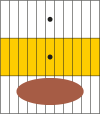
Rysunek nr 2. Stan po rozszerzeniu o korpus nad miodową komorę

Rodzina pszczela składa zapasy w korpusie nad miodową komorą, co pozwala w ten sposób uzyskać miód odmianowy. Przez pewien czas zapasy trafiają również w dół do gniazda czerwiowego (i wokół niego), które w ten sposób jest przesuwane w dół w kierunku głównego wylotka. Otwór wentylacyjny w miodowej komorze oraz w korpusach znajdujących się nad nią pozostaje zamknięty, podobnie jak otwór w co najmniej jednym korpusie poniżej miodowej komory. W ten sposób można również wpływać na wielkość gniazda czerwiowego (szybciej się zmniejsza) i na zapasy bezpośrednio w nim.

=== Reakcja rodziny pszczelej na rozszerzenie podczas pożytku

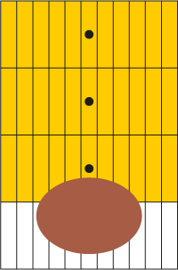
Rysunek nr 3. Sytuacja podczas trwającego pożytku

Gniazdo czerwiowe jest przesuwane bliżej wylotka. Jeśli nad nim znajduje się blok złożony z dwóch korpusów zapasowych, możliwe jest dalsze rozszerzanie nad nimi, używając wywirowanych plastrów, bez ryzyka, że matka zacznie je z powrotem zaczerwiać. Jeśli w miodowej komorze znajdują się zapasy cukrowe, należy wyraźnie oznaczyć korpus, aby uniknąć zanieczyszczenia miodu cukrem! Zasklepionych zapasów pszczoły zazwyczaj nie przenoszą.

=== Reakcja rodziny pszczelej, gdy pożytku brak

Całkowicie inna sytuacja występuje, gdy pożytku brak, a my rozszerzamy ul nad miodową komorą.
Rodzina pszczela z miodową komorą gospodaruje i reaguje zgodnie ze swoim genetycznym wyposażeniem. Przykłady tego zachowania przedstawiają poniższe rysunki nr 4–6, które ilustrują naturalne reakcje pszczół.

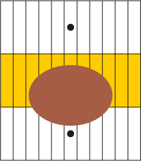
Rysunek nr 4. Rodzina pszczela przenosi czerw do miodowej komory

W tym przypadku rodzina pszczela zazwyczaj nie ogranicza znacząco czerwienia i jest w stanie w pełni wykorzystać kolejny pożytek. To nie zdarza się w rodzinach, które głodują (pozbawione są miodowej komory i odpowiednich zapasów).

Jasne jest, że gniazdo czerwiowe może pozostać pod miodową komorą (zob. rys. nr 5), w bezpośrednim kontakcie z zapasami. Jeśli w rodzinie nie byłoby miodowej komory, czerwienie zostałoby znacząco ograniczone, a rodzina zaczęłaby „oszczędzać”. Krajnka (szczególnie alpejski ekotyp) ma do tego silną skłonność.

Moim zdaniem ta cecha jest często błędnie uznawana za zaletę. W pszczelarstwie wielokorpusowym stanowi ona jednak istotny problem, a jej eliminacja wiąże się z dodatkowymi, niepotrzebnymi kosztami (np. stymulacją pokarmową, wymianą korpusów).

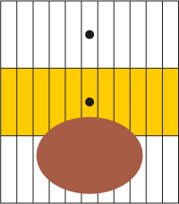
Rysunek nr 5. Gniazdo czerwiowe pozostaje w kontakcie z zapasami w miodowej komorze, ale nie wchodzi do niej

Tutaj przedstawiono przykład, w którym rodzina pszczela jeszcze nie przeniosła czerwiu do miodowej komory. Jeśli nastąpi pożytek, zazwyczaj nawet nie podejmie takiej próby.

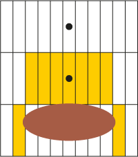
Rysunek nr 6. Rodzina pszczela zaczyna przenosić zapasy miodu w dół, w kierunku gniazda czerwiowego

Tutaj zazwyczaj dochodzi do znaczącego ograniczenia czerwienia, a rodzina pszczela funkcjonuje na „pół mocy”. Następna gotowość do pożytku jest zwykle niższa.

Sytuacja ta przypomina stan rodziny pszczelej w okresie jesienno-zimowym, kiedy pszczoły przenoszą zapasy z obrzeży plastrów, głównie otwartych.

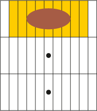
Rysunek nr 7. Słaba rodzina pszczela przenosi się do górnego korpusu

Liczebnie słaba rodzina pszczela stara się poprawić swój bilans cieplny, przesuwając się tuż pod powałkę. Osobiście takie rodziny zazwyczaj likwiduję, ponieważ w naturze również by nie przetrwały.

== II. ROZSZERZENIE PRZESTRZENI ULOWEJ POD MIODOWĄ KOMORĘ

Ta metoda może spowodować wydłużenie gniazda czerwiowego w górę. Tylko silny pożytek może zapobiec temu zjawisku. W dodanych korpusach znajdują się zarówno świeży nektar, jak i miód, który pszczoły przenoszą z niezasklepionych plastrów w dolnych korpusach, szczególnie podczas wiosennych pożytków. W ten sposób warto rozszerzać ul o nowe korpusy budowlane.

Mezery w takich korpusach są szybciej wypełniane i czasami również zakładane (w zależności od tego, czy używamy suszu jako jądra, czy nie, oraz od dostępności pożytku).

Tę metodę można polecić, gdy nie dysponujemy wystarczającą liczbą suszy, chcemy zbudować silniejsze rodziny (lub tworzymy je z odkładów), potrzebujemy więcej pszczół i czerwiu np. do odkładów lub ulików weselnych itp.

Rodziny pszczele w tym przypadku bardziej intensywnie przenoszą otwarte zapasy do nowych przestrzeni, a miodowe zapasy zwykle pochodzą z różnych źródeł. Uzyskany w ten sposób miód nie jest tak czysty odmianowo, jak przy poprzednim sposobie rozszerzania nad miodową komorą, ale jego skład bardziej przypomina ten gromadzony przez pszczoły w środowisku naturalnym. Można powiedzieć, że ten sposób jest dla pszczół bardziej naturalny.

Dla pszczelarza jednak nie zawsze musi to być preferowana metoda, ponieważ zazwyczaj dąży on do osiągnięcia celów gospodarczych.

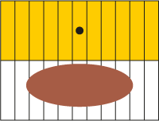
Rysunek nr 8. Stan dwóch górnych korpusów przed rozszerzeniem

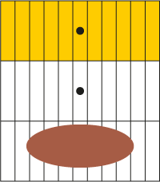
Rysunek nr 9. Stan po rozszerzeniu o korpus pod miodową komorę

Po rozszerzeniu mogą wystąpić podobne warianty, jak w poprzednim przypadku. Obowiązuje tu jednak zasada, że czerw i zapasy muszą pozostać w kontakcie, jak pokazują poniższe przypadki. Pszczoły wypełnią pusty korpus czerwiem lub nektarem.

Ten sposób jest również odpowiedni do rozszerzania za pomocą korpusu budowlanego, jak wspomniano powyżej.

Reakcja rodziny pszczelej na rozszerzenie podczas pożytku

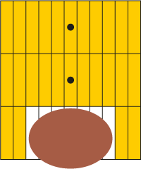
Rysunek nr 10. Rodzina pszczela łączy gniazdo czerwiowe z zapasami, wypełniając nowy korpus nektarem

Czerw jest przesuwany przez „dzwon miodowy” w kierunku wylotka.
Zapasy są umieszczane w nowym korpusie tak szybko, że matka nie ma możliwości złożyć tam jaj.
Ten obrazek jest typowy dla przypadków silnego pożytku.

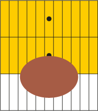
Rysunek nr 11. Przy słabszym pożytku

Część czerwiu znajduje się w dodanym korpusie. Po wygryzieniu się czerwiu pszczoły wypełniają uwolnione miejsce nektarem.
Czasami zdarza się to, gdy w nowym korpusie znajdują się wywirowane plastry. Jeśli nowy korpus jest budowlany, pszczoły zakładają tam nowe plastry, które są czasami zakładane przez matkę w środkowej części.

=== Reakcja rodziny pszczelej, gdy pożytku brak

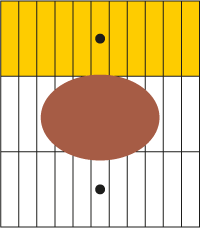
Rysunek nr 12. Gniazdo czerwiowe przesuwa się aż do miodowej komory

Nie dochodzi do znaczącego ograniczenia czerwienia. Połączenie zapasów i czerwiu następuje poprzez przesunięcie gniazda czerwiowego do dodanego korpusu. Gniazdo czerwiowe rozciąga się bardziej poziomo.

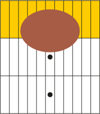
Rysunek nr 13. Rodzina pszczela przenosi czerw aż do miodowej komory

W tym przypadku dochodzi do znaczącego ograniczenia czerwienia, a kolejny pożytek jest zazwyczaj mniej efektywnie wykorzystany.

Sytuacje przedstawione na rysunkach nr 5 i 14 są najmniej korzystne dla dobrego stanu rodziny pszczelej.

Przytoczone ilustracje obrazują, jakie sytuacje mogą wystąpić w rodzinie pszczelej podczas korzystania z miodowej komory. W przypadku, gdy rodzina ma wystarczające zapasy, nie ogranicza czerwienia i zachowuje duży potencjał na przyszłość. Oczywiste jest, że w okresach bez pożytku pszczoły sięgają po zapasy z miodowej komory, co jest niezwykle ważne.

Należy pamiętać, że pszczoły mogą głodować zarówno wiosną, jak i latem. Rodzina pszczela zaczyna głodować jeszcze zanim zacznie korzystać z zasklepionych zapasów! Dobrze rozwinięta rodzina pszczela, która zużyła zapasy, z reguły szybko je uzupełni w przeciwieństwie do rodzin, które pszczelarz pozostawił w stanie głodowania.

W swojej praktyce wielokrotnie zauważyłem, że rodziny prowadzone w taki sposób wykazywały przyrosty na wadze, gdy inne rodziny (według mnie głodujące) traciły na wadze. Jest to prawdopodobnie spowodowane tym, że dobrze zaopatrzone rodziny wysyłają do przyrody większą liczbę pszczół zwiadowczych i są w stanie szybciej reagować na bodźce zewnętrzne.

Ilustracje przedstawione powyżej pokazują podstawowe możliwości zachowań rodziny pszczelej.

Pionowy ruch gniazda czerwiowego jest dla pszczół całkowicie naturalny i wynika z instynktów, które kształtowały się przez miliony lat. Niektórzy pszczelarze jednak nie potrafią sobie wyobrazić hodowli pszczół bez matowej kraty.

Pewnego razu pokazywałem pszczelarzowi prosty sposób hodowli matek. Podczas pobierania materiału genetycznego musiałem sięgnąć do dolnych korpusów. Zauważył, że w jednym korpusie (trzecim od wylotka) na 3–4 plastrach znajdował się czerw, a wokół zasklepiony miód. Zdziwił się, jak mogę tak prowadzić pasiekę. Nie zauważył jednak, że nad tym korpusem znajdowały się dwa pełne korpusy zasklepionego miodu rzepakowego (około 40 kg) gotowego do wirowania.

Trzeba pamiętać, że rodzina pszczela musi mieć zapasy, w tym zasklepione, również w korpusie z czerwiem. Nie można całkowicie oddzielić zapasów od czerwiu bez negatywnych skutków.

Każdy z nas czerpie radość z innych rzeczy. W naturze człowieka leży potrzeba kontrolowania wszystkiego i narzucania swojego wyobrażenia o życiu innym istotom. Jest to jednak zawsze krótkowzroczne i w ostatecznym rozrachunku nieefektywne. Natura zawsze znajdzie swoją drogę.

W przypadku pszczół są to właśnie te niespodzianki, które czasami są dla nas zagadką. Skupiamy się na problemach, dzieląc je na coraz mniejsze części, co powoduje, że tracimy z oczu istotę rzeczy, bo nie potrafimy lub nie chcemy spojrzeć na problem w szerszym kontekście.

Należy pamiętać, że hodujemy pszczoły, aby korzystać z ich zdolności, a nie po to, aby je wykorzystywać lub ograniczać ich naturalne zachowania. Życie w naturze jest tak proste, że inteligentny człowiek często tego nie rozumie.

Mam nadzieję, że powyższe ilustracje pomogą początkującym pszczelarzom, którzy wybrali drogę pszczelarstwa wielokorpusowego, osiągnąć nie tylko wyższe zbiory, ale również większą rentowność swoich pasiek. Rentowność nie opiera się jedynie na wysokich zbiorach i cenie miodu, ale również na niskich kosztach, co pszczelarstwo wielokorpusowe umożliwia. To, za jaką cenę sprzedamy miód, zależy już od naszych umiejętności handlowych.

Autor: Ing. Leoš Dvorský

Legenda:

