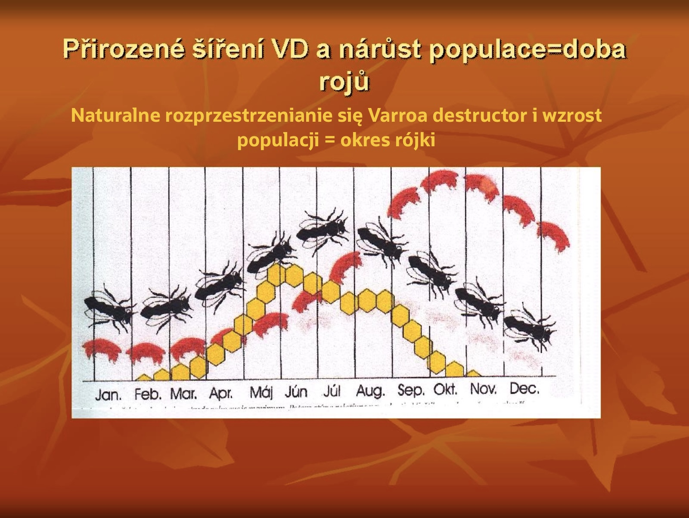
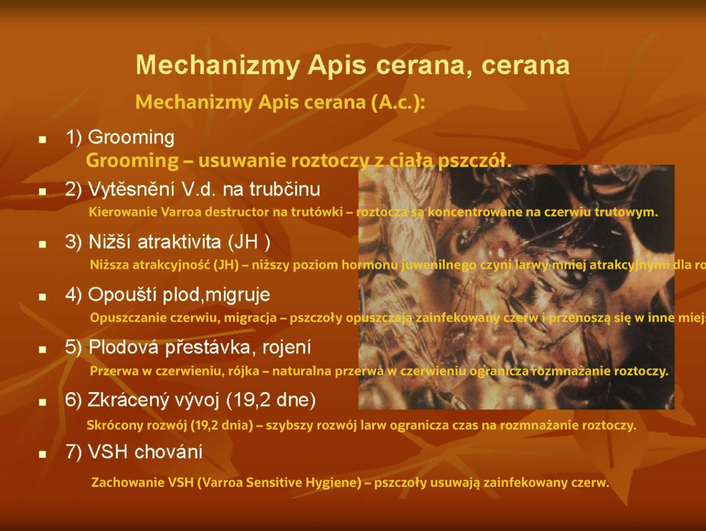
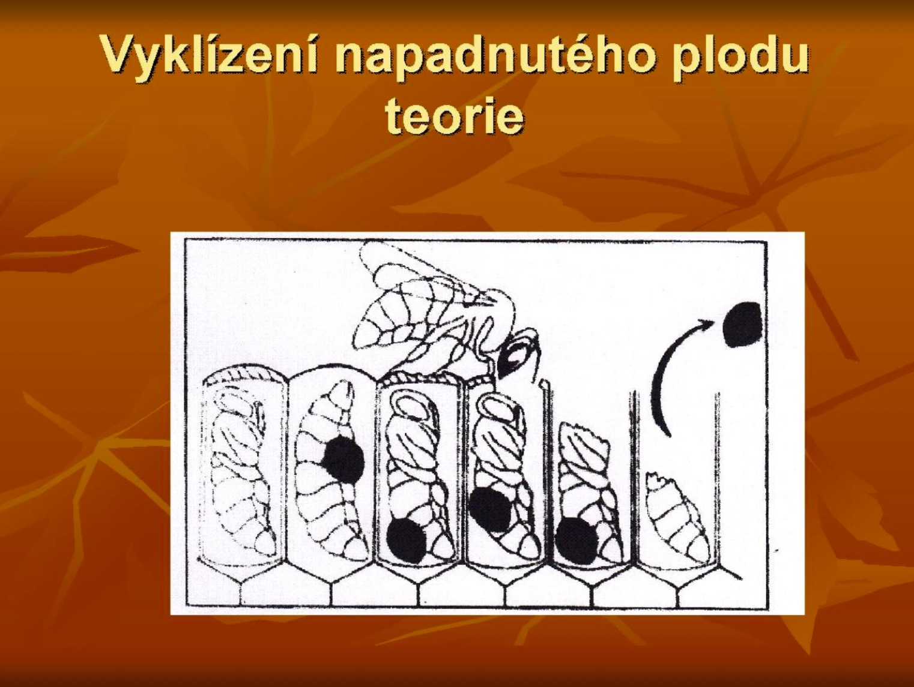

= BEZ TRUCIZNY TO NIEMOŻLIWE? (I)

Autor: Leoš Dvorský
Zródło: https://jjvcela.cz/LD/CLANKY/Bez_jedu_to_nejde4.editace.s.obrazky.pdf
Tłumaczenie: R.Styczynski z pomocą ChatGPT
 

Obecnie w społeczności pszczelarskiej oraz w prasie codziennej toczy się dyskusja, czy obecna chemiczna metoda zwalczania warrozy jest właściwą drogą, czy też istnieją inne podejścia, które nazywamy biotechnicznymi. Tym artykułem chciałbym nieco przybliżyć, jak powstała obecna tzw. metodologia i gdzie ma swoje słabości.

Powszechnie wiadomo, że pszczoły z gatunku Apis cerana (pszczoła wschodnia – A.c.) potrafią radzić sobie z roztoczami. Z własnego doświadczenia wiem jednak, że również niektóre rodziny pszczół z gatunku Apis mellifera (A.m.) są w stanie poradzić sobie z roztoczami bez chemicznych zabiegów, zarówno w warunkach naturalnych, jak i w naszych nowoczesnych systemach uli. To właśnie rodziny pszczół żyjące na wolności były dla mnie inspiracją przy tworzeniu własnej metodyki pielęgnacji rodzin pszczelich.

== Co to jest warroza?

Mówimy, że warroza to złożona choroba wywołana przez roztocze Varroa destructor. Obecnie choroba ta jest przede wszystkim związana z różnorodną mieszanką wirusów, grzybów Nosema apis (N.a.) i Nosema ceranae (N.c.). Ponieważ jest to choroba kompleksowa, jasne jest, że wariantów może być wiele. Na własne potrzeby kilka lat temu podzieliłem warrozę na grupy A, B, C.
* Warroza typu A to przypadek, w którym faktyczną przyczyną jest nadmierne rozmnożenie roztoczy. Jest to jednak wariant stosunkowo łatwy do rozwiązania w obecnych warunkach.
* Typ B oznacza warrozę, w której dominuje uszkodzenie wywołane wirusem zdeformowanych skrzydeł, czasem w połączeniu z N.a.. Ten typ również jest stosunkowo łatwy do opanowania, o ile interwencja zostanie podjęta na czas, i nie powoduje znaczących strat w rodzinach pszczelich.
* Typ C to taka warroza, w której uszkodzenia pszczół są zdominowane przez mieszankę wirusów ostrej i przewlekłej paralizy, czasem w połączeniu z N.c.. Istnieje kilka wariantów tego typu, i to właśnie on powoduje największe straty. W wielu aspektach przypomina klasyczny CCD (Colony Collapse Disorder). Jednak przy wczesnym rozpoznaniu i działaniach również jest możliwy do opanowania.

Jak widać, wczesna diagnoza jest absolutnie niezbędna, choć obecna metodologia jej nie zapewnia. Każda z tych grup ma swoje objawy i rozwiązania, a praktyka pokazuje, że wszystko jest możliwe do rozwiązania. Problemem, który pozostaje trudny do przewidzenia, jest jednak wariant z grupy C, gdzie czynnikiem wyzwalającym lub przyspieszającym mogą być na przykład pestycydy, co potwierdzają doświadczenia niektórych pszczelarzy.

Wiem, że niektórzy krytykują mnie za ten podział, twierdząc, że nikt dotąd tego nie zrobił. To jednak nie mój problem. Wolę jasność i podejmuję działania na podstawie wiedzy, a nie domysłów, jak to obecnie często bywa. To właśnie brak zdolności do precyzyjnego zdefiniowania problemu w znacznym stopniu przyczynia się do masowych upadków rodzin pszczelich. Pszczelarze mówią o warrozie, ale często każdy ma na myśli coś innego. Pytam więc: czy nie lepiej precyzyjnie zidentyfikować problem, a następnie go rozwiązać, zamiast desperacko szukać wskazówek w Internecie z nadzieją, że ktoś poda gotowy sposób? Nazwy mogą zajmować naukowcy na uczelniach – od tego tam są. Mnie, jako praktycznego pszczelarza, interesuje wczesne rozwiązanie problemu warrozy, a ten podział z pewnością mi w tym pomaga.

== Kiedy do nas został sprowadzony roztocz i jak rozwijało się obecne chemiczne podejście do zwalczania warrozy?

Roztocz został po raz pierwszy odnotowany u nas w 1978 roku na obszarze Svitavska, skąd zaczął się rozprzestrzeniać na cały kraj. Można powiedzieć, że od 1981 roku był praktycznie obecny na całym jego terytorium.

W tamtym czasie nie posiadano żadnej wiedzy ani środków do szybkiego zwalczania roztocza Varroa destructor. Nikt nie przewidywał, że tzw. warroza w przyszłości zostanie znacząco zmieniona przez wpływ wirusów, Nosema apis i Nosema ceranae. Ówczesna wiedza prowadziła do wniosku, że jeśli pozbędziemy się roztocza, problem zostanie rozwiązany. Chemiczna metoda była wprawdzie uważana za najszybsze, ale tymczasowe rozwiązanie (według inż. Vladimíra Veselého).

Dlatego też, po wykryciu choćby jednej samicy roztocza w rodzinie pszczelej, likwidowano wszystkie ule w promieniu 5 km od ogniska. Było to drastyczne, ale w swojej istocie stanowiło pewne biotechniczne rozwiązanie. W niektórych przypadkach starsi pszczelarze nie przeżyli tych działań i odeszli do pszczelarskiego nieba wraz ze swoimi pszczołami. Trudno mi wspominać ten okres. Już wtedy jednak wielu pszczelarzy wskazywało, że pomysł może i jest dobry, ale niewłaściwy, ponieważ w przyrodzie działają inne zasady niż te, które zakładaliśmy, i nie przyniesie to znaczących efektów. Bardzo szybko okazało się, że mieli rację.

Dziś trudno to oceniać. Po bitwie każdy jest generałem. Celem było najpierw wykrycie roztocza i zatrzymanie jego rozprzestrzeniania się poprzez całkowitą eliminację w rodzinach pszczelich.

Później, zamiast likwidować rodziny, zaczęliśmy zimą rozbierać ule i stosować oprysk preparatem Tactik. Sam, wraz z dwoma kolegami, przez dwie kolejne zimy, leczyłem w ten sposób połowę rodzin w organizacji, czyli 800 uli rocznie. Od tego czasu prawdopodobnie rozwinąłem alergię na substancję czynną, co objawiało się tym, że w sezonie zimowym miałem nawet pięć razy anginę, której wcześniej nie doświadczałem. Nikomu tego nie życzę, ale również nikt nie może mnie przekonać, że stosujemy środki nieszkodliwe dla człowieka. To nieprawda, a kto twierdzi inaczej, albo celowo kłamie, albo jest producentem tych środków i jego motywacja jest oczywista.

Początkowo nasza metoda zaczęła wykorzystywać znaną dziś fumigację jako sposób diagnozowania. Ten zabieg zaczęto nazywać leczeniem. Warunkiem jednak było zalecenie inż. Veselého, który podkreślał, że fumigacja musi być przeprowadzana w okresie, gdy rodziny pszczele są wolne od czerwiu. Zalecał izolację matek w miesiącach jesiennych, a następnie wykonanie zabiegu. W gorszym przypadku sugerował usunięcie zasklepionego czerwiu przed przeprowadzeniem fumigacji. Proponował więc podejście łączące metody chemiczne z biotechnicznymi.

Niestety pszczelarze nie przestrzegali tego zalecenia lub je bagatelizowali, co pozwoliło roztoczom się rozmnażać i rozprzestrzeniać. Wraz ze wzrostem liczby roztoczy, wzrastała liczba zabiegów. Opracowano także aerozol, aby substancje aktywne (trucizny) lepiej docierały do roztoczy. Jednak wciąż nie udawało się ich wyeliminować, więc zaczęto wprowadzać kolejne chemiczne zabiegi zamiast metod biotechnicznych, które pszczelarzom wydawały się bardziej uciążliwe. Tak z metody diagnostycznej powstała tzw. metoda lecznicza, co zwiększyło ilość pracy pszczelarzy i podniosło koszty pszczelarstwa.

Stopniowo dodano wiosenne zabiegi, takie jak smarowanie połączone z fumigacją. I tu inż. Veselý zalecał najpierw usunięcie zasklepionego czerwiu, a dopiero potem wykonanie fumigacji. Jednak smarowanie wydawało się pszczelarzom prostsze. Gdy i to okazało się niewystarczające, zaczęto stosować kwas mrówkowy (Formidol) oraz Gabon w ciągu całego roku. Wtedy powoli zaczęto dostrzegać, że zwalczanie roztoczy nie powinno ograniczać się do jesieni i zimy.

Jeśli spojrzymy na metodologię największego dostawcy środków przeciwko roztoczom, VÚD s.r.o., można odnieść wrażenie, że bez chemii współczesne pszczelarstwo nie może istnieć. Nie znajdziemy tam żadnych odniesień do hodowli czy metod biotechnicznych, choć obie te metody były jasno określone na początku inwazji roztoczy. Gdy jednak środki chemiczne zaczęły być dotowane, walka z warrozą stała się biznesem, zwłaszcza w warunkach monopolistycznej pozycji na rynku. To nie jest zarzut wobec VÚD s.r.o., ponieważ firma działała racjonalnie z biznesowego punktu widzenia. Niemniej jednak broszura „Cały rok przeciwko warrozie” wydaje się raczej materiałem reklamowym niż obiektywną metodologią.

Smutne jest, że organizacje reprezentujące pszczelarzy, jak również państwo i instytucje, które ono nadzoruje, nie potrafiły nadać odpowiedniej wagi opiniom inż. Veselého z początku inwazji roztoczy i nie wprowadziły ich w życie. W tamtym czasie wszystkim zależało na powstrzymaniu roztoczy, a nie na czerpaniu zysków. Szkoda, że pszczelarze wybierali „łatwe” rozwiązania, czyli te oparte na coraz większej ilości chemii, zamiast korzystać z dostępnych już wtedy metod biotechnicznych.

Ostatnie dziesięciolecie pokazuje, że mimo masowego stosowania chemii przeciwko roztoczom, nadal dochodzi do powszechnych upadków rodzin pszczelich. Co więcej, dotyczy to również profesjonalistów, którzy bezkrytycznie stosują tę metodologię (lub raczej brak metodologii), jak np. dwóch przewodniczących ČSV, którzy stracili całe pasieki. To jasno pokazuje, że obecne podejście zawodzi i nadal będzie zawodzić, ponieważ opiera się na przestarzałej tezie, że warroza zależy wyłącznie od roztoczy. Naiwnie lub celowo wierzy się, że możliwe jest całkowite wyeliminowanie roztoczy z rodzin pszczelich, jak zakładano na początku ich inwazji.

Pomijane są przy tym patogeny takie jak wirusy i ich mieszanki z Nosema apis oraz Nosema ceranae, które są dziś charakterystyczne dla warrozy.

W farmacji obowiązuje ogólna zasada, która mówi, że różnica między lekiem a trucizną tkwi w dawce. W naszych pasiekach chemii jest jednak tak dużo, że nie można jej nazwać lekami. Nie leczymy pszczół, lecz zwalczamy roztocza.

Przez cały okres zwalczania roztoczy nikt nie podjął się opracowania metodologii, kiedy dokładnie stosować poszczególne środki, w zależności od siły rodziny pszczelej, przestrzeni, dawki, czy ewentualnej kombinacji z innymi metodami, na przykład biotechnicznymi. Nikt nie próbował zminimalizować ilości stosowanych trucizn. Zawsze opierano się na podejściu diagnostycznym, które z czasem przekształciło się w podejście masowe, nieprzynoszące pożądanych rezultatów. W świetle najnowszej wiedzy trudno dziś uznać, że jest to podejście profesjonalne, przyjazne dla ludzi, pszczół oraz produktów, przede wszystkim miodu, który jest dziełem naszych pszczół.

Podejście masowe prowadzi do stopniowego tworzenia się odporności roztoczy na substancje czynne, a co gorsze, całkowicie eliminuje różnice w wrażliwości lub odporności poszczególnych rodzin pszczelich na roztocza i inne choroby. Znacznie to utrudnia selekcję i hodowlę bardziej odpornych pszczół.

Chcę ponownie przypomnieć inż. Veselého, który na początku wprowadzenia jesiennych i wiosennych zabiegów jasno wskazywał, że zabiegi powinny być wykonywane w czasie, gdy w rodzinach pszczelich nie ma czerwiu. Zalecał wówczas izolację matki na kilka tygodni (zwykle trzy), po czym należało usunąć czerw i zdecydowaną większość roztoczy lub usunąć zasklepiony czerw przez wycinanie lub zdrapywanie, a dopiero potem przeprowadzić chemiczne leczenie rodzin pszczelich.

Inż. Veselý wskazał tym samym jeden z elementów selekcji tzw. bardziej odpornych rodzin pszczelich oraz tzw. punktowego leczenia rodzin pszczelich (leczenie konkretnej rodziny w określonym czasie i w konkretnej sytuacji).

== Punktowe leczenie? Co to właściwie jest?

Nasza metoda-nie-metoda tego terminu dotąd nie zna. Dzieje się tak, ponieważ wciąż koncentrujemy się na eliminacji roztoczy jesienią. Ale co, jeśli to się całkowicie nie uda? Czy mamy znowu bezrefleksyjnie stosować uniwersalne metody, jak dotychczas? Czy to konieczne? Myślę, że każdy, kto zajmuje się warrozą bardziej szczegółowo, zauważył, że wiosną rodziny pszczele rzadko upadają z powodu nadmiaru roztoczy – albo wcale, albo tylko sporadycznie. Jednak właśnie w tym czasie można zaobserwować, że niektóre rodziny są większymi nosicielami infekcji niż inne, są bardziej zaatakowane przez roztocza lub szybciej zaczynają wykazywać oznaki ich działania. Przejawia się to np. wyższą obecnością wirusów lub różnorodnie uszkodzonymi pszczołami. Można to dobrze wykorzystać, aby zainterweniować właśnie w takich rodzinach i oszczędzić sobie wiele pracy i kosztów na przyszłość.

Na przykład w czerwcu 2013 roku, na jednej z moich pasiek, stosunek rodzin zainfekowanych do niezainfekowanych wynosił 1:14, a w zeszłym roku 1:20. Oznacza to, że lecząc jedną rodzinę, oszczędziłem sobie pracy z dwudziestoma innymi, do których nie musiałem wprowadzać zbędnej chemii.

Zadziwiające jest, że tak proste metody są pomijane przez naszych tzw. ekspertów pszczelarskich. To jeszcze nie byłoby tak tragiczne. Smutne jest, że nie widzą tego sami pszczelarze i niepotrzebnie czekają kilka miesięcy, po czym nawet masowe zastosowanie środków przeciw warrozie nie wystarcza, i sytuacja się powtarza, jak choćby w roku 2007 i innych.

== Dlaczego musimy zacząć stosować inne metody zwalczania roztocza?

Jak już wspomniano, wyłącznie chemiczna metoda prowadzi z czasem do powstania odporności roztoczy, a ponadto jest stosunkowo kosztowna. Istnieją także aspekty higieniczne i zdrowotne, których żaden obiektywnie myślący pszczelarz nie powinien pomijać.

Obecnie nie mamy zbyt wielu alternatyw dla substancji czynnych stosowanych w środkach do zwalczania roztoczy. Istnieją jednak możliwości ich zastąpienia lub uzupełnienia, które są znane od dłuższego czasu i przynoszą dobre efekty. Od stosowania np. kwasów organicznych po wykorzystanie tzw. metod biotechnicznych, które mogą znacznie uprościć, obniżyć koszty obecnej metodologii, a według moich doświadczeń, wraz z rygorystyczną selekcją pszczół pod kątem odporności, nawet całkowicie ją zastąpić.

Biologia roztocza jest ściśle powiązana z biologią pszczoły. To odkrycie jest bardzo dobrze wykorzystane w praktyce pszczelarskiej. Ponadto stosowanie różnych preparatów do zwalczania roztoczy w połączeniu z metodami biotechnicznymi może znacząco zmniejszyć ryzyko powstania odporności roztoczy na różne substancje.

== Kiedy należy zachować czujność?

Zazwyczaj zaczynamy zauważać warrozę dopiero wtedy, gdy problem zaczyna wymykać się spod kontroli. Niestety, pszczelarze są w tym wspierani przez anonimowych doradców, np. w internecie. Wystarczy spojrzeć na odpowiednie wątki na forach pszczelarskich, aby zobaczyć, że niemal nikt nie przejmuje się roztoczami w okresie rójki i krótko po niej. Wręcz przeciwnie – panuje wtedy spokój, relaks, a potem wszyscy dosłownie wpadają w panikę od późnego lata do zimy, a czasem nawet wiosny. Tymczasem często wystarczyłoby tak niewiele (patrz: punktowe leczenie).

Dziś już słynne jest stwierdzenie jednego z tych „ekspertów”, który twierdził, że roztocz ma genialną strategię rozprzestrzeniania się w przestrzeni, polegającą na okresie rabunków, przeszukiwania i karmienia rodzin pszczelich.

To jednak podstawowy błąd. To jedynie skutek naszych prowarrozowych metod pszczelarskich. Roztocz nie jest pasożytem, który niszczy swojego gospodarza, a tym samym sam siebie. Tak by było, gdyby słowa wspomnianego „eksperta” były prawdziwe.

Odpowiedź na pytanie, dlaczego tak nie jest, a także kiedy rzeczywiście roztocz rozprzestrzenia się w przestrzeni, aby zachować swój gatunek, nie niszcząc przy tym gospodarza, znajdziemy w naturalnie żyjących rodzinach pszczelich. Jedyny okres, kiedy jest to możliwe i najbardziej korzystne dla obu gatunków, to czas rójki.

== Rójka jako naturalny sposób rozprzestrzeniania się roztoczy i redukcji ich populacji

Podczas rójki roztocz naturalnie rozprzestrzenia się w przestrzeni, a jednocześnie jego populacja w rodzinie pszczelej ulega rozrzedzeniu. To właśnie w czasie lotów pszczół w trakcie pożytku i rójek roztocz rozprzestrzenia się najbardziej. W okresie pożytku każda pszczoła z obcego roju, która przynosi nektar, jest mile widziana w dowolnej rodzinie pszczelej. Dzięki temu roztocz ma możliwość przemieszczenia się, a rój dodatkowo rozrzedza jego populację, jednocześnie przenosząc go dalej.

Po rójce w obu częściach pierwotnej rodziny pszczelej (macierzaku i roju) następuje przerwa w czerwieniu, która może trwać od 3 tygodni do miesiąca. Nowo powstała rodzina pszczela musi znaleźć schronienie, zbudować plastry, które matka dopiero zacznie zaczerwiać. Dopiero wtedy roztocz ma możliwość ponownego rozmnażania się, co może zająć kilka tygodni. W macierzaku podobnie – młoda matka potrzebuje czasu na zapłodnienie i rozpoczęcie czerwienia. Te naturalne przerwy w czerwieniu, w połączeniu z niskim poziomem infekcji, są często wystarczającymi czynnikami ograniczającymi populację roztoczy przy jednoczesnym zachowaniu zarówno roztoczy, jak i ich gospodarza. Tak działa to w naturalnych rodzinach pszczelich, ale również w tych, które prowadzone są w ulach w podobny sposób.

Dodatkowym czynnikiem, który działa w środowisku naturalnym, jest tzw. grooming (uszkadzanie roztoczy przez pszczoły), który pojawia się znacznie wcześniej i daje pszczołom dodatkowe 1,5–2 miesiące na ograniczenie populacji roztoczy.

Analizując teoretyczne krzywe czerwienia w rodzinach pszczelich i populacyjną krzywą roztoczy (patrz ilustracja nr 1), widać, że w okresie sierpnia i września populacja roztoczy gwałtownie rośnie. W tym czasie pszczelarze dodatkowo stwarzają idealne warunki do rozmnażania roztoczy, ponieważ właśnie wtedy zaczynają dokarmiać rodziny pszczele. W efekcie pszczoły rozszerzają obszar czerwienia, co dla roztoczy jest prawdziwym rajem.

W naturze sytuacja wygląda zupełnie inaczej. Nikt nie zabiera pszczołom zapasów, a czerwienie w tym okresie jest zwykle zakończone. Jeśli w kolejnych miesiącach pojawia się czerwienie, to jest ono sporadyczne, w krótkich cyklach i na znacznie mniejszą skalę niż w przypadku karmienia przez pszczelarzy. Można zatem powiedzieć, że kto dokarmia pszczoły w sierpniu i wrześniu, świadomie rozmnaża roztocza i nie ma prawa narzekać. Niestety, nasze metodyki leczenia rodzin pszczelich często są oparte na takich działaniach, a szkoły pszczelarskie nadal je zalecają.

Jeśli uda nam się prowadzić nasze rodziny pszczele w taki sposób, aby były przygotowane na zimę już pod koniec lipca, odbierzemy roztoczowi możliwość nadmiernego rozmnożenia się i wyrządzenia szkód w kolejnym roku.

== Dlaczego pszczoła z gatunku Apis cerana (A.c.) jest bardziej odporna na roztocza?

Ta pszczoła jest przykładem gatunku, który potrafi pozbyć się roztoczy bez pomocy człowieka ani chemii. Mechanizmy, dzięki którym to osiąga, są przedstawione w poniższej tabeli.

== Czy nasze pszczoły mają takie lub podobne zdolności?
Możliwe, że pomyślicie, iż niewiele nam to pomoże, ponieważ nasze pszczoły tego nie potrafią, gdyż są innym gatunkiem.
Nie jest to do końca prawda. Profesor Sokagami, na podstawie analizy czynnikowej, udowodnił, że oba gatunki są bardzo podobne i przez pewien czas rozwijały się jako jeden gatunek. Rozdzielenie nastąpiło na skutek zmian geograficznych około 8-10 tysięcy lat temu, co jest stosunkowo niedawnym okresem. Dziś jego hipoteza jest potwierdzona.
Choć niektórzy z nas nie chcą tego dostrzec, również w naszej przyrodzie występują rodziny pszczele, które są odporne zarówno na roztocza, jak i inne choroby.

== Dlaczego tak się dzieje?

1. Rodziny pszczele w naturze są bardziej rozproszone, co zmniejsza presję infekcyjną. Pszczoły rzadziej zalatują do innych uli i rzadziej rabują. W rodzinach pszczelich w naturze samice roztoczy są bardziej spokrewnione, co obniża ich witalność.

2. Rodziny pszczele w naturze odżywiają się miodem, co zapewnia im kompleksową dietę. Dzięki temu pszczoły są bardziej odporne, żywotne i dłużej żyją. W naturze rodziny pszczele przez dłuższy czas wychowują trutnie, a roztocza mnożą się głównie na ich czerwiu. Dzięki temu czerw robotniczy, z którego wykluwają się również pszczoły długowieczne, jest przez pewien czas w dużym stopniu chroniony przed roztoczami. Również nasze pszczoły potrafią czasowo skoncentrować roztocza w jednym miejscu, jakim jest właśnie czerw trutowy.

3. Rodziny pszczele w naturze mają naturalny cykl czerwienia, co pozwala na wczesne wychowanie pszczół długowiecznych przez dłuższy okres niż w ulach prowadzonych według obecnych metod opartego na współczesnych metodach pielęgnacji. Jest to powiązane z wcześniej wspomnianym punktem dotyczącym naturalnej diety i zdrowotności pszczół.

4. Rójka nie tylko pozwala na rozmnażanie się rodzin pszczelich, ale również prowadzi do rozrzedzenia populacji roztoczy. Następująca po rójce przerwa w czerwieniu znacząco spowalnia rozmnażanie roztoczy.

5. Naturalna budowa i architektura plastra. Trutowisko w rodzinach pszczelich, które przetrwały, znajduje się zazwyczaj na obrzeżach gniazda czerwiowego, gdzie trutnie są bardziej narażone na presję infekcyjną. Roztocza rozmnażają się głównie w tych miejscach, co chroni czerw robotniczy. Pszczoły mogą również budować komórki o wielkości dostosowanej do ich naturalnych predyspozycji, co może skrócić cykl rozwojowy pszczół, dodatkowo ograniczając przestrzeń dostępną dla roztoczy.

6. Wcześniejsze zakończenie czerwienia. W naturze, jeśli rodzina pszczela jest odpowiednio wcześnie zaopatrzona w zapasy, proces zakończenia czerwienia następuje znacznie szybciej. Cykl czerwienia jest o 1-2 cykle krótszy niż w naszych ulach, szczególnie w rodzinach dokarmianych w sierpniu i wrześniu. To ponownie ogranicza przestrzeń dostępną dla rozmnażania roztoczy.

Jak wynika z wcześniejszych punktów, kluczowe dla przetrwania rodziny pszczelej w naturze jest osiągnięcie pewnej równowagi między rodziną pszczelą a roztoczami, tak aby nie dochodziło do ich nadmiernego rozmnażania, które mogłoby zagrozić życiu rodziny pszczelej. Istotne jest, że biologia roztoczy jest ściśle związana z biologią pszczół. Te rodziny, które potrafią to osiągnąć lub którym na to pozwolono, przetrwają.

== Czy można wykorzystać te obserwacje?

Kilka lat temu również należałem do tych, którzy wierzyli, że odporne na warrozę pszczoły można w jakiś cudowny sposób znaleźć w dzikiej przyrodzie, przenieść do własnych uli i w ten sposób prowadzić pasiekę. Czasem na to liczyłem. Jednak to właśnie takie przeniesienie rodzin pszczelich z natury do naszych uli ostatecznie wyleczyło mnie z tej iluzji. Zauważyłem, że te rodziny pszczele były zdolne do upadku z powodu warrozy równie szybko, jak te, które były na nią wyraźnie podatne.

To doświadczenie zmusiło mnie do zmiany sposobu myślenia, niezależnie od tego, co na temat hodowli prezentowali różni zagraniczni eksperci. Skupiłem się na samym problemie, na końcowym wyniku, i zacząłem współpracować z pszczelarzami, którzy postrzegają ten problem podobnie. Dziś wiem, że istnieją rodziny pszczele, które są bardzo odporne na roztocza oraz towarzyszące im choroby wirusowe, Nosema apis i Nosema ceranae. Takie rodziny mogą przetrwać bez leczenia przez 4–5 lat (czyli przez cały okres życia matki).

Czasem jednak konieczna jest interwencja. Praktycznie każda rodzina pszczela ma w swoim rozwoju słaby punkt, a to, czy go pokona, zależy od jej możliwości lub od tego, czy będziemy w stanie jej w tym momencie pomóc. Nasze interwencje, przynajmniej według mnie, powinny naśladować to, co jest dla pszczół naturalne, to, co praktykują w przyrodzie, aby przetrwać w obecności roztoczy. Chodzi o wykorzystanie tego przykładu.

Z wcześniejszych punktów wynika, że zdolność rodziny pszczelej do radzenia sobie z roztoczami wynika z pewnego algorytmu i że nie jest to jeden mechanizm czy „złoty graal”, którego wszyscy szukają. To kombinacja wielu czynników umożliwia pszczołom przetrwanie.

Przyroda stosuje kompleksową selekcję, co bardzo różni się od naszej. Wyciągam z tego lekcję.

Dla mnie wynika z tego, że w naszej pracy musimy w większym stopniu korzystać z elementów naturalnej selekcji, działać znacznie bardziej kompleksowo niż dotychczas i przede wszystkim stanowczo. Uważam, że bardziej odporne pszczoły, wraz z odpowiednią zootechniką inspirowaną rodzinami pszczelimi żyjącymi w naturze, to dziś najszybsza droga do radzenia sobie z warrozą.

Jeśli to nie wystarczy, a rodzina pszczela nie radzi sobie z sytuacją, konieczna jest interwencja – nie jednak masowa, lecz punktowa, i to w odpowiednim czasie. Jeśli przegapimy właściwy moment, prawdopodobnie pozostanie nam jedynie podejście masowe.

Jest całkowicie naturalne, że pasożyt dostosowuje się do swojego gospodarza, a gospodarz stara się pozbyć pasożyta lub ograniczyć go na tyle, aby nie zagrażał jego istnieniu. Tak dzieje się w naturze. Jednak z powodu naszego niezrozumienia relacji między obiema grupami pasożyt odnosi zwycięstwo, szczególnie w naszych ulach. To nasza, pszczelarzy, wina, że tak się dzieje.

Jest oczywiste, że nigdy nie będziemy mieć pszczół w 100% odpornych na roztocza, tak samo jak nie będziemy mieć rodzin pszczelich, które w pełni spełnią nasze oczekiwania pod względem innych cech. Nie oznacza to jednak, że powinniśmy zaprzestać dalszej hodowli pod kątem odporności. To tylko część – według mnie najważniejsza – sposobu na radzenie sobie ze skutkami działania roztoczy. Same pszczoły pokazują nam, że jest to możliwe. To zależy tylko od nas, jak potrafimy wykorzystać nasze doświadczenia z rodzinami pszczelimi przetrwałymi zarówno w naturze, jak i w naszych ulach, w naszych metodach pielęgnacji pszczół.

== Co i jak możemy wykorzystać w naszych pasiekach

== 1) Grooming

To zdolność pszczół do uszkadzania roztoczy. Czasem wydaje się nam, że roztocz jest niezniszczalny, ale to nieprawda. Wystarczy, że pszczoła odgryzie mu nogę, a roztocz wykrwawia się. Znajdujemy również rodziny pszczele, a właściwie pszczoły, które dosłownie rozrywają roztocze na części.

Zaletą tego mechanizmu jest to, że posiadają go praktycznie wszystkie rodziny pszczele z gatunku Apis mellifera, oczywiście w różnym stopniu. Mechanizm ten uaktywnia się głównie jesienią, gdy pszczoły kończą czerwienie. Przy odpowiednio wczesnym dokarmieniu rodzin pszczelich (do końca lipca) lub zastosowaniu tzw. komory miodowej, rodziny pszczele w naszych ulach mogą w pełni lub w większym stopniu wykorzystywać ten mechanizm.

U gatunku Apis cerana mechanizm ten realizuje jednocześnie aż 5 pszczół, co różni się od Apis mellifera, gdzie działa równocześnie 1-2 pszczoły na jednej pszczole. Jest to prawdopodobnie wynik głębszych relacji społecznych w rodzinach pszczelich gatunku Apis cerana. Mechanizm ten uaktywnia się głównie na początku infekcji i jest stosunkowo łatwy do selekcji.

Możliwość wykorzystania w praktyce:

Ciekawe jest, że przy zastosowaniu kwasu mrówkowego grooming w rodzinach pszczelich wzrasta nawet o 50% i uaktywnia się znacznie wcześniej, np. w lipcu, niż miałoby to miejsce normalnie (na podstawie własnych obserwacji i doświadczeń innych pszczelarzy).

Mechanizm ten można częściowo naśladować i włączyć do własnych metod pielęgnacji pszczół, co jest z pewnością pozytywnym wnioskiem.

== 2) Koncentrowanie roztoczy (Varroa destructor) na trutowisku

U gatunku Apis cerana roztocza rozmnażają się głównie na trutowisku. Czy jednak jest to mechanizm, którego nasze pszczoły (Apis mellifera) nie posiadają? Ogólnie uważa się, że tak. Czy rzeczywiście? Nasze pszczoły również potrafią koncentrować roztocza w określonym obszarze.

Podczas obserwacji gniazd rodzin pszczelich przetrwałych w naturze (tylko takie nas interesują) można zauważyć, że trutowisko niemal zawsze znajduje się na obrzeżach gniazda czerwiowego. Jest to logiczne, ponieważ w tych miejscach presja infekcyjna jest największa, a samce są na nią bardziej narażone. Ważne jest jednak to, że robotniczy czerw w tej strukturze jest znacznie mniej atakowany przez roztocza. W połączeniu z wczesnym zakończeniem czerwienia (trutowisko i robotniczy czerw rozwijają się niemal równocześnie) powoduje to, że długowieczne generacje pszczół pojawiają się w rodzinach wcześniej niż w naszych pasiekach, a co najważniejsze, są one nieuszkodzone przez roztocza. Tak więc rodziny Apis mellifera również są zdolne do koncentrowania roztoczy w określonym obszarze, co można wykorzystać.

Jeśli pozwolimy pszczołom wychowywać trutnie na obrzeżach gniazda czerwiowego również w naszych ulach, roztocza będą rozmnażać się głównie tam, ponieważ czas rozwoju trutnia jest dłuższy niż pszczoły robotnicy, co jest korzystne dla roztoczy. Prawdopodobnie większa atrakcyjność tego czerwiu dla roztoczy również odgrywa tu rolę. W takim przypadku czerw robotniczy pozostanie znacznie mniej zaatakowany.

Tę koncentrację roztoczy w określonym obszarze (jest to tylko jeden ze sposobów) można wykorzystać do ich późniejszego usunięcia wraz z trutowiskiem lub do ich eliminacji np. za pomocą kwasu mrówkowego.

System tzw. „pułapek na roztocza” jest szczególnie skuteczny wiosną, gdy można go zastosować w kwietniu i maju w odstępie około trzech tygodni. Wiosną ma to tę zaletę, że trutowisko można usuwać praktycznie na tym samym etapie rozwoju u wszystkich rodzin na danej pasiece.

Późniejsze leczenie w ten sposób jest mniej skuteczne, głównie dlatego, że rodziny pszczele nie wychowują trutni równomiernie, co komplikuje leczenie i wymaga więcej czasu.

Oczywiście możliwe są także inne metody, które bardziej wykorzystują ten system koncentracji roztoczy, podobnie jak rodziny pszczele w naturze.

Jak się okazuje, architektura plastra pszczelego ma kluczowe znaczenie dla przetrwania rodzin w naturze i ich koegzystencji z roztoczami. Potwierdziłem to także w rodzinach prowadzonych w tzw. nowoczesnych ulach.

Plaster pszczeli jest dla rodziny pszczelej tym, czym dla człowieka jest szkielet – fundamentalną częścią organizmu pszczelego państwa.

== 3) Migracja, rójka, przerwa w czerwieniu

Pszczoły z gatunku Apis cerana w ciągu roku migrują za pożywieniem, rójkują, a w tych sytuacjach opuszczają cały czerw w gnieździe. Ten tryb życia pozwala im na rozrzedzenie populacji roztoczy.

Co możemy z tym zrobić? Czy da się to wykorzystać?
Bez wątpienia.

Zwiększona skłonność naszych rodzin pszczelich do rójki jest dla pszczelarzy kłopotliwa. Jednak można ten mechanizm wykorzystać, tworząc więcej odkładów, nawet z każdej rodziny pszczelej. Później, we wrześniu, możemy te odkłady wykorzystać do rewitalizacji naszych rodzin.

Powszechnie wiadomo, że majowe odkłady są prawie wolne od roztoczy. Wynika to z tego, że w tym czasie roztocza przebywają głównie na pszczołach (nie na czerwiu) i pozostają tam do 17 dni (prawdopodobnie w oczekiwaniu na rójkę i możliwość rozprzestrzenienia). Natomiast od połowy czerwca (to nie jest reguła) czas przebywania roztoczy na pszczołach skraca się do 2-4 dni. Dlatego czerwcowe odkłady są znacznie bardziej obciążone roztoczami.

Możemy to wykorzystać, tworząc tzw. lecznicze odkłady. Taki odkład można lekko potraktować np. kwasem mrówkowym przez kilka dni, a następnie wstawić matecznik. Jeśli planujemy dodać matkę, należy odczekać tydzień między zakończeniem działania kwasu mrówkowego a dodaniem matki. Korzystniejsze jest jednak użycie matecznika, co dodatkowo wydłuża przerwę w czerwieniu.

Wpływ przerwy w czerwieniu
Jak wiemy, przerwa w czerwieniu znacznie ogranicza rozwój populacji roztoczy. Istnieje wiele sposobów na wykorzystanie takich odkładów.

Przerwę w czerwieniu można również stosować przez cały rok, izolując matkę. To zależy od naszych warunków pożytkowych i znajomości zootechniki. Izolacja matki to szerokie i dobrze znane zagadnienie wśród pszczelarzy. Warto jednak przypomnieć, że do izolacji najlepiej używać klateczki lub izolatora, który zapewnia pszczołom bezproblemowy dostęp do matki. Idealnym rozwiązaniem jest 1-centymetrowa ramka otoczona z obu stron kratą odgrodową.

Istnieją także metody izolacji matki na całą zimę. Taką metodę polecał inż. Veselý przed jesiennym leczeniem. W Polsce stosuje ją np. pan Sapák senior na kilkuset rodzinach pszczelich. Metoda ta jest szeroko stosowana przez pszczelarzy w Rosji, na Ukrainie i we Włoszech. Nie ma więc powodu, aby nie wrócić do tego rozwiązania również u nas.

== 4) Skrócenie cyklu rozwojowego pszczoły

W tym artykule starałem się zasugerować, jak można wykorzystać cechy i mechanizmy pszczół z gatunku Apis cerana, a także naszych rodzin pszczelich z gatunku Apis mellifera, które przetrwały bez leczenia zarówno w naturze, jak i w ulach, pod warunkiem zrozumienia przedstawionych zasad.

O mechanizmie skrócenia cyklu rozwojowego pszczoły wspomniałem już w artykule „Je alternativní přístup ke včelaření pro české včelaře novou, možnou volbou”, dostępnym tutaj:
http://dvorsky.leos.sweb.cz/CLANKY/Je_alternativní_přístup_ke_včelaření_pro_české_včelaře_novou_volbou.pdf

(od tłumacza: tekst jest tutaj:
https://brdybee.cz/wp-content/uploads/2015/10/Alternativni-pristup-ke-vcelareni-nova-volba.pdf)

Skrócenie cyklu rozwojowego pszczoły do około 18 dni praktycznie uniemożliwiłoby nadmierne rozmnażanie się roztoczy. Do tej pory zmierzyliśmy u naszych pszczół długość rozwoju wynoszącą 19 dni, zarówno w przypadku pszczół budujących komórki robotnicze o wielkości 4,9 mm, jak i większe. Wydaje się, że wielkość komórki nie zawsze musi decydować o długości rozwoju.

Poprawa reżimu cieplnego, na którą obecnie kładzie się największy nacisk (choć nie tylko), wpływa nie tylko na wielkość komórki, ale także na liczbę pszczół w uliczce. W szerszych uliczkach mieści się więcej pszczół. Być może dlatego w naturze uliczki są szersze niż te, które oferujemy w naszych ulach. Wielkość komórki prawdopodobnie zależy nie tylko od jej samej, ale także od wielkości larwy, czyli jej zawartości. Jeśli jednak skrócenie cyklu rozwojowego nie będzie towarzyszyło zwiększeniu odporności na przykład na wirusy, może nie oznaczać istotnego postępu. Mechanizm ten działa jednak równomiernie przez cały rok i dlatego warto poświęcić mu większą uwagę w procesie hodowli.

Uważam, że stosowanie węzy jest błędem porównywalnym z poleganiem wyłącznie na chemii, a może nawet gorszym.

Do połowy lat 50. pszczelarze na Dalekim Wschodzie w ZSRR nie mieli większych problemów z roztoczami. W tym czasie jednak nie używali węzy. Kiedy to udogodnienie dotarło do nich, pojawiły się masowe upadki rodzin pszczelich, przypominające CCD (Colony Collapse Disorder) w USA. Podobna sytuacja miała miejsce w Chinach około 10 lat później. Czy nadal będziemy ignorować te doświadczenia?

== 5) Zachowanie VSH (Varroa Sensitive Hygiene)

Jest to mechanizm, w którym pszczoły usuwają zainfekowany czerw. Działa w końcowej fazie infekcji i jest dla pszczół najbardziej energochłonny. Intensywność tego mechanizmu wzrasta wraz ze wzrostem intensywności zainfekowania przez roztocza. Mechanizm ten występuje zarówno u pszczół z gatunku Apis cerana, jak i Apis mellifera. To właśnie na ten mechanizm najczęściej kładzie się nacisk w procesie hodowli.

Moim zdaniem, orientowanie się wyłącznie na ten mechanizm w hodowli jest jak skupianie się jedynie na wydajności miodu, z pominięciem zdolności przetrwania i odporności na choroby.

Skupienie się tylko na VSH prowadzi do hodowli małych rodzin pszczelich, które nie zapewniają wystarczającej odporności na choroby wirusowe oraz Nosema ceranae. Dlatego w hodowli konieczne jest bardziej kompleksowe podejście niż dotychczas.

Jak wskazano powyżej, odporność pszczół jest wynikiem złożonego procesu, w którym różne mechanizmy i sposoby obrony mają swoje miejsce. To właśnie o tym aspekcie często zapominamy.

== 6) Zalatywanie się pszczół

Jest to istotny czynnik rozprzestrzeniania się roztoczy na naszych pasiekach. W naturze problem ten jest znacznie mniejszy niż w naszych ulach i pasiekach.

Zalatywanie można ograniczyć przez odpowiednie rozmieszczenie rodzin pszczelich na pasiece, co jest bardzo prostym rozwiązaniem.

Dodatkowo można łatwo i skutecznie selekcjonować pszczoły pod kątem mniejszej skłonności do zalatywania, co jest często niedoceniane przez hodowców.

Rodziny pszczele, które rzadziej zalatują lub są odpowiednio rozmieszczone, są w dużej mierze chronione przed inwazją roztoczy przez cały sezon.

== Zdrowie pszczół i działalność związkowa

Uważam, że troska o zdrowie i prawidłowy rozwój naszych pszczół to najwyższa forma działalności związkowej. Dlatego też w Związku Pszczelarskim dla Mladej Boleslavi i okolic, liczącym około 130 członków, od 2008 roku prowadzimy monitoring letniego osypu Varroa destructor.

Chociaż wiemy, że ta metoda może być mało precyzyjna lub dostarczać opóźnionych informacji do odpowiedniej interwencji, coraz częściej wykorzystujemy moją metodę diagnostyki różnych wariantów warrozy, opartą na obserwacji uszkodzonych pszczół. Jest to metoda prosta, która odzwierciedla rzeczywisty stan uszkodzenia rodzin pszczelich przez roztocza.

Dzięki temu możemy działać już w czerwcu, w czasie, gdy 99,9% pszczelarzy widzi w pszczołach jedynie miód i nie interesuje się ich zdrowiem, albo nie ma o nim pojęcia.

Pszczelarze z innych organizacji często przyzwyczaili się do tego, że ich problemy ktoś za nich rozwiąże, i nie rozumieją, że za swoje pszczoły są odpowiedzialni sami (przepraszam tych, którzy tak nie myślą).

Dzięki naszym działaniom udało się uratować dziesiątki rodzin pszczelich i zapobiec ich upadkom. Charakterystyczne jest to, że nawet pszczelarze w wieku 85 lat potrafią działać na rzecz zdrowia swoich pszczół. Na przykład nasz kolega Hajzler w czerwcu ubiegłego roku zwrócił uwagę na uszkodzenie swoich pszczół. Dzięki szybkiej i skutecznej pomocy z naszej „varroa-linii” wystarczyło natychmiastowe leczenie rodzin preparatem Fromidol w jego ulach typu będziec i problem został zażegnany.

W innych regionach, gdzie pszczelarze kierowali się obowiązującą „metodyką-nie-metodyką” (czyli właściwie niczym), odnotowano duże straty.

Zadaję sobie pytanie, co jest lepsze: przejąć odpowiedzialność za swoje pszczoły, interesować się nimi i troszczyć o nie, czy też ślepo podążać za absurdalnymi dogmatami osób, które mają interes w „rozwiązywaniu” problemów, ale nie w ich rozwiązaniu.

My staramy się podążać tą pierwszą drogą. Może dlatego w 2007 roku mieliśmy straty na poziomie 14%, podczas gdy w całej Czechach wynosiły one ponad 30%. W ubiegłym roku nasze straty wyniosły 8,5%, podczas gdy w całej Czechach przekroczyły 35%.

Zadaję pytanie osobom odpowiedzialnym: kto nas ochroni przed niedbałymi pszczelarzami, którzy używają Varidolu nawet 10 razy w roku, którzy trzymają Gabon w ulach przez cały rok, którzy stosują inne, bezsensowne zabiegi, może zgodne z „metodyką”, ale na pewno nie ze zdrowym rozsądkiem i wiedzą pszczelarską?

Kto nas i nasze pszczoły ochroni przed tym szaleństwem i organizowaną głupotą? Przyjaciele, odpowiem wam prosto: nikt was przed tymi niedbałymi ludźmi nie ochroni, bo nikt nie ma w tym interesu. Musimy sobie pomóc sami.

Proszę podczas opieki nad swoimi rodzinami pszczelimi kierować się następującymi zasadami:

* Nigdy swoimi działaniami nie zagrażajcie swoim sąsiadom.
* Nie pozwólcie, aby oni zagrażali wam, i zwracajcie szczególną uwagę na to, gdzie nadmierne stosowanie chemii może prowadzić do powstania odporności roztoczy. To coraz bardziej aktualny problem.
* Nadmierne stosowanie chemii zgłaszajcie natychmiast weterynarzowi.
* Leczenie prowadźcie punktowo, czyli dla konkretnej rodziny pszczelej w konkretnym czasie i w określony sposób.
* W swoim kole współpracujcie z innymi pszczelarzami i weterynarzem.
* Monitorujcie swoje pasieki przez cały rok, stosując co najmniej dwie metody, lub zorganizujcie taką usługę w swojej organizacji.
* Nie wykonujcie pochopnych zamian ani przestawiania korpusów, ponieważ przyspiesza to rozprzestrzenianie się roztoczy na całym obszarze czerwiu. Ten sam efekt (zwiększenie gotowości do pożytku) można osiągnąć poprzez przesunięcie bez zwiększania ilości czerwiu.
* Jeśli zauważycie przed ulami pierwszą uszkodzoną pszczołę, wiedzcie, że bez interwencji za 6-10 tygodni możecie stracić rodzinę. Interweniujcie natychmiast, nawet kosztem miodu w danej rodzinie. Chronicie w ten sposób zarówno swoje pszczoły, jak i pszczoły sąsiadów.
* Zapomnijcie, że problem warrozy zaczyna się późnym latem – on się wtedy kończy. Każdy, kto mówi inaczej, powinien oddać swój dyplom (jeśli go ma). Poproście go o to.
* Problem z roztoczami zazwyczaj zaczyna się w okresie rójki – bądźcie czujni i działajcie w odpowiednim czasie.
* Umieszczajcie swoje rodziny pszczele w pasiece tak, aby jak najbardziej ograniczyć zalatywanie pszczół – zaoszczędzicie sobie wielu problemów z roztoczami.
* Nigdy nie pozwólcie, aby wasze rodziny głodowały – dostarczcie im zapasy na czas (sierpień, wrzesień w wyjątkowych sytuacjach).
* Wprowadźcie do swoich metod hodowlanych mechanizmy obronne rodzin pszczelich, które nie wymagają leczenia lub wymagają go w minimalnym stopniu.
* Oprócz biotechnicznych metod, włączcie do swoich technik zasady naturalnej selekcji.
* Traktujcie rodziny pszczele nie jako martwy materiał, lecz jako organizm. Obserwujcie je i podchodźcie do nich indywidualnie.

== Dlaczego napisałem ten artykuł?

Przede wszystkim dlatego, że przedstawione kwestie omawiam na swoich wykładach, aby pszczelarze mogli stosować odpowiednie środki zapobiegawcze na czas. Nie mówię o niczym, czego nie zweryfikowałem i nie stosuję w swojej pasiece.

Jedną ze słabości obecnej metodyki jest jej brak elastyczności oraz niezdolność reagowania na nowe odkrycia. Bardzo szybko zapomniano o niektórych biotechnicznych metodach, które promował inż. Veselý.

Pszczoła miodna przetrwała do naszych czasów głównie dzięki swojej zmienności i zdolności adaptacji. Tak samo powinna wyglądać nasza metodyka, a bez znaczącego wykorzystania biotechnicznych metod nie da się tego osiągnąć.

Kiedy 27 listopada 2014 reprezentowałem ruch „Szansa dla Pszczół” na Państwowej Inspekcji Weterynaryjnej (SVS) i wyjaśniałem, dlaczego konieczne jest zrównanie w rozporządzeniu o pszczelarstwie metod biotechnicznych z chemicznymi, jasno nam powiedziano, że wszystko to jest już obecnie uwzględnione. Powiedziano również, że żaden pszczelarz nie może być dyskryminowany w ten sposób, by nie pozwolić mu na stosowanie takich samych metod jak tzw. „ekologiczni pszczelarze”.

Oczywiście byłoby absurdalne stosowanie chemicznych zabiegów, jeśli nasze pszczoły są zdrowe, wolne od chorób wirusowych i innych problemów.

Tak, poprzez hodowlę bardziej odpornych pszczół w połączeniu z metodami biotechnicznymi i dostosowaniem naszej zootechniki możemy drastycznie zmniejszyć ilość stosowanej chemii (lub, jak kto woli, „leków”) w naszych pasiekach, a nawet całkowicie ją wyeliminować. Uważam to za najszybszą drogę naprzód. Choroby pszczół są bardziej problemem hodowlanym niż weterynaryjnym.

Obecnie nie widzę warrozy typu A i B jako poważnego problemu dla pszczół. W wielu miejscach, a także w przyszłości, będziemy musieli zmierzyć się z o wiele większym problemem, jakim jest Nosema ceranae. Na tę chorobę nie istnieje obecnie żaden „lek”, a co za tym idzie – nikt nie może na niej zarabiać. Dlatego musimy zająć się tym problemem już teraz i rozpocząć hodowlę odpornych pszczół.

Sytuacja w pszczelarstwie przypomina sytuację w naszym systemie opieki zdrowotnej, który produkuje pacjentów, leczy ich aż do śmierci.

Tym artykułem starałem się pokazać, że biotechniczne metody są równie skuteczne, a często nawet bardziej efektywne (ponieważ działają kompleksowo, a nie jednostkowo) niż chemiczne. Niemniej jednak czasami chemii nie da się uniknąć.

Jest bardzo prawdopodobne, że wielu z was, czytając te słowa, ma na swojej koszuli paciorkowca. Czy przyszłoby wam do głowy „profilaktycznie” zażyć antybiotyk? Zapewne nie. Gdyby lekarz was do tego zmuszał, prawdopodobnie więcej byście do niego nie poszli. Czyż nie?

A co robimy z naszymi rodzinami pszczelimi? Czy to nie to samo?

29.04.2015
Ing. Leoš Dvorský

