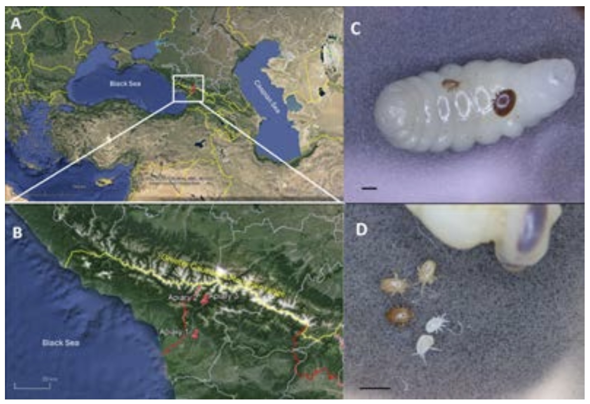
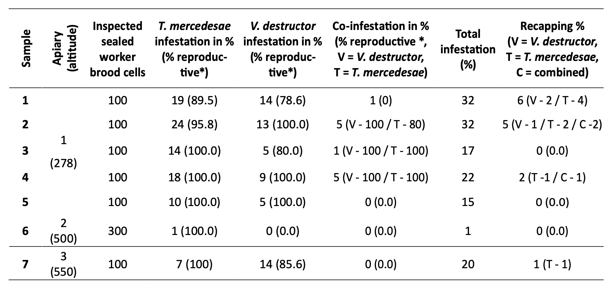

= PIERWSZE DONIESIENIE O OBECNOŚCI TROPILAELAPS MERCEDESAE W GRUZJI: ROZTOCZ ZMIERZA NA ZACHÓD!
Irakli Janashia i inni.

Źródło: https://sciendo.com/article/10.2478/jas-2024-0010

== Streszczenie

Tropilaelaps spp. (Mesostigmata: Laelapidae), ektopasożytniczy roztocz pierwotnie związany z azjatyckimi gatunkami olbrzymich pszczół miodnych, takimi jak Apis dorsata, A. breviligula i A. laboriosa, staje się coraz większym przedmiotem globalnego niepokoju ze względu na swoje niszczycielskie skutki dla kolonii zachodnich pszczół miodnych (Apis mellifera) oraz niedawną ekspansję geograficzną. W niniejszym badaniu udokumentowano pierwsze doniesienie o obecności Tropilaelaps mercedesae w zachodniej Gruzji, w regionie Samegrelo-Zemo Svaneti, w siedmiu koloniach pszczół miodnych (A. mellifera caucasica) z trzech pasiek. W celu identyfikacji roztocza przeprowadzono inspekcje próbek czerwiu, kodowanie DNA oraz pomiary morfologiczne. Wyniki wykazały wysokie wskaźniki infestacji T. mercedesae, współwystępowanie z Varroa destructor oraz znaczący sukces rozrodczy roztoczy. Odkrycia te podkreślają zagrożenie, jakie T. mercedesae stwarza dla gruzińskiego pszczelarstwa, i wskazują na możliwość dalszego rozprzestrzeniania się tego pasożyta w Europie. Natychmiastowe działania oraz czujny monitoring przez władze krajowe i międzynarodowe są kluczowe, aby złagodzić wpływ na pszczelarstwo i rolnictwo.

Słowa kluczowe: pszczelarstwo, ektopasożytniczy roztocz, Gruzja, pszczoły miodne, gatunki inwazyjne, Tropilaelaps

== Wstęp

Ektopasożytniczy roztocz Tropilaelaps spp. (Mesostigmata: Laelapidae) pierwotnie bytował u azjatyckich gatunków olbrzymich pszczół miodnych, takich jak Apis dorsata, A. breviligula i A. laboriosa (Anderson & Roberts, 2013; Chantawannakul et al., 2018). W ostatnich latach zyskał on uwagę pszczelarzy i naukowców na całym świecie z powodu dobrze udokumentowanych, niszczycielskich skutków dla kolonii zachodnich pszczół miodnych (Apis mellifera) w przypadku braku odpowiednich metod kontroli (Anderson & Roberts, 2013) oraz niedawnych inwazji na nowe terytoria. Gatunek T. mercedesae został ostatnio zgłoszony jako rozprzestrzeniony na Azję Centralną, w tym Uzbekistan (Namin et al., 2024), a co bardziej niepokojące, dotarł na kontynent europejski, do regionów Krasnodar i Rostów w południowo-zachodniej Rosji (Brandorf et al., 2024).

Biorąc pod uwagę, że cykl życiowy, biologia, rozmnażanie i patologia Tropilaelaps spp. są porównywalne z Varroa destructor (de Guzman et al., 2017), scenariusz dalszego rozprzestrzeniania się na zachód i południe budzi poważne obawy wśród pszczelarzy i władz w Europie. Celem niniejszego badania jest zwrócenie uwagi na to nowe zagrożenie poprzez udokumentowanie pierwszego zgłoszonego przypadku infestacji Tropilaelaps mercedesae w Gruzji.

== Materiały i metody

Latem 2024 roku, po uzyskaniu ustnego zgłoszenia (komunikacja osobista) oraz podejrzeń jednego z pszczelarzy z regionu Samegrelo-Zemo Svaneti w Gruzji, przebadano siedem kolonii pszczół miodnych (Apis mellifera caucasica) z trzech pasiek (Rys. 1), w celu wykrycia obecności Tropilaelaps spp.. Z obszaru czerwia krytego pobrano fragmenty plastra (o wymiarach 5x6 cm) zawierające komórki z poczwarkami, które umieszczono w plastikowych workach strunowych i przetransportowano do laboratorium w ciągu dwóch godzin. Próbki czerwia krytego zostały zamrożone i przechowywane w temperaturze -20°C, aby zapobiec przypadkowemu rozprzestrzenianiu się roztoczy oraz unieruchomić je dla dokładniejszego liczenia, ponieważ roztocza Tropilaelaps spp. są znane ze swojej dużej ruchliwości.

Rys. 1. Regionalne ujęcie próbkowanych pasiek (A), lokalizacje pasiek w Gruzji (B), poczwarka z próbek czerwiu z obecnością dorosłych samic T. mercedesae i V. destructor; skala=1 mm (C), macierzysta samica T. mercedesae (ciemny brąz) z potomstwem w różnych stadiach rozwoju; skala=1 mm (D).

Do analizy użyto stereoskopowego mikroskopu Carl Zeiss Stemi 508 o powiększeniu x6,3. Otworzono co najmniej 100 komórek czerwia robotniczego na każdą próbkę, indywidualnie sprawdzając obecność roztoczy, status reprodukcyjny roztoczy macierzystych oraz stopień zakrywania komórek przez obydwa gatunki ektopasożytów, Tropilaelaps spp. i Varroa destructor (Tab. 1). Dodatkowo, dziesięć roztoczy zmierzono za pomocą mikrometru okularowego. Roztocza zebrane podczas inspekcji przechowywano w 99% etanolu.

Do analizy DNA wykorzystano pulę ośmiu roztoczy. Sekwencjonowano region cytochromu oksydazy c podjednostki I (COI) w mitochondrialnym DNA, zgodnie z metodą Folmera i in. (1994). Roztocza zamrożono za pomocą ciekłego azotu i zmielono na drobny proszek, który następnie zawieszono w 150 μl buforu fosforanowego PBS. Ekstrakcję DNA przeprowadzono przy użyciu komercyjnego zestawu Quick DNA Microprep Plus Kit (Zymo Research, Irvine, CA, USA), zgodnie z wcześniejszymi badaniami (Tiritelli et al., 2024).

Region COI amplifikowano przy użyciu polimerazy HotStarTaq (Qiagen, Hilden, Niemcy), a reakcję PCR przeprowadzono na termocyklerze Applied Biosystems®2720 Thermal Cycler (ThermoFisher Scientific), zgodnie z metodologią Selis et al. (2024). Uzyskane produkty amplifikacji wizualizowano na żelu agarozowym 1,5%, oczyszczano za pomocą ExoSAP-IT Express (ThermoFisher Scientific, Waltham, MA, USA) i sekwencjonowano metodą Sangera za pomocą SeqStudio™ (ThermoFisher Scientific) (Cilia et al., 2022).

== Wyniki i dyskusja

Uzyskane sekwencje (563 bp) potwierdziły, że próbki należą do Tropilaelaps mercedesae. Analiza BLAST wykazała wysoką zgodność (96,80%) z okazami z Rosji (numery dostępu OR965215.1), Tajlandii (KY865193.1), Chin (NC_082931.1) i Indii (OK188792.1), a także 96,61% zgodności z Uzbekistanem (OR165785). Sekwencja została przesłana do bazy GenBank: PQ049741.

Tabela 1.
Wyniki inspekcji próbek czerwia (N=7) z trzech (N=3) pasiek: poziom infestacji przez T. mercedesae i/lub V. destructor w pojedynczych komórkach, odsetek roztoczy w stanie reprodukcyjnym oraz wskaźnik ponownego zakrycia komórek dla obu gatunków ektopasożytniczych roztoczy.

W sześciu z siedmiu kolonii obecne były oba gatunki ektopasożytów. W dziewięciuset (N=900) zbadanych komórkach czerwia robotniczego poziom infestacji wahał się od 1% do 32% (Tab. 1). Zarejestrowano wyższą infestację przez T. mercedesae (średnio 13,3%, w zakresie 1–24%) niż przez V. destructor (średnio 8,6%, w zakresie 0–14%), co zgadza się z badaniami Buawangpong i in. (2015) w Tajlandii. Podobną tendencję zaobserwowano w reprodukcji roztoczy – w 97,9% komórek zainfekowanych przez T. mercedesae znaleziono potomstwo, podczas gdy dla V. destructor wskaźnik reprodukcji wynosił 90,7%.

W czterech z siedmiu próbek czerwia stwierdzono współinfestację pojedynczych poczwarek pszczół, która wynosiła od 0 do 5%. Był to wyższy wskaźnik niż w raportach z Tajlandii (<0,1%), lecz niższy niż w Korei Południowej (26%) (Buawangpong i in., 2015; de Guzman i in., 2017). Oceniono również wskaźnik ponownego zakrycia komórek, który wynosił od 0 do 6%, bez wyraźnych różnic między komórkami zainfekowanymi pojedynczym gatunkiem a współinfestowanymi. Zgłaszano wcześniej higieniczne zachowania pszczół Apis spp. jako mechanizm ograniczający infestację przez Tropilaelaps spp., jednak dotychczas żadne badanie nie zmierzyło wskaźnika ponownego zakrycia w naturalnie zainfekowanych komórkach, choć w obecności T. mercedesae opisywano odkryty czerw (“łysy”) (de Guzman i in., 2017).

Analiza morfometryczna roztoczy wykazała, że ich długość wynosiła 0,91±0,01 mm (średnia±SE), a szerokość 0,49±0,01 mm (średnia±SE). Rozmiary te są zgodne z opisanymi “letnimi roztoczami” w badaniu Brandorfa i in. (2024).

Nasze wyniki pokazują, że T. mercedesae z powodzeniem infestuje kolonie pszczół (A. m. caucasica) w Gruzji, z wysokimi wskaźnikami reprodukcji, gdzie roztocz ten został zgłoszony po raz pierwszy.

Obecność T. mercedesae na Kaukazie Południowym nie jest zaskakująca, biorąc pod uwagę doniesienia o jego obecności na Kaukazie Północnym (Brandorf i in., 2024). Prawdopodobne jest, że T. mercedesae rozprzestrzenił się przez strefę subtropikalną wybrzeża Morza Czarnego, przez region Abchazji. Bezpośrednia inwazja z Kaukazu Północnego wydaje się mniej prawdopodobna, ponieważ pasmo Wielkiego Kaukazu, z wierzchołkami o wysokości powyżej 5000 m, stanowi istotną barierę geograficzną dla pszczół miodnych. Możliwa jest również trasa przez północny Iran (Shahrouzi, dostęp: 24 lipca 2024 r.), choć inne źródła zaprzeczają obecności Tropilaelaps spp. w Iranie (Moshaverinia i in., 2013), a na naszą wiedzę, nie ma doniesień, nawet anegdotycznych, o jego obecności w południowej Gruzji, Armenii i Azerbejdżanie.

Intensywne operacje migracyjne w Gruzji mogą przyczyniać się do szybkiego rozprzestrzeniania roztoczy w różnych regionach. Zróżnicowane strefy klimatyczne Gruzji, w tym obszary subtropikalne, prawdopodobnie sprzyjają ustabilizowaniu się populacji Tropilaelaps co najmniej w tych regionach. Wzrost średnich rocznych temperatur, związany ze zmianami klimatu, który wydłuża sezon wychowu czerwiu niemal przez cały rok, może również prowadzić do rozprzestrzenienia się roztoczy na inne strefy.

Wreszcie, oprócz naturalnego rozprzestrzeniania się pszczół, współpraca transgraniczna i możliwa wymiana matek pszczelich między gruzińskimi i tureckimi pszczelarzami otwiera możliwość przeniknięcia Tropilaelaps spp. do Turcji, gdzie roztocz ten nie został jeszcze zgłoszony. Biorąc pod uwagę patologię i epidemiologię T. mercedesae (de Guzman i in., 2017; Truong i in., 2023) oraz zdolność do współinfestacji z V. destructor, europejskie pszczelarstwo jest ewidentnie pod znaczącym zagrożeniem. Dlatego wzywamy władze krajowe i międzynarodowe do zachowania czujności, dalszego monitorowania kolonii pszczół miodnych oraz przygotowania skutecznych środków zwalczania. Historia się powtarza – w przeciwieństwie do przypadku V. destructor, tym razem społeczność europejska powinna być przygotowana i przeciwdziałać. Szkolenie pszczelarzy, doradców oraz służb weterynaryjnych jest niezbędne dla skutecznej i szybkiej reakcji w celu ograniczenia szkód dla środowiska i produkcji rolniczej, które może spowodować rozprzestrzenianie się tego ektopasożytniczego roztocza.

== Podziękowania

Dziękujemy Audrey Meazza (stażystce w CREA z Uniwersytetu Purpan) za wsparcie przy wykonywaniu pomiarów.

== Autorzy

AU opracował koncepcję i projekt badania. Prace terenowe i analizy laboratoryjne przeprowadził IJ, a przypisanie mtDNA wykonał GC. IJ i AU dzielą pierwsze autorstwo; AU napisał pierwszą wersję manuskryptu. Wszyscy autorzy komentowali wcześniejsze wersje i przeczytali oraz zatwierdzili ostateczną wersję manuskryptu.

== Tłumaczenie

Tłumaczenie R.Styczynski przy pomocy ChatGPT na podstawie: https://sciendo.com/article/10.2478/jas-2024-0010
