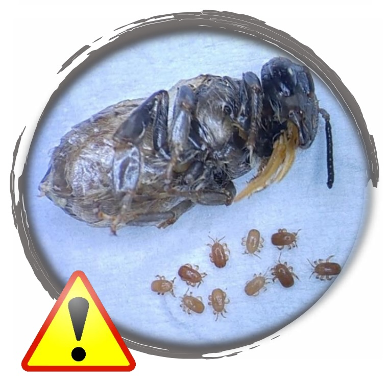
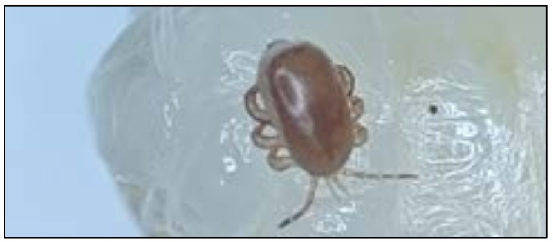
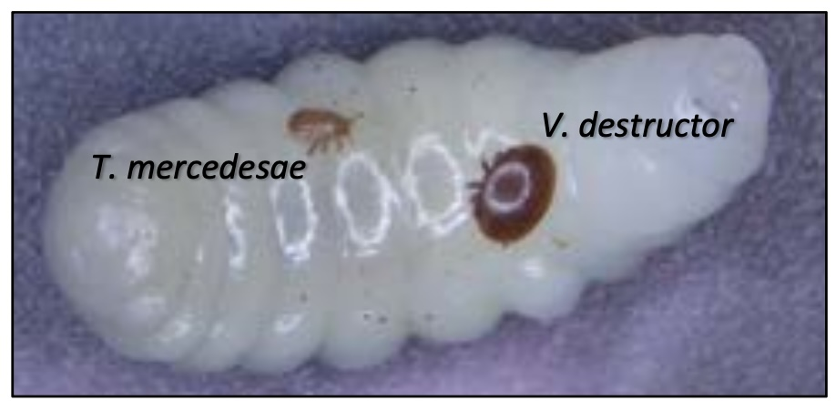
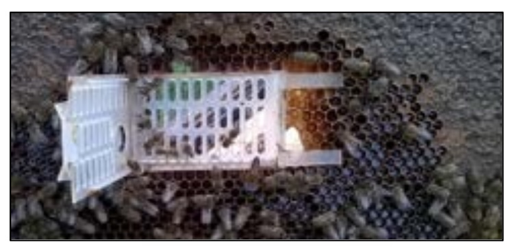

= Tropilaelaps mercedesae

Roztocza Tropilaelaps pochodzą z Azji, ale obecnie rozprzestrzeniły się z pierwotnych gospodarzy, aby pasożytować i szkodzić zachodniej pszczole miodnej (A. mellifera). Jednak roztocza te wyrządzają niewielkie szkody azjatyckim gatunkom pszczół miodnych (Apis dorsata, Apis laboriosa, Apis cerana itp.).

Tropilaelaps ma mniejszy rozmiar ciała niż Varroa. Chociaż roztocze jest widoczne gołym okiem, potwierdzenie obecności w czerwiu wymaga bardzo dokładnych obserwacji.

Dojrzałe roztocza mają wydłużone, czerwonawo-brunatne ciało i są bardziej zwinne w ruchach niż Varroa. Roztocza Tropilaelaps poruszają się bardzo szybko, gdy wychodzą z zasklepionych komórek lub przemieszczają się po powierzchni plastra. Warto zapoznać się z ich charakterystycznymi ruchami, oglądając filmy dostępne na stronie BeeGuards (zeskanuj kod QR). Cykl życiowy Tropilaelaps jest podobny do cyklu Varroa, obejmując etap rozrodczy w zasklepionym czerwiu, a następnie krótką fazę foretyczną na dorosłych pszczołach.

W przeciwieństwie do Varroa, Tropilaelaps odżywia się wyłącznie larwami i poczwarkami i może przetrwać tylko kilka dni na dorosłych pszczołach. Roztocza te pozostają na dorosłych pszczołach przez krótki czas, zanim zaatakują nowe komórki czerwiu. Roztocza Tropilaelaps rozmnażają się szybciej niż Varroa, co sprawia, że uszkodzenia kolonii mogą nastąpić bardzo szybko.

== Symptomy

Symptomy są podobne do warrozy, obejmując objawy zarówno na poziomie indywidualnym, jak i kolonii. Pasożytowane poczwarki mogą być zdeformowane i czasami umierać w swoich komórkach, a dorosłe pszczoły mogą wykazywać zdeformowane skrzydła, skrócone odwłoki i mieć krótszą długość życia. Objawy na poziomie kolonii obejmują nieregularny czerw z perforowanymi zasklepami i zgryzanym czerwiem. Kolonie mogą stagnować i kurczyć się, co prowadzi do zaniedbania czerwiu i utraty kolonii.

== Wykrywanie

Chociaż niektóre metody stosowane do wykrywania roztoczy Varroa są użyteczne, Tropilaelaps może być trudniejszy do wykrycia. Roztocza Tropilaelaps są mniejsze i lżejsze niż Varroa i nie spadają łatwo przez siatkowe dennice. Mają długie nogi i mogą pozostawać zaplątane w umytych pszczołach, co daje niższe wyniki liczenia. Skuteczne metody wykrywania obejmują:

•	przesiewanie cukrem pudrem dorosłych pszczół,
•	badanie odkrytego czerwiu,
•	metodę “Bump”, polegającą na energicznym uderzeniu otwartego czerwiu o twardą powierzchnię w celu usunięcia roztoczy.

Nowatorskie podejście wykorzystuje paski wosku do szybkiego odkrywania komórek i obserwacji roztoczy Tropilaelaps opuszczających odkryte komórki czerwiu. Proces ten można nagrać i odtworzyć dla lepszej dokładności, z minimalnym wpływem na rodzinę pszczelą.

== Kontrola

Niezdolność Tropilaelaps do długiego przeżywania na dorosłych pszczołach jest słabością, którą można wykorzystać w kontroli tych roztoczy. Przerwanie czerwienia, usunięcie czerwiu, izolacja lub ograniczenie matki to skuteczne metody hodowlane. Chociaż zarejestrowane produkty mogą nie być dostępne w wielu krajach, wstępne badania sugerują, że zabiegi oparte na kwasie mrówkowym są najbardziej efektywne w zwalczaniu Tropilaelaps. Należy ściśle przestrzegać zaleceń na etykiecie produktu.

== Co zrobić, jeśli zauważysz Tropilaelaps?

Monitoruj swoje rodziny pszczele pod kątem obecności roztoczy Tropilaelaps. W wielu krajach są one uznawane za szkodniki podlegające obowiązkowi zgłaszania, więc w przypadku podejrzenia ich obecności należy natychmiast poinformować lokalne władze. Przydatne mogą być próbki roztoczy i fotografie do przekazania władzom. Pszczelarze mogą ograniczyć rozprzestrzenianie się roztoczy, importując lub przemieszczając rodziny pszczele z regionów o niskim ryzyku występowania roztoczy.

Tropilaelaps mercedesae to pasożytniczy roztocz, który poważnie zagraża zdrowiu pszczół miodnych (Apis mellifera) i może prowadzić do upadku nieleczonych kolonii. Poważna infestacja może powodować podobne skutki dla zdrowia kolonii jak Varroa, w tym śmierć poczwarek, perforację zasklepów, nieregularny, zgryziony czerw oraz dorosłe pszczoły ze zdeformowanymi skrzydłami.

W 2024 roku Tropilaelaps został po raz pierwszy potwierdzony w Europie, infestując rodziny pszczele na południowym zachodzie Rosji i w Gruzji. Raporty te wskazują na kontynuację przemieszczania się roztocza na zachód z pierwotnych obszarów w Azji. Wędrowne pszczelarstwo oraz sprzedaż rodzin pszczelich prawdopodobnie stanowią główne drogi szybkiego rozprzestrzeniania się tego niebezpiecznego roztocza.

== Bądź przygotowany!

Mamy nadzieję, że ten ulotka dostarcza niezbędnych informacji, zwiększając świadomość i gotowość na pojawienie się roztoczy Tropilaelaps. Ulotka została przetłumaczona na wiele języków i jest dostępna na naszej stronie z materiałami do pobrania. Musimy być czujni jako społeczność, więc prosimy o szerokie udostępnianie tej ulotki wśród znajomych pszczelarzy, aby wspólnie spowolnić rozprzestrzenianie się tych szkodliwych roztoczy.

== Więcej informacji

Więcej informacji można znaleźć na stronach:
	•	www.beeguards.eu
	•	www.tropilaelaps.info

Ilustracje: Irakli Janashia i Aleksandar Uzunov.

Finansowane przez Unię Europejską w ramach umowy GA nr 101082073. Poglądy i opinie wyrażone są wyłącznie autorów i niekoniecznie odzwierciedlają stanowisko Unii Europejskiej. Unia Europejska ani organ przyznający nie ponoszą za nie odpowiedzialności.

