:toc: macro
:toc-title: 
:toclevels: 4

= Pszczelarstwo z ulem słoweńskim
William Blomstedt, Americal Bee Journal, 2015

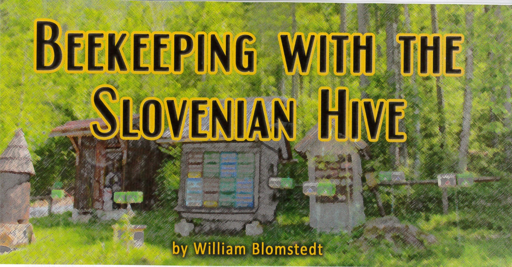

== Spis treści
toc::[]

== Wstęp

Słowenia to niewielki kraj z bogatą tradycją pszczelarską. Na światowej scenie pszczelarskiej może pochwalić się kilkoma wyjątkowymi cechami: to ojczyzna pszczoły kraińskiej, kraj o niezwykle wysokim odsetku pszczelarzy, a także miejsce związane z wieloma znaczącymi postaciami w historii pszczelarstwa (w tym pierwszym uniwersyteckim profesorem pszczelarstwa w USA). Kolejną cechą charakterystyczną słoweńskiego pszczelarstwa jest rodzaj uli, które stosują. Podczas gdy większość świata korzysta z uli Langstrotha, około 90% słoweńskich pszczół nadal mieszka w swoich tradycyjnych ulach AZ. Ule te są zwykle ustawiane w małych domkach, obok siebie i jeden na drugim. Często malowane są w jaskrawe kolory lub ozdabiane rysunkami, stając się centralnym punktem każdego podwórka. Byłem nimi zauroczony, gdy po raz pierwszy zobaczyłem je cztery lata temu, i napisałem o nich w swojej serii artykułów o pszczelarstwie w Słowenii. Moja uwaga ponownie kieruje się ku tym słoweńskim ulom, które teraz zaczęły pojawiać się także w amerykańskich ogródkach.

== Wycieczka do Słowenii

We wrześniu 2014 roku grupa amerykańskich pszczelarzy udała się do Słowenii na sześciodniową wycieczkę pszczelarską, podczas której spotykali pszczelarzy i naukowców, kosztowali różnych rodzajów miodów oraz „medicy” (miodowego likieru) i odwiedzali muzea. Częścią wycieczki było oglądanie licznych nowoczesnych i historycznych domków dla uli, które wciąż funkcjonują w różnych częściach kraju. W siedzibie Słoweńskiego Stowarzyszenia Pszczelarzy grupa wysłuchała wykładu dr. Janko Božiča, badacza zachowań pszczół z Uniwersytetu w Lublanie. Jego wystąpienie koncentrowało się głównie na zastosowaniu i korzyściach wynikających z użytkowania słoweńskich uli.

Organizatorem tej wycieczki był Mark Simontisch, 75-letni emerytowany rybak i pszczelarz mieszkający na Cape Cod w stanie Massachusetts. Po raz pierwszy odwiedził Słowenię kilka lat wcześniej, ponieważ dwoje jego dziadków urodziło się na południu tego kraju, a on sam wciąż miał kuzynów mieszkających w tej samej wiosce. Simontisch szybko zakochał się w tym miejscu: w wiejskim krajobrazie, jedzeniu, winie i oczywiście kulturze pszczelarskiej. Podczas swojej wizyty zaprzyjaźnił się ze słoweńskimi pszczelarzami, którzy powiedzieli mu, że chociaż wielu europejskich pszczelarzy odwiedza Słowenię, to jeszcze nie było zorganizowanej wycieczki dla pszczelarzy amerykańskich. Współpracując z firmą ApiTours, Simontisch stworzył wakacje dla osób zainteresowanych pszczołami, oferując jednocześnie możliwość poznania innych uroków Słowenii.

Przed tym przedsięwzięciem Simontisch współdzielił jeden słoweński ul ze swoim przyjacielem na Cape Cod. Po obejrzeniu uli w akcji i wysłuchaniu wykładu dr. Božiča, postanowił całkowicie przejść na słoweński sposób pszczelarstwa.

Simontisch nie był zainteresowany słoweńskimi ulami wyłącznie z powodów rodzinnych: jego wcześniejsza kariera jako rybaka komercyjnego obejmowała ręczne wyciąganie sieci, co doprowadziło do licznych problemów ortopedycznych z ramionami. W jego wieku podnoszenie ciężkich uli Langstrotha nie sprawiało już przyjemności. W przypadku słoweńskiego ula nie trzeba zdejmować nadstawki podczas inspekcji gniazda, a najcięższy element, jaki należy podnieść, to pełna ramka.

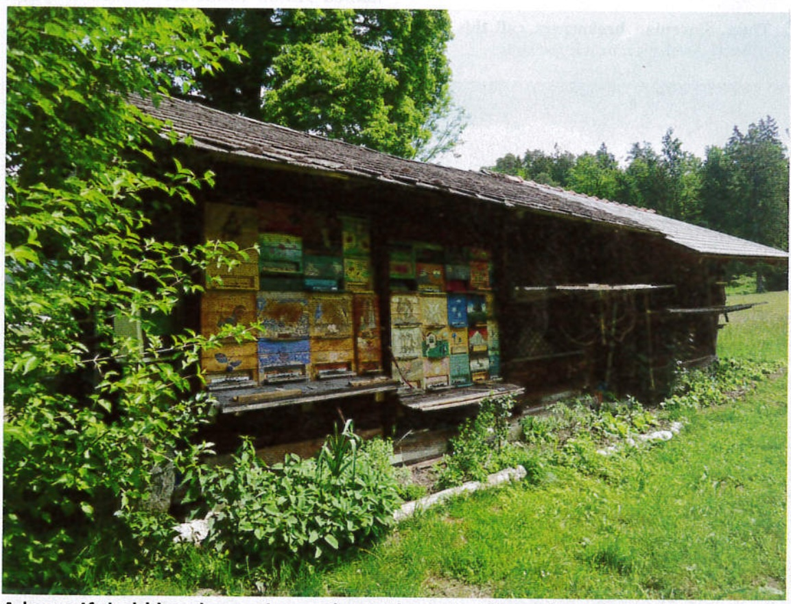

Zdjęcie 1: Piękny, stary domek dla pszczół w północnej Słowenii. Pszczoły miodne były w nim hodowane przez ponad trzy pokolenia.

Z większością pszczelarzy w swoim stowarzyszeniu, którzy są kobietami lub starszymi osobami o malejącej sile w górnych partiach ciała, Simontisch uznał, że nie będzie jedynym zainteresowanym tym typem ula. Zamiast kupować kilka uli dla siebie, zamówił całą przesyłkę uli AZ. Poprosił również dr. Božiča o możliwość napisania podręcznika, ponieważ poza kilkoma fragmentarycznymi informacjami w internecie nie było dostępnych instrukcji w języku angielskim dotyczących użytkowania słoweńskich uli.

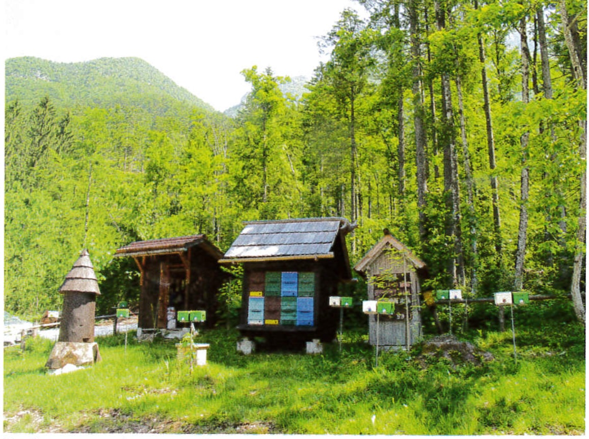

Zdjęcie 2: Domki pszczele mogą mieć różne rozmiary. Oto dwa mniejsze domki używane do produkcji trutni na pasiece unasienniającej. Na stojakach przed nimi można zobaczyć odkłady.

Dla niektórych uczestników wycieczki widok tych uli na słoweńskiej wsi był wystarczający, aby zacząć eksperymentować z słoweńskimi ulami. Simontisch prowadził również prezentacje w innych stowarzyszeniach pszczelarskich w Nowej Anglii, a pierwsza przesyłka słoweńskich uli wyprzedała się jeszcze przed dotarciem do Stanów Zjednoczonych. Druga przesyłka, która miała dotrzeć latem, również została wyprzedana, a trzecia planowana jest na jesień. Osoby, które zaczęły używać tych uli, tworzą niewielką, ale entuzjastyczną społeczność z własną stroną na Facebooku: „AZ Hivers”. Strona zawiera mnóstwo informacji i filmów o tym, jak zacząć.

== Charakterystyka ula słoweńskiego

Słoweński ul po raz pierwszy pojawił się na początku XX wieku. Pszczelarz o nazwisku Anton Žnideršič chciał dostosować ul z ruchomymi ramkami, który mógłby być używany wewnątrz tradycyjnych słoweńskich domków pszczelarskich, a jednocześnie byłby łatwy w transporcie. Eksperymentował z kilkoma różnymi typami uli z sąsiednich krajów, w tym z Langstrothem, ale największy potencjał dostrzegł w ulu Alberti’ego z Niemiec. Zmodyfikował ul Alberti’ego, zmieniając ramki z pionowych na poziome, i sprawił, że ramki na miód i ramki na czerw miały ten sam rozmiar, aby można je było zamieniać.

Ramki AZ są nieco krótsze i głębsze niż Langstrotha (o 1,5 cala w obu wymiarach) i nie mają „uszu”. Zamiast tego mają rowek w kształcie litery „U” na górze i na dole, dzięki czemu są wsuwane do ula, zamiast być podnoszone. Po otwarciu drzwi ula i wewnętrznych ekranów, gniazdo czerwiowe można natychmiast i szybko skontrolować. Ramki bez „uszu” można również obrócić do góry nogami, co jest przydatne przy budowie podstawy plastra lub w przypadku pasów miodu, które są zbyt grube. Każdy ul ma dwie sekcje oddzielone kratą odgrodową – gniazdo czerwiowe na dole i miód na górze – przy czym ta ostatnia może być zamknięta zimą w celu zmniejszenia wielkości ula.

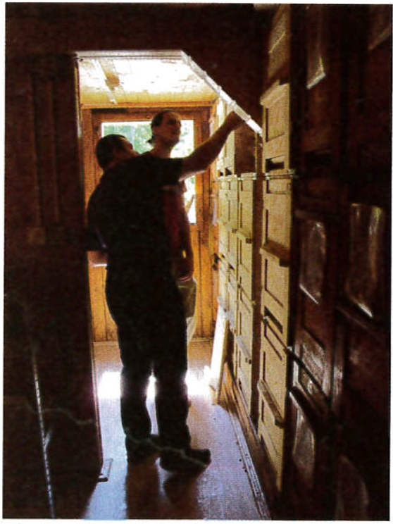

Zdjęcie 3: Wnętrze dużego domku pszczelego. Ule mogą być ułożone w trzech poziomach.

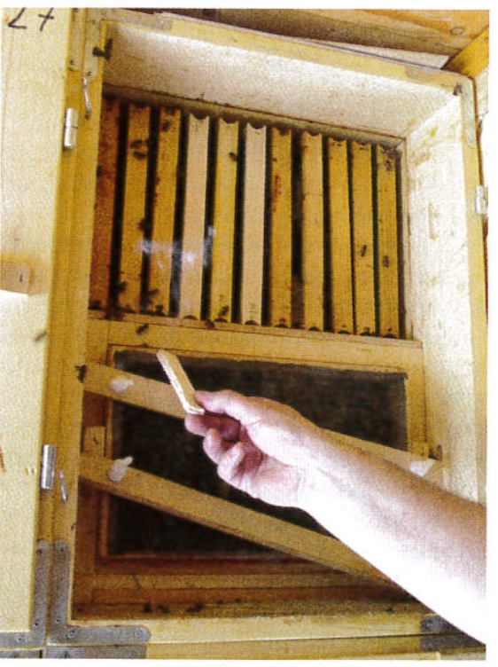

Zdjęcie 4: Tył ula AZ z otwartymi drzwiami i wyjętym jednym ekranem. Plaster w kształcie litery „U” bez uszu opiera się na trzech metalowych prętach i jest wsuwany.

Ponieważ są otwierane od tyłu, słoweńskie ule są często układane jeden na drugim — na dwie lub trzy warstwy — i umieszczane obok siebie w małym domku. Wszystkie wejścia są skierowane w jedną stronę, a pszczoły znajdują swoje ule po kolorze lub wzorze na przodzie. Liczba uli zależy od wielkości domku, ale widziałem zarówno takie, które mieściły 2 ule, jak i ponad 100. Kontrola uli odbywa się wewnątrz domku, co utrudnia dostrzeżenie małych rzeczy, takich jak jaja czy choroby, ale niektórzy pszczelarze argumentują, że brak bezpośredniego światła słonecznego docierającego do wnętrza ula jest mniej stresujący dla pszczół. Dach chroni zarówno pszczoły, jak i pszczelarza; ten ostatni może pracować w niesprzyjających warunkach pogodowych, podczas gdy pszczoły zyskują cień latem (potrzebują mniej wody) oraz więcej ciepła zimą (mniej miodu zużywanego do ogrzewania ula). Mówi się, że miód produkowany w domkach AZ ma niższą zawartość wody niż ten wytwarzany w ulach Langstrotha stojących obok.

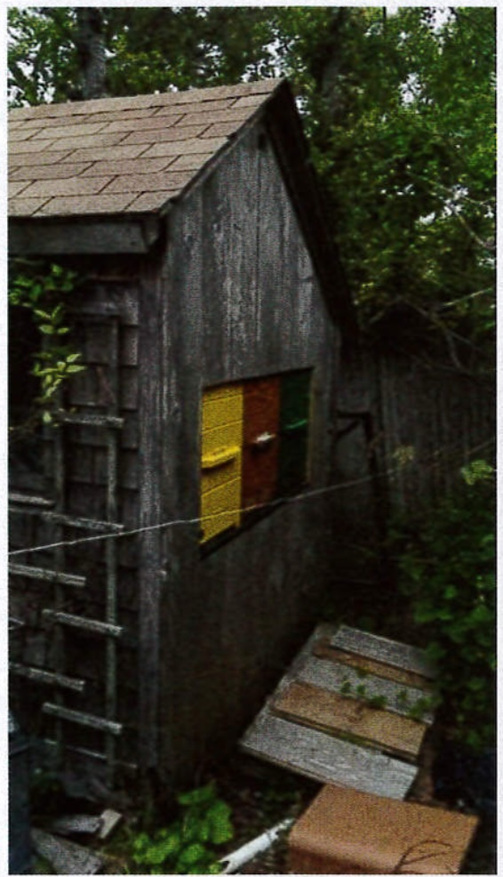

Zdjęcie 5: Jak widać w tej szopie na Cape Cod, ule AZ doskonale nadają się do dyskretnego pszczelarstwa. Nikt nie zauważy kilku pszczół wchodzących i wychodzących z boku chatki. Zdjęcie dzięki uprzejmości Marka Simontischa.

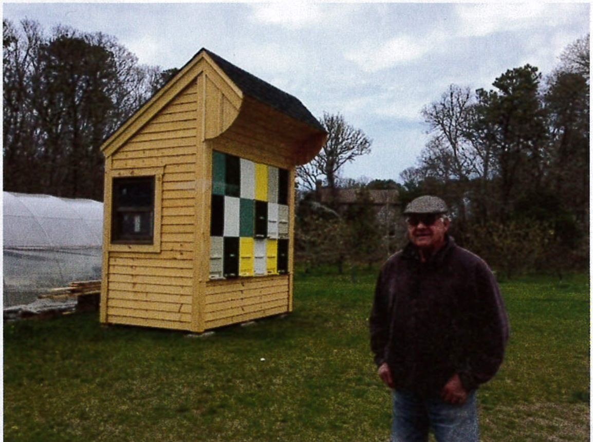

Zdjęcie 6: Mark Simontisch obok słoweńskiego domku pszczelego, który współdzieli ze Stephenem Danielem. Zdjęcie dzięki uprzejmości Marka Simontischa.

== Mobilne domki pszczele

Słoweński ul został zaprojektowany specjalnie z myślą o transporcie. Wewnątrz ula, zarówno przy wejściu, jak i drzwiach, znajduje się seria metalowych trójkątów, które zapewniają odpowiednie rozmieszczenie ramek i zapobiegają ich wibracjom podczas transportu. Komercyjni słoweńscy pszczelarze często migrują po kraju, używając specjalnie skonstruowanych ciężarówek lub przyczep z ulami zamontowanymi na stałe z tyłu. Pszczelarz przywozi ciężarówkę lub przyczepę na pastwisko i zostawia ją tam bez potrzeby użycia wózka widłowego lub ciężkiej pracy fizycznej do rozładunku. Po zakończeniu pożytku pszczelarz wraca, zwalnia hamulec postojowy i jedzie na kolejne pastwisko.

Wady słoweńskiego ula, w zależności od twoich celów pszczelarskich, mogą być znaczące. Jeśli Twoim celem jest maksymalne wykorzystanie każdej kropli miodu, słoweński ul może nie być odpowiedni. Ul Langstrotha, zyskał światowe uznanie, dzięki swojej prostocie i wydajności. Ul AZ wymaga więcej uwagi od pszczlarza ora ma więcej skomplikowanych części, takich jak zamykane drzwi. 

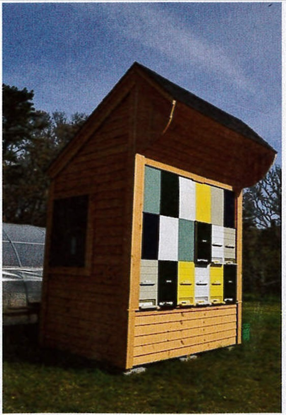

Zdjęcie 7: Domek pszczeli w połowie użytkowany, a pozostałe przestrzenie wypełniają przegrody. Ule mogą być wyjmowane lub wkładane z powrotem. Zdjęcie dzięki uprzejmości Marka Simontischa.

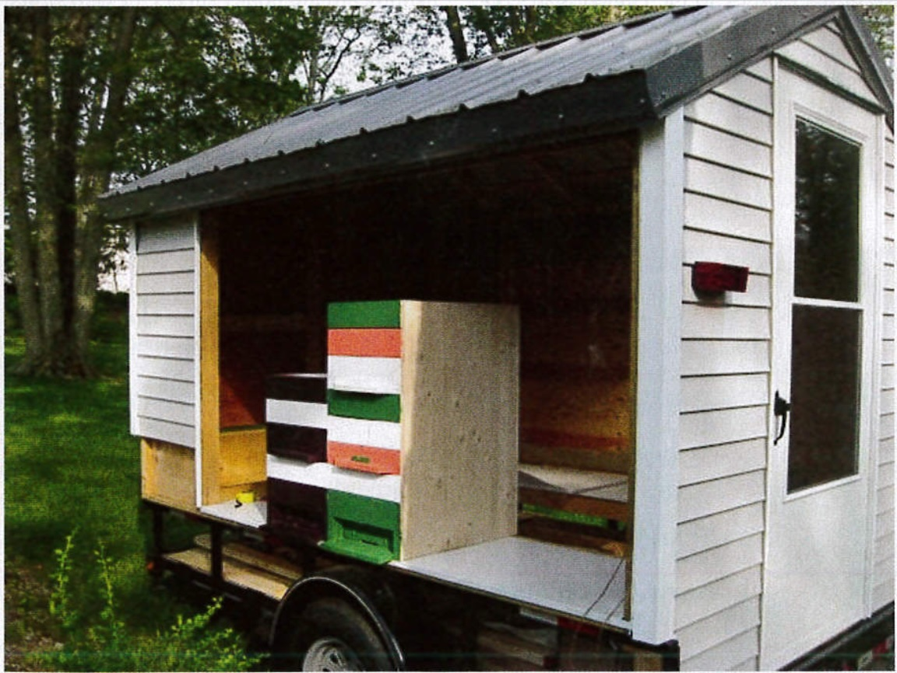

Zdjęcie 8: Mobilny domek pszczeli Shauna Fitzgeralda. Zdjęcie dzięki uprzejmości Marka Simontischa.

Mają również stały rozmiar, który w porównaniu z ulami Langstrotha jest stosunkowo mały. Zwykle znajduje się tylko jedna sekcja miodowa, więc plastry muszą być natychmiast usunięte i zastąpione. Nie można, jak w przypadku ula Langstrotha, zbudować gigantycznego ula, ustawić na nim wiele nadstawek i zapomnieć o nim na kilka tygodni. Ule słoweńskie muszą być dokładnie monitorowane, zwłaszcza w sezonie rójki, a większość słoweńskich pszczelarzy trzyma je na swoich podwórkach, aby często je obserwować.

== Kulturowe znaczenie uli

Jak wspomniano wcześniej, fronty uli były tradycyjnie malowane obrazkami. Te obrazy opowiadają historie, oferują ochronę, zachowują wspomnienia i opowiadają dowcipy – cokolwiek jest ważne dla pszczelarza lub aktualnego klimatu kulturowego. Muzeum pszczelarskie w tym kraju ma ponad 100 oryginalnych, malowanych frontów uli, a starsze fronty uli są bardzo poszukiwane i drogie jako antyki. Dla pszczół, które mogą mieć tuzin lub więcej wejść w domku do wyboru, te wzory dają im wzorzec, aby wiedziały, który ul jest ich własny.

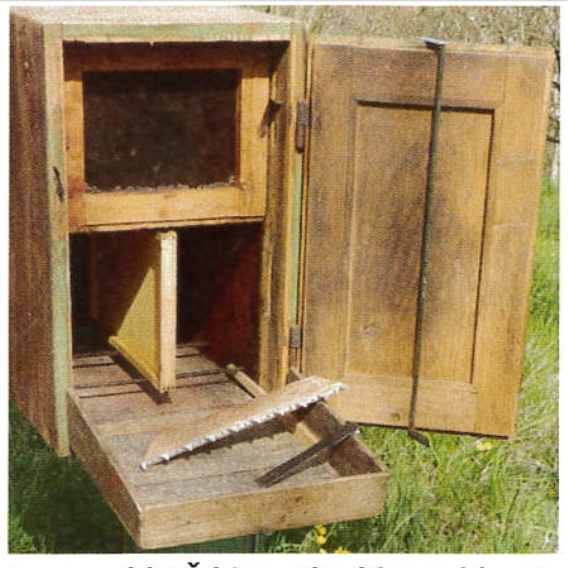

Zdjęcie 9: Bardzo stary ul AZ. Stół ula przymocowany z tyłu umożliwia pszczołom powrót do ula. Dystans znajduje się na stole, a czyścik ula (do usuwania zanieczyszczeń z dna) wisi na drzwiach. Zdjęcie dzięki uprzejmości Janko Bozica.

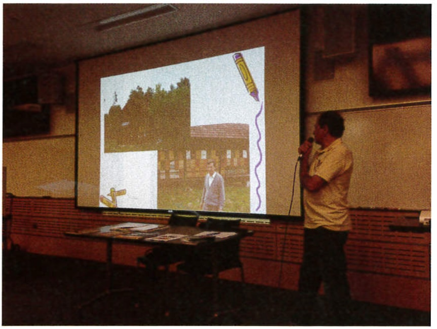

Zdjęcie 10: Dr Janko Bozic podczas wykładu na UMASS Amherst.

== Ul hobbystyczny

Słoweński ul wydaje się bardziej odpowiedni dla amerykańskiego hobbysty pszczelarskiego, kogoś, kto jest gotów poświęcić wiele godzin swoim pszczołom i dla kogo pokazywanie uli gościom i przechodniom jest radością. Domek dla uli emanuje porządkiem i schludnością, co przemawia do germańskiego sentymentu i promuje bliskość oraz długotrwały kontakt prawdziwego miłośnika pszczół. Jest to szczególnie widoczne w Słowenii, gdzie pszczoły otacza wielka troska i sentyment. Te domki dla pszczół wykraczają poza prostą produkcję miodu, stając się kulturowo istotnymi i dekoracyjnymi elementami krajobrazu. Wewnątrz domku dla pszczół, wypełnionego zapachem wosku i miodu, gdzie drewniana konstrukcja lekko brzęczy, a na półce leżą księgi dokumentujące historię każdego ula, miejsce to staje się niemal świętą przestrzenią poświęconą pszczołom.

„Dla mnie jedyne porównanie to wejście do kościoła” – pisze dr Božič we wstępie do swojej nowo opublikowanej książki „A-Z Beekeeping with the Slovenian Hive.” Z zachętą Marka Simontischa oraz moją pomocą w edycji, dr Božič najpierw napisał broszurę o słoweńskim ulu, a następnie pełny podręcznik, którego wydanie miało miejsce w czerwcu, tuż przed jego podróżą do Stanów Zjednoczonych. Podczas 20-dniowej podróży po wschodnim wybrzeżu dr Božič wygłaszał prezentacje na temat słoweńskich uli, Światowego Dnia Pszczół i swoich badań w kilku uniwersytetach i stowarzyszeniach pszczelarskich.

W trakcie podróży dr Božič pojawił się nawet w lokalnych wiadomościach. Część tych wykładów została nagrana i można je znaleźć na stronie Facebooka AZ Hivers. Podróż dr Božiča zakończyła się w Georgii, gdzie kolejna grupa pszczelarzy zainteresowała się słoweńskimi ulami. Mary Lou Blohm, która w 2014 roku uczestniczyła w wycieczce do Słowenii, stała się entuzjastką uli AZ, a inny pszczelarz, Brian Drebber, zbudował swoją własną wersję uli AZ. Zamiast zamawiać je z Europy, stworzyli ograniczoną liczbę uli AZ dla swojego klubu, eksperymentując z wymiarami ramek Langstrotha, aby dwa typy uli mogły być łatwo wymieniane. W swojej książce dr Božič zauważa, że nie widzi większych wad w używaniu ramek Langstrotha w ulu AZ, ale z uwagi na ich mniejsze rozmiary mogą one lepiej działać z trzema sekcjami zamiast dwóch.

Ewidentnie jest wiele do eksperymentowania z tymi ulami AZ. Ci, którzy są zainteresowani utrzymaniem pszczół, ale zmęczeni przenoszeniem ciężkich nadstawek, ci, którzy chcieliby brzęczącej ozdoby do swojego ogrodu, lub ci, którzy są ciekawi innego podejścia, są zachęcani do wypróbowania AZ. Książka „A-Z Beekeeping with the Slovenian Hive” jest dobrym wprowadzeniem dla doświadczonych pszczelarzy Langstrotha, a w przyszłości planowana jest również seria wykładów online. Dla tych, którzy chcą czerpać inspirację z pierwszej ręki, ApiTours oferuje kolejną wycieczkę pszczelarską do Słowenii we wrześniu tego roku, a także w maju przyszłego roku. Będzie również wiele okazji do spróbowania medicy.

== Kontakt i dodatkowe informacje

* Kontakt w sprawie książki „A-Z Beekeeping with the Slovenian Hive”: beeslovenia@gmail.com
* AZ Hivers na Facebooku: https://www.facebook.com/groups/1608057116103205/
* Informacje o zakupie słoweńskiego ula lub rezerwacji ApiTour: http://www.slovenianbeekeeping.com/

== Tłumaczenie

Autor: William Blomstedt

Zródło: https://czs.si/Upload/clanek%20ABJ.pdf

Tłumaczenie: R.Styczynski z pomocą ChatGPT
