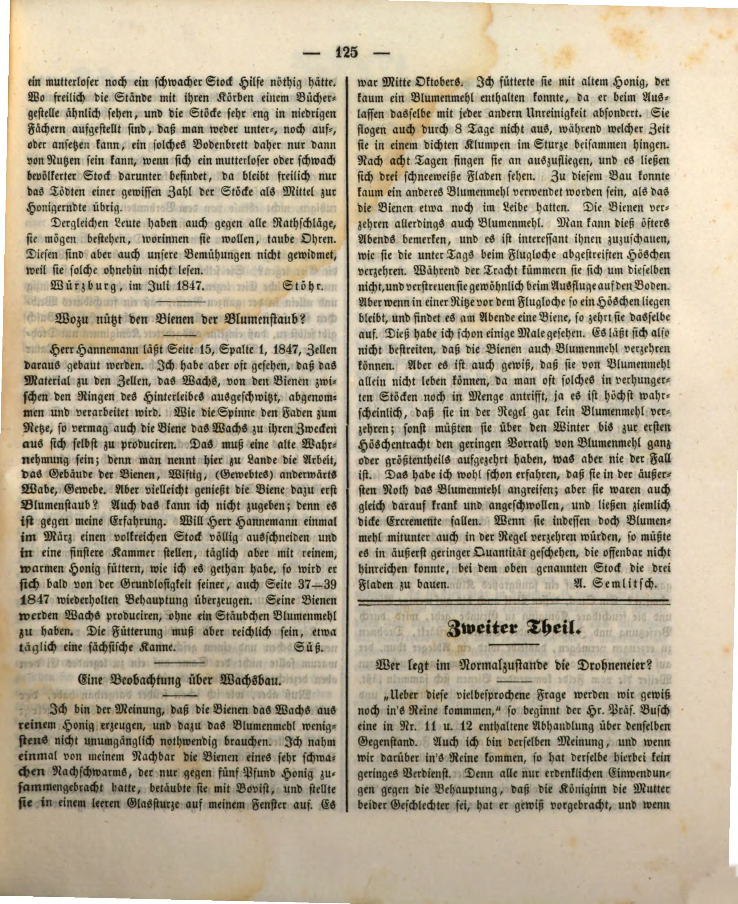
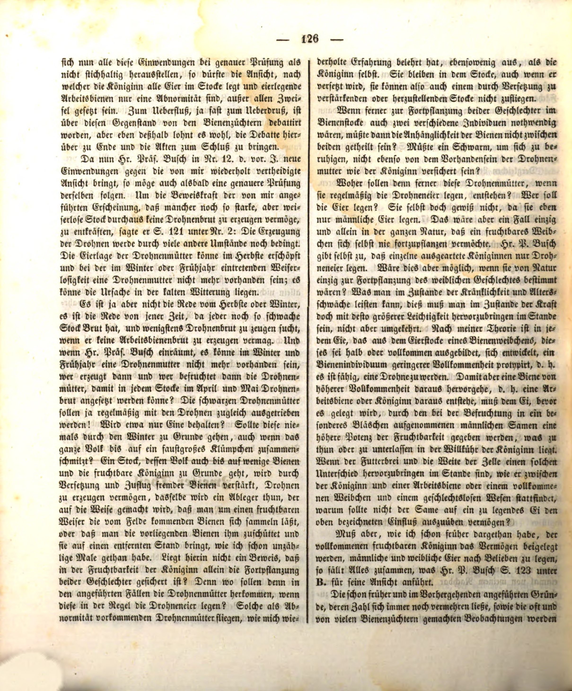
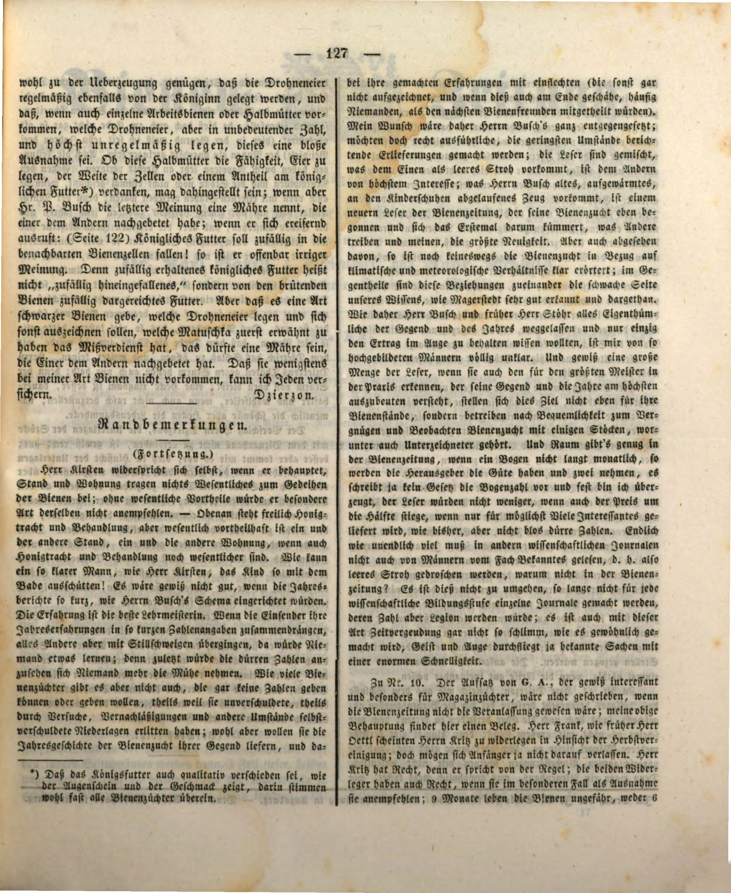

# Kto w normalnym stanie składa jaja trutowe?

Jan Dzierżoń, *Bienenzeitung*, 1847

„Z pewnością dojdziemy jeszcze do ładu w tej tak wiele dyskutowanej kwestii” — tak pan prezes Busch rozpoczyna rozprawę na ten sam temat, zamieszczoną w nr 11 i 12. Ja także jestem tego zdania; a gdy dojdziemy w tej sprawie do jasności, jego zasługa będzie niemała. Przedstawił bowiem z pewnością wszelkie dające się pomyśleć zarzuty przeciw twierdzeniu, że królowa jest matką obu płci; i jeżeli po dokładnym zbadaniu wszystkie te zarzuty okażą się nieuzasadnione, to pogląd, według którego królowa składa w ulu wszystkie jaja, a robotnice składające jaja są tylko anomalią, powinien być poza wszelką wątpliwością. Pszczelarze dyskutowali ten temat aż do przesytu, lecz właśnie dlatego warto doprowadzić debatę do końca i zamknąć akta sprawy.

Ponieważ pan prezes Busch w nr 12 z ubiegłego roku przedstawia nowe zarzuty wobec poglądu, którego wielokrotnie broniłem, niech zaraz nastąpi ich dokładniejsze zbadanie. Aby osłabić moc dowodową przytoczonego przeze mnie zjawiska, iż niejeden nawet bardzo silny, lecz bezkrólowy pień w ogóle nie potrafi wytworzyć czerwiu trutowego, powiedział on na s. 121, w punkcie 2: wytwarzanie trutni zależy jeszcze od wielu innych okoliczności; zdolność składania jaj przez matki trutowe może jesienią się wyczerpać, a gdy bezmateczność nastąpi zimą lub wiosną, matki trutowe może już nie być; przyczyną może być też chłodna pogoda.

Nie mówimy jednak o jesieni ani zimie, lecz o tym czasie, gdy każdy, nawet najsłabszy pień ma czerw i przynajmniej usiłuje wychować czerw trutowy, jeśli nie jest zdolny wytworzyć czerwiu robotnic. A jeśli pan prezes Busch przyznaje, że zimą i wiosną matki trutowej może już nie być, to kto ją wtedy wytwarza i kto zapładnia, aby w każdym pniu w kwietniu i maju można było założyć czerw trutowy? Czarne matki trutowe mają przecież być regularnie wypędzane wraz z trutniami! Czy zostawia się tylko jedną? Czy ta nigdy nie ginie zimą, nawet gdy cała rodzina kurczy się do kłębka wielkości pięści?

Pień, którego rodzina zginęła niemal całkowicie — pozostało tylko kilka pszczół i płodna królowa — po wzmocnieniu przez przeniesienie i dolot obcych pszczół potrafi wytworzyć trutnie. To samo uczyni odkład utworzony tak, że wokół płodnej królowej pozwala się zebrać pszczołom wracającym z pola, albo dosypuje się do niej znajdujące się przed ulem pszczoły i przenosi na odległe stanowisko; robiłem tak już niezliczoną liczbę razy. Czy nie dowodzi to, że w samej płodności królowej zabezpieczone jest rozmnażanie obu płci? Skąd bowiem w podanych przypadkach miałyby się wziąć matki trutowe, gdyby to one z zasady składały jaja trutowe? Takie matki trutowe, występujące jako anomalia, jak pouczyło mnie wielokrotne doświadczenie, nie wylatują — podobnie jak sama królowa. Pozostają w ulu także po jego przeniesieniu, nie mogą więc przylecieć do pnia wzmacnianego lub odbudowywanego przez przeniesienie.

Gdyby zaś do rozmnażania obu płci w rodzinie pszczelej były potrzebne dwa różne osobniki, czy przywiązanie pszczół nie musiałoby dzielić się między nimi? Czy rój, aby się uspokoić, nie musiałby być równie pewny obecności matki trutowej, jak obecności królowej?

Skąd zresztą miałyby powstawać te matki trutowe, jeśli regularnie składają jaja trutowe? Kto miałby składać ich jaja? Z pewnością nie one same, skoro składają tylko jaja męskie. Byłby to jedyny w całej przyrodzie przypadek, w którym płodna samica nigdy nie mogłaby rozmnażać samej siebie. Pan P. Busch sam przyznaje, że pojedyncze zwyrodniałe królowe składają wyłącznie jaja trutowe. Czy byłoby to możliwe, gdyby z natury przeznaczone były wyłącznie do rozmnażania płci żeńskiej? To, co jest możliwe w stanie choroby i starczego osłabienia, powinno być tym łatwiejsze do wywołania w stanie siły, a nie odwrotnie.

Według mojej teorii w każdym jaju rozwijającym się w jajniku samicy pszczoły — czy to pół- czy w pełni rozwiniętej — zarysowany jest osobnik pszczeli niższej doskonałości, to znaczy zdolny stać się trutniem. Aby jednak powstała z niego pszczoła o wyższej doskonałości, czyli robotnica albo królowa, jajo musi przed złożeniem otrzymać, za sprawą męskiego nasienia umieszczonego przy zapłodnieniu w osobnym pęcherzyku, wyższą możność płodności. Wykonanie lub zaniechanie tego pozostaje w mocy królowej. Jeżeli papka pokarmowa i szerokość komórki mogą wywołać taką różnicę, jaka zachodzi między królową a robotnicą, albo między w pełni rozwiniętą samicą a istotą bezpłciową, dlaczego nasienie nie miałoby wywrzeć opisanego wyżej wpływu na jajo, które ma zostać złożone?

Jeżeli jednak — jak wykazałem już wcześniej — w pełni płodnej królowej trzeba przypisać zdolność składania wedle woli jaj męskich i żeńskich, upada wszystko, co pan P. Busch przytacza na s. 123 w punkcie B na poparcie swego poglądu.

…wystarczą, aby dojść do przekonania, że jaja trutowe również regularnie składa królowa, a jeśli trafiają się pojedyncze robotnice albo półmatki, które składają jaja trutowe, to czynią to w nieznacznej liczbie i zupełnie nieregularnie, a więc jest to tylko wyjątek. Czy te półmatki zawdzięczają zdolność składania jaj szerokości komórek czy udziałowi w mleczku królewskim* — niech pozostanie nierozstrzygnięte. Jeżeli jednak pan P. Busch nazywa ten drugi pogląd bajką, którą jedni powtarzają za drugimi, i oburza się, wołając (s. 122): „Mleczko królewskie ma przypadkowo wpadać do sąsiednich komórek pszczelich!”, to oczywiście jest w błędzie. „Przypadkowo otrzymane” mleczko królewskie nie znaczy bowiem „przypadkowo wpadłe do środka”, lecz pokarm przypadkowo podany przez pszczoły opiekujące się czerwiem. Natomiast opowieść o pewnym rodzaju czarnych pszczół, które składają jaja trutowe i mają się poza tym wyróżniać — a których pierwsze wspomnienie przypisuje się Matuschce — może być właśnie taką bajką, powtarzaną z ust do ust. Mogę każdego zapewnić, że przynajmniej w mojej rasie pszczół one nie występują.

\* Prawie wszyscy pszczelarze zgodzą się zapewne, że mleczko królewskie różni się także jakościowo, co widać i czuć po smaku.

Dzierżoń

---

Tłumaczenie: R. Styczynski z pomocą ChatGPT
