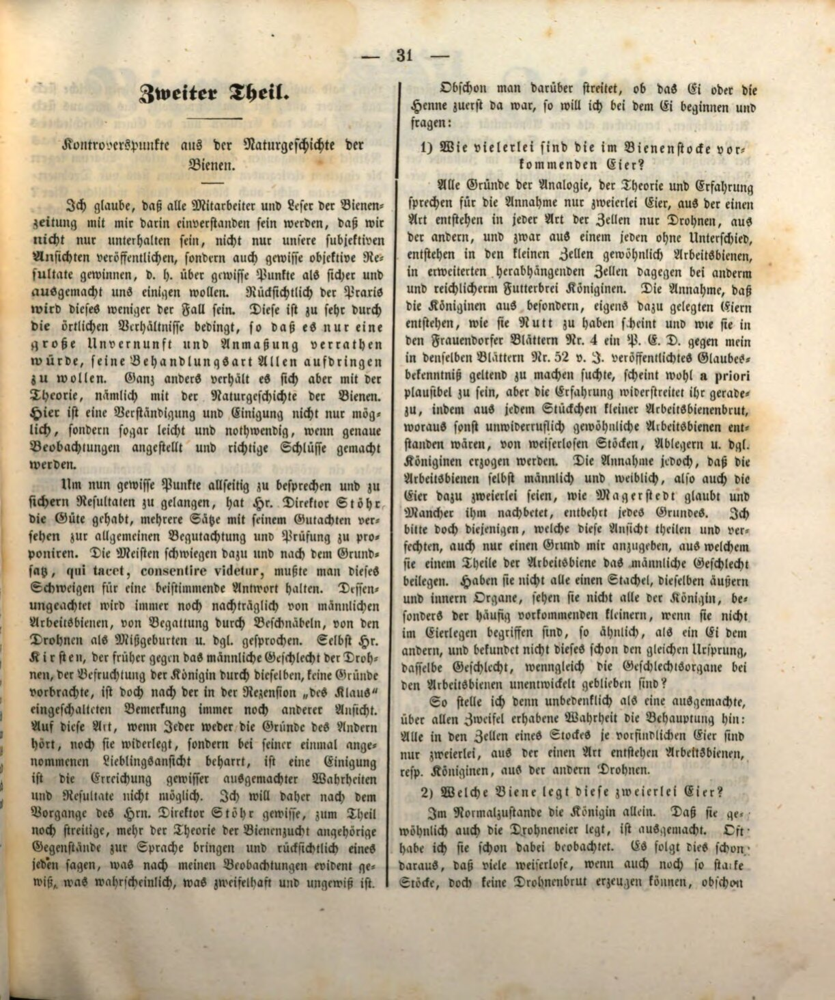
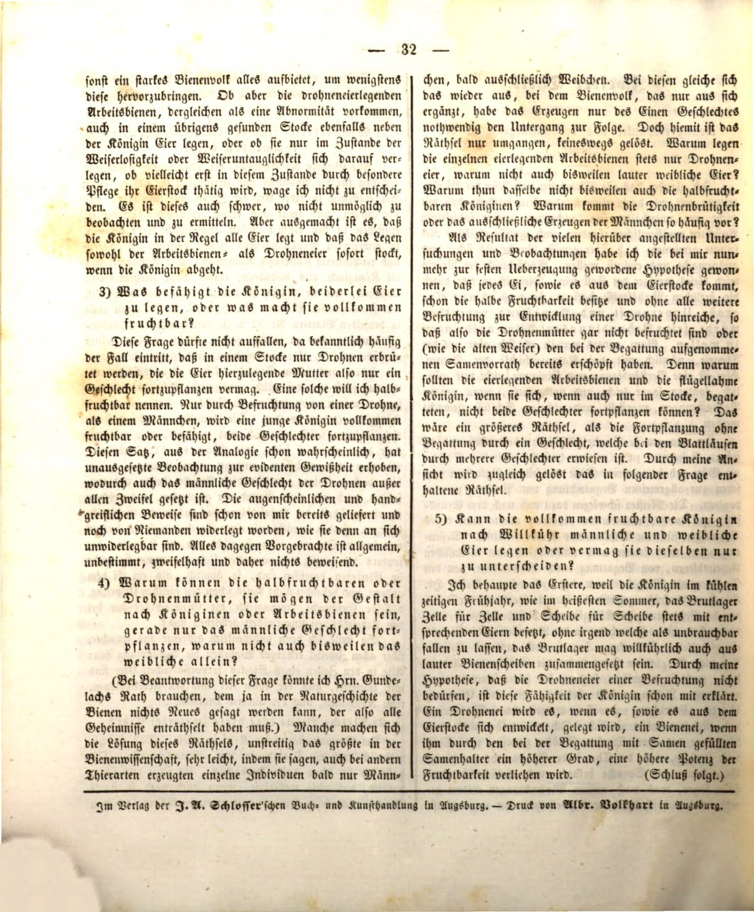
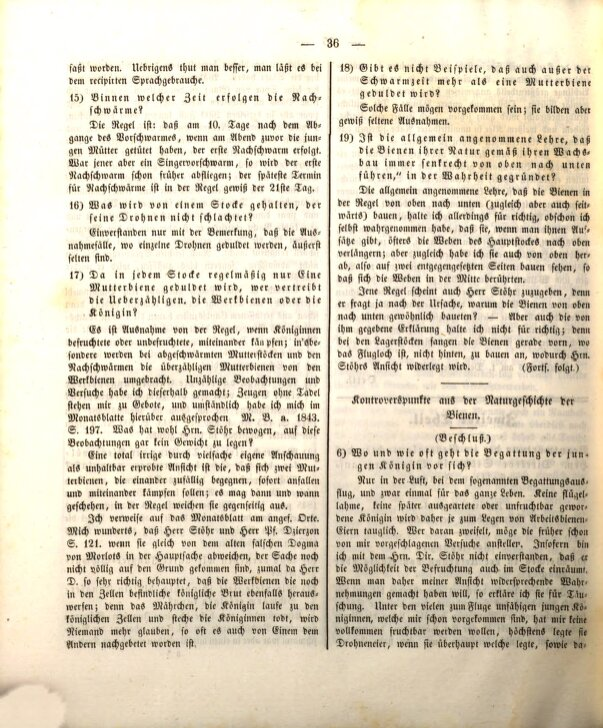
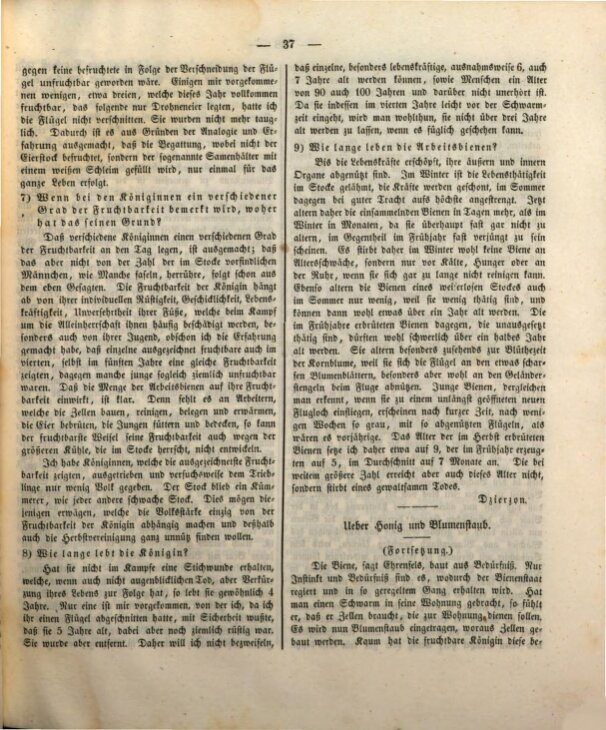

:toc: macro
:toc-title: 
:toclevels: 4

= Kontrowersyjne punkty z historii naturalnej pszczół
Jan Dzierzon, Bienenzeitung 4-5, 1847

== Spis treści
toc::[]

== Wstęp 

Uważam, że wszyscy współpracownicy i czytelnicy gazety pszczelarskiej zgodzą się ze mną, że nie powinniśmy ograniczać się tylko do rozrywki, publikowania naszych subiektywnych opinii, lecz także dążyć do uzyskania pewnych obiektywnych wyników, czyli ustalenia i uzgodnienia pewnych kwestii jako pewnych i rozstrzygniętych. W odniesieniu do praktyki będzie to jednak mniej prawdopodobne, ponieważ jest ona zbyt silnie uzależniona od lokalnych warunków, co sprawia, że byłoby dużym nierozsądkiem i arogancją próbować narzucać wszystkim jeden sposób postępowania.

Inaczej sprawa wygląda z teorią, a konkretnie z historią naturalną pszczół. W tym przypadku porozumienie i uzgodnienie nie tylko jest możliwe, ale wręcz łatwe i konieczne, o ile przeprowadzane są dokładne obserwacje i wyciągane prawidłowe wnioski.

Aby omówić pewne kwestie z każdej strony i dojść do solidnych wyników, Pan Dyrektor Stöhr miał uprzejmość przedstawić kilka swoich opinii do ogólnej oceny i analizy. Większość jednak milczała, a zgodnie z zasadą „kto milczy, ten się zgadza”, milczenie to musiało zostać uznane za stanowczą odpowiedź. Niemniej jednak nadal mówi się o męskich robotnicach, zapładnianiu za pomocą żądła, trutniach jako nieudanych narodzinach itd.

Nawet Pan Kirsten, który wcześniej przedstawiał argumenty przeciw męskiemu charakterowi trutni i zapładnianiu królowej przez nich, nadal w recenzji „des Klaus” przedstawia odmienne zdanie. W taki sposób, jeśli każdy ani nie słucha argumentów drugiego, ani ich nie obala, lecz trzyma się swojego ulubionego poglądu, porozumienie i ustalenie pewnych uzgodnionych prawd i wyników staje się niemożliwe.

Dlatego, idąc za przykładem Pana Dyrektora Stöhra, zamierzam przedstawić kilka kwestii, częściowo nadal spornych, bardziej związanych z teorią pszczelarstwa, i omówić je w sposób jasny, wskazując, co według moich obserwacji jest oczywiste, co prawdopodobne, a co wątpliwe i niepewne.

Chociaż wciąż trwa dyskusja, czy pierwsze było jajko, czy kura, chciałbym zacząć od jajka i zadać pytanie:

== 1. Ile rodzajów jaj występuje w ulu pszczół?

Wszystkie argumenty z zakresu analogii, teorii i doświadczenia przemawiają za założeniem, że istnieją tylko dwa rodzaje jaj. Z jednego rodzaju powstają w każdej komórce tylko trutnie, z drugiego – w zależności od rodzaju komórki – zwykle robotnice w małych komórkach, a w większych, zwisających komórkach, po obfitym karmieniu, królowe. Założenie, że królowe powstają z osobnych, specjalnie złożonych jaj, wydaje się a priori uzasadnione, ale doświadczenie temu zaprzecza. Każdy fragment larw robotniczych, które normalnie wykluwają się jako robotnice, może w rodzinach bez królowej, odkładach i podobnych sytuacjach zostać przekształcony w królowe.

Założenie jednak, że robotnice są zarówno męskie, jak i żeńskie, a także że ich jaja są dwojakiego rodzaju, jak twierdzi Magerstedt i inni powtarzają za nim, jest całkowicie bezpodstawne. Proszę więc tych, którzy podzielają ten pogląd i próbują go bronić, o podanie chociaż jednego powodu, dla którego przypisują części robotnic męską płeć. Czyż wszystkie nie mają żądła, tych samych zewnętrznych i wewnętrznych organów, nie przypominają królowej, a ich mniejsze rozmiary nie wynikają jedynie z ich funkcji w kolonii? I czyż nie dowodzi to tego samego pochodzenia, tej samej płci, mimo że narządy rozrodcze robotnic pozostają nierozwinięte?

Dlatego bez wahania uznaję za pewną, niepodważalną prawdę następujące stwierdzenie: wszystkie jaja obecne w komórkach jednego ula są dwojakiego rodzaju. Z jednego rodzaju powstają robotnice lub królowe, z drugiego – trutnie.

== 2. Która pszczoła składa te dwa rodzaje jaj?

W normalnych warunkach tylko królowa. To, że składa również jaja trutowe, jest oczywiste – wielokrotnie to zaobserwowałem. Wynika to także z faktu, że wiele bezkrólowych rodzin, nawet jeśli są bardzo silne, nie jest w stanie wyprodukować czerwiu trutowego.

Silna rodzina pszczela zrobi wszystko, co w jej mocy, aby przynajmniej wytworzyć te [trutnie]. Jednakże czy robotnice składające jaja trutowe, uważane za anomalię, mogą również w zdrowym ulu składać jaja obok królowej, czy robią to tylko w stanie osierocenia lub gdy królowa jest niezdolna do funkcjonowania? A może dopiero w takim stanie, dzięki szczególnej opiece, ich jajniki stają się aktywne? Nie odważę się tego jednoznacznie rozstrzygnąć.

Jest to również trudne, jeśli nie niemożliwe, do zaobserwowania i ustalenia. Jednak pewne jest, że to królowa w normalnych warunkach składa wszystkie jaja, a składanie jaj zarówno przez robotnice, jak i trutnie natychmiast ustaje, gdy królowa opuszcza ul.

== 3. Co umożliwia królowej składanie obu rodzajów jaj, albo co czyni ją w pełni płodną?

To pytanie nie powinno dziwić, ponieważ znane są przypadki, gdy w ulu wylęgają się wyłącznie trutnie. W takiej sytuacji matka składająca jaja jest zdolna do rozmnażania tylko jednej płci. Taką królową nazywam „półpłodną”. Dopiero dzięki zapłodnieniu przez trutnia, czyli samca, młoda królowa staje się w pełni płodna i zdolna do rozmnażania obu płci.

To stwierdzenie, już prawdopodobne na podstawie analogii, zostało potwierdzone przez niezbite obserwacje, które wykazały, że męska płeć trutni nie budzi żadnych wątpliwości. Oczywiste i namacalne dowody zostały już przeze mnie przedstawione i nie zostały jeszcze przez nikogo obalone, ponieważ są one same w sobie niepodważalne. Wszystkie przeciwnie przedstawione twierdzenia są ogólne, nieokreślone, wątpliwe i w związku z tym niczego nie dowodzą.

== 4. Dlaczego półpłodne matki trutowe, niezależnie od tego, czy mają postać królowych, czy robotnic, mogą rozmnażać tylko męską płeć, a niekiedy również wyłącznie żeńską?

(Odpowiadając na to pytanie, mógłbym potrzebować rady pana Gundelacha, który w historii naturalnej pszczół prawdopodobnie już wszystko wyjaśnił i rozwikłał wszystkie tajemnice). Niektórzy wyjaśniają tę zagadkę, prawdopodobnie największą w nauce o pszczołach, w bardzo prosty sposób, twierdząc, że u innych gatunków zwierząt pojedyncze osobniki czasami produkują wyłącznie samce, a czasami tylko samice. W przypadku pszczół, które opierają swoje istnienie na współpracy w kolonii, wytwarzanie tylko jednej płci musiałoby nieuchronnie prowadzić do ich zagłady. Jednak takie wyjaśnienie jest jedynie obejściem problemu, a nie jego rozwiązaniem.

Dlaczego pojedyncze robotnice składające jaja produkują zawsze tylko jaja trutowe, a niekiedy wyłącznie żeńskie? Dlaczego półpłodne królowe nie robią tego samego? Dlaczego trutówki, czyli wytwarzanie wyłącznie samców, jest tak powszechne?

W wyniku licznych badań i obserwacji doszedłem do hipotezy, która stała się dla mnie coraz bardziej przekonująca: każde jajo, które pochodzi z jajnika, już posiada częściową płodność i bez zapłodnienia rozwija się w trutnia. Zatem matki trutowe nie są zapładniane, lub (jak stare królowe) wyczerpały już nasienie zgromadzone podczas kopulacji. Dlaczego jednak robotnice składające jaja i królowe bez skrzydeł, jeśli są zdolne do zapłodnienia, nie mogą rozmnażać obu płci? Byłaby to większa zagadka niż rozmnażanie bez zapłodnienia przez jedną płeć, co zostało udowodnione u mszyc, które mogą mieć wiele płci.

Moje spostrzeżenia rozwiązały tę zagadkę, co wyjaśnię w kolejnych pytaniach.

== 5. Czy całkowicie płodna królowa może według własnej woli składać męskie i żeńskie jaja, czy może jedynie je rozróżniać?

Twierdzę, że to pierwsze, ponieważ królowa zarówno w chłodną wiosnę, jak i w najgorętsze lato, zawsze wypełnia każdą komórkę lęgową odpowiednimi jajami, nie pozostawiając żadnych jako bezużyteczne. Gniazdo lęgowe może być dowolnie złożone nawet wyłącznie z komórek robotnic.

Moja hipoteza, że jaja trutowe nie wymagają zapłodnienia, już wyjaśnia tę zdolność królowej. Jajo staje się trutniem, gdy rozwija się z jajnika i zostaje złożone, a staje się jajem pszczelim, gdy zostaje wzbogacone podczas kopulacji o nasienie przechowywane w zbiorniczku nasiennym, co nadaje mu wyższy stopień płodności i potencjał.

(Ciąg dalszy nastąpi.)

== 6. Gdzie i jak często dochodzi do zapłodnienia młodej królowej?

Tylko w powietrzu, podczas tzw. lotu godowego, i to raz na całe życie. Żadna królowa pozbawiona skrzydeł, zdeformowana ani później stała się bezpłodna, nie nadaje się do składania jaj robotnic. Kto w to wątpi, może przeprowadzić wcześniej przeze mnie zaproponowane eksperymenty. W związku z tym nie zgadzam się z Panem Dyrektorem Stöhr, który dopuszcza możliwość zapłodnienia również w ulu.

Jeśli ktoś chciałby potwierdzić spostrzeżenia sprzeczne z moją opinią, uznałbym je za błędne. Spośród wielu młodych królowych, które nie były zdolne do lotu, żadna z tych, które badałem, nie stała się w pełni płodna. Najwyżej składały jaja trutowe, o ile w ogóle cokolwiek składały.

Żadna z królowych nie stała się bezpłodna w wyniku przycięcia skrzydeł. U niektórych, które badałem (około trzech), które w danym roku były całkowicie płodne, w następnym roku składały jedynie jaja trutowe. Nie przycinałem im skrzydeł. Nie były już zdolne do rozmnażania. Na podstawie analogii i doświadczenia ustalono, że zapłodnienie, podczas którego nie zapładnia się jaja, lecz napełnia tzw. zbiorniczek nasienny białym śluzem, odbywa się tylko raz na całe życie.

== 7. Jeśli u królowych zauważa się różny stopień płodności, skąd to się bierze?

To, że różne królowe wykazują różny stopień płodności, jest oczywiste; jednakże nie wynika to z liczby samców w ulu, jak niektórzy twierdzą, co wynika już z wcześniej wspomnianych faktów. Płodność królowej zależy od jej indywidualnej sprawności, zręczności, żywotności, nienaruszonych nóg, które podczas walki o dominację są często uszkadzane, a także od jej młodości, choć zaobserwowałem, że niektóre wyjątkowo płodne królowe pozostają płodne również w czwartym, a nawet piątym roku życia. Z drugiej strony niektóre młode królowe są stosunkowo mało płodne.

Wpływ liczby pszczół robotnic na ich płodność jest jasny. Jeśli brakuje robotnic, które budują, czyszczą, wypełniają i ogrzewają komórki, troszczą się o jaja, karmią i chronią larwy, nawet najbardziej płodna królowa nie może w pełni rozwinąć swojej płodności z powodu większego chłodu panującego w ulu.

Miałem królowe, które wykazywały najwyższą płodność, ale po ich wyizolowaniu i zapewnieniu im niewielkiej liczby robotnic, ich ul stał się słaby, jak każdy inny osłabiony ul. Powinno to być rozważone przez tych, którzy uzależniają siłę roju wyłącznie od płodności królowej, a przez to uważają jesienne łączenie rodzin za całkowicie niepotrzebne.

== 8. Jak długo żyje królowa?

Jeśli nie otrzymała rany kłutej w walce, która, choć nie powoduje natychmiastowej śmierci, skraca jej życie, to zwykle żyje 4 lata. Tylko jedna z królowych, które napotkałem, miała 5 lat, co wiedziałem na pewno, ponieważ przycięto jej skrzydło. Była wtedy jeszcze dość sprawna. Została jednak usunięta. Dlatego nie chciałbym wykluczać, że iektóre, szczególnie żywotne królowe, mogą wyjątkowo dożyć 6, a nawet 7 lat, podobnie jak ludzie mogą osiągnąć wiek 90 czy nawet 100 lat, co nie jest niezwykłe. Ponieważ jednak królowa w czwartym roku życia często umiera krótko przed okresem rójki, lepiej jest nie pozwalać jej żyć dłużej niż trzy lata, jeśli można to rozsądnie zorganizować.

== 9. Jak długo żyją pszczoły robotnice?

Aż ich siły życiowe zostaną wyczerpane, a ich zewnętrzne i wewnętrzne organy się zużyją. W zimie aktywność życiowa w ulu jest zahamowana, siły są oszczędzane, podczas gdy w lecie przy dobrym pożytku są one maksymalnie obciążone. Dlatego zbierające pszczoły starzeją się szybciej w ciągu dni latem niż w miesiącach zimowych, ponieważ zimą prawie w ogóle się nie starzeją, a wręcz wydają się być odmłodzone na wiosnę.

W zimie pszczoły nie umierają ze starości, lecz z zimna, głodu lub z powodu braku ruchu, jeśli przez długi czas nie mogą się oczyścić. Podobnie pszczoły z bezkrólowego ula starzeją się również powoli latem, ponieważ mało pracują, i mogą dożyć ponad roku. Natomiast pszczoły wyklute na wiosnę, które są bardzo aktywne, prawdopodobnie rzadko przeżywają więcej niż pół roku.

Starzeją się szczególnie szybko w okresie kwitnienia chabra, ponieważ ich skrzydła ulegają zużyciu na ostrych krawędziach płatków kwiatów, a szczególnie na łodygach podczas lotu. Młode pszczoły można rozpoznać, gdy wylatują z niedawno otwartego wylotu ula – już po krótkim czasie, po kilku tygodniach, ich skrzydła są tak zniszczone, że wydają się być starsze. Wiek pszczół wyklutych jesienią oceniam na około 9 miesięcy, tych wyklutych wiosną na około 5 miesięcy, a średnia to 7 miesięcy. Jednak większość pszczół nie osiąga nawet tego wieku, lecz ginie gwałtowną śmiercią.

Dzierzon

== Tłumaczenie

Autor: Jan Dzierżoń

Zródło: 

* https://digitale-sammlungen.de/de/view/bsb10228417?page=33
* https://digitale-sammlungen.de/de/view/bsb10228417?page=38

Tłumaczenie: R.Styczynski z pomocą ChatGPT

