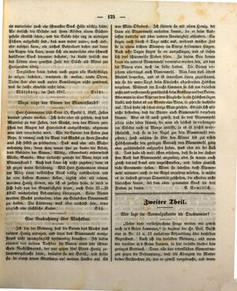

# Strona 125

## Transkrypcja (niemiecki)

ein mutterloser noch ein schwacher Stock Hilfe nöthig hätte. Wo freilich die Stände mit ihren Körben einem Büchergestelle ähnlich sehen, und die Stöcke sehr eng in niedrigen Fächern aufgestellt sind, daß man weder unter-, noch auf-, oder ansetzen kann, ein solches Bodenbrett daher nur dann von Nutzen sein kann, wenn sich ein mutterloser oder schwach bevölkerter Stock darunter befindet, da bleibt freilich nur das Tödt[e]n einer gewissen Zahl der Stöcke als Mittel zur Honigernte übrig.

Dergleichen Leute haben auch gegen alle Rathschläge, sie mögen bestehen, worinnen sie wollen, taube Ohren. Diesen sind aber auch unsere Bemühungen nicht gewidmet, weil sie solche ohnehin nicht lesen.

Würzburg, im Juli 1847. Stöhr.

### Wozu nützt den Bienen der Blumenstaub?

Herr Hannemann läßt Seite 15, Spalte 1, 1847, Zellen daraus gebaut werden. Ich habe aber oft gesehen, daß das Material zu den Zellen, das Wachs, von den Bienen zwischen den Ringen des Hinterleibes ausgeschwitzt, abgenommen und verarbeitet wird. Wie die Spinne den Faden zum Netze, so vermag auch die Biene das Wachs zu ihren Zwecken aus sich selbst zu produciren. Das muß eine alte Wahrnehmung sein; denn man nennt hier zu Lande die Arbeit, das Gebäude der Bienen, Wistig, (Gewebtes) anderwärts Wabe, Gewebe. Aber vielleicht genießt die Biene dazu erst Blumenstaub? Auch das kann ich nicht zugeben; denn es ist gegen meine Erfahrung. Will Herr Hannemann einmal im März einen volkreichen Stock völlig ausschneiden und in eine finstere Kammer stellen, täglich aber mit reinem, warmen Honig füttern, wie ich es gethan habe, so wird er sich bald von der Grundlosigkeit seiner, auch Seite 37–39 1847 wiederholten Behauptung überzeugen. Seine Bienen werden Wachs produciren, ohne ein Stäubchen Blumenmehl zu haben. Die Fütterung muß aber reichlich sein, etwa täglich eine sächsische Kanne. Süß.

### Eine Beobachtung über Wachsbau

Ich bin der Meinung, daß die Bienen das Wachs aus reinem Honig erzeugen, und dazu das Blumenmehl wenigstens nicht unumgänglich nothwendig brauchen. Ich nahm einmal von meinem Nachbar die Bienen eines sehr schwachen Nachschwarms, der nur gegen fünf Pfund Honig zusammengebracht hatte, betäubte sie mit Bovist, und stellte sie in einem leeren Glassturze auf meinem Fenster auf. Es war Mitte Oktobers. Ich fütterte sie mit altem Honig, der kaum ein Blumenmehl enthalten konnte, da er beim Auslassen dasselbe mit jeder andern Unreinigkeit absondert. Sie flogen auch durch 8 Tage nicht aus, während welcher Zeit sie in einem dichten Klumpen im Sturze beisammen hingen. Nach acht Tagen fingen sie an auszufliegen, und es ließen sich drei schneeweiße Fladen sehen. Zu diesem Bau konnte kaum ein anderes Blumenmehl verwendet worden sein, als das die Bienen etwa noch im Leibe hatten.

Die Bienen verzehren allerdings auch Blumenmehl. Man kann dies öfters Abends bemerken, und es ist interessant ihnen zuzuschauen, wie sie die unter Tags beim Flugloche abgestreiften Höschen verzehren. Während der Tracht kümmern sie sich um dieselben nicht, und verstreuen sie gewöhnlich beim Ausfluge auf den Boden. Aber wenn in einer Ritze vor dem Flugloche so ein Höschen liegen bleibt, und findet es am Abende eine Biene, so zehrt sie dasselbe auf. Dies habe ich schon einige Male gesehen. Es läßt sich also nicht bestreiten, daß die Bienen auch Blumenmehl verzehren können. Aber es ist auch gewiß, daß sie von Blumenmehl allein nicht leben können, da man oft solches in verhungerten Stöcken noch in Menge antrifft, ja es ist höchst wahrscheinlich, daß sie in der Regel gar kein Blumenmehl verzehren; sonst müßten sie über den Winter bis zur ersten Höschentracht den geringen Vorrath von Blumenmehl ganz oder größtentheils aufgezehrt haben, was aber nie der Fall ist. Das habe ich wohl schon erfahren, daß sie in der äußersten Noth das Blumenmehl angreifen; aber sie waren auch gleich darauf krank und angeschwollen, und ließen ziemlich dicke Excremente fallen. Wenn sie indessen doch Blumenmehl mitunter auch in der Regel verzehren würden, so müßte es in äußerst geringer Quantität geschehen, die offenbar nicht hinreichen konnte, bei dem oben genannten Stock die drei Fladen zu bauen. A. Semlitsch.

## Tłumaczenie polskie

…bezmateczny ani słaby pień potrzebowałby pomocy. Tam, gdzie ule z koszami wyglądają wprawdzie jak regał z książkami, a pnie stoją bardzo ciasno w niskich przegródkach, tak że nie można niczego podstawić ani wsunąć pod nie, nad nie ani przy nich, taka deska denna może być użyteczna tylko wtedy, gdy pod nią znajduje się pień bez matki albo słabo zaludniony. Wówczas pozostaje wprawdzie jedynie zabicie pewnej liczby pni jako sposób na pozyskanie miodu.

Ludzie tego pokroju pozostają głusi na wszelkie rady, jakiekolwiek by one były. Nasze starania nie są jednak do nich skierowane, ponieważ i tak ich nie czytają.

Würzburg, lipiec 1847 r. Stöhr.

### Do czego pszczołom służy pyłek kwiatowy?

Pan Hannemann twierdzi (1847, s. 15, łam 1), że buduje się z niego komórki. Ja jednak często widziałem, że materiał komórek, wosk, jest wypacany przez pszczoły między pierścieniami odwłoka, następnie zbierany i przetwarzany. Jak pająk potrafi sam z siebie wytworzyć nić do sieci, tak pszczoła potrafi wytwarzać wosk dla swoich celów. Musi to być dawna obserwacja, gdyż u nas pracę tę, budowlę pszczół, nazywa się „Wistig” (tkaniną), a gdzie indziej plastrem lub tkanką. Może jednak pszczoła najpierw spożywa do tego pyłek? Tego również nie mogę przyjąć, ponieważ przeczy to memu doświadczeniu. Gdyby pan Hannemann w marcu całkowicie wyciął silny pień i postawił go w ciemnej komorze, a następnie codziennie karmił czystym, ciepłym miodem — jak ja uczyniłem — rychło przekonałby się o bezpodstawności swego twierdzenia, powtórzonego także na s. 37–39 z 1847 r. Jego pszczoły będą wytwarzały wosk, nie mając ani odrobiny pyłku. Karmienie musi jednak być obfite: około jednej saskiej kwarty dziennie. Süß.

### Obserwacja dotycząca budowy woszczyny

Jestem zdania, że pszczoły wytwarzają wosk z czystego miodu i że pyłek przynajmniej nie jest im do tego bezwzględnie konieczny. Raz wziąłem od sąsiada pszczoły bardzo słabego roju wtórnego, który zgromadził zaledwie około pięciu funtów miodu; odurzyłem je purchawką i umieściłem w pustym szklanym ulu na moim oknie. Było to w połowie października. Karmiłem je starym miodem, który ledwie mógł zawierać pyłek, ponieważ przy klarowaniu oddziela się on wraz z wszelkimi innymi zanieczyszczeniami. Przez osiem dni pszczoły nie wylatywały; przez ten czas wisiały zbite w gęstą kępę w ulu. Po ośmiu dniach zaczęły wylatywać i można było zobaczyć trzy śnieżnobiałe płaty woszczyny. Do tej budowy z trudem mógł zostać użyty inny pyłek niż ten, który pszczoły miały jeszcze w ciele.

Pszczoły rzeczywiście zjadają także pyłek. Często można to zauważyć wieczorem; ciekawie jest patrzeć, jak pożerają „koszyczki” pyłku strząśnięte w dzień przy wylotku. Podczas pożytku nie zajmują się nimi i zazwyczaj rozsypują je na ziemię przy wylocie. Jeśli jednak taki koszyczek zostanie w szczelinie przed wylotkiem i znajdzie go wieczorem pszczoła, zjada go. Widziałem to już kilka razy. Nie można więc zaprzeczyć, że pszczoły są zdolne spożywać pyłek. Pewne jest jednak również, że nie mogą żyć z samego pyłku, ponieważ w ulach, które padły z głodu, często znajduje się go jeszcze wiele. Jest nawet wysoce prawdopodobne, że zwykle wcale go nie spożywają; w przeciwnym razie zimą, aż do pierwszego pożytku pyłkowego, musiałyby całkowicie lub w większej części zużyć niewielki jego zapas, czego nigdy się nie stwierdza. Doświadczyłem wprawdzie, że w skrajnej potrzebie rzucają się na pyłek, lecz zaraz potem były chore i opuchnięte, a ich odchody były dość gęste. Gdyby jednak choć czasami, a nawet zwykle, pyłek spożywały, musiałoby to następować w ilości tak małej, że oczywiście nie wystarczyłaby ona do zbudowania przez wspomniany pień trzech płatów woszczyny. A. Semlitsch.

### Początek następnego działu

**Część druga.**

**Kto w normalnym stanie składa jaja trutowe?**

„Z pewnością dojdziemy jeszcze do ładu w tej tak wiele dyskutowanej kwestii” — tak pan prezes Busch rozpoczyna rozprawę na ten sam temat, zamieszczoną w nr 11 i 12. Ja także jestem tego zdania; a gdy dojdziemy w tej sprawie do jasności, jego zasługa będzie niemała. Przedstawił bowiem z pewnością wszelkie dające się pomyśleć zarzuty przeciw twierdzeniu, że królowa jest matką obu płci; i gdy…
