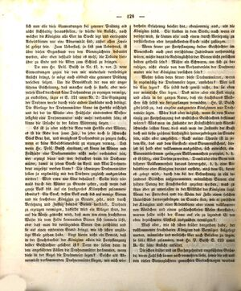

# Strona 126

## Transkrypcja (niemiecki)

sich nun alle diese Einwendungen bei genauer Prüfung als nicht stichhaltig herausstellen, so dürfte die Ansicht, nach welcher die Königin alle Eier im Stocke legt und eierlegende Arbeitsbienen nur eine Abnormität sind, außer allen Zweifel gesetzt sein. Zum Ueberfluß, ja fast zum Ueberdruß, ist über diesen Gegenstand von den Bienenzüchtern debattirt worden, aber eben deshalb lohnt es wohl, die Debatte hierüber zu Ende und die Akten zum Schluß zu bringen.

Da nun Hr. Präs. Busch in Nr. 12. d. vor. J. neue Einwendungen gegen die von mir wiederholt vertheidigte Ansicht bringt, so möge auch alsbald eine genauere Prüfung derselben folgen. Um die Beweiskraft der von mir angeführten Erscheinung, daß mancher noch so starke, aber weiserlose Stock durchaus keine Drohnenbrut zu erzeugen vermöge, zu entkräften, sagte er S. 121 unter Nr. 2: Die Erzeugung der Drohnen werde durch viele andere Umstände noch bedingt: Die Eierlage der Drohnenmütter könne im Herbste erschöpft und bei der im Winter oder Frühjahr eintretenden Weiserlosigkeit eine Drohnenmutter nicht mehr vorhanden sein; es könne die Ursache in der kalten Witterung liegen.

Es ist ja aber nicht die Rede vom Herbste oder Winter, es ist die Rede von jener Zeit, da jeder noch so schwache Stock Brut hat, und wenigstens Drohnenbrut zu zeugen sucht, wenn er keine Arbeitsbienenbrut zu erzeugen vermag. Und wenn Hr. Präs. Busch einräumt, es könne im Winter und Frühjahr eine Drohnenmutter nicht mehr vorhanden sein, wer erzeugt dann und wer befruchtet dann die Drohnenmütter, damit in jedem Stocke im April und Mai Drohnenbrut angesetzt werden könne? Die schwarzen Drohnenmütter sollen ja regelmäßig mit den Drohnen zugleich ausgetrieben werden! Wird etwa nur Eine behalten? Sollte diese niemals durch den Winter zu Grunde gehen, auch wenn das ganze Volk bis auf ein faustgroßes Klümpchen zusammenschmilzt? Ein Stock, dessen Volk auch bis auf wenige Bienen und die fruchtbare Königin zu Grunde geht, wird durch Versetzung und Zuflug fremder Bienen verstärkt, Drohnen zu erzeugen vermögen, dasselbe wird ein Ableger thun, der auf die Weise gemacht wird, daß man um einen fruchtbaren Weiser die vom Felde kommenden Bienen sich sammeln läßt, oder daß man die vorliegenden Bienen ihm zuschüttet und sie auf einen entfernten Stand bringt, wie ich schon unzählige Male gethan habe. Liegt hierin nicht ein Beweis, daß in der Fruchtbarkeit der Königin allein die Fortpflanzung beider Geschlechter gesichert ist? Denn wo sollen denn in den angeführten Fällen die Drohnenmütter herkommen, wenn diese in der Regel die Drohneneier legen? Solche als Abnormität vorkommenden Drohnenmütter fliegen, wie mich wiederholte Erfahrung belehrt hat, ebensowenig aus, als die Königin selbst. Sie bleiben in dem Stocke, auch wenn er versetzt wird, sie können also auch einem durch Versetzung zu verstärkenden oder herzustellenden Stocke nicht zufliegen.

Wenn ferner zur Fortpflanzung beider Geschlechter im Bienenstocke auch zwei verschiedene Individuen nothwendig wären, müßte dann die Anhänglichkeit der Bienen nicht zwischen beiden getheilt sein? Müßte ein Schwarm, um sich zu beruhigen, nicht ebenso von dem Vorhandensein der Drohnenmutter wie der Königin versichert sein?

Woher sollen denn ferner diese Drohnenmütter, wenn sie regelmäßig die Drohneneier legen, entstehen? Wer soll die Eier legen? Sie selbst doch gewiß nicht, da sie eben nur männliche Eier legen. Das wäre aber ein Fall einzig und allein in der ganzen Natur, daß ein fruchtbares Weibchen sich selbst nie fortzupflanzen vermöchte. Hr. P. Busch gibt selbst zu, daß einzelne ausgeartete Königinnen nur Drohneneier legen. Wäre dies aber möglich, wenn sie von Natur einzig zur Fortpflanzung des weiblichen Geschlechtes bestimmt wären? Was man im Zustande der Kränklichkeit und Altersschwäche leisten kann, dies muß man im Zustande der Kraft doch mit desto größerer Leichtigkeit hervorzubringen im Stande sein, nicht aber umgekehrt. Nach meiner Theorie ist in jedem Ei, das aus dem Eierstocke eines Bienenweibchens, dieses sei halb oder vollkommen ausgebildet, sich entwickelt, ein Bienenindividuum geringerer Vollkommenheit protypirt, d. h. es ist fähig, eine Drohne zu werden. Damit aber eine Biene von höherer Vollkommenheit daraus hervorgehe, d. h. eine Arbeitsbiene oder Königin daraus entstehe, muß dem Ei, bevor es gelegt wird, durch den bei der Befruchtung in ein besonderes Bläschen aufgenommenen männlichen Samen eine höhere Potenz der Fruchtbarkeit gegeben werden, was zu thun oder zu unterlassen in der Willkühr der Königin liegt. Wenn der Futterbrei und die Weite der Zelle einen solchen Unterschied hervorzubringen im Stande sind, wie er zwischen der Königin und einer Arbeitsbiene oder einem vollkommenen Weibchen und einem geschlechtslosen Wesen stattfindet, warum sollte nicht der Same auf ein zu legendes Ei den oben bezeichneten Einfluß auszuüben vermögen?

Muß aber, wie ich schon früher dargethan habe, der vollkommenen fruchtbaren Königin das Vermögen beigelegt werden, männliche und weibliche Eier nach Belieben zu legen, so fällt Alles zusammen, was Hr. P. Busch S. 123 unter B. für seine Ansicht anführt.

Die schon früher und im Vorhergehenden angeführten Gründe, deren Zahl sich immer noch vermehren ließe, sowie die oft und von vielen Bienenzüchtern gemachten Beobachtungen werden …

## Tłumaczenie polskie

…jeżeli po dokładnym zbadaniu wszystkie te zarzuty okażą się nieuzasadnione, to pogląd, według którego królowa składa w ulu wszystkie jaja, a robotnice składające jaja są tylko anomalią, powinien być poza wszelką wątpliwością. Pszczelarze dyskutowali ten temat aż do przesytu, lecz właśnie dlatego warto doprowadzić debatę do końca i zamknąć akta sprawy.

Ponieważ pan prezes Busch w nr 12 z ubiegłego roku przedstawia nowe zarzuty wobec poglądu, którego wielokrotnie broniłem, niech zaraz nastąpi ich dokładniejsze zbadanie. Aby osłabić moc dowodową przytoczonego przeze mnie zjawiska, iż niejeden nawet bardzo silny, lecz bezkrólowy pień w ogóle nie potrafi wytworzyć czerwiu trutowego, powiedział on na s. 121, w punkcie 2: wytwarzanie trutni zależy jeszcze od wielu innych okoliczności; zdolność składania jaj przez matki trutowe może jesienią się wyczerpać, a gdy bezmateczność nastąpi zimą lub wiosną, matki trutowe może już nie być; przyczyną może być też chłodna pogoda.

Nie mówimy jednak o jesieni ani zimie, lecz o tym czasie, gdy każdy, nawet najsłabszy pień ma czerw i przynajmniej usiłuje wychować czerw trutowy, jeśli nie jest zdolny wytworzyć czerwiu robotnic. A jeśli pan prezes Busch przyznaje, że zimą i wiosną matki trutowej może już nie być, to kto ją wtedy wytwarza i kto zapładnia, aby w każdym pniu w kwietniu i maju można było założyć czerw trutowy? Czarne matki trutowe mają przecież być regularnie wypędzane wraz z trutniami! Czy zostawia się tylko jedną? Czy ta nigdy nie ginie zimą, nawet gdy cała rodzina kurczy się do kłębka wielkości pięści? Pień, którego rodzina zginęła niemal całkowicie — pozostało tylko kilka pszczół i płodna królowa — po wzmocnieniu przez przeniesienie i dolot obcych pszczół potrafi wytworzyć trutnie. To samo uczyni odkład utworzony tak, że wokół płodnej królowej pozwala się zebrać pszczołom wracającym z pola, albo dosypuje się do niej znajdujące się przed ulem pszczoły i przenosi na odległe stanowisko; robiłem tak już niezliczoną liczbę razy. Czy nie dowodzi to, że w samej płodności królowej zabezpieczone jest rozmnażanie obu płci? Skąd bowiem w podanych przypadkach miałyby się wziąć matki trutowe, gdyby to one z zasady składały jaja trutowe? Takie matki trutowe, występujące jako anomalia, jak pouczyło mnie wielokrotne doświadczenie, nie wylatują — podobnie jak sama królowa. Pozostają w ulu także po jego przeniesieniu, nie mogą więc przylecieć do pnia wzmacnianego lub odbudowywanego przez przeniesienie.

Gdyby zaś do rozmnażania obu płci w rodzinie pszczelej były potrzebne dwa różne osobniki, czy przywiązanie pszczół nie musiałoby dzielić się między nimi? Czy rój, aby się uspokoić, nie musiałby być równie pewny obecności matki trutowej, jak obecności królowej?

Skąd zresztą miałyby powstawać te matki trutowe, jeśli regularnie składają jaja trutowe? Kto miałby składać ich jaja? Z pewnością nie one same, skoro składają tylko jaja męskie. Byłby to jedyny w całej przyrodzie przypadek, w którym płodna samica nigdy nie mogłaby rozmnażać samej siebie. Pan P. Busch sam przyznaje, że pojedyncze zwyrodniałe królowe składają wyłącznie jaja trutowe. Czy byłoby to możliwe, gdyby z natury przeznaczone były wyłącznie do rozmnażania płci żeńskiej? To, co jest możliwe w stanie choroby i starczego osłabienia, powinno być tym łatwiejsze do wywołania w stanie siły, a nie odwrotnie. Według mojej teorii w każdym jaju rozwijającym się w jajniku samicy pszczoły — czy to pół- czy w pełni rozwiniętej — zarysowany jest osobnik pszczeli niższej doskonałości, to znaczy zdolny stać się trutniem. Aby jednak powstała z niego pszczoła o wyższej doskonałości, czyli robotnica albo królowa, jajo musi przed złożeniem otrzymać, za sprawą męskiego nasienia umieszczonego przy zapłodnieniu w osobnym pęcherzyku, wyższą możność płodności. Wykonanie lub zaniechanie tego pozostaje w mocy królowej. Jeżeli papka pokarmowa i szerokość komórki mogą wywołać taką różnicę, jaka zachodzi między królową a robotnicą, albo między w pełni rozwiniętą samicą a istotą bezpłciową, dlaczego nasienie nie miałoby wywrzeć opisanego wyżej wpływu na jajo, które ma zostać złożone?

Jeżeli jednak — jak wykazałem już wcześniej — w pełni płodnej królowej trzeba przypisać zdolność składania wedle woli jaj męskich i żeńskich, upada wszystko, co pan P. Busch przytacza na s. 123 w punkcie B na poparcie swego poglądu.

Przytoczone wcześniej i powyżej racje, których liczbę można by jeszcze powiększyć, a także obserwacje często czynione przez wielu pszczelarzy, będą …
