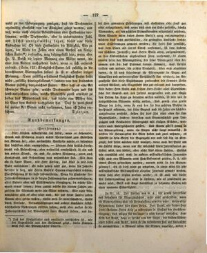

# Strona 127

## Transkrypcja (niemiecki)

wohl zu der Ueberzeugung genügen, daß die Drohneneier regelmäßig ebenfalls von der Königin gelegt werden, und daß, wenn auch einzelne Arbeitsbienen oder Halbmütter vorkommen, welche Drohneneier, aber in unbedeutender Zahl, und höchst unregelmäßig legen, dieses eine bloße Ausnahme sei. Ob diese Halbmütter die Fähigkeit, Eier zu legen, der Weite der Zellen oder einem Antheil am königlichen Futter*) verdanken, mag dahingestellt sein; wenn aber Hr. P. Busch die letztere Meinung eine Mähre nennt, die einer dem Andern nachgebetet habe; wenn er sich ereifernd ausruft: (Seite 122) Königliches Futter soll zufällig in die benachbarten Bienenzellen fallen! so ist er offenbar irriger Meinung. Denn zufällig erhaltenes königliches Futter heißt nicht „zufällig hineingefallenes,” sondern von den brütenden Bienen zufällig dargereichtes Futter. Aber daß es eine Art schwarzer Bienen gebe, welche Drohneneier legen und sich sonst auszeichnen sollen, welche Matuschka zuerst erwähnt zu haben das Mißverdienst hat, das dürfte eine Mähre sein, die Einer dem Andern nachgebetet hat. Daß sie wenigstens bei meiner Art Bienen nicht vorkommen, kann ich Jeden versichern. Dzierzon.

*) Daß das Königsfutter auch qualitativ verschieden sei, wie der Augenschein und der Geschmack zeigt, darin stimmen wohl fast alle Bienenzüchter überein.

### Randbemerkungen

*(Fortsetzung.)*

Herr Kirsten widerspricht sich selbst, wenn er behauptet, Stand und Wohnung tragen nichts Wesentliches zum Gedeihen der Bienen bei; ohne wesentliche Vortheile würde er besondere Art derselben nicht anempfehlen. — Obenan steht freilich Honigtracht und Behandlung, aber wesentlich vortheilhaft ist ein und der andere Stand, ein und die andere Wohnung, wenn auch Honigtracht und Behandlung noch wesentlicher sind. Wie kann ein so klarer Mann, wie Herr Kirsten, das Kind so mit dem Bade ausschütten! Es wäre gewiß nicht gut, wenn die Jahresberichte so kurz, wie Herrn Busch's Schema eingerichtet würden. Die Erfahrung ist die beste Lehrmeisterin. Wenn die Einsender ihre Jahreserfahrungen in so kurzen Zahlenangaben zusammendrängen, alles Andere aber mit Stillschweigen übergingen, da würde Niemand etwas lernen; denn zuletzt würde die dürren Zahlen anzusehen sich Niemand mehr die Mühe nehmen. Wie viele Bienenzüchter gibt es aber nicht auch, die gar keine Zahlen geben können oder geben wollen, theils weil sie unverschuldete, theils durch Versuche, Vernachlässigungen und andere Umstände selbstverschuldete Niederlagen erlitten haben; wohl aber wollen sie die Jahresgeschichte der Bienenzucht ihrer Gegend liefern, und dabei ihre gemachten Erfahrungen mit einflechten (die sonst gar nicht aufgezeichnet, und wenn dies auch am Ende geschähe, häufig Niemanden, als den nächsten Bienenfreunden mitgetheilt würden).

Mein Wunsch wäre daher Herrn Busch's ganz entgegengesetzt; möchten doch recht ausführliche, die geringsten Umstände berichtende Erlieferungen gemacht werden; die Leser sind gemischt, was dem Einen als leeres Stroh vorkommt, ist dem Andern von höchstem Interesse; was Herrn Busch altes, aufgewärmtes, an den Kinderschuhen abgelaufenes Zeug vorkommt, ist einem neuern Leser der Bienenzeitung, der seine Bienenzucht eben begonnen und sich das Erstemal darum kümmert, was Andere treiben und meinen, die größte Neuigkeit. Aber auch abgesehen davon, so ist noch keineswegs die Bienenzucht in Bezug auf klimatische und meteorologische Verhältnisse klar erörtert; im Gegentheile sind diese Beziehungen zueinander die schwache Seite unseres Wissens, wie Magerstedt sehr gut erkannt und dargethan. Wie daher Herr Busch, und früher Herr Stöhr alles Eigenthümliche der Gegend und des Jahres weggelassen und nur einzig den Ertrag im Auge zu behalten wissen wollten, ist mir von so hochgebildeten Männern völlig unklar. Und gewiß eine große Menge der Leser, wenn sie auch den für den größten Meister in der Praxis erkennen, der seine Gegend und die Jahre am höchsten auszubeuten versteht, stellen sich dies Ziel nicht eben für ihre Bienenstände, sondern betreiben nach Bequemlichkeit zum Vergnügen und Beobachten Bienenzucht mit einigen Stöcken, worunter auch Unterzeichneter gehört. Und Raum gibt's genug in der Bienenzeitung, wenn ein Bogen nicht langt monatlich, so werden die Herausgeber die Güte haben und zwei nehmen, es schreibt ja kein Gesetz die Bogenzahl vor und fest bin ich überzeugt, der Leser würden nicht weniger, wenn auch der Preis um die Hälfte stiege, wenn nur für möglichst Viele Interessantes geliefert wird, wie bisher, aber nicht bloß dürre Zahlen. Endlich wie unendlich viel muß in andern wissenschaftlichen Journalen nicht auch von Männern vom Fach Bekanntes gelesen, d. h. also leeres Stroh gedroschen werden, warum nicht in der Bienenzeitung? Es ist dies nicht zu umgehen, so lange nicht für jede wissenschaftliche Bildungsstufe einzelne Journale gemacht werden, deren Zahl aber Legion werden würde; es ist auch mit dieser Art Zeitvergeudung gar nicht so schlimm, wie es gewöhnlich gemacht wird, Geist und Auge durchfliegt ja bekannte Sachen mit einer enormen Schnelligkeit.

Zu Nr. 10. Der Aufsatz von G. A., der gewiß interessant und besonders für Magazinzüchter, wäre nicht geschrieben, wenn die Bienenzeitung nicht die Veranlassung gewesen wäre; meine obige Behauptung findet hier einen Beleg. Herr Frank, wie früher Herr Oettl scheinten Herrn Kriz zu widerlegen in Hinsicht der Herbstvereinigung; doch mögen sich Anfänger ja nicht darauf verlassen. Herr Kriz hat Recht, denn er spricht von der Regel; die beiden Widerleger haben auch Recht, wenn sie im besonderen Fall als Ausnahme sie anempfehlen; 9 Monate leben die Bienen ungefähr, weder 6 …

## Tłumaczenie polskie

…wystarczą, aby dojść do przekonania, że jaja trutowe również regularnie składa królowa, a jeśli trafiają się pojedyncze robotnice albo półmatki, które składają jaja trutowe, to czynią to w nieznacznej liczbie i zupełnie nieregularnie, a więc jest to tylko wyjątek. Czy te półmatki zawdzięczają zdolność składania jaj szerokości komórek czy udziałowi w mleczku królewskim* — niech pozostanie nierozstrzygnięte. Jeżeli jednak pan P. Busch nazywa ten drugi pogląd bajką, którą jedni powtarzają za drugimi, i oburza się, wołając (s. 122): „Mleczko królewskie ma przypadkowo wpadać do sąsiednich komórek pszczelich!”, to oczywiście jest w błędzie. „Przypadkowo otrzymane” mleczko królewskie nie znaczy bowiem „przypadkowo wpadłe do środka”, lecz pokarm przypadkowo podany przez pszczoły opiekujące się czerwiem. Natomiast opowieść o pewnym rodzaju czarnych pszczół, które składają jaja trutowe i mają się poza tym wyróżniać — a których pierwsze wspomnienie przypisuje się Matuschce — może być właśnie taką bajką, powtarzaną z ust do ust. Mogę każdego zapewnić, że przynajmniej w mojej rasie pszczół one nie występują. Dzierzon.

\* Prawie wszyscy pszczelarze zgodzą się zapewne, że mleczko królewskie różni się także jakościowo, co widać i czuć po smaku.

### Uwagi na marginesie

*(Ciąg dalszy.)*

Pan Kirsten przeczy sam sobie, gdy twierdzi, że stanowisko i mieszkanie nie wnoszą nic istotnego do pomyślności pszczół; nie zalecałby szczególnego ich rodzaju, gdyby nie miał on istotnych zalet. Pożytek miodowy i prowadzenie pasieki stoją wprawdzie na pierwszym miejscu, lecz to albo inne stanowisko, ten albo inny ul są także istotnie korzystne, nawet jeśli pożytek i prowadzenie są ważniejsze. Jak tak jasny człowiek jak pan Kirsten może wylewać dziecko z kąpielą! Z pewnością nie byłoby dobrze, gdyby sprawozdania roczne sporządzano tak zwięźle jak według schematu pana Buscha. Doświadczenie jest najlepszym nauczycielem. Gdyby nadsyłający streszczali swe roczne doświadczenia w tak krótkich danych liczbowych, a o wszystkim innym milczeli, nikt niczego by się nie nauczył; w końcu nikt nie trudziłby się nawet oglądaniem suchych liczb. Jak wielu jest pszczelarzy, którzy w ogóle nie mogą albo nie chcą podać liczb — częściowo dlatego, że ponieśli straty niezawinione, częściowo zaś zawinione przez próby, zaniedbania i inne okoliczności — a którzy chcą przecież przedstawić roczną historię pszczelarstwa swej okolicy i wpleść w nią własne doświadczenia (które inaczej wcale nie zostałyby zapisane, a nawet jeśli w końcu by je zapisano, często przekazano by je tylko najbliższym przyjaciołom pszczół).

Moje życzenie byłoby zatem całkiem przeciwne życzeniu pana Buscha: niech powstają możliwie wyczerpujące relacje, opisujące najdrobniejsze okoliczności. Czytelnicy są różni: to, co jednemu wydaje się pustą słomą, dla drugiego jest niezwykle interesujące; to, co panu Buschowi wydaje się starą, odgrzewaną rzeczą, z której się już wyrosło, dla nowego czytelnika „Bienenzeitung”, który właśnie zaczął pszczelarzyć i po raz pierwszy interesuje się tym, co inni robią i sądzą, jest największą nowością. Poza tym pszczelarstwo w odniesieniu do warunków klimatycznych i meteorologicznych wcale nie zostało jeszcze jasno omówione; przeciwnie, wzajemne związki tych zjawisk są słabą stroną naszej wiedzy, co Magerstedt bardzo trafnie rozpoznał i wykazał. Dlatego zupełnie nie rozumiem, jak tak wykształceni ludzie jak pan Busch, a wcześniej pan Stöhr, mogli chcieć pominąć wszelkie osobliwości miejsca i roku, mając na uwadze jedynie plon. Z pewnością wielu czytelników, nawet jeśli uznaje za największego mistrza praktyki tego, kto umie najskuteczniej wykorzystywać swą okolicę i kolejne lata, nie stawia sobie takiego celu w swoich pasiekach. Prowadzą oni kilka pni dla wygody, przyjemności i obserwacji — do nich należy także podpisany. A w „Bienenzeitung” jest dość miejsca: jeśli jeden arkusz miesięcznie nie wystarcza, wydawcy uprzejmie wezmą dwa; żadna ustawa nie wyznacza przecież liczby arkuszy. Jestem pewien, że czytelników nie byłoby mniej, nawet gdyby cena wzrosła o połowę, byle dostarczano możliwie wielu rzeczy interesujących, jak dotąd, a nie samych suchych liczb. W innych czasopismach naukowych także trzeba przecież czytać nieskończenie wiele rzeczy znanych specjalistom, czyli — mówiąc inaczej — młócić pustą słomę; dlaczego nie w „Bienenzeitung”? Nie da się tego uniknąć, dopóki nie tworzy się osobnych czasopism dla każdego szczebla wykształcenia naukowego, a ich liczba musiałaby wtedy być legionem. Taka strata czasu nie jest też tak zła, jak zwykle się ją przedstawia: umysł i oko przebiegają po znanych sprawach z ogromną szybkością.

Do nr 10. Artykuł G. A., z pewnością interesujący, a szczególnie dla pszczelarzy gospodarujących w ulach skrzynkowych, nie zostałby napisany, gdyby nie wywołała go „Bienenzeitung”; stanowi on dowód mojego powyższego twierdzenia. Pan Frank, podobnie jak wcześniej pan Oettl, zdają się obalać pana Kriza w sprawie jesiennego łączenia, lecz początkujący nie powinni na tym polegać. Pan Kriz ma rację, ponieważ mówi o regule; obaj oponenci także mają rację, gdy zalecają je w szczególnym wypadku jako wyjątek; pszczoły żyją około dziewięciu miesięcy, nie sześć …
