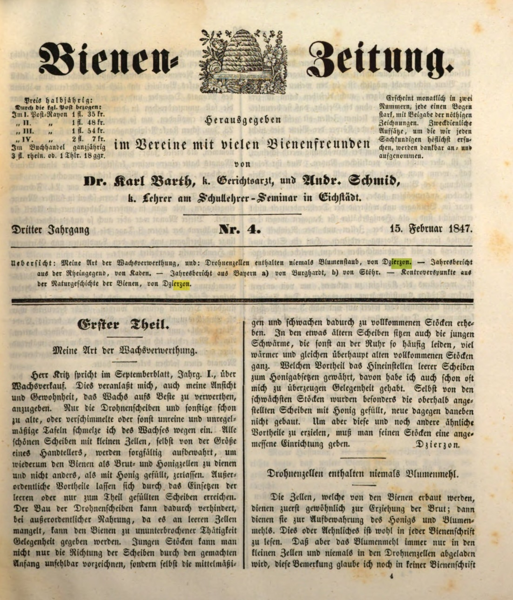

:toc: macro
:toc-title: 
:toclevels: 4

= Mój sposób przetwarzania wosku.
Jan Dzierzon, Bienenzeitung 4, 1847

Pan Kriz pisze w numerze wrześniowym, rok I, o sprzedaży wosku. Skłania mnie to, aby również wyrazić swoją opinię i zwyczaj w zakresie maksymalnego wykorzystania wosku. Tylko plastry trutowe oraz inne już zbyt stare, spleśniałe lub w inny sposób nieczyste i nieregularne tafle topię na wosk. Wszystkie piękne plastry z małymi komórkami, nawet wielkości talerzyka, są starannie przechowywane, aby mogły służyć pszczołom jako komórki na czerwie i miód, a nie inaczej.

Wyjątkowe korzyści wynikają z wkładania pustych lub częściowo wypełnionych plastrów. Budowa plastrów trutowych może być ograniczona, a przy wyjątkowym pożywieniu, gdy brakuje pustych komórek, pszczołom można zapewnić nieprzerwaną pracę.

Młodym rodzinom pszczelim można nie tylko wskazać kierunek plastrów przez wcześniejsze przygotowanie, ale także umieścić dla nich średniej wielkości i starsze plastry, co podnosi je do pełnych rodzin. Na nieco starszych plastrach zasiadają również młode roje, które inaczej tak często cierpią na choroby, znacznie cieplej i w ogóle lepiej rozwijają się do pełnych rodzin.

Jakie korzyści daje wkładanie pustych plastrów do wybierania miodu, miałem już wiele okazji się przekonać. Nawet w najbiedniejszych rodzinach pszczelich plastry umieszczone w górnych częściach ula były wypełniane miodem, podczas gdy nowe plastry obok pozostawały puste. Aby jednak osiągnąć te i inne podobne korzyści, należy odpowiednio urządzić swoje ule.

**Dzierzon.**