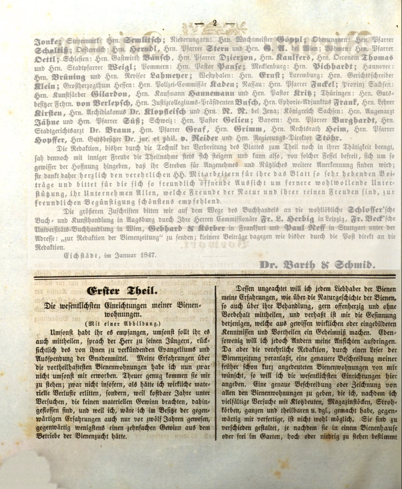
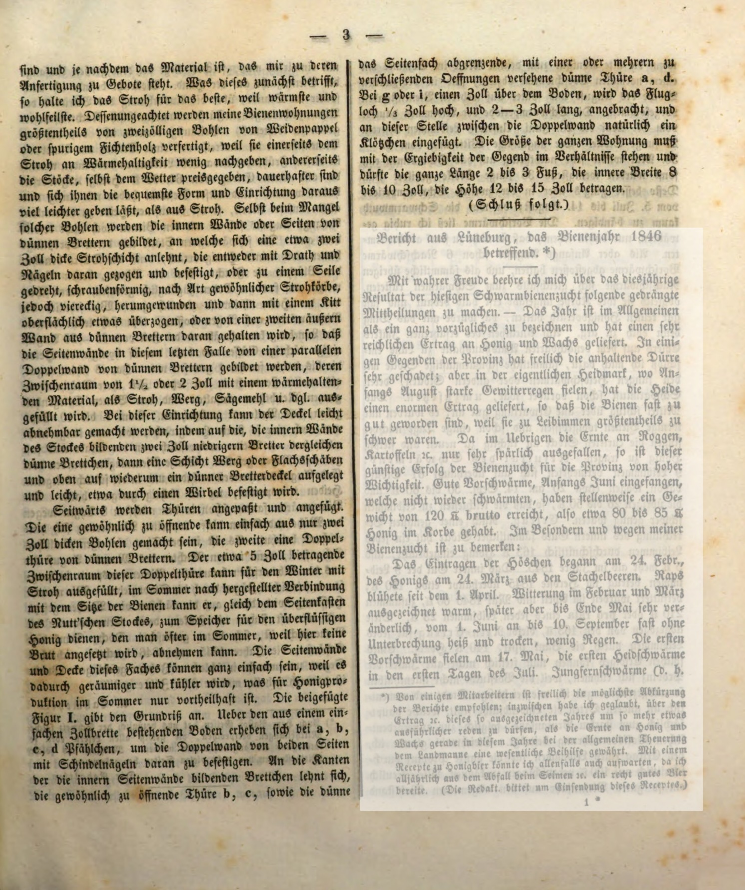
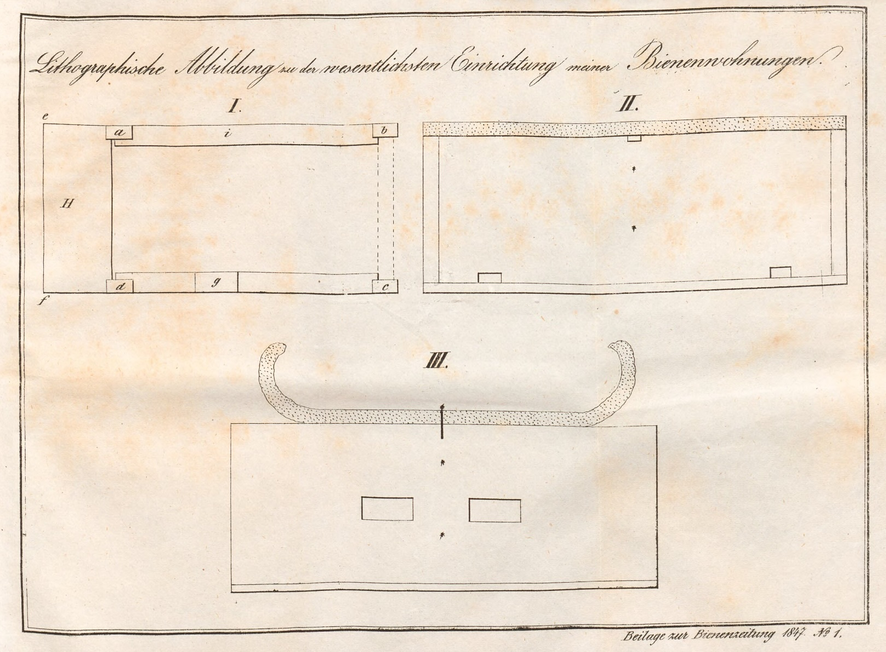
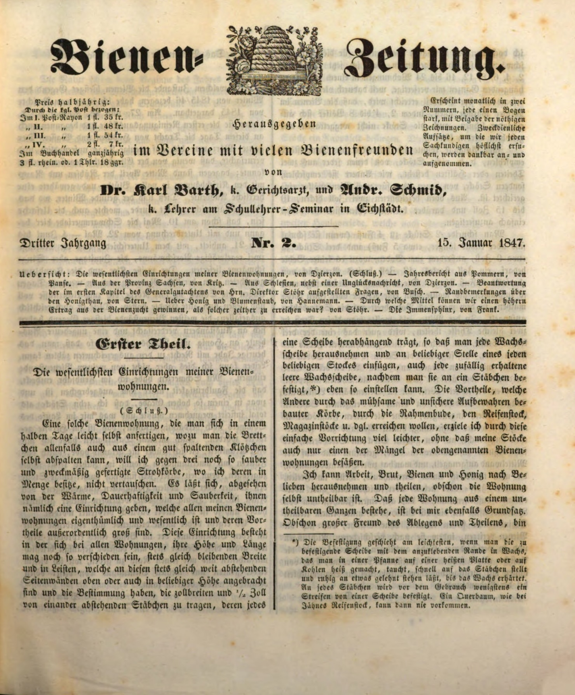
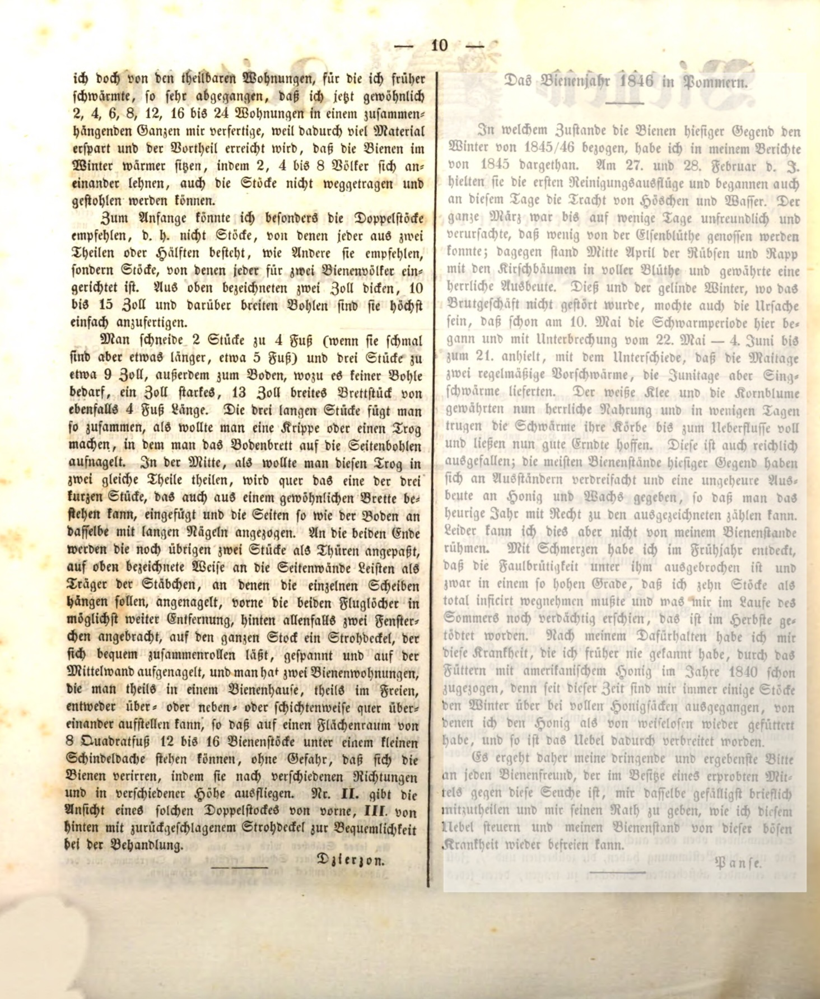

:toc: macro
:toc-title: 
:toclevels: 4

= Najważniejsze urządzenia moich uli
Jan Dzierzon, Bienenzeitung 1-2, 1847

„Darmo otrzymaliście, darmo dawajcie” – powiedział Pan do swoich uczniów, mając na myśli głoszenie Ewangelii oraz udzielanie łask. Moje doświadczenia dotyczące najbardziej korzystnych uli nie zostały jednak nabyte za darmo. Kosztowały mnie one drogo – nie w sensie materialnych strat, ale przez wiele lat prób, które nie przyniosły materialnych korzyści. Gdybym dwanaście lat temu posiadał wiedzę, którą mam dzisiaj, mógłbym uzyskać dziesięciokrotny zysk z prowadzenia pasieki.

Pomimo tego, pragnę podzielić się swoimi doświadczeniami z miłośnikami pszczół, zarówno na temat ich naturalnej historii, jak i ich hodowli, bez żadnych zastrzeżeń. Nie lubię postawy tych, którzy z prawdziwych lub wyimaginowanych powodów czynią z tego tajemnicę dla własnych korzyści. Również nie chcę narzucać innym swoich poglądów.

Jednak redakcja czasopisma pszczelarskiego, zachęcona przez czytelnika, poprosiła mnie o dokładniejszy opis moich uli, które wcześniej tylko pokrótce wspominałem. Dlatego zamierzam tutaj opisać najważniejsze urządzenia.

Szczegółowy opis lub rysunek wszystkich uli, które stworzyłem na podstawie licznych prób z ulami skrzynkowymi, magazynowymi, słomianymi, pełnymi i częściowymi itd., obecnie nie jest możliwy. Są one różnorodne, w zależności od tego, czy mają być ustawione w pszczelarni, na otwartym terenie, na wysokości czy na niskim poziomie

i w zależności od materiału, jaki jest dostępny do wykonania. Co się tyczy tego ostatniego, uważam, że słoma jest najlepsza, ponieważ jest najcieplejsza i najbardziej odpowiednia. Mimo to moje ule są w większości wykonane z dwu-calowych desek z wierzby, topoli lub lekkiego drewna świerkowego, ponieważ pod względem utrzymywania ciepła niewiele ustępują słomie, a z drugiej strony są bardziej trwałe, nawet narażone na działanie pogody, i łatwiej można nadać im wygodny kształt i urządzenie niż słomianym ulom. Nawet w przypadku braku takich desek, wewnętrzne ściany lub boki z cienkich desek tworzą podstawę, do której przylega dwucalowa warstwa słomy, która jest przymocowana drutem i gwoździami albo skręcona na kształt zwykłych koszy słomianych, chociaż w tym przypadku ma kształt kwadratowy, na końcu pokryty cienką warstwą kitu.

Alternatywnie, druga, zewnętrzna ściana z cienkich desek może być użyta, tak że boczne ściany tworzą w tym przypadku podwójne ściany. Przestrzeń między nimi wynosi 1,5 lub 2 cale i jest wypełniona materiałem izolacyjnym, takim jak słoma, mech, trociny itp. Przy takiej konstrukcji pokrywę można łatwo zdjąć, ponieważ na wewnętrznych ścianach bocznych osadzono cienką deseczkę o wysokości dwóch cali, na którą kładzie się warstwę mchu lub lnu, a na niej cienką pokrywę z desek, przymocowaną wkrętem.

Z boku montuje się i dołącza drzwi. Jedne zwykle otwierające się mogą być wykonane z desek o grubości dwóch cali, a drugie jako podwójne drzwi z cienkich desek. Przestrzeń o szerokości około 5 cali w podwójnych drzwiach może być wypełniona słomą na zimę, a latem może służyć jako magazyn dla nadmiaru miodu, który można łatwo wyjąć, gdy nie jest związany z gniazdem pszczół. W ten sposób miodarka staje się bardziej przestronna i chłodniejsza, co jest korzystne dla produkcji miodu w lecie.

Dołączony rysunek (Figura I) pokazuje plan. Podstawa, która składa się z deski o grubości jednego cala, jest przymocowana do narożników za pomocą kołków, aby wzmocnić podwójne ściany po obu stronach. We wnętrzu ścian bocznych deski opierają się na gwoździach, na których montuje się zwykłe drzwi h, c, oraz cienkie ścianki z desek odgradzająca boczną przestrzeń, z jednymi lub kilkoma cienkimi drzwiami a, d, wyposażonymi w zamknięcia. Przy g lub e, jeden cal nad podłogą, umieszczony jest otwór wlotowy o wysokości 1/3 cala i długości 2–3 cali, a w tym miejscu między podwójną ścianą naturalnie wstawia się mały klocek.

Wielkość całego ula musi odpowiadać wydajności okolicy i powinna wynosić 2 do 3 stóp długości, wewnętrzna szerokość 8 do 10 cali, a wysokość 12 do 15 cali.

Ul, który można łatwo wykonać samodzielnie w pół dnia, używając desek i ewentualnie dobrze rozszczepialnych szczap, które można samemu wystrugać, cenię wyżej niż trzy dobrze wykonane i czyste kosze słomiane, których posiadam wiele. Pod względem ciepła, trwałości i higieny taki ul jest niezastąpiony. Umożliwia on także zastosowanie rozwiązań, które są charakterystyczne dla wszystkich moich uli i mają bardzo istotne zalety.

To urządzenie opiera się na ramkach, które niezależnie od różnic w wysokości i długości uli, mają zawsze tę samą szerokość i listwy, znajdujące się w równych odległościach od siebie. Ramki te są umieszczone w bocznych ścianach, na górze lub na dowolnej wysokości, i mają za zadanie utrzymywać plaster o szerokości 1/2 cala. Każda ramka może być wyjęta, co pozwala na łatwe zastąpienie każdego fragmentu wosku lub wstawienie pustej ramki, po uprzednim przymocowaniu jej do małego pręta.

Zaletą tego rozwiązania, które eliminuje trudne i niehigieniczne przechowywanie wosków, uzyskiwane w innych typach uli, takich jak ramowe, magazynowe itp., jest to, że w moich ulach takie problemy nie występują. Mogę z łatwością przemieszczać pszczoły, larwy i miód oraz dzielić zawartość ula, mimo że jest to nierozdzielna całość.

Każdy ul składa się z jednej nierozdzielnej całości, co ułatwia pracę i zwiększa wydajność. Dzięki temu jestem wielkim zwolennikiem dzielenia i odkładania, co sprawia mi dużą radość.

Odszedłem od podzielnych uli, którymi wcześniej się zachwycałem, tak bardzo, że obecnie zazwyczaj konstruuję 2, 4, 6, 8, 12, 16 do 24 uli jako jedną całość, ponieważ w ten sposób oszczędza się materiał i osiąga korzyść w postaci cieplejszego zimowania pszczół. Dzieje się tak, ponieważ 2, 4 lub 8 rodzin przylega do siebie, a ule nie mogą zostać skradzione.

Na początek szczególnie poleciłbym podwójne ule, czyli nie takie, które składają się z dwóch części lub połówek, jak zalecają inni, lecz ule, w których każdy z dwóch jest przeznaczony dla dwóch rodzin pszczelich. Są one bardzo łatwe do wykonania z wcześniej wspomnianych dwu-calowych, 10- do 15-calowych szerokich desek.

Należy wyciąć dwie deski o długości 4 stóp (jeśli są wąskie, mogą być nieco dłuższe, około 5 stóp) i trzy deski o szerokości około 9 cali. Ponadto, do spodu, gdzie deska nie jest konieczna, można użyć 1-calowego kawałka drewna o szerokości 13 cali i długości również 4 stóp. Trzy długie kawałki łączy się tak, jakby miało się zrobić żłób lub rynnę, przybijając deskę spodnią do bocznych desek. Na środku, jakby chciało się podzielić rynnę na dwie równe części, wstawia się poprzecznie jedną z trzech krótkich desek, którą również można wykonać z typowej deski, a boki oraz spód przybija się gwoździami.

Na obu końcach pozostałe dwie deski są dostosowywane jako drzwi. Do bocznych ścian przybija się listwy jako podpory dla prętów, na których mają zawisnąć pojedyncze plastry. Z przodu umieszcza się dwa otwory wlotowe w jak największym oddaleniu od siebie, z tyłu ewentualnie dwie wentylacyjne otwory okienne. Na cały ul kładzie się pokrywę ze słomy, którą można łatwo zwinąć, napiąć i przybić do środkowej ściany. Otrzymuje się w ten sposób dwa ule, które można ustawić w pszczelarni, na zewnątrz, jedno nad lub obok drugiego, albo w układzie warstwowym.

Na powierzchni 8 stóp kwadratowych może znajdować się 12 do 16 uli pod niewielkim dachem, bez ryzyka, że pszczoły się zgubią, ponieważ wylatują w różnych kierunkach i na różnych wysokościach. Rysunek II pokazuje widok takiego podwójnego ula z przodu, a III z tyłu z odchyloną pokrywą dla wygody podczas pracy z ulem.”

Podpisano: Dzierzon

== Tłumaczenie

Autor: Jan Dzierżoń

Zródło: https://digitale-sammlungen.de/de/view/bsb10228417?page=2,3

Tłumaczenie: R.Styczynski z pomocą ChatGPT

