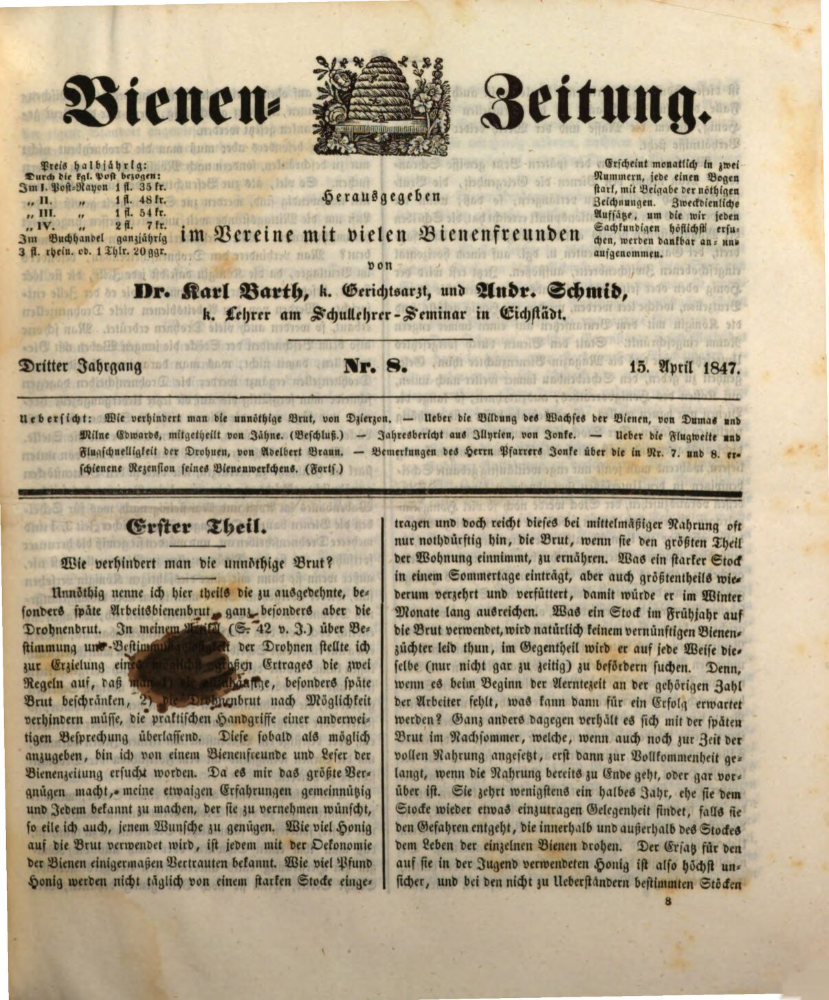
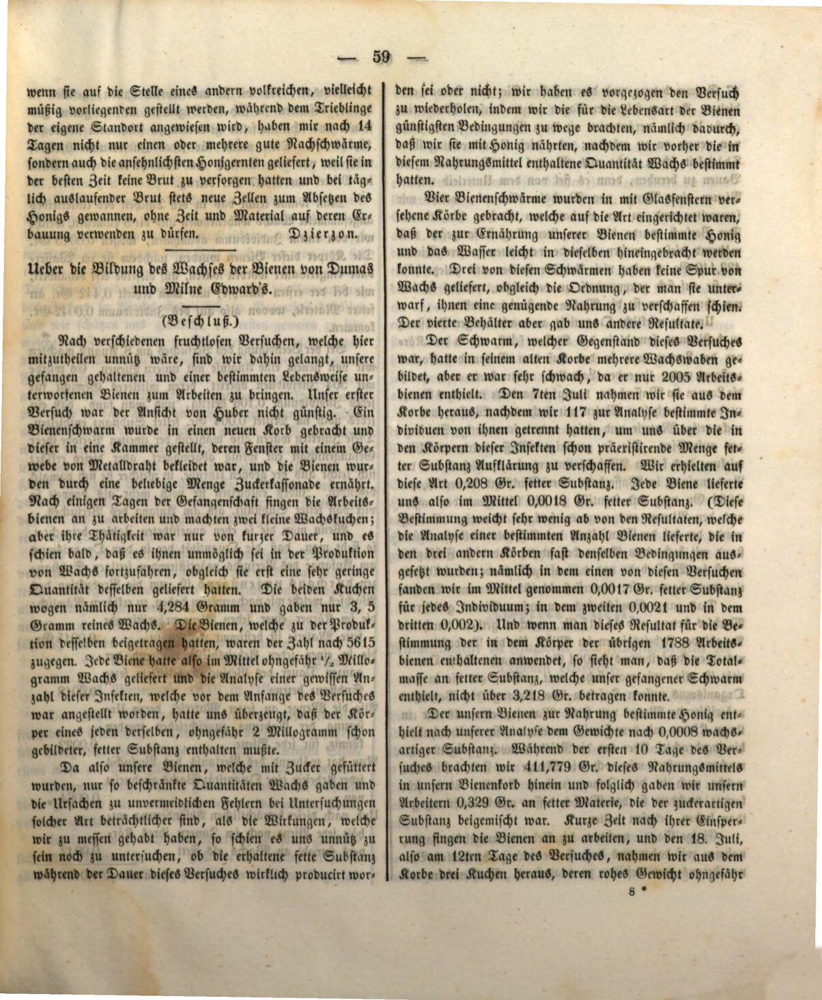
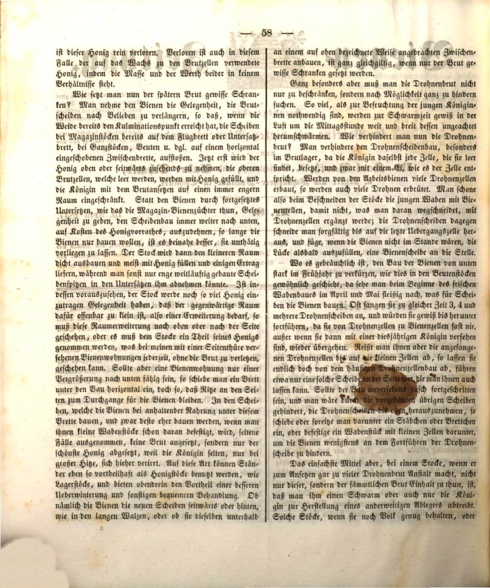

:toc: macro
:toc-title: 
:toclevels: 4

= Jak zapobiec zbędnemu czerwieniu?
Jan Dzierzon, Bienenzeitung 8, 1847

Niepotrzebny nazywam tu częściowo zbyt rozległy, a zwłaszcza późny czerw robotnic, a przede wszystkim czerw trutowy. W moim artykule (str. 42) o liczbie i określeniu liczby trutni dla osiągnięcia praktycznych korzyści podałem dwie zasady:

1.	ograniczyć czerw tak bardzo, jak to możliwe,
2.	zapobiec czerwiowi trutowemu, pozostawiając praktyczne działania do dalszej dyskusji.

Ponieważ poproszono mnie przez pszczelarza i czytelników mojego czasopisma, abym możliwie szybko podał szczegóły, chętnie spełniam tę prośbę. Każdy pszczelarz, który zna biologię pszczół, wie, jak dużo miodu zużywane jest codziennie przez silny rój. Nawet przy umiarkowanym żywieniu często ledwo wystarcza, aby wyżywić czerw, jeśli zajmuje on większość ula. Co przynosi silny rój podczas letniego dnia, jest w dużej mierze również natychmiast konsumowane i zużywane, co nie wystarczy na zimę przez kilka miesięcy.

Rój, który wiosną zużywa duże ilości czerwia, naturalnie nie przyniesie korzyści rozumnemu pszczelarzowi. Wręcz przeciwnie, ten na wszelkie sposoby postara się go ograniczyć (choć nie za wcześnie). Bowiem jeśli na początku sezonu zbiorów brakuje odpowiedniej liczby robotnic, czego można się spodziewać? Całkowicie inaczej sytuacja wygląda w przypadku późnego czerwia w późnym lecie, który, choć jeszcze karmiony, osiąga dojrzałość, gdy kończą się zapasy żywności. Jest to wyczerpujące dla pszczół przez co najmniej pół roku, zanim znajdzie się jakakolwiek okazja do nadrobienia strat. W przeciwnym razie ryzyko dla życia poszczególnych pszczół wewnątrz i na zewnątrz ula staje się większe.

Ten miód jest całkowicie stracony. Stracony jest również miód używany do wosku na ramki dla czerwia, ponieważ masa i wartość obu nie pozostają w odpowiedniej proporcji.

== Jak więc ograniczyć późny czerw?

Należy odebrać pszczołom możliwość przedłużania ramek w dowolnym momencie, tak aby, gdy osiągnięty zostanie punkt kulminacyjny, ramki w ulach magazynowych były już na desce wlotowej lub dolnym ruszcie z całymi plastrami. Ule itp. należy układać na wstawionych poziomych przegrodach. Następnie należy stopniowo usuwać miód z górnych ramek, które stają się puste, a te są napełniane miodem, ograniczając przestrzeń dla królowej do składania jaj na coraz mniejszej powierzchni.

Zamiast ciągle dawać pszczołom możliwość rozbudowy, jak to robią pszczelarze magazynowi, powiększając ramki zawsze w dół kosztem zapasów miodu, aż do momentu, gdy pszczoły przestaną budować, lepiej tego nie robić. Plastry w mniejszej przestrzeni są wtedy mniej rozbudowane i zazwyczaj wypełnione miodem, co przynosi niewielkie zbiory, w przeciwieństwie do bardziej obszernie zbudowanych ramek, które można zebrać z dolnych części ula.

Jeżeli można przewidzieć, że pszczoły wciąż będą miały okazję przynieść dużo miodu i że dostępna przestrzeń okaże się zbyt mała, wtedy należy ją powiększyć w górę lub na bok. Jeśli to nie jest możliwe, należy odebrać część miodu z ula, co można osiągnąć np. przez boczne drzwi w przystosowanych ulach, bez konieczności przesuwania czerwiu.

Jeśli ul nie może być powiększony w dół, można wsunąć poziomo deskę pod konstrukcję, zostawiając szczeliny na przejście pszczół. W ramkach, które pszczoły budują przy stałym dostępie do pożywienia w takich warunkach, czerw rzadko się rozwija, a królową trudno znaleźć, chyba że przez przypadek lub podczas upałów. Te ramki mogą być używane jako ramki do przechowywania miodu i jednocześnie pomagają pszczołom w lepszym przezimowaniu.

Budowanie ramek na wstawionych przegrodach w opisany wyżej sposób jest równie skuteczne, o ile ma to na celu ograniczenie czerwia.

== Jak ograniczyć czerw trutowy?

Nie tylko należy ograniczyć czerw trutowy, ale w miarę możliwości całkowicie go wyeliminować. Tylko tyle trutni, ile jest potrzebnych do zapłodnienia młodych królowych, powinno być dopuszczonych do wychowania. W przeciwnym razie w okresie rójki trutnie będą szeroko latały, marnując czas i zasoby.

== Jak zapobiegać budowie ramek trutowych?

Należy zapobiegać budowie ramek trutowych szczególnie w obszarze czerwiowym, gdzie królowa składa jaja w każdą pustą komórkę. Robotnice budują wiele komórek trutowych, co prowadzi do rozwoju licznych trutni. Aby temu zapobiec, podczas przycinania ramek należy usuwać młode komórki trutowe z woskiem, aby nie zastąpić ich nowymi trutniami. Ramki trutowe należy ciąć ostrożnie, szczególnie tam, gdzie pszczoły budują komórki przejściowe, a w przypadku ich braku można wstawić nową ramkę.

Zazwyczaj pszczelarze skracają budowę ramek od dołu na wiosnę, ale w kwietniu i maju obserwuje się intensywną budowę, gdzie często zaczynają budowę 3-4 ramek jednocześnie, w tym ramek trutowych. Jeśli ramki te nie zostaną usunięte, będą kontynuowane aż do całkowitego wypełnienia komórkami trutowymi, które następnie zamienią się w robotnice.

Jeśli ramki trutowe nie zostaną na czas usunięte, należy je przyciąć, pozostawiając tylko niewielką część wypełnioną jajami na boku. Jeśli konstrukcja zostanie nieświadomie zbyt szybko rozbudowana, należy usunąć nadmiar trutowych ramek, przesuwając je na górę lub bok, wstawiając tam nową przegrodę.

== Najlepsze rozwiązanie

Najprostszym sposobem, jeśli rój zaczyna wychowywać zbyt dużo czerwiu trutowego, nie tylko tego, ale całego czerwiu, jest usunięcie go z ula. Można to zrobić, przenosząc rój lub tylko królową do innego ula, aby utworzyć nowy rój. Takie ule, jeśli zachowają wystarczająco dużo pszczół, lub jeśli zostaną umieszczone w miejscu innego pełnego ula, który być może jest chwilowo bezczynny, podczas gdy rój zostaje przypisany do nowego miejsca, po 14 dniach dostarczają nie tylko jednego lub kilku dobrych rojów, ale także najbardziej znaczące zbiory miodu. Było to możliwe, ponieważ w najlepszym czasie nie musiały zajmować się wychowywaniem czerwiu, a dzięki codziennemu wylęganiu czerwiu zawsze miały nowe komórki na składowanie miodu, bez konieczności poświęcania czasu i materiału na ich budowę.
Dzierzon

== Tłumaczenie

Autor: Jan Dzierżoń

Zródło: https://digitale-sammlungen.de/de/view/bsb10228417?page=59

Tłumaczenie: R.Styczynski z pomocą ChatGPT
