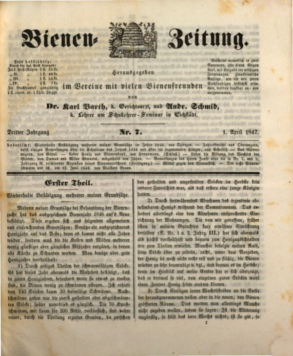
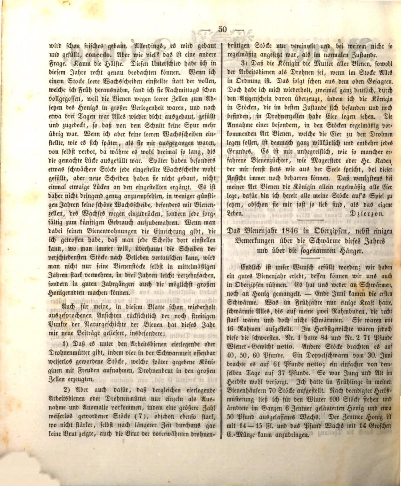

:toc: macro
:toc-title: 
:toclevels: 4

= Powtórne potwierdzenie kilku moich zasad.
Jan Dzierzon, Bienenzeitung 7, 1847

== Spis treści
toc::[]

Kilka moich zasad dotyczących hodowli pszczół zostało ponownie potwierdzonych przez znakomity rok pszczelarski 1846. Wynikają one z następujących ogólnych i jasnych zasad: Wykorzystaj wyjątkowy rok miodowy jak najlepiej, ponieważ nie zdarza się on co roku, a musi pokryć koszty i trud kilku mniej korzystnych lub nieurodzajnych lat, w których wszystkie umiejętności stają się bezużyteczne. Korzystne jest jednak odpowiednie wykorzystanie dobrych lat miodowych:

== 1. Przez wczesne dzielenie rodzin zdolnych do rojenia.

W tym roku ponownie potwierdziła się prawda, że w dobrych latach miodowych, szczególnie gdy są one nieco suche, pszczoły rzadziej się roją. Z moich 240 rodzin tylko 20 wyroiło się dobrowolnie. Późniejsze roje miały miejsce tylko z wcześniej podzielonych lub już wyrojonych rodzin; później ustały one całkowicie. Z moich 70 sztucznych rojów sprzedałem zaledwie kilka za 300 talarów, a mimo to zyski z podziałów były większe, ponieważ między podzielonymi a niepodzielonymi rodzinami jesienią nie było różnicy, poza tym, że te pierwsze miały młodą królową.

== 2. Przez systematyczne usuwanie wszelkiego możliwego do zebrania miodu w miesiącach letnich.

Wymaga to jednak odpowiedniego dostosowania uli. Wprowadzony przeze mnie, wcześniej wspomniany system (por. nr 1 i 2, rocznik III), okazał się ponownie bardzo korzystny i wygodny zarówno do pozyskiwania miodu, jak i do podziałów. Niektórzy, mimo moich zaleceń, nie decydowali się na zebranie miodu, tłumacząc, że nie jest jeszcze wystarczająco dojrzały lub pszczoły byłyby zbyt niepokojone, i żałowali tego jesienią, ponieważ porównując plony, przekonali się, że mogli zebrać nawet trzy razy więcej, z niektórych dobrych rodzin nawet cały cetnar miodu.

== 3. Przez wstawianie pustych plastrów w miejsce usuniętych pełnych lub w nowe przestrzenie udostępnione pszczołom.

Niektórzy mogą się z tym nie zgodzić, argumentując, że przy niesprzyjającej pogodzie puste plastry nic nie dają; jeśli jednak pogoda jest dobra to budowa nowych plastrów postępuje, jednak ile ich powstaje? To już inna sprawa. Niewiele ponad połowę. W tym roku mogłem dokładnie zaobserwować tę różnicę. Kiedy wstawiałem do ula puste plastry woskowe zamiast pełnych, które usunąłem na wiosnę, już po południu były one w całości wypełnione, ponieważ pszczoły, z braku pustych komórek, miały trudności z magazynowaniem miodu. Po około trzech dniach wszystko było znów szczelnie zbudowane, wypełnione i przykryte, tak że nie było śladu po usuniętych plastrach.

Jeśli jednak nie wstawiałem pustych plastrów – co później zdarzyło się, gdy mi ich zabrakło – to trwało trzykrotnie dłużej, zanim luka została wypełniona. W późniejszym czasie szczególnie słabsze rodziny wypełniały każdą wstawioną ramkę woskiem, ale nie budowały nowych plastrów ani nawet nie uzupełniały luk w istniejących. Dlatego należy zdecydowanie polecić, aby w mniej sprzyjających latach nie niszczyć żadnego plastra wosku, zwłaszcza z komórkami pszczelimi, ze względu na wosk, lecz każdą ramkę starannie przechowywać na przyszłość.

Jeśli ule zostaną wyposażone w system umożliwiający umieszczanie plastrów w dowolnym miejscu, a także swobodną wymianę plastrów między różnymi rodzinami, to nie tylko można znacznie zwiększyć liczbę uli w przeciętnych latach i trzykrotnie ją pomnożyć w ciągu trzech lat, ale także osiągnąć jak największe zbiory miodu w dobrych latach.”

== Kontrowersje

Również w tym roku moje, już wielokrotnie wyrażone w tym czasopiśmie, opinie na temat wciąż kontrowersyjnych punktów historii naturalnej pszczół, dostarczyły mi nowych spostrzeżeń, w szczególności:

1.	Istnieją robotnice składające jaja lub tzw. matki trutowe. Cztery osierocone rodziny pszczele, które później z radością przyjęły nowe królowe, wytworzyły czerwie trutowe w dużych komórkach.

2.	Jednak takie robotnice składające jaja lub matki trutowe występują jedynie sporadycznie i jako anomalia. Spośród większej liczby osieroconych rodzin (7), mimo że były równie silne, jeśli nie silniejsze, nie zaobserwowano w nich nawet po dłuższym czasie żadnego czerwia, a czerwie w wcześniej wspomnianych rodzinach z matkami trutowymi pojawiały się tylko sporadycznie i nie były układane tak regularnie, jak w normalnym stanie.

3.	Królowa jest matką wszystkich pszczół, zarówno robotnic, jak i trutni, jeśli w rodzinie wszystko jest w porządku. Wynika to już z powyższych spostrzeżeń. Osobiście przekonałem się o tym dwukrotnie w sposób niepodważalny, obserwując, jak królowa w dobrze prosperujących rodzinach składała jaja w komórkach trutowych. Twierdzenie, że istnieje szczególny typ pszczół, który regularnie występuje w rodzinach i składa jaja w komórkach trutowych, jest całkowicie arbitralne i pozbawione jakichkolwiek podstaw.

Nie mogę zrozumieć, jak doświadczeni pszczelarze, tacy jak Magerstedt czy pan Kaden, którzy zwykle wyrażają opinie zgodne z moimi, mogą nadal obstawać przy tym poglądzie. Jestem gotów postawić wszystkie swoje rodziny na szali, mimo że są mi tak bliskie, jak własne życie, na dowód, że w moim typie pszczół tylko królowa regularnie składa wszystkie jaja.”

Dzierzon

== Tłumaczenie

Autor: Jan Dzierżoń

Zródło: https://digitale-sammlungen.de/de/view/bsb10228417?page=51

Tłumaczenie: R.Styczynski z pomocą ChatGPT
