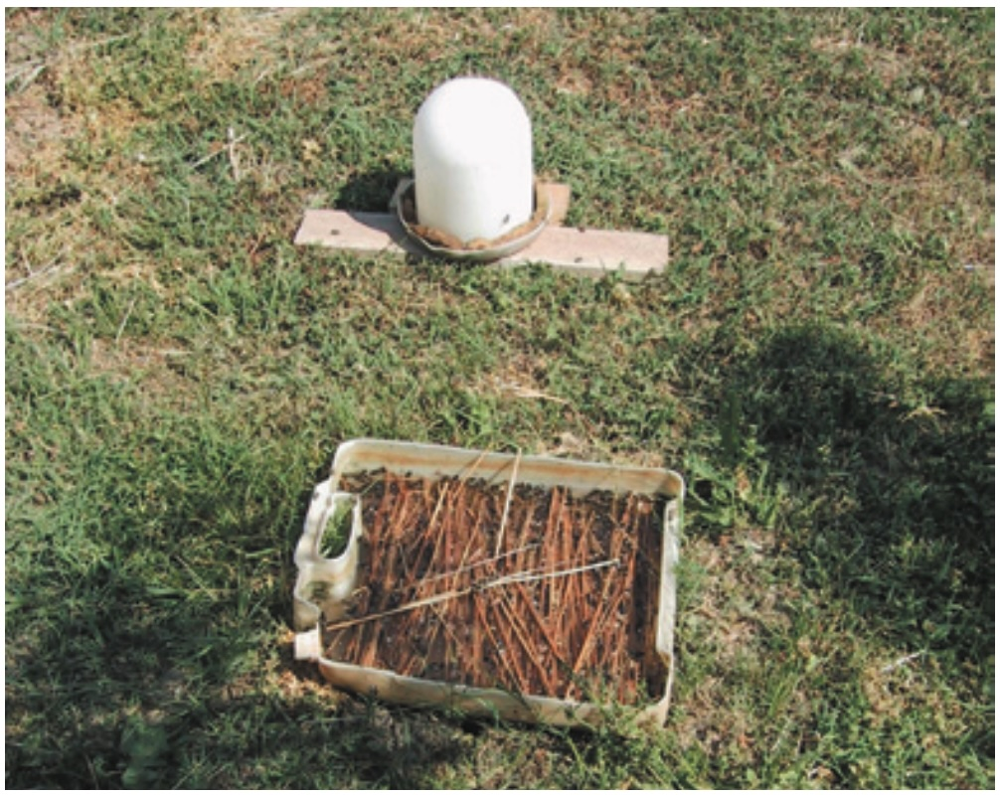
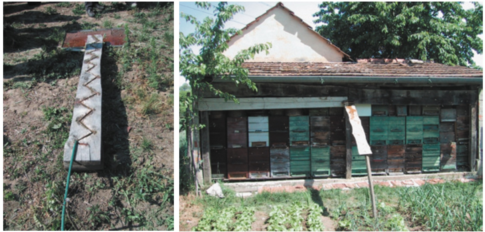
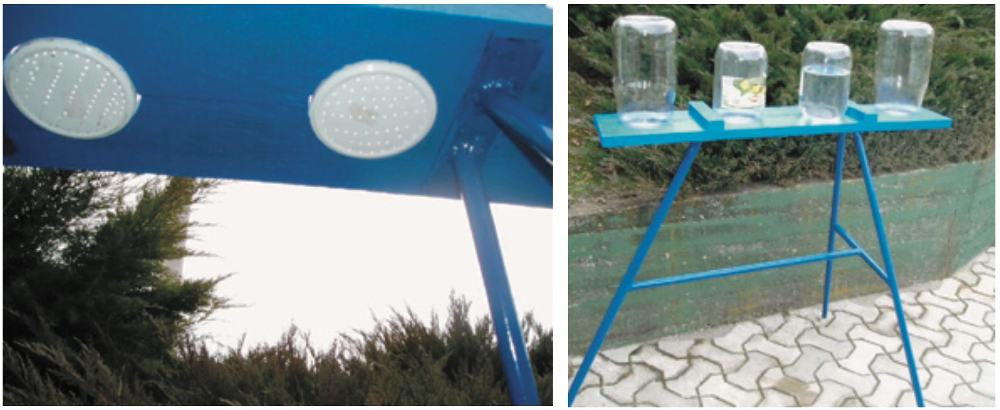
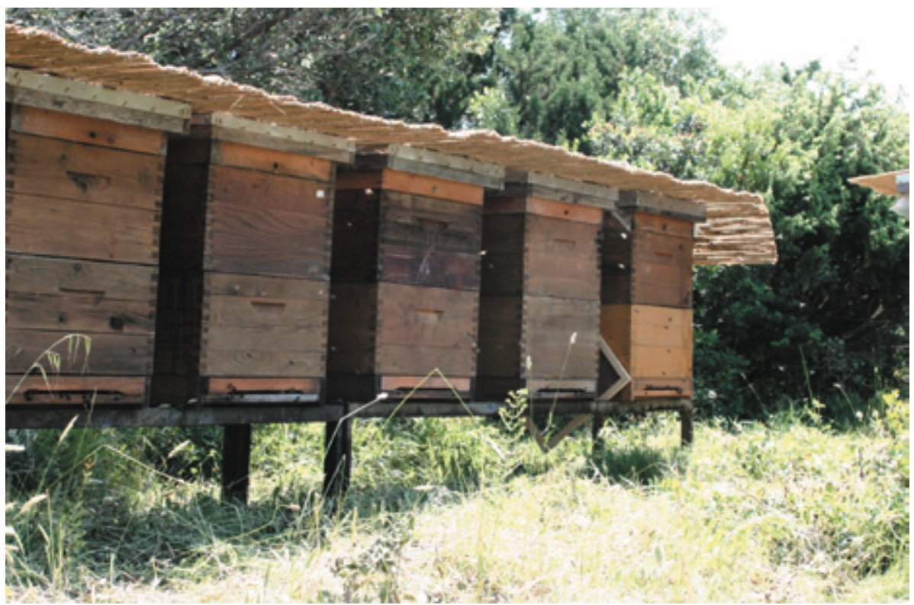
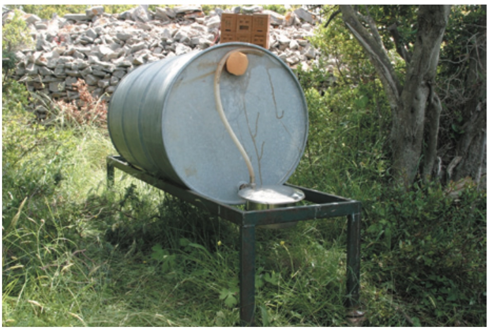
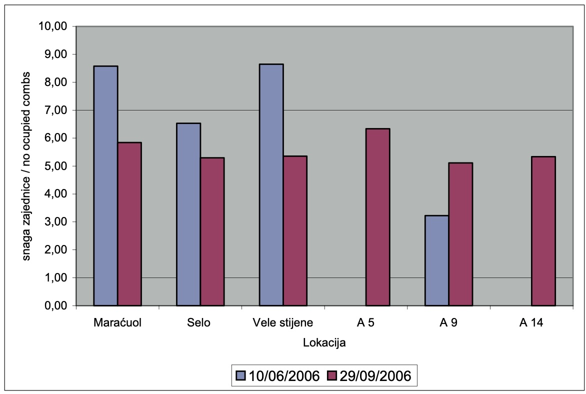
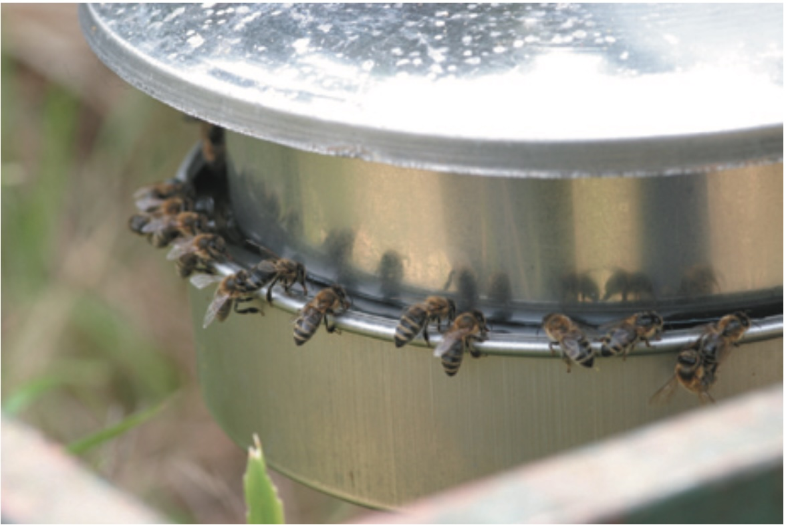
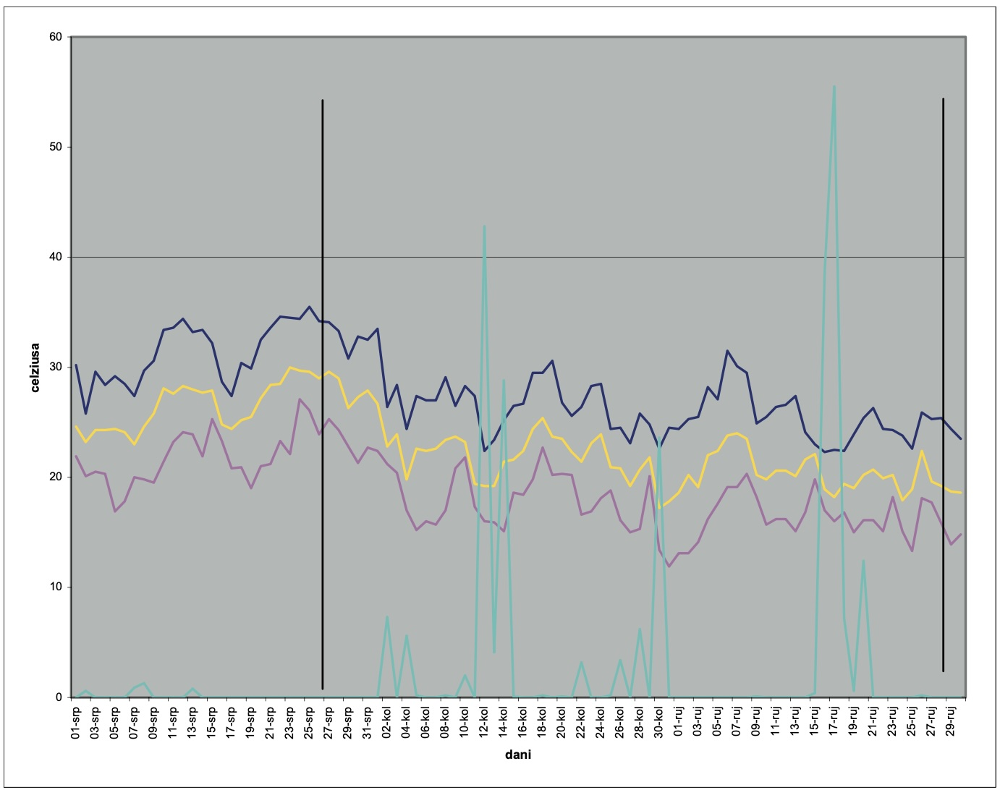

:toc: macro
:toc-title: 
:toclevels: 4

= HIGIENICZNE ZAOPATRZENIE W WODĘ DLA PSZCZÓŁ

Autor: Gordana HEGIĆ*, Dragan BUBALO, 2007

Zródło: https://jcea.agr.hr/articles/442_HYGIENIC_WATER_SUPPLY_FOR_THE_BEES_en.pdf

Tłumaczenie: R.Styczynski z pomocą ChatGPT

[abstract]
Pszczoły muszą mieć zapewniony ciągły i odpowiedni dostęp do dobrej jakości wody, niezbędnej do ich prawidłowego rozwoju i przetrwania. Pszczelarze w swojej pracy korzystają z różnych pojemników do zaopatrzenia w wodę, które często mają liczne wady (niewystarczająca pojemność, nieregularne dostawy wody, niezadowalające warunki sanitarne). W celu zbadania ciągłości, zużycia oraz higieny zaopatrzenia w wodę, skonstruowano i zastosowano nowy model higienicznego pojemnika na wodę w eksperymencie przeprowadzonym na wyspie Unije. Próba trwała od 26 lipca do 29 września 2006 roku i obejmowała sześć izolowanych pasiek o równej sile rodzin pszczelich. W tym okresie 83 ule zużyły łącznie 374,10 litra wody, co daje średnie zużycie wody na ul wynoszące 5,19 ± 2,88 litra. Średnie dzienne zużycie wody na ul wyniosło 0,12 ± 0,07 litra.  

SŁOWA KLUCZOWE: pszczoły, woda, zaopatrzenie w wodę, zużycie wody

== Skrót opracowania

Pszczelarze muszą zapewnić ciągły dostęp wody dla pszczół. Większość systemów zaopatrzenia w wodę nie spełnia wymogów sanitarnych. W wodzie często można znaleźć martwe pszczoły i/lub ich odchody, które mogą być potencjalnym źródłem chorób, takich jak Nosema apis. Wymagania dotyczące wody są różne i zależą od warunków klimatycznych (temperatury, konfiguracji terenu, nasłonecznienia, wiatru, opadów) oraz rozwoju rodziny pszczelej (siły i stanu zdrowia kolonii). Pszczoły częściowo zaspokajają zapotrzebowanie na wodę z miodu i nektaru. Pszczoły, którym brakuje wody, żyją krócej. W ekstremalnych warunkach suszy pszczoły eliminują larwy, wysysając z nich płyny ustrojowe. Jeśli pszczołom przez dłuższy czas brakuje wystarczającej ilości dobrej jakości wody, młodsze pszczoły mogą cierpieć na zaparcia z powodu diety pyłkowej. Wybuch tej technologicznej choroby jest częsty w maju, kiedy rozwój kolonii jest bardzo intensywny. Nie jest to choroba zakaźna, ale jej obecność powoduje osłabienie lub w cięższych przypadkach wyczerpanie kolonii. Zapobieganie tej chorobie to zapewnienie higienicznego zaopatrzenia w wodę w pasiece. Latem, kiedy temperatury zewnętrzne są wysokie, pszczoły używają wody do utrzymania optymalnej temperatury i wilgotności czerwiu. Nie zaleca się polegania na naturalnych źródłach wody. Higieniczny pojemnik na wodę powinien znajdować się w pasiece od początku rozwoju kolonii, od wiosny aż do ostatnich lotów pszczół przed zimą. Pszczoły muszą wykształcić nawyk odwiedzania zapewnionego źródła wody. Trudno jest ponownie przyzwyczaić pszczoły do miejsc pojenia, które nie mają stałego zaopatrzenia w wodę. Pszczelarze z pasiekami mobilnymi muszą starannie ustawiać miejsca zaopatrzenia w wodę. Powinny one być w stałej relacji z ulem, ponieważ pszczoły nie akceptują łatwo zmian lokalizacji. W praktyce często stosuje się różne urządzenia do pojenia pszczół. Na rysunku przedstawiono jedynie kilka najczęściej stosowanych otwartych systemów zaopatrzenia w wodę (rysunek 1). Ogólnie stosuje się pochyłe drewniane systemy wodne (rysunki 2 i 3). Dziś wiadomo, że każde otwarte miejsce pojenia stanowi zagrożenie dla rozprzestrzeniania się chorób pasożytniczych w pasiece lub nawet na szerszym obszarze [2, 3, 9]. Pszczoły wydalają odchody podczas lotu, a chore pszczoły jeszcze bardziej, zwiększając możliwość, że odchody trafią do wody. Odchody chorych pszczół są słodkie z powodu zmniejszonej resorpcji, a inne pszczoły chętnie je zlizują, rozprzestrzeniając chorobę. Jeśli odchody chorej pszczoły zawierające miliony zarodników Nosema apis trafią do wody, pszczoły robotnice z wszystkich innych uli zbiorą je. Najczęściej stosowany higieniczny system pojenia pszczół to odwrócone szklane pojemniki zamknięte perforowaną pokrywką lub szmatką. System ten w pełni spełnia warunki sanitarne, dostarczając pasiece wodę dobrej jakości. Wadą tego systemu jest konieczność obecności pszczelarza do uzupełniania pojemników. Pszczoły pobierają wodę z dolnej strony pojemnika, dzięki czemu odchody mogą spadać na ziemię, gdzie pszczoły nie występują, a chore pszczoły nie mogą wpaść do wody. Nowy model zaopatrzenia w wodę eliminuje zaobserwowane wady dotyczące ciągłości dostaw i warunków sanitarnych. System ten umożliwia niezawodne monitorowanie zużycia wody w pasiece. Eksperyment przeprowadzono w pasiekach na wyspie Unije. Łącznie osadzono 83 ule w 6 lokalizacjach: Selo, Maracuol, Vele stijene, A5, A9 i A14. Siłę kolonii oceniano przez liczenie zajętych ramek na początku i końcu eksperymentu. Zużycie wody porównano z warunkami pogodowymi uzyskanymi z pomiarów Państwowego Biura Meteorologicznego w Puli. W okresie próbnym od 26 lipca do 29 września (łącznie 66 dni) odnotowano 24 dni deszczowe, kiedy pszczoły nie latały. W tym okresie 83 ule zużyły łącznie 374,5 litra wody. Średnie zużycie wody na ul wyniosło 5,19 ± 2,88 litra. Zużycie wody na ul obliczono tylko dla aktywnych 42 dni (bez deszczu). Średnie dzienne zużycie wody przez kolonię wyniosło 0,12 ± 0,07 litra (tabela 2). Zużycie kolonii w pasiekach wahało się od 2,50 do 9,71 litra wody. W poprzednich latach Nosema apis była zwykle diagnozowana w koloniach pszczół na wyspie Unije. Po zastosowaniu nowego modelu higienicznego pojemnika na wodę objawy kliniczne Nosemozy nie wystąpiły. Stosowany higieniczny system zaopatrzenia w wodę jest łatwy do czyszczenia i dezynfekcji, co stanowi dodatkową zaletę w porównaniu z innymi systemami pojenia. Obliczone wartości zużycia wody są wynikami wstępnymi. Konieczne jest ich monitorowanie przez kilka lat, uwzględniając inne parametry mogące wpływać na zużycie wody.

== Spis treści
toc::[]

== WSTĘP

Dzięki sprzyjającym warunkom naturalnym, pszczelarstwo w naszych regionach jest tradycyjnym zajęciem i w pisanych źródłach pojawia się już w starych kodeksach prawnych z XII wieku [4]. Rozwój transportu i środków komunikacji umożliwił przemieszczanie pszczół na większe odległości, co zaowocowało nowymi odkryciami i wymaganiami. Jednym z głównych problemów pszczelarzy, które pojawiły się w wyniku przemieszczania pszczół na pożytki, było znalezienie odpowiednich pożytków oraz walka z chorobami.

Jednym z ważnych sposobów walki z rozprzestrzenianiem się chorób jest zapewnienie odpowiednich i ciągłych ilości wody, która jest niezbędna do prawidłowego rozwoju i przetrwania rodziny pszczelej. Najczęściej stosowanym sposobem zaopatrywania pszczół w wodę, zwłaszcza na początku, były powierzchniowe wody, takie jak cieki wodne (rzeki i jeziora) oraz wody opadowe gromadzące się na powierzchni ziemi. W takich wodach mogą znajdować się substancje szkodliwe dla pszczół. Dzieje się tak najczęściej na terenach, gdzie prowadzona jest intensywna uprawa roślin, przez co w wodach powierzchniowych mogą pozostawać substancje stosowane w ochronie roślin lub zwalczaniu chwastów. Zdarza się również, że podczas długotrwałych okresów suszy źródła wody wysychają [8].

Pszczelarze starali się zapewnić pszczołom stały dostęp do wody, jednak konstrukcja poideł często nie gwarantowała odpowiednich warunków higienicznych. Bardzo często w wodzie można było znaleźć martwe pszczoły i/lub ich odchody, co stanowiło potencjalne źródło zakażenia dla wszystkich pszczół korzystających z poidła, zwłaszcza jeśli pszczoła, która trafiła do wody, była zarażona jakąś chorobą, np. nosemozą.

Zapotrzebowanie na wodę różni się w zależności od zewnętrznych warunków klimatycznych (temperatury, ukształtowania terenu, zacienienia pasieki, wiatru, opadów) oraz rozwoju rodziny pszczelej (siły rodziny i jej stanu zdrowia).

W dobrze rozwiniętej rodzinie pszczelej znajduje się, w zależności od pory roku i typu ula, od 20 000 do 80 000 pszczół robotnic [1,6]. Starsze pszczoły robotnice nazywane są zbieraczkami i przynoszą z natury pokarm – substancje słodkie: nektar, spadź lub miód, pyłek i wodę, którą zbierają z poideł. Pszczoły przenoszą wodę do ula w swoich wolu miodowym. Pojemność wola miodowego na wodę wynosi około 40 µl. Zapotrzebowanie na wodę jest tylko częściowo pokrywane z miodu i nektaru. Pszczoły, które nie mają dostępu do wystarczającej ilości wody, żyją krócej, a w ekstremalnych warunkach suszy wyrzucają larwy, pozyskując od nich niezbędną wodę.

== WODA I JEJ ZNACZENIE DLA Pszczół

Woda jest z pewnością najważniejszym składnikiem nieorganicznym wszystkich organizmów żywych. Stanowi ogólne medium do rozpuszczania substancji organicznych [5]. Parowanie wody jest najważniejszym mechanizmem odprowadzania ciepła z ula. Pszczoły potrzebują wody do życia i rozwoju równie mocno, jak miodu i pyłku kwiatowego. W intensywnym rozwoju wiosennym, szczególnie w produkcji mleczka pszczelego, pszczoły zużywają znaczne ilości pyłku. Do trawienia pyłku konieczna jest odpowiednia ilość wody. W przypadku braku wystarczających i ciągłych ilości wody pyłek w jelitach pszczół twardnieje, co prowadzi do zaparć. Jest to choroba technologiczna, najczęściej występująca w maju, gdy rozwój rodziny pszczelej jest najintensywniejszy, dlatego nazywana jest również "chorobą majową". Jest to niezakaźna choroba pszczół, która w przypadku wystąpienia osłabia rodzinę, a w ciężkich przypadkach może prowadzić do jej upadku. Występowanie tej choroby można zapobiec lub przerwać, instalując higieniczne poidło w pasiece.

Latem, gdy temperatury zewnętrzne są wysokie, pszczoły używają wody do utrzymania optymalnej temperatury i wilgotności w gnieździe. Optymalna temperatura dla rozwoju czerwiu wynosi 34–35°C. Czerwie są bardziej odporne na niższe temperatury niż na wyższe, na przykład przy 38°C mogą całkowicie obumrzeć.

=== WODA I POIDŁA DLA Pszczół

Jeśli w pasiece brakuje wody, pszczoły będą szukały jej gdzieś indziej. Nie można przewidzieć, na jakie źródło wody trafią ani w jakim stanie będzie poidło. Wskazane jest, aby w pobliżu pasieki nie znajdowały się żadne kałuże ani zastoiska wody, ponieważ takie miejsca z reguły są ogniskami chorób pszczół. Dlatego nie należy polegać na naturalnych źródłach wody, które są niepewne i mogą zagrażać przetrwaniu całej rodziny pszczelej. W pasiece powinno znajdować się higieniczne poidło. Higieniczne poidło z wodą powinno być dostępne od początku rozwoju rodziny pszczelej na wiosnę aż do ostatnich lotów pszczół przed zimą. Pszczoły muszą przyzwyczaić się do stałego źródła wody w pobliżu ula, aby nie były zmuszone do szukania wody o niepewnej jakości w okolicy. 

Zapotrzebowanie na wodę nie jest małe, szczególnie wiosną, gdy karmicielki produkują duże ilości mleczka pszczelego – im więcej czerwiu jest karmionych, tym większe są potrzeby na wodę. Kezić i współpracownicy [7] przytaczają dane z badań Weipple z 1928 r., które wskazują, że ilość wody pobranej przez pszczoły w ciągu roku (nie licząc wody zawartej w nektarze) wynosi około 20 litrów. Z kolei badania Ferara z 1973 r. wykazały, że pszczoły na pasiece z 50 ulami zużywały ponad 220 litrów wody tygodniowo.

Woda w poidłach powinna być stale dostępna, ponieważ pszczoły niechętnie wracają do poideł, które okresowo są pozbawione wody. W praktyce zdarza się, że pszczelarze dodają do wody grudki soli, co jest niewskazane, ponieważ badania laboratoryjne wykazały, że już przy stężeniu soli wynoszącym 0,2–0,5% skraca się życie pszczół, a wyższe stężenia (1–5%) są bardzo toksyczne.

Pszczelarze, którzy przemieszczają pasieki, muszą zwracać uwagę na stałe ustawienie poidła względem uli, ponieważ pszczoły trudno adaptują się do zmian lokalizacji.

== NAJCZĘŚCIEJ UŻYWANE POIDŁA DLA PSZCZÓŁ

W praktyce spotyka się różne urządzenia służące do pojenia pszczół. Na ilustracji przedstawiono jedynie część różnorodnych improwizacji poideł i poidłowych konstrukcji, które pszczelarze stosują, aby zapewnić swoim pszczołom wodę (rysunek 1).

Najczęściej stosowanym rozwiązaniem jest drewniane poidło składające się z ukośnie ułożonej deski, na którą kapie woda (rysunek 2). Deska ma na swojej powierzchni ukośne nacięcia lub listwy, które zatrzymują wodę, tworząc dużą wilgotną powierzchnię, na której mogą lądować pszczoły.

Przez długi czas ten typ poidła uważano za najlepszy sposób zapewnienia pszczołom wystarczającej ilości wody. Obecnie wiadomo, że wszystkie otwarte poidła stanowią zagrożenie rozprzestrzeniania się nosemozy – choroby pasożytniczej w obrębie pasieki lub na szerszym obszarze.

Pszczoły dostarczające wodę często chorują na nosemozę, zwaną również biegunką pszczół. Ponieważ pszczoły wypróżniają się podczas lotu, a chore pszczoły mają zwiększoną potrzebę defekacji, istnieje możliwość, że ich odchody trafią na deskę. Odchody chorych pszczół są słodkawe ze względu na zmniejszoną resorpcję pokarmu, co powoduje, że inne pszczoły chętnie je zlizują, a choroba w ten sposób łatwo się rozprzestrzenia [2,3,9]. Odchody chorych pszczół mogą zawierać miliardy zarodników Nosema, które wraz z wodą zbierają pszczoły-zbieraczki i przenoszą je do uli.

W ostatnim czasie coraz częściej jako higieniczne poidła dla pszczół stosuje się odwrócone szklane pojemniki zamknięte perforowaną pokrywką lub kawałkiem materiału. Takie pojemniki w pełni spełniają wymagania higieniczne w pasiece i zapewniają pszczołom wodę dobrej jakości. Wadą tego typu poidła jest konieczność stałej obecności pszczelarza, który musi regularnie uzupełniać pojemniki (ze względu na ich małą pojemność – największe mają objętość 5 litrów). Pszczoły pobierają wodę z dolnej strony pojemnika, a przypadkowe odchody spadają na ziemię, gdzie pszczoły się nie poruszają, co eliminuje ryzyko kontaktu chorej pszczoły z wodą.

Poidło, oprócz zapewnienia wystarczającej i ciągłej ilości wody dla pszczół, musi spełniać podstawowe warunki higieniczne, które zapobiegają dostawaniu się odchodów pszczół do wody lub topieniu się pszczół w wodzie. Nowo skonstruowane higieniczne poidło dla pszczół, oprócz wyeliminowania dotychczasowych niedostatków związanych z ciągłością zaopatrzenia i higieniczną jakością wody, umożliwiło nam również wiarygodne monitorowanie zużycia wody w pasiece.

---

Zdjęcie 1. Poidło dla pszczół jako otwarte naczynie lub przystosowane poidło dla kurcząt  

---

---

Zdjęcie 2. Tradycyjne poidło dla pszczół  

---

== MATERIAŁY I METODY

Eksperyment przeprowadzono na pasiekach zlokalizowanych na wyspie Unije. Łącznie 83 rodziny pszczele rozmieszczono na sześciu lokalizacjach: Selo, Maraćuol, Vele stijene, A5, A9 i A14. Odległość między pasiekami wynosiła ponad 500 metrów. Ule zostały ustawione na metalowych stojakach, a rodziny pszczele były latem osłonięte pokryciem z trzciny (rysunek 4). Dla każdej pasieki zamontowano oddzielne poidło.

.Tablica 1. Liczba uli na pasiekach na wyspie Unije
[cols="2,1", options="header"]
|===
| Lokalizacja / Location | Liczba uli / No. of beehives
| Maraćuol | 19
| Vele stijene | 17
| Selo | 17
| A5 | 12
| A9 | 9
| A14 | 9
| **Razem / Total** | **83**
|===

Poidło składało się z metalowej beczki na wodę (o pojemności 200 litrów) ustawionej na stojaku. Do mniejszego otworu beczki zamontowano poidło wykonane ze stali nierdzewnej, natomiast większy otwór beczki był zamknięty gąbką. Położenie poidła względem uli było stałe. Poidła nie były osłonięte od słońca, z wyjątkiem pasieki Selo, gdzie poidło było częściowo zacienione przez pobliskie drzewo.

Poidła były chętnie odwiedzane przez pszczoły. Na podstawie obserwacji oceniono, że dostęp do wody był odpowiedni dla liczby i siły rodzin pszczelich w pasiekach. Dostęp do wody w poidle przedstawiono na rysunku 6.

Główne elementy higienicznego poidła ze stali nierdzewnej to:
- szeroka pokrywa, która chroni wodę przed odchodami pszczół i jednocześnie minimalizuje straty wody przez parowanie,
- korpus poidła z mechanizmem automatycznego utrzymywania poziomu wody. Poziom wody poniżej krawędzi kanału dostępnego dla pszczół wynosi maksymalnie 3 mm. Obniżenie poziomu wody o 3 mm otwiera zawór, który umożliwia uzupełnienie pojemnika. Mechanizm ten zapewnia ciągły dopływ wody, którą zużywają pszczoły.

Siła rodzin pszczelich została oceniona poprzez liczenie zajętych przez pszczoły ramek przed rozpoczęciem i na końcu eksperymentu. Zużycie wody porównano z danymi dotyczącymi warunków pogodowych, uzyskanymi z Państwowego Instytutu Meteorologicznego, stacja pomiarowa Pula.

---

Zdjęcie 3. Higieniczne poidło dla pszczół  

---

---

Zdjęcie 4. Pasieka Vele stijene na wyspie Unije  

---

---

Zdjęcie 5. Poidło na pasiece Selo  

---

== WYNIKI I DYSKUSJA

=== Stan siły rodzin pszczelich

Ponieważ rodziny pszczele na pasiekach A5 i A14 zostały utworzone bezpośrednio przed rozpoczęciem monitorowania zużycia wody, w Tablicy 1 przedstawiono siłę rodzin wyrażoną w liczbie zajętych ramek jedynie po zakończeniu eksperymentu. Jesienią, po zakończeniu monitorowania, wszystkie rodziny, których siła była wcześniej określona, wykazywały osłabienie. Jedynie rodziny pszczele na pasiece A9 wykazały znaczący wzrost siły. Średnia siła rodzin pod koniec eksperymentu była wyrównana.

=== Monitorowanie warunków pogodowych

Na początku eksperymentu, w lipcu 2006 roku, dominowały słoneczne dni (4) z wysokimi temperaturami powietrza. Gdy temperatura przekraczała 30°C, pszczoły, oprócz zaspokajania swoich potrzeb fizjologicznych, wykorzystywały wodę do utrzymania optymalnej temperatury i wilgotności w gnieździe, co jest kluczowe dla prawidłowego rozwoju czerwiu.

W sierpniu 2006 roku całkowita liczba słonecznych dni wyniosła 15, a temperatury tylko sporadycznie przekraczały 30°C. W tym okresie pszczoły korzystały z wody głównie do swoich potrzeb fizjologicznych. Podczas 16 deszczowych dni w sierpniu pszczoły nie korzystały z poideł.

---

Grafika 1. Średnia siła rodzin pszczelich na pasiekach na wyspie Unije  

---

---

Zdjęcie 6. Dostęp do wody w poidle ze stali nierdzewnej  

---

We wrześniu liczba słonecznych dni była większa niż w sierpniu, jednak temperatury nie były wysokie. Tylko 6 i 7 września temperatura przekroczyła 30°C, co oznacza, że pszczoły również we wrześniu wykorzystywały wodę głównie do potrzeb fizjologicznych, a zapotrzebowanie na wodę do chłodzenia ula było bardzo niskie. Podczas 8 deszczowych dni we wrześniu pszczoły nie odwiedzały poideł.

W okresie trwania eksperymentu, od 26 lipca do 29 września (łącznie 66 dni), odnotowano 24 deszczowe dni, w trakcie których pszczoły nie odwiedzały poideł. Deszczowe dni są dla pszczół dniami nieaktywnymi, tj. dniami, w których pszczoły nie latają.

== ZUŻYCIE WODY

W okresie od 26 lipca do 29 września 83 ule zużyły łącznie 374,5 litra wody. Średnie zużycie wody na ul w analizowanym okresie na wyspie Unije wyniosło 5,19 ± 2,88 litra. W tym czasie wystąpiły 42 dni bez opadów, co oznacza, że były to aktywne dni dla pszczół. Zużycie wody na ul obliczono wyłącznie dla aktywnych dni, w których pszczoły latały. Średnie dzienne zużycie wody na pasiekach na wyspie Unije w aktywnych dniach wyniosło 0,12 ± 0,07 litra. Wyniki monitorowania zużycia wody przedstawiono w tabeli 2.

Zużycie wody na pasiekach nie było równomierne i wynosiło od 2,50 litra do 9,71 litra. 

Nosemoza była regularnie diagnozowana w rodzinach pszczelich na wyspie Unije w poprzednich latach. Po zastosowaniu nowego modelu higienicznego poidła kliniczne objawy nosemozy nie były obecne. 

W związku z występowaniem nosemozy w poprzednich latach na wyspie Unije, stosowano różne typy poideł, które nie przynosiły zadowalających wyników. Na wyspie pasieki są odwiedzane raz w miesiącu, dlatego odwrócone szklane pojemniki nie były w stanie zapewnić wystarczającej ilości wody między wizytami. 

Zastosowane higieniczne poidło ze stali nierdzewnej bardzo łatwo się czyści i dezynfekuje, co stanowi dodatkową przewagę w porównaniu z innymi typami poideł używanymi wcześniej. Poidło ze stali nierdzewnej umożliwiło monitorowanie zużycia wody. Na dzienne zużycie wody w ulu wpływa wiele czynników, takich jak: stan zdrowia, siła rodziny, temperatura zewnętrzna, wiatr, opady, intensywność pożytku, ukształtowanie terenu i zacienienie pasieki.

Obliczone wartości zużycia wody są wynikami wstępnymi i wymagają monitorowania przez kilka lat przy jednoczesnym uwzględnieniu innych parametrów, które mogą wpływać na zużycie wody. Zmierzone zużycie wody jest bardzo realistyczne, ponieważ straty wynikające z przelania lub parowania wody zostały ograniczone do minimum. Szeroka pokrywa chroniąca wąski kanał poidła uniemożliwia innym zwierzętom korzystanie z wody, co pozwala przypuszczać, że jedynie pszczoły mogły korzystać z zużytej wody. Uzupełnianie poidła opadami jest prawie niemożliwe, ponieważ cała woda spływa z szerokiej pokrywy poidła poza zbiornik.

---

Grafika 2. Maksymalna i minimalna temperatura powietrza od lipca do września 2006 roku na wyspie Unije  

---

Duże różnice w zużyciu wody na wyspie Unije można jedynie spekulować. Konieczne jest monitorowanie zużycia wody przez kilka lat na tych samych pasiekach, aby możliwe było określenie przyczyn różnic w zużyciu.

Kezić i współpracownicy [7] przytaczają badanie Weipplea z 1928 roku, które wskazuje, że ilość wody dostarczonej do ula w ciągu roku (bez uwzględnienia wody z nektaru) wynosi około 20 litrów. Podanych danych z literatury trudno porównać z zmierzonym zużyciem wody na wyspie Unije, ponieważ na wyspie monitorowano zużycie jedynie w okresie letnim. Jedna trzecia okresu obserwacji była deszczowa, co miało znaczący wpływ na całkowite zużycie wody.

.Tablica 2. Zużycie wody na pasiekach na wyspie Unije od 26 lipca do 29 września 2006 roku  
[cols="2,3,3,3", options="header"]  
|===  
| Lokalizacja / Location | Liczba uli / No. of beehives | Całkowite zużycie wody (l) / Total water consumption (l) | Średnie zużycie wody na ul (l) / Average water consumption per beehive (l) | Średnie dzienne zużycie na ul (l) / Daily water consumption per beehive (l)  

| Maraćuol  
| 19  
| 60,42  
| 3,18  
| 0,08  

| Vele stijene  
| 17  
| 46,42  
| 2,73  
| 0,07  

| Selo  
| 17  
| 42,42  
| 2,50  
| 0,06  

| A5  
| 12  
| 82,00  
| 6,83  
| 0,16  

| A9  
| 9  
| 55,42  
| 6,16  
| 0,15  

| A14  
| 9  
| 87,42  
| 9,71  
| 0,23  

| **Razem / Total (średnia ± odchylenie)**  
| **83**  
| **374,10**  
| **5,19 ± 2,88**  
| **0,12 ± 0,07**  
|===  

== Bibliografia

(patrz oryginał)
