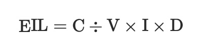

# Zintegrowane Zarządzanie Szkodnikami w Kontroli Varroa destructor (Acari: Varroidae), Najbardziej Szkodliwego Szkodnika Kolonii Apis mellifera L. (Hymenoptera: Apidae)

Autorzy: Cameron J. Jack, James D. Ellis

> [!NOTE]
> Tłumaczenie z pomocą AI. Oryginał znajduje się [tutaj](https://academic.oup.com/jinsectscience/article/21/5/6/6372257)

## Abstrakt

*Varroa destructor* jest jednym z największych biologicznych zagrożeń dla zdrowia pszczoły miodnej zachodniej (*Apis mellifera L.*) na całym świecie. Pszczelarze rutynowo stosują chemiczne metody leczenia, aby kontrolować tego pasożyta, jednak nadużywanie i niewłaściwe zarządzanie tymi metodami doprowadziły do powszechnej odporności populacji Varroa na te środki. Zintegrowane zwalczanie szkodników (IPM, ang. Integrated Pest Management) to ekologicznie oparta, zrównoważona metoda zarządzania szkodnikami, która opiera się na połączeniu różnych taktyk kontroli minimalizujących wpływ na środowisko. W niniejszym artykule przedstawiamy dogłębną analizę elementów IPM w kontekście zwalczania Varroa. Obejmuje to określanie ekonomicznych progów dla roztocza, identyfikację i monitorowanie Varroa, strategie zapobiegania oraz świadome ryzyka metody leczenia. Ponadto przedstawiamy szczegółowy przegląd strategii kontroli kulturowej, mechanicznej, biologicznej i chemicznej, zarówno długo stosowanych, jak i nowo powstałych, używanych przeciwko Varroa na całym świecie. Dla każdego rodzaju kontroli opisujemy wszystkie dostępne zabiegi, ich skuteczność przeciwko Varroa, jak to opisano w literaturze naukowej, oraz przeszkody w ich wdrożeniu. Niestety, nie istnieją niezawodne protokoły IPM dla Varroa z powodu skomplikowanej biologii roztocza oraz silnego uzależnienia pszczelarzy od chemicznych metod kontroli. Aby zachęcić pszczelarzy do stosowania IPM, skuteczne podejście do zwalczania Varroa w zarządzanych koloniach musi być lepsze od konwencjonalnych metod kontroli i obejmować opłacalne zabiegi, które mogą być łatwo stosowane przez pszczelarzy. Naszym celem jest dostarczenie najpełniejszego przeglądu dostępnych opcji zwalczania Varroa, ostatecznie umieszczając naszą dyskusję w kontekście IPM. Mamy nadzieję, że niniejszy artykuł będzie wezwaniem do działania przeciwko najbardziej niszczycielskiemu szkodnikowi, z którym zmagają się zarządzane kolonie pszczół miodnych na całym świecie.

**Varroa destructor** (Anderson & Trueman) jest uważana przez wielu badaczy pszczół miodnych za jednego z najważniejszych szkodników kolonii pszczoły miodnej zachodniej (*Apis mellifera* L.) na całym świecie (Carreck et al. 2010, Guzman-Novoa et al. 2010, Le Conte et al. 2010, McMenamin i Genersch 2015). Roztocz ten miał druzgocący wpływ na pszczelarstwo od czasu jego rozprzestrzenienia się z naturalnego gospodarza, pszczoły wschodniej lub azjatyckiej (*Apis cerana* (Hymenoptera: Apidae)), na pszczołę miodną zachodnią (dalej zwaną pszczołą miodną). Varroa odgrywa kluczową rolę w stratach kolonii obserwowanych na całym świecie (van der Zee et al. 2015, Kulhanek et al. 2017, Beyer et al. 2018, Brown et al. 2018, Brodschneider et al. 2019). Ze względu na niemal globalne rozprzestrzenienie (Ellis i Munn 2005, Rosenkranz et al. 2010, Iwasaki et al. 2015, Boncristiani et al. 2021), ten pasożytniczy roztocz poważnie osłabi lub spowoduje upadek większości kolonii pszczół miodnych, jeśli nie zostanie podjęte leczenie (Boecking i Genersch et al. 2008, Thompson et al. 2014, Frey i Rosenkranz 2014).

Wspólne wysiłki patalogów owadów, akarologów i pszczelarzy nie przyniosły jeszcze długoterminowych rozwiązań w zakresie kontroli Varroa. Dlatego ciągły rozwój nowych i innowacyjnych metod kontroli Varroa powinien pozostać priorytetem wśród badaczy pszczół miodnych i agencji finansujących (Dietemann et al. 2012). Jednakże pojedyncza strategia kontroli raczej nie zapewni trwałego rozwiązania problemu Varroa. Pomimo tego pszczelarze w większości zarządzanych kolonii pszczół miodnych w dużej mierze polegają na jednej głównej metodzie kontroli tego roztocza: kontroli chemicznej (Haber et al. 2019). W związku z tym istnieje potrzeba przeglądu badań wspierających kombinację wielu dostępnych strategii kontroli Varroa.

Zintegrowane zwalczanie szkodników (IPM, ang. Integrated Pest Management) to ekologicznie oparta, zrównoważona metoda zarządzania szkodnikami. Opiera się ona na połączeniu różnych taktyk kontroli i minimalizuje wpływ, jaki ma zwalczanie danego szkodnika na środowisko (Frisbee i Luna 1989). Skuteczny program IPM składa się z identyfikacji progów ekonomicznych, monitorowania populacji szkodników, wdrażania szeregu technik zapobiegawczych oraz stosowania stopniowego planu leczenia w zależności od potrzeb (Flint 2012). Niestety, wielu pszczelarzom nie udało się wprowadzić zasad IPM w swoich programach zarządzania Varroa, głównie z powodu luk w wiedzy i braków w szkoleniu (Whitehead 2017). W niniejszym artykule omawiamy podstawowe zasady IPM, ich związek z zarządzaniem Varroa, obecne opcje kontroli Varroa oraz przedstawiamy perspektywy zrównoważonych rozwiązań. Podczas gdy inne niedawne przeglądy dotyczące biologii i kontroli Varroa oferują dyskusje na temat różnych strategii kontroli Varroa (Rosenkranz et al. 2010, Gregorc i Sampson 2019, Noël et al. 2020, Roth et al. 2020), naszym celem jest dostarczenie jednego, kompleksowego przeglądu kontroli Varroa w ramach IPM.

## Ustalanie Progów

Zintegrowane zwalczanie szkodników (IPM) opiera się na założeniu, że pewne poziomy obecności szkodników i uszkodzeń są tolerowane i nie wymagają całkowitej eliminacji (Ostlie i Pedigo 1987). W związku z tym, ustalenie progów dotyczących poziomu zagęszczenia szkodników, który spowoduje szkody ekonomiczne, oraz poziomu zagęszczenia, przy którym należy zastosować środki kontrolne, jest fundamentem IPM (Higley i Peterson 2009). Te progi są niezbędne, ponieważ wyznaczają kierunek działań w każdej sytuacji zarządzania szkodnikami.

Pierwszym krokiem w IPM jest określenie zagęszczenia szkodników, które uzasadnia koszt zastosowania środków kontrolnych. Ekonomiczny poziom szkodliwości (EIL) jest definiowany jako najniższe zagęszczenie populacji, które spowoduje szkody ekonomiczne (Stern et al. 1959). EIL to proste równanie kosztów i korzyści, w którym koszty związane z zarządzaniem szkodnikiem są zrównoważone korzyściami z zapobiegania stratom (Pedigo et al. 1986). Najprostszym równaniem używanym do obliczania EIL jest:

gdzie:  
- \(C\) = koszt zarządzania na jednostkę produkcji (przykład: $/ha),  
- \(V\) = wartość rynkowa na jednostkę produktu (przykład: $/buszel),  
- \(I\) = jednostki uszkodzeń na szkodnika na jednostkę produkcji (przykład: procent defoliacji/szkodnik/akr, wyrażone jako proporcja),  
- \(D\) = uszkodzenia na jednostkę uszkodzenia (przykład: buszle stracone/ha/jednostka uszkodzenia) (Pedigo et al. 1986).

Ekonomiczny próg zagrożenia (ET) to liczba szkodników, przy której należy rozpocząć stosowanie środków kontrolnych, aby uniknąć osiągnięcia EIL (Stern et al. 1959), czasem nazywany również progiem działania. ET jest parametrem czasowym, a liczba szkodników jest używana jako wskaźnik, kiedy należy wdrożyć zarządzanie (Pedigo i Rice 2009). Zazwyczaj nie ma formuł używanych do określania ET ze względu na zmienność między różnymi działaniami zarządzania (Pedigo et al. 1986). ET zawsze jest ustawiony na niższą wartość niż EIL, ponieważ populacja szkodników będzie nadal rosła do momentu podjęcia leczenia. Dlatego konieczne jest działanie, gdy tylko populacje szkodników osiągną ET, aby zredukować liczebność populacji, zanim osiągnie ona EIL (Rys. 1). Nie podejmuje się żadnych działań na poziomach poniżej ET.

*(obrazek tutaj)*  
**Rys. 1.** Wykres przedstawiający zależność między ekonomicznym progiem zagrożenia (ET) a ekonomicznym poziomem szkodliwości (EIL). Populacja szkodników przekracza ET dwukrotnie (zaznaczone dwiema strzałkami). W tym miejscu konieczne jest podjęcie działań zarządzających, aby zapobiec osiągnięciu EIL przez populację szkodników. Kiedy EIL zostanie osiągnięty (strzałka najbardziej po prawej), zdrowie/produktywność kolonii zmniejsza się do punktu, w którym pszczelarz doświadcza strat ekonomicznych.

### Wyzwania związane z ustalaniem progów dla Varroa

Aby określić specyficzny dla Varroa ekonomiczny poziom szkodliwości (EIL), pszczelarze muszą być w stanie zidentyfikować zmienne w danym wzorze, które są specyficzne dla ich sytuacji zarządzania Varroa. Koszt zarządzania na ul (*C* = $/kolonia) i wartość rynkowa na jednostkę produktu (*V* = $/kg miodu, lub $/utrata zapylania itp.) są stosunkowo łatwe do oszacowania. Jednak niektóre zmienne są trudniejsze do oszacowania ze względu na złożony charakter kolonii pszczół miodnych i brak informacji na temat wpływu Varroa na całą kolonię. Na przykład, uszkodzenie powodowane przez każdego szkodnika na jednostkę produkcji jest trudne do oszacowania. Varroa są głównie postrzegane jako zagrożenie dla kolonii pszczół miodnych ze względu na ryzyko przenoszenia wirusów (Martin et al. 2012); dlatego oszacowanie uszkodzenia (*I*) w kategoriach procentu pszczół z wirusem na Varroa na kolonię jest trudne do obliczenia. Zgodnie z naszą wiedzą, nie zostało to określone w koloniach pszczół miodnych. Można by oszacować koszty śmierci kolonii, w tym koszty zastąpienia, koszty alternatywne wynikające z niewypełnionych kontraktów na zapylanie lub niezrealizowaną produkcję miodu. Jednak dla celów tworzenia równania EIL nie można uwzględniać zmiennej, która dotyczy wartości absolutnych, takich jak „żywy” czy „martwy”. Co więcej, bez zrozumienia jednostki uszkodzenia, oszacowanie uszkodzeń (*D*) na jednostkę uszkodzenia jest niemożliwe. Na przykład, pszczelarz mógłby oszacować utratę kg miodu na kolonię z powodu wysokiego zarażenia (Emsen et al. 2014), zmniejszoną skuteczność zapylania lub zmniejszoną zdolność do tworzenia odkładów, ale nie na poziomie indywidualnej jednostki uszkodzenia, co jest wymagane do dokładnego obliczenia EIL.

Bez wyraźnie określonego EIL dla zarządzania Varroa, trudno jest również ustalić prawdziwy ekonomiczny próg zagrożenia (ET). Kilku badaczy zaproponowało ET dla zarządzania Varroa (Delaplane i Hood 1997, 1999; Strange i Sheppard 2001, Currie i Gatien 2006), ale żaden z nich nie opiera się na obliczeniach EIL. Aby jeszcze bardziej skomplikować sprawę, skuteczność leczenia w zarządzaniu Varroa różni się w zależności od sezonu i lokalizacji (Currie i Gatien 2006, Gracia et al. 2017). Czynniki na poziomie pasieki, takie jak gęstość kolonii pszczół miodnych i dostępność pożytku w okolicy, mogą wpływać na obciążenie roztoczem kolonii (Seeley i Smith 2015, Smart et al. 2016). Wszystkie te czynniki odgrywają ważną rolę w ustalaniu ET. Dlatego konieczne jest, aby pszczelarze ustalili indywidualne progi odpowiednie do ich lokalizacji, preferencji zarządzania i celów zarządzania.

### Wcześniej Określone Progi dla Varroa

W Stanach Zjednoczonych progi zagrożenia (*ETs*) dla Varroa zostały ustalone dla regionu południowo-wschodniego (Georgia i Karolina Południowa) oraz północno-zachodniego (stan Waszyngton). Progi dla obu regionów opierały się na 300-pszczelej próbce przy użyciu metody rolowania w eterze. Delaplane i Hood (1999) podali, że progi dla wczesnego sezonu (luty) i późnego sezonu (sierpień) wynosiły odpowiednio 0,13–0,93 roztoczy/100 pszczół i 5–12,67 roztoczy/100 pszczół. W regionie północno-zachodnim Strange i Sheppard (2001) zgłosili próg na wczesny sezon (kwiecień) wynoszący 3 roztocza/100 pszczół, próg na sezon letni (sierpień) wynoszący 14 roztoczy/100 pszczół oraz próg na późny sezon (październik) wynoszący 3 roztocza/100 pszczół. W regionie preriowym Kanady progi leczenia zostały ustalone na podstawie liczby roztoczy/100 pszczół określonej za pomocą metod przemywania alkoholem. Currie i Gatien (2006) zgłosili, że progi dla leczenia Varroa wynoszą 2 roztocza/100 pszczół wiosną (kwiecień) i 4 roztocza/100 pszczół w późnym sezonie (wrzesień).

Dokładne przeszukanie literatury wykazało, że progi zagrożenia nie są często raportowane poza Ameryką Północną. Le Conte i in. (2010) wspomnieli w swojej recenzji, że pszczelarze w Niemczech są zobowiązani do leczenia, jeśli naturalny spadek roztoczy przekracza 10 roztoczy/24 godziny, ale nie ma odniesienia do źródła literaturowego tego progu. Podobnie inne grupy raportują ~3 roztocza/100 pszczół jako próg ET, chociaż nie cytują swoich źródeł (Honey Bee Health Coalition 2018). Niemniej jednak wydaje się, że ~2–5 roztoczy/100 pszczół jest ogólnie akceptowanym progiem ET dla Varroa, gdyż jest często nauczany pszczelarzom (Goodwin i Van Eaton 2001, Honey Bee Health Coalition 2018, Ontario Ministry of Agriculture, Food and Rural Affairs 2020), choć zaskakująco brakuje danych badawczych wspierających tę liczbę. Ustalanie progów ET dla zarządzania Varroa zostało wcześniej zidentyfikowane jako kluczowy kierunek badań potrzebnych do odpowiedniej kontroli roztocza (Dietemann et al. 2012). Podkreślamy to również tutaj, ponieważ skuteczna strategia Zintegrowanej Ochrony Przeciwpasożytniczej (IPM) opiera się na znajomości dokładnych i możliwych do zastosowania progów EIL i ET.

### Identyfikacja i Monitorowanie

Dokładna identyfikacja szkodnika jest kluczowym elementem Zintegrowanej Ochrony Przeciwpasożytniczej (IPM), ponieważ błędna identyfikacja może prowadzić do niepotrzebnego leczenia, marnowania zasobów i potencjalnych szkód dla systemu rolniczego. Chociaż infestacje Varroa są powszechne (Ellis i Munns 2005, Boncristiani et al. 2021), właściwa diagnoza Varroa w kolonii jest kluczowa przed podjęciem jakichkolwiek decyzji dotyczących zarządzania.

Pszczelarze mogą chcieć znać dwie główne rzeczy dotyczące Varroa: (1) ich obecność/nieobecność oraz (2) oszacowanie populacji Varroa. Standardowe metody dla tych kwestii są przedstawione w BEEBOOK (Dietemann et al. 2013). Niemniej jednak rozszerzamy tutaj ich omówienie.

### Identyfikacja Varroa

#### Cechy Fizyczne Varroa destructor

Pszczelarze najczęściej zauważają dorosłe samice roztocza Varroa, ponieważ są one widoczne na ciałach dorosłych pszczół (Infantidis, 1983). Inne artykuły przeglądowe opisują anatomię i morfologię Varroa znacznie bardziej szczegółowo, niż zrobimy to tutaj (Dillier i in. 2006, Rosenkranz i in. 2010). Niemniej jednak zwracamy uwagę na kluczowe cechy fizyczne, które są użyteczne dla pszczelarzy w poprawnej identyfikacji szkodnika jako Varroa. Choć może się to wydawać niepotrzebne, istnieje co najmniej jeden inny komensal pszczół miodnych, który może być mylony z Varroa — dorosła bezskrzydła mucha Braula coeca (Kulincevic i in. 1991).

Dorosłe samice Varroa mają kolor od czerwonobrązowego do ciemnobrązowego i są owalnego kształtu (rys. 2). Zazwyczaj mają około 1,1 mm długości i 1,6 mm szerokości (Anderson i Trueman 2000) i są widoczne gołym okiem. Ponieważ Varroa są pajęczakami, a nie owadami, mają osiem nóg (rys. 2A). Posiadają duży grzbietowy pancerz (rys. 2B), przednią część ciała zwaną gnatosoma (rys. 2A-III), która zawiera otwór gębowy, a ich ciała są prawie całkowicie pokryte szczecinkami (rys. 2A-IV).

>>Ilustracja tutaj<<  
**Rys. 2.** Anatomia Varroa destructor: A. Widok brzuszny Varroa; B. Widok grzbietowy Varroa; (I). Nogi, (II). Grzbietowy pancerz, (III). Gnatosoma, (IV). Szczecinki. Źródło zdjęcia: N. Noble, University of Florida.

### Badanie Czerwiu Pszczoły Miodnej

Rozmnażanie się Varroa odbywa się całkowicie w zasklepionych komórkach zawierających czerw pszczeli (Ifantidis 1983, Boot i in. 1994, Donze i Guerin 1994, 1997, Martin 1994). W rzeczywistości ponad 70% Varroa w kolonii znajduje się w zasklepionych komórkach, gdy w kolonii jest obfitość czerwiu (Boot i in. 1995, Frey i Rosenkranz 2014). Roztocza Varroa wykazują preferencję dla czerwiu trutowego w porównaniu z czerwiem robotnic (Fuchs 1990, Boot i in. 1995) z powodu dłuższego okresu przed zasklepieniem (Ifantidis 1988, Boot i in. 1992), częstszego pielęgnowania przez pszczoły karmicielki (Calderone i Kuenen 2003) oraz dłuższego czasu rozwoju trutni (Boot i in. 1995). Dzięki temu roztocza mają więcej czasu na rozmnażanie. Dlatego badanie czerwiu trutowego zwiększa prawdopodobieństwo wykrycia Varroa w koloniach (Dietemann i in. 2013). Mimo to, Varroa są również obecne w komórkach czerwiu robotnic i mogą być łatwo wykryte, gdy występują na średnim lub wysokim poziomie. W związku z tym, komórki czerwiu stanowią dobre miejsce do wykrywania Varroa.

Obecność roztoczy można potwierdzić na czerwiu lub w komórce, otwierając komórki i usuwając zawarty w nich czerw pszczeli. Jedną z metod jest wypłukiwanie poczwarek pszczelich z ich komórek za pomocą strumienia ciepłej wody nad sitkiem, aby zaobserwować roztocza znajdujące się w komórkach (Dietemann i in. 2013). Po usunięciu poczwarek z komórek, widoczne mogą być również odchody roztoczy na ścianach komórki.

### Badanie Dorosłych Pszczół Miodnych

Dojrzałe samice Varroa mogą być również wykrywane na dorosłych pszczołach miodnych (Delfinado-Baker i in. 1992, Kuenen i Calderone 1997, Dietemann i in. 2013). Choć Varroa można zobaczyć gołym okiem na dorosłych pszczołach, trudno je dostrzec na ruchomych pszczołach, zwłaszcza biorąc pod uwagę ich preferencje do żerowania na spodniej stronie odwłoka pszczoły (Ramsey i in. 2019). Dlatego najlepiej jest, gdy Varroa zostaną strącone z dorosłych pszczół w celu wizualizacji i kwantyfikacji.

### Badanie Resztek Z Ula

Resztki z uli wyposażonych w ekranowane dno można zbadać pod kątem obecności Varroa (Rosenkranz i in. 1997, Webster i in. 2000, Branco i in. 2006). Pszczoły mogą usuwać Varroa ze swoich ciał lub roztocza mogą naturalnie spadać z plastra i przez ekranowane dno ula (Arechavaleta-Velasco i Guzman-Novoa 2001, Harbo i Harris 2004). W związku z tym, pod ul można umieścić lepką płytę (cienki kawałek tektury lub plastiku pokryty lepką substancją, taką jak olej roślinny, wazelina lub Tanglefoot), aby złapać spadające roztocza i użyć jej do kwantyfikacji populacji roztoczy, ponieważ martwe roztocza można zobaczyć na płytach (Ostiguy i Sammataro 2000, Calderone i Lin 2003). Podobnie, ekranowane lepkie płyty można umieścić przy wejściu do uli wyposażonych w solidne dno. Ekran zapobiega przyklejaniu się pszczół do płyty.

### Kwantyfikacja populacji Varroa

Częste monitorowanie populacji szkodników jest kluczowym elementem Zintegrowanego Zarządzania Szkodnikami (IPM) (Moon i Wilson 2009). Aby podjąć świadomą decyzję o kontroli, konieczne jest poznanie aktualnego stanu populacji Varroa i porównanie go z Progiem Ekonomicznym (ET). Istnieje wiele różnych metod diagnostycznych używanych do oszacowania populacji Varroa (Branco et al. 2006, Lee et al. 2010, Flores et al. 2015). Populacje Varroa w koloniach pszczół miodnych zazwyczaj szacuje się na dwa sposoby: 1) licząc liczbę roztoczy w subpróbce pszczół dorosłych i przeliczając to na stosunek roztoczy do pszczół dorosłych (zazwyczaj stosunek roztoczy/100 pszczół dorosłych lub „wskaźnik infestacji”), oraz 2) licząc liczbę roztoczy, które naturalnie spadają na dno ula, gdzie są zbierane na lepkiej desce, a następnie używając tych informacji do oszacowania całkowitej populacji roztoczy w kolonii.

Stosunek roztoczy do pszczół dorosłych jest zazwyczaj preferowaną metodą i najczęściej stosowaną przez pszczelarzy, ponieważ daje wskaźnik populacji roztoczy niezależnie od wielkości kolonii. Choć szacowanie całkowitej populacji roztoczy przy użyciu lepkich desek jest użyteczne, zwłaszcza do celów naukowych, jej praktyczne zastosowanie jest ograniczone, ponieważ można jej używać tylko do oszacowania rzeczywistej liczby roztoczy w kolonii (zobacz Spontaniczne Opadanie Roztoczy poniżej).

### Usuwanie roztoczy z pszczół dorosłych

Wiele strategii może być użytych do określenia stosunku roztoczy do pszczół dorosłych, z których wszystkie wymagają usunięcia roztoczy z pszczół dorosłych. Dietemann et al. (2013) przeglądali cztery różne substancje często używane do usuwania roztoczy z pszczół dorosłych: cukier puder, eter, woda z mydłem i etanol. Badanie z 2015 roku wykazało, że etanol był bardziej skuteczny w usuwaniu roztoczy z pszczół dorosłych niż cukier puder (Flores et al. 2015); jednak zaletą cukru pudru jest to, że jest on nieszkodliwy dla pszczół. Wielu badaczy zaleca zebranie około 300 pszczół dorosłych (bez królowej) z plastrów z czerwiem (Delaplane 1997, Strange i Sheppard 2001, Lee et al. 2010, Dietemann et al. 2013). Jeśli wymagana jest większa precyzja, można wziąć trzy próbki po 300 pszczół (łącznie 900) i obliczyć średnie wartości (Lee et al. 2010), choć należy zachować ostrożność przy zbieraniu próbek z osłabionych kolonii. Próbkując co najmniej osiem kolonii w pasiece, pszczelarze mogą uzyskać dokładne oszacowanie średniego wskaźnika infestacji Varroa w tej pasiece (Lee et al. 2010). Jednak im więcej kolonii zostanie przebadanych w pasiece, tym dokładniejsze będzie oszacowanie.

Podczas używania alkoholu lub wody z mydłem do usuwania roztoczy, napełnij słoik z pszczołami dorosłymi jedną z tych substancji do wysokości ½–¾ słoika. Nałóż pokrywkę na naczynie i energicznie potrząsaj przez 30 s. Następnie możesz przełożyć zawartość słoika przez sito lub do białego pojemnika, aby policzyć roztocze. Alkohol i woda z mydłem zabijają pszczoły dorosłe, ale ta metoda pozwala na ich policzenie w celu obliczenia dokładnego stosunku roztoczy/100 pszczół. Większość pszczelarzy szacuje objętość pszczół dorosłych na około 300 pszczół podczas zbierania ich do słoika, bez ich bezpośredniego liczenia. Skutkuje to mniej dokładnymi stosunkami roztoczy do pszczół dorosłych, ale jest szybsze w terenie.

Podczas używania cukru pudru do usuwania roztoczy z pszczół dorosłych, umieść około dwóch łyżek stołowych cukru pudru (~20 g) w słoiku z ~300 żywymi pszczołami. Nałóż pokrywkę z siateczki na naczynie i delikatnie potrząsaj/roluj słoik poziomo, aby cukier puder równomiernie pokrył wszystkie pszczoły w próbce. Umieść słoik na twardej powierzchni, w cieniu, na 2 minuty, aby roztocza miały czas na odłączenie się od pszczół. Trzymając słoik do góry dnem, delikatnie potrząsaj nad białą tacą przez 1 minutę. Policz roztocza i zanotuj liczbę zebranych roztoczy. Wskaźnik infestacji roztoczy można określić, dzieląc liczbę złapanych roztoczy przez szacunkową liczbę pszczół w próbce i mnożąc przez 100. Na przykład, jeśli w słoiku zawierającym ~300 pszczół wypadnie 15 roztoczy, wskaźnik infestacji wyniesie liczbę roztoczy (15) podzieloną przez liczbę pszczół w próbce (~300) pomnożoną przez 100. W tym przykładzie wynik to ~5 roztoczy/100 pszczół, czyli wskaźnik infestacji wynoszący 5%.

### Naturalne opadanie roztoczy

Pszczoły miodne czyszczą się same (autogrooming) lub nawzajem (allogrooming) z kurzu, zanieczyszczeń, pyłku, a nawet roztoczy. Zachowanie to obejmuje ruchy szczotkowania nogami i gryzienie roztoczy szczękami (Boecking i Spivak 1999, Andino i Hunt 2011). Roztocza mogą być usuwane przez pszczoły lub naturalnie spadać z pszczół lub plastrów w wyniku normalnej aktywności w ulu. W związku z tym można zbierać roztocza, zbierając je z dolnej części ula, zazwyczaj na lepiku (Fries et al. 1991).

Ocena naturalnego opadania roztoczy z kolonii uznawana jest za skuteczną metodę w określaniu całkowitej liczby roztoczy w kolonii (Fries et al. 1991, Harbo i Harris 2004, Branco et al. 2006, Flores et al. 2015). Ta nieinwazyjna i niedestrukcyjna metoda jest powszechnie używana do długoterminowych badań i oceny skuteczności stosowanych środków kontrolujących Varroa. Jednak standaryzacja metody opadania roztoczy przy porównywaniu różnych kolonii jest nieco wątpliwa, ponieważ opadanie roztoczy jest w dużej mierze determinowane ilością wylęgającego się czerwiu w kolonii (Dietemann et al. 2013). Jeśli nie znasz populacji swojej kolonii pszczół, powinieneś być ostrożny przy podejmowaniu decyzji o leczeniu opartych na opadaniu roztoczy. W większości przypadków pszczelarze powinni podejmować decyzje o leczeniu na podstawie wskaźnika infestacji (roztocza/100 pszczół dorosłych), a nie całkowitej liczby roztoczy.

Podczas mierzenia naturalnego opadania roztoczy, umieść lepik pod ulem wyposażonym w sito na dnie lub przymocuj arkusz do spodu siatki, wsuwając całą strukturę, stroną lepką do góry, do wejścia ula. Usuń lepik z ula po 72 godzinach, co zapewnia bardziej solidny okres próbny (Jack et al. 2020a), i policz całkowitą liczbę roztoczy znajdujących się na lepiku. Populację roztoczy w kolonii można oszacować za pomocą wzoru:

\[ x = \frac{M - k}{(k \times 0.01)} \]

podstawiając całkowitą liczbę roztoczy złapanych na lepiku za \( M \) w równaniu, rozwiązując dla \( x \) i dzieląc przez liczbę dni, przez które lepik był w ulu (K. Delaplane, komunikacja osobista; Jack et al. 2019). Na przykład, jeśli złapałeś 100 roztoczy na lepiku po 72 godzinach, całkowita populacja roztoczy w kolonii (x) wynosi 3,208 roztoczy w kolonii (3.76 − 100 = −96.24; −96.24/0.01 roztoczy = 9,624; 9,624/# dni w ulu (3) = 3,208).

Delaplane i Hood (1999) opisali późno-sezonowy próg ekonomiczny dla opadania roztoczy przez noc (20 ± 4 h) w ich lokalizacji na południowym wschodzie USA jako 59–187 roztoczy dla średniej wielkości kolonii (jedno głębokie pudło z czerwiem i jeden średni super). Choć ten próg może nie być odpowiedni dla wszystkich lokalizacji i sezonów, może być użyty jako przykład ET dla kolonii o „przeciętnej” sile.

Oszacowania populacji roztoczy mogą być mylące, ponieważ konieczne jest oszacowanie siły kolonii, aby wiedzieć, czy oszacowanie populacji roztoczy ustalone na podstawie opadania jest szkodliwe dla pszczół (Dietemann et al. 2013). Na przykład, twoje liczenie na ekranie może sugerować, że masz 3,000 roztoczy w kolonii. Byłoby to niezwykle szkodliwe dla kolonii liczącej 10,000 pszczół, ale mniej szkodliwe dla kolonii z 50,000 pszczół. Dlatego podejmowanie decyzji o leczeniu na podstawie wskaźnika infestacji roztoczy jest korzystniejsze. Jednak lepiki używane do monitorowania opadania roztoczy dostarczają pewnych informacji, a wielu pszczelarzy woli monitorować poziomy Varroa w ten sposób.

Istnieją inne ważne czynniki, które należy wziąć pod uwagę przy używaniu naturalnego opadania roztoczy do monitorowania populacji Varroa w kolonii. Przy tej metodzie, opadłe roztocza mogą być usuwane z lepika przez mrówki lub pszczoły, spadać z lepika (jeśli lepik nie jest wystarczająco lepki) itp. Dlatego konieczne jest podjęcie środków ostrożności, aby ograniczyć usuwanie roztoczy z plastrów (Dietemann et al. 2013). Ponadto, ta metoda próbkowania wymaga wielu wizyt w ulu (wstawianie i usuwanie siatek) oraz dodatkowego czasu na liczenie roztoczy na ekranie. Dlatego lepiki rzadko są używane przez pszczelarzy komercyjnych lub dużych, chyba że pobierane są próbki z całej pasieki. Lee et al. (2010) udowodnili, że próbkowanie ośmiu kolonii na pasiekę wystarczy, aby uzyskać dokładne oszacowanie średnich obciążeń Varroa w pasiece za pomocą metod do usuwania roztoczy z pszczół; jednak oszacowania na poziomie pasieki nie zostały jeszcze ustalone przy użyciu naturalnego opadania roztoczy. Procedury próbkowania warstwowego mogą również znacznie skrócić czas analizy bez utraty dokładności (Ostiguy i Sammataro 2000, Calderone i Lin 2003, Kretzschmar et al. 2015). Lepiki mogą być zaprojektowane z siatkami i liczeniem wcześniej oznaczonych komórek (Ostiguy i Sammataro 2000) lub okręgów (Kretzschmar et al. 2015) w siatkach, co nadal może dostarczyć dokładnego oszacowania liczby roztoczy opadających na lepiki.

### Niebezpieczne lub nieskuteczne metody monitorowania

Wizualne obserwacje roztoczy są nieskuteczne. Varroa są trudne do dostrzeżenia, ponieważ często są ukryte pod sklerotykami pszczół (Ramsey et al. 2019). Zamiast monitorować Varroa, niektórzy pszczelarze wybierają poszukiwanie oznak infestacji spowodowanej przez roztocze. Jednak typowe oznaki infestacji, takie jak plamiste wzory czerwiu, nie są wyłącznie spowodowane przez infestację Varroa (Boecking i Spivak 1999, Tarpy i Page 2002) i nie powinny być podstawowym wskaźnikiem do podejmowania decyzji o leczeniu. Dodatkowo, niektórzy pszczelarze decydują się na obserwację wskaźników infestacji czerwiu trutowego podczas ich usuwania z ula (Wilkinson i Smith 2002). Chociaż dokładne próbkowanie zamkniętych komórek z ramki z czerwiem może być informacyjne jako wskaźnik infestacji, produkcja czerwiu trutowego jest sezonowa (Charriere et al. 2003, Branco et al. 2006). Dlatego próbkowanie wyłącznie czerwiu trutowego nie byłoby skuteczne przez większą część roku i metoda ta nie ma żadnej standardyzacji.

Przez kilka dziesięcioleci stosowano eterowe rolki jako popularną metodę monitorowania. Metoda ta jest przeprowadzana podobnie jak inne metody służące do usuwania roztoczy z ciał pszczół. Krótko mówiąc, eter jest rozpylany do słoika zawierającego próbkę pszczół, zabijając pszczoły i roztocza. Umierające pszczoły wymiotują nektar lub miód z ich wola. Po potrząsaniu słoikiem przez około minutę, martwe roztocza przylegają do ścianek słoika, co umożliwia łatwe ich policzenie (Dietemann et al. 2013). Niestety, metoda ta jest nieprzyjazna dla środowiska i niebezpieczna z powodu wysoce łatwopalnej natury eteru. Dlatego nie zaleca się stosowania eterowych rolek do monitorowania populacji Varroa.

### Zapobieganie

Jednym z aspektów IPM, który często jest pomijany, jest zapobieganie. Zapobieganie polega na usunięciu warunków, które przyciągają szkodniki lub pomagają im w budowaniu ich populacji (Pedigo 1995). Ponieważ Varroa występuje w wielu częściach świata (Boncristiani et al. 2021), całkowite zapobieganie jest niemal niemożliwe. Ponadto Varroa żywi się wyłącznie pszczołami miodnymi i rozmnaża się tylko w ich komórkach z czerwiem (Donzé i Guerin 1994, Rosenkranz et al. 2010); obecnie nie ma więc sposobu, aby pszczelarze usunęli warunki, które przyciągają Varroa. Chociaż niektórzy pszczelarze dążą do zapobiegania pojawieniu się Varroa w ich rejonie, powinni oni stosować praktyki zapobiegawcze, aby zapobiec rozprzestrzenianiu się populacji Varroa na różne obszary. Do niektórych działań zapobiegawczych mogą należeć: redukcja dryfu i rabunku w pasiekach, skuteczne kontrolowanie rójki oraz regulowanie przemieszczania pszczół między obszarami.

### Zapobieganie Rozprzestrzenianiu się Varroa

Varroa może rozprzestrzeniać się z kolonii do kolonii na różne sposoby, niektóre związane z biologią pszczoły miodnej, inne z praktykami pszczelarskimi. Roztocza mogą rozprzestrzeniać się pośrednio, przemieszczając się do neutralnego miejsca, takiego jak kwiat, a następnie do nowej pszczoły miodnej, a potem do nowej kolonii (Peck et al. 2016). Niemniej jednak, ten mechanizm jest mało prawdopodobny, aby prowadzić do istotnego rozprzestrzenienia roztoczy między koloniami (Peck i Seeley 2019). Bardziej prawdopodobne jest, że transmisja Varroa zachodzi bezpośrednio, gdy pszczoła miodna przenosząca roztocza przechodzi z jednego gniazda do innego przez dryf lub rabunek (Frey et al. 2011). Dryf to sytuacja, gdy pszczoła miodna opuszcza swoją ul i wchodzi do ula innej kolonii. Rabunek to sytuacja, gdy pszczoła miodna wchodzi do ula innej kolonii, aby ukraść miód lub nektar, a następnie wraca do swojego ula. Peck i Seeley (2019) wykazali, że rabunek był ważniejszy dla transmisji Varroa niż dryf, ponieważ słabe, upadające kolonie są rabowane przez sąsiednie kolonie pszczół. Niemniej jednak, zaobserwowali również dryf, zwłaszcza u trutni, które mogą przenosić Varroa podczas lotu (Mortensen et al. 2018). Dlatego pszczelarze powinni zarządzać koloniami, aby były one silne (mniej podatne na rabunek) i rozmieszczać kolonie w odległości >300 m w obrębie pasieki, aby zapobiec poziomej transmisji Varroa z jednej kolonii do drugiej przez rabunek lub dryf (Seeley i Smith 2015, Nolan i Delaplane 2017, Peck i Seeley 2019). Niemniej jednak, rozmieszczanie kolonii w tej odległości nie jest praktyczne dla większości pszczelarzy. Malowanie uli w unikalne kolory i/lub wzory może pomóc w redukcji dryfu (Dynes et al. 2019).

Pionowa transmisja Varroa jest możliwa, gdy kolonie rozmnażają się przez rojki, a roje przenoszą roztocza do nowego miejsca gniazdowego (Wilde et al. 2005). Wilde et al. (2005) stwierdzili, że około 25% populacji roztoczy w kolonii opuszcza ją wraz z rojem, pozostawiając pozostałe 75% roztoczy w kolonii macierzystej. Ponieważ nieleczone kolonie są mało prawdopodobne, aby długo pozostawały zdrowe (Frey i Rosenkranz 2014), stanowią ryzyko dla pobliskich (w promieniu 1,5 km; Frey et al. 2011) kolonii leczonych/zarządzanych (Frey et al. 2011). Dlatego skuteczne kontrolowanie rojów powinno być stosowane, aby zapobiec pionowej transmisji Varroa z kolonii macierzystej do nowo założonej (Fries i Camazine 2001).

### Rola Przepisów Rządowych

Podobnie jak w przypadku większości szkodników i chorób, Varroa jest znacznie trudniejsze do wyeliminowania niż do zapobiegania jego przybyciu. Kontrola regulacyjna jest często stosowana przez agencje rządowe w celu zapobiegania wprowadzeniu lub rozprzestrzenieniu szkodników w danym obszarze. Typowe działania obejmują inspekcje, kwarantannę i zniszczenie zainfekowanych materiałów (USDA APHIS 2020, BeeAware 2021). Ma to kluczowe znaczenie dla pszczelarzy znajdujących się w pobliżu portów morskich lub lotnisk, ponieważ szkodniki i choroby najprawdopodobniej dostają się do nowych obszarów przez te punkty wejścia. W związku z tym, pszczelarze muszą stosować intensywne monitorowanie, sanitację oraz szkolenia, aby chronić dobrostan kolonii pszczół miodnych w swoich regionach.

### Obszary Wolne od Varroa

Pomimo ogólnej, szerokiej obecności Varroa na całym świecie, istnieją obszary, gdzie Varroa jeszcze nie występuje (Boncristiani et al. 2021). Należą do nich wiele wysp/państw wyspiarskich, Australia oraz niektóre odległe obszary. Te regiony są korzystne w walce z Varroa z dwóch głównych powodów. Po pierwsze, pszczelarze w obszarach wolnych od Varroa mogą wprowadzać surowe wymagania regulacyjne, aby ograniczyć przemieszczanie się Varroa do tego obszaru, tj. zapobiec ich wystąpieniu. Po drugie, i być może ważniejsze, mogą służyć jako źródło pszczół wolnych od Varroa dla osób, które chcą zdobyć kolonie, które jeszcze nie mają roztoczy. Tak było w przypadku, gdy Australia eksportowała paczki pszczół do USA w latach 90. (Manning 1996). Jednakże, istnieją potencjalne wady związane z używaniem pszczół z obszarów, gdzie Varroa nie występuje. Najważniejszą z nich jest to, że pszczoły te nie mogą być oczekiwane, aby rozwijały jakikolwiek poziom tolerancji na roztocza, co prawdopodobnie czyni je bardzo podatnymi na presję roztoczy, gdyby kiedykolwiek napotkały Varroa. Niemniej jednak, zdobywanie pszczół wolnych od Varroa i zarządzanie nimi w celu zapobiegania infestacji pozostaje możliwe w niektórych obszarach na całym świecie.

### Prewencja vs. Zarządzanie

Prewencja odnosi się do środków podejmowanych w celu zapobiegania przybyciu szkodników do obszaru lub wykrywania oznak infestacji. Jest to szczególnie ważne w przypadku szkodników destrukcyjnych lub takich, które są najtrudniejsze do kontrolowania. Zarządzanie odnosi się do działań kontrolnych podejmowanych po wykryciu szkodnika lub oznak infestacji. Zarządzanie obejmuje kontrolę kulturową, mechaniczną, biologiczną i chemiczną (patrz Rys. 3). Ponieważ Varroa jest już obecna w wielu rejonach świata, największy nacisk należy teraz położyć na jej zarządzanie, a nie na prewencję. Przedstawiamy podsumowanie skuteczności wszystkich strategii leczenia Varroa w Tabeli 1.

| Level               | Type                               | Treatment                      | Efficacy | References |
| ------------------- | ---------------------------------- | ------------------------------ | -------- | ---------- |
|                     |                                    |                                | High     | Moderate   | Low |  |
| Cultural Controls   | Resistant Lines                    | Minnesota Hygienic Bees        |          | X          |  | Spivak and Reuter 2001b; Ibrahim et al. 2007; Danka et al. 2013 |
|                     |                                    | Russian Honey Bees             |          | X          |  | Ward et al, 2008; Danka et al. 2012; Kirrane et al. 2018; Rinderer et al. 2014a |
|                     |                                    | Varroa Sensitive Hygiene (VSH) |          | X          |  | Harbo and Harris 2001; Delaplane et al. 2005; Ibrahim and Spivak 2006; Harris 2007 |
|                     |                                    | Indiana “mite-biter”           |          | X§         |  | Morfin et al. 2020 |
|                     |                                    | POL-line Hygienic              |          |            | X§ | Danka et al. 2016 |
|                     |                                    | Saskatraz                      |          | X§         |  | Robertson et al. 2014; 2020 |
|                     | Brood Interruption                 | Queen Caging                   |          | X          |  | Lodesani et al. 2014; Giacomelli et al. 2016; Gregorc et al. 2017; Büchler et al. 2020; Jack et al. 2020a |
|                     | Hive Equipment                     | Small Cell Foundation          |          |            | X | Ellis et al. 2009a; Berry et al. 2010; Coffey et al. 2010; Saucy 2014 |
| Mechanical Controls | Hive Equipment                     | Screened Bottom Boards         |          |            | X | Ellis et al. 2001; Rinderer et al. 2003; Harbo and Harris 2004; Delaplane et al. 2005 |
|                     | Drone Removal                      | Drone Brood Trapping           | X        |            |  | Calis et al. 1999; Wilkinson and Smith 2002; Calderone 2005; Wantuch and Tarpy 2009 |
|                     | Hyperthermia                       | Thermovar device               | X§       |            |  | Goras et al. 2015 |
|                     |                                    | Mite-Zapper device             | X§       |            |  | Huang 2001 |
|                     | Dislodging Mites                   | Powdered Sugar                 |          |            | X | Fakhimzadeh 2001; Asha and Sharma 2009; Ellis et al. 2009b; Berry et al. 2012; Stevanovic et al. 2012 |
| Biological Controls | Entomo-pathogenic Fungi            | Beauveria bassiana             |          | X§         |  | Sewify et al. 2015; Sinia and Guzman-Novoa 2018 |
|                     |                                    | Metarhizium anisopliae         |          | X§         |  | Kanga et al. 2003; Sinia and Guzman-Novoa 2018 |
|                     | Predators                          | Pseudoscorpians                |          |            | X | Thapa et al. 2013 |
|                     |                                    | Stratiolaelaps scimitus        |          |            | X | Rangel and Ward 2018; Rondeau et al. 2019 |
|                     | Bacteria (laboratory studies only) | Bacillus thuringiensis (Bt)    |          | X§         |  | Alquisira-Ramírez et al. 2014 |
|                     |                                    | Serratia marcescens            |          | X§         |  | Tu et al. 2010 |
| Chemical Controls   | Natural “Soft”                     | Formic acid                    | X        |            |  | Satta et al. 2005; Vandervalk et al. 2014; Giusti et al. 2017; Pietropaoli and Formato 2019 |
|                     |                                    | Oxalic acid                    | X        |            |  | Rademacher and Harz 2006; Al Toufailia et al. 2015; Gregorc et al. 2016; Jack et al. 2021 |
|                     |                                    | Thymol (essential oil)         |          | X          |  | Melathopoulos and Gates 2003; Gregorc and Planinc 2012; Vandervalk et al. 2014; Giacomelli et al. 2016 |
|                     |                                    | Hop beta acids                 |          | X          |  | DeGrandi-Hoffman et al. 2012; Vandervalk et al. 2014; Rademacher et al. 2015; Gregorc et al. 2018 |
|                     | Synthetic “Hard”                   | Amitraz (formamidine)          | X\*      |            |  | Vandervalk et al. 2014; Al Naggar et al. 2015; Gregorc et al. 2018; Jack et al. 2020a |
|                     |                                    | Coumaphos (organophosphate)    |          |            | X\* | Spreafico et al. 2001; Pettis et al. 2004; Maggi et al. 2009; Haber et al. 2019 |
|                     |                                    | Fluvalinate (pyrethroid)       |          |            | X\* | Cabras et al. 1997; Calderone 1999; Mozes-Koch et al. 2000; Thompson et al. 2002 |
|                     |                                    | Flumethrin (pyrethroid)        | X\*      |            |  | Smodiš Škerl et al. 2011; Blacquière et al. 2017; Olmstead et al. 2019 |

**Tabela 1. Skuteczność powszechnie stosowanych metod leczenia Varroa destructor w koloniach Apis mellifera**

Skuteczność leczenia może różnić się w zależności od regionu świata; jednak trzy kategorie skuteczności zostały ustalone na podstawie wyników przeglądów literatury. Niska ocena oznacza, że literatura raportuje skuteczność danej strategii/kontroli w zakresie od 0 do 24%. Ocena umiarkowana oznacza, że literatura raportuje skuteczności w przedziale od 25 do 75%. Wysoka ocena oznacza, że literatura raportuje skuteczności w przedziale od 76 do 100%.

§) Oznacza, że istnieje brak literatury naukowej dotyczącej tej metody leczenia i należy zachować ostrożność przed jej zastosowaniem.

*) Varroa wykazuje pewien poziom oporności na aktywny składnik.

<<image here>>
Rys. 3. Piramida IPM. Pszczelarze powinni najpierw stosować metody kontrolne niskiego ryzyka lub bezchemiczne znajdujące się u podstawy piramidy, a następnie przechodzić do metod chemicznych lub wysokiego ryzyka w miarę potrzeb.

## Kontrola Kulturowa

Głównym celem kontroli kulturowej jest zmiana środowiska ula w taki sposób, aby uczynić je mniej odpowiednim dla szkodnika lub choroby, minimalizując jednocześnie wpływ na pszczoły miodne. W wielu przypadkach kontrola kulturowa działa jako środki zapobiegawcze, mające na celu zminimalizowanie wpływu szkodnika lub choroby na kolonię. Przykładem kontroli kulturowej jest stosowanie higienicznych rodzin pszczelich, które są w stanie usunąć larwy zainfekowane szkodnikami lub chorobami z gniazda (Boecking i Spivak 1999). Umieszczanie królowej w klatce w celu przerwania cyklu wychowu larw pszczół może zakłócić biologię rozrodu Varroa i poprawić skuteczność zabiegów chemicznych (Wagnitz i Ellis 2010, Gregorc i in. 2017). Również praktyki sanitarno-higieniczne stosowane przez pszczelarza, takie jak usuwanie plastrów czy sterylizacja sprzętu ulowego, są uznawane za kontrolę kulturową.

### Hodowla Pszczół Odpornych na Varroa

Hodowla pszczół odpornych na Varroa była celem badań i działań hodowlanych na całym świecie (przeglądy Büchler i in. 2010, Rinderer i in. 2010, Guichard i in. 2020, Le Conte i in. 2020). Odporność najczęściej definiuje się jako zdolność organizmu do ograniczania obciążenia pasożytem, podczas gdy tolerancja odnosi się do zdolności organizmu do ograniczenia szkód wywołanych przez dane obciążenie (Råberg i in. 2009). Tak więc odporność jest właściwym terminem do opisania pszczół miodnych, które utrzymują infestacje Varroa na stosunkowo niskim poziomie (Danka i in. 2013).

Jest oczywiste, że hodowla pszczół odpornych na Varroa przynosi wiele korzyści; obejmują one zmniejszenie stosowania akarycydów w ulu oraz zmniejszenie pracy związanej z kontrolą roztoczy. Jednak odporność na Varroa nie wynika z jednej cechy, lecz jest rezultatem skutecznych interakcji między roztoczami a pszczołami miodnymi w ulu (Büchler i in. 2010). Niestety, proces tworzenia odpowiednich odmian odpornych często zajmuje hodowcom dziesięciolecia. Ponadto, identyfikacja cech genetycznych, które można wyselekcjonować, jest niezwykle trudna z powodu złożonych interakcji między dwoma gatunkami i biologii rozrodu pszczół. Niemniej jednak, badania genetyczne i wysiłki hodowlane nadal będą stanowiły główne obszary zainteresowania, dopóki Varroa pozostaje problemem dla rodzin pszczelich.

## Cechy Selektywne

### Zachowanie Higieniczne

Selekcja pszczół higienicznych praktykowana jest od dziesięcioleci. Higieniczne pszczoły robotnice mają zdolność wykrywania larw zainfekowanych chorobami lub pasożytami, odkrywania woskowych pokrywających komórki, które zawierają zainfekowane larwy, oraz usuwania chorych larw lub poczwarek (Boecking i Spivak 1999). Zachowanie higieniczne zostało po raz pierwszy opisane przez Rothenbuhlery'ego (1964), który zaobserwował usuwanie larw zainfekowanych chorobą bakteryjną znaną jako American foulbrood (Paenibacillus larvae). Od tego czasu pojawiło się wiele badań opisujących zachowanie higieniczne jako mechanizm oporu wobec chalkbrood (Milne Jr. 1983, Gilliam i in. 1988), grzybowej choroby larw pszczół, European foulbrood (Palacio i in. 2000) oraz, oczywiście, Varroa (Spivak 1996, Spivak i Reuter 1998, Ibrahim i in. 2007). Zachowanie higieniczne jest teraz uważane za społeczną odpowiedź immunologiczną pszczół (przegląd Evans i Spivak 2010 oraz Simone-Finstrom 2017).

Zachowanie higieniczne jest skuteczne w redukcji populacji Varroa w kolonii, ponieważ zakłóca cykl reprodukcyjny roztoczy, wydłużając czas, w którym roztocza przebywają na dorosłych pszczołach, co zmniejsza ich szkodliwość (Spivak i Gilliam 1998). Naturalny gospodarz Varroa, A. cerana, jest zazwyczaj bardziej higieniczny niż A. mellifera, co jest jednym z głównych powodów, dla których populacje Varroa są niższe w koloniach A. cerana niż w koloniach A. mellifera (Rath 1999, Rosenkranz i in. 2010). Jednak kolonie A. mellifera selekcjonowane pod kątem zwiększonej ekspresji higienicznej wykazały zdolność do utrzymywania niższej populacji roztoczy niż te, które nie były selekcjonowane pod kątem tej cechy (Kefuss 2004, Danka 2012). Ta cecha jest również uważana za umiarkowanie dziedziczną, z estymacjami dziedziczności w zakresie od 0,17 do 0,65 (Harbo i Harris 1999, Boecking i in. 2000, Stanimirović i in. 2008, Pernal i in. 2012). Dodatkowo, sposób dziedziczenia cech higienicznych jest prawdopodobnie związany z efektami matczynymi i nie jest łatwo redukowany przez drony z mniej higienicznych kolonii (Unger i Guzman-Novoa 2010).

Ustandaryzowane metody identyfikacji zachowań higienicznych opierają się na usuwaniu larw przez dorosłe pszczoły (opisane w Büchler i in. 2014, przegląd Leclercq i in. 2018a, Spivak i Danka 2021). Popularne metody obejmują zabijanie przykrytych larw przy użyciu szpilki (Spivak i Downey 1998) oraz wykorzystanie węglowodorów cutykularnych zainfekowanych larw w celu wywołania reakcji (Wagoner i in. 2020). Jednak najczęściej stosowaną metodą identyfikacji jest umieszczanie otwartego cylindra na sekcji plastra zawierającej przykryte poczwarki i wlewanie ciekłego azotu do cylindra, co powoduje zamrożenie i śmierć larw (Leclercq i in. 2018a). Zamrożone larwy są następnie zwracane do kolonii, która odkrywa i usuwa pewną część martwych larw w wyznaczonym czasie, zazwyczaj 48 godzin. Kolonia jest uważana za higieniczną, jeśli usunie co najmniej 95% martwych larw w ciągu 48 godzin (Spivak i Downey 1998), chociaż istnieje silniejsza korelacja między usuwaniem martwych pszczół a odpornością na choroby, gdy usuwanie martwych pszczół w ciągu 24 godzin jest uwzględniane. Mimo że testy zamrażania larw mogą nie przewidywać odporności na Varroa dla nieselekcjonowanych hodowli (Leclercq i in. 2018b), były one używane z dużym powodzeniem do identyfikacji zachowań higienicznych w hodowlach "higienicznych" (Spivak i Rueter 1998, 2001b; Masterman i in. 2001).

### Zachowanie Czesania

Czesanie jest ważnym zachowaniem społecznym pszczół miodnych. Czesanie obejmuje ruchy szczotkowania nóg mezotoraksa po ciele i gryzienie Varroa szczękami (Boecking i Spivak 1999). Zachowanie to może uszkodzić roztocza poprzez okaleczenie ich nóg lub, w niektórych przypadkach, zgniecenie roztoczy w szczękach (Ruttner i Hänel 1992). Czesanie uważa się za ważny mechanizm oporu wobec Varroa dla A. cerana i afrykańskich podgatunków A. mellifera (Peng i in. 1987, Büchler i in. 1992, Moretto i in. 1993, Rath 1999, Frazier i in. 2010). A. cerana jest najbardziej efektywnym czesaczem, usuwającym i uszkadzającym 73% roztoczy, które na nią nałożono (Peng i in. 1987). Büchler i in. (1992) zaobserwowali, że robotnice A. cerana złapały 32% Varroa na swoich ciałach szczękami, podczas gdy robotnice A. mellifera nie złapały żadnych. Dodatkowo, zaobserwowali, że A. cerana ostatecznie usunęła 75% roztoczy ze swoich ciał, podczas gdy A. mellifera usunęła tylko 48%. W innym badaniu Aumeier (2001) zaobserwował, że A. m. scutellata usunęła 18% Varroa dzięki intensywnemu zachowaniu czesania.

Czesanie jest cechą dziedziczną, choć uznawane jest za cechę o niskiej dziedziczności, z estymacjami dziedziczności w zakresie od 0,16 do 0,49 (Stanimirović i in. 2010). Aby ocenić praktyczną skuteczność zachowania czesania, badacze często przeprowadzają testy laboratoryjne, zbierając pszczoły z określonych kolonii i w określonym wieku, a następnie umieszczając Varroa na ich thoraksach, aby obserwować reakcje behawioralne (Peng i in. 1987, Büchler i in. 1992, Boecking i Ritter 1993). Czesanie często mierzy się jako stosunek uszkodzonych roztoczy do nieuszkodzonych, znajdujących się na dolnej desce (Guzman-Novoa i in. 2012, Morfin i in. 2020, Smith i in. 2021). Proces analizy spadających roztoczy w kolonii może być czasochłonny i nieco subiektywny, ponieważ uszkodzenia roztoczy mogą być spowodowane innymi czynnikami, takimi jak inne owady, np. mrówki i mole woskowe (Szabo i Walker 1995), temperatura i wilgotność (Currie i Tahmasbi 2008) lub problemy fizjologiczne z rozwojem roztoczy (Davis 2009). Ponadto, pomiar zdolności pszczół do czesania przez analizę spadających Varroa może być wadliwy, ponieważ niektóre roztocza mogą spaść na dno gniazda podczas regularnych czynności czyszczących pszczół, które usuwają roztocza, które zmarły z przyczyn naturalnych (Büchler i in. 1992, Rinderer i in. 2013). Ostatnie badania koncentrują się na znalezieniu lepszych sposobów kwantyfikacji zachowania czesania w celu poprawy skuteczności selektywnej hodowli w zakresie odporności na Varroa, takich jak wiek spadających roztoczy (Rinderer i in. 2013), uszkodzenia spadających roztoczy (Rinderer i in. 2014b) lub mapowanie genetyczne pszczół (Arechavaleta-Velasco i in. 2012). Co ciekawe, ekspresja genu AmNrx-1 (neureksyna-1) jest znacznie wyższa w hodowlach pszczół wyselekcjonowanych do intensywnego czesania, co może czynić go obiecującym narzędziem do selekcji wspomaganej markerami w zakresie zachowania czesania (Hamiduzzaman i in. 2017, Morfin i in. 2020).

**Inne Potencjalne Cechy**

Obecnie zachowania higieniczne i czesanie są najczęściej wybieranymi cechami w programach hodowlanych (przegląd Zakar i in. 2014). Istnieją jednak inne cechy, które mogą być potencjalnie użyteczne w zwalczaniu Varroa, chociaż mechanizmy selekcji tych cech nie zostały jeszcze w pełni zidentyfikowane. Jedną z cech, która zyskuje coraz większą uwagę, jest odskakiwanie i ponowne zakrywanie komórek z czerwiem przez robotnice (Oddie i in. 2018). Oczekiwany spadek sukcesu reprodukcyjnego Varroa jest związany z otwieraniem komórek poczwarkowych, co prowadzi do zmian temperatury i wilgotności wewnątrz komórek poczwarkowych i zakłóca rozmnażanie roztoczy (Martin i in. 2019, Oddie i in. 2019). Fizyczne usuwanie roztoczy z kolonii przez dorosłe pszczoły to inna cecha, która może przyczyniać się do odporności pszczół na Varroa (Lodesani i in. 1996, Rinderer i in. 2010). Lodesani i in. (1996) zmierzyli ilość uszkodzeń roztoczy i stwierdzili, że 46% roztoczy wynoszonych przez wejście frontowe było uszkodzonych, w porównaniu do 26% znalezionych na dolnych deskach. Inną potencjalną cechę opisały Kralj i Fuchs (2006), którzy sugerowali, że pszczoły zbierające pokarm zarażone Varroa mogą nie wracać do swojej kolonii, aby obniżyć poziom roztoczy w kolonii, chociaż może to być przykład zachowania, które zostało zmanipulowane przez pasożyta w celu ułatwienia poziomego przekazywania roztoczy (Schmid-Hempel 1998). To zachowanie jest trudne do ilościowego określenia i może nie być realistyczną cechą do selekcji.

Użycie królowych poligamicznych może również wspierać odporność na Varroa, synergicznie z, lub zamiast, klasycznego wyboru cech. Królowe pszczół zazwyczaj kopulują z średnio 12 samcami (Tarpy i in. 2004), chociaż zaobserwowano kopulację z 40 samcami lub więcej (Estroup i in. 1994). Chociaż badacze nie zaobserwowali znaczącego spadku liczby szkodników lub patogenów w koloniach kierowanych przez królowe kopulujące z nieznacznie większą liczbą trutni (16-20) (Delaney i in. 2011, Tarpy i in. 2015), Delaplane i in. (2015) stwierdzili znaczną ilość czerwiu i mniejszy odsetek próbek pozytywnych na Varroa w koloniach, których królowe były inseminowane przez 30 lub 60 trutni. Może więc istnieć korzyść na poziomie kolonii wynikająca z hiperpoliandrii w zarządzaniu Varroa, chociaż dodatkowe badania powinny potwierdzić te wyniki.

**Rasy Odporne na Varroa**

**Pszczoły Minnesota Hygieniczne**

Pszczoły Minnesota Hygieniczne wyhodowano z włoskiego materiału genetycznego (A. m. ligustica), aby miały wysokie poziomy zachowań higienicznych, co pozwala na zmniejszenie obecności amerykańskiego zgnilca czerwiu, białej zgagi i Varroa w koloniach (Spivak i Gilliam 1998, Spivak i Reuter 2001, Ibrahim i Spivak 2006). Spivak i Reuter (1998) odkryli, że kolonie pszczół Minnesota Hygienicznych usuwały średnio 94,2% zamarzniętego czerwiu i miały średnie obciążenie Varroa na poziomie 0,6 roztoczy na 100 pszczół, podczas gdy kolonie niehigieniczne usuwały tylko 82% martwego czerwiu i miały średnio 1,0 roztoczy na 100 pszczół pod koniec eksperymentów. Nie wydaje się, aby hodowla pszczół o wysokich poziomach zachowań higienicznych wiązała się z negatywnymi skutkami ubocznymi. Jednak test zamarzniętego czerwiu jest dość pracochłonny, co sprawia, że proces selekcji jest stosunkowo wolny (Spivak i Gilliam 1998).

**Higiena Wrażliwa na Varroa**

Wysiłki hodowlane Jeffa Harrisa i Johna Harbor w laboratorium USDA w Baton Rouge w Luizjanie, USA, skoncentrowały się na cechy dziedzicznej, pierwotnie nazwanej „tłumioną reprodukcją roztoczy” (Harbo i Harris 1999, 2000). Pszczoły z tą cechą uważało się za ingerujące w reprodukcję Varroa w komórkach. Później stwierdzono, że tłumienie roztoczy wynikało z selektywnego usuwania przez pszczoły poczwarek zarażonych reprodukującymi Varroa. Brod w komórkach zawierających nierozmnażające się Varroa był ignorowany przez pszczoły. Doprowadziło to do nadania cechy nazwy „Higiena Wrażliwa na Varroa” (VSH—Harbo i Harris 2005). Pszczoły VSH uznawane są za bardziej higieniczne niż pszczoły Minnesota Hygieniczne (Ibrahim i Spivak 2006). Ibrahim i Spivak (2006) użyli kilku metryk do porównania tych dwóch linii, z najbardziej znaczącym odkryciem, że pszczoły VSH usuwały 85% zainfekowanych poczwarek, podczas gdy pszczoły Minnesota Hygieniczne usuwały 66%.

**Pszczoły Rosyjskie**

Badacze z Laboratorium Badawczego Pszczół USDA w Baton Rouge, Luizjana, USA, poszukiwali w Azji materiału genetycznego A. mellifera odpornego na Varroa, który mógł być narażony na Varroa dłużej niż kolonie A. mellifera w innych częściach świata. Założeniem było, że A. mellifera przywiezione z Europy do Azji dziesiątki lat wcześniej mogły być narażone na Varroa naturalnie i mogły wykształcić odporność na roztocza. Odkryli obiecujący materiał genetyczny w regionie Primorski na wschodnim krańcu Rosji. Te pszczoły (obecnie nazywane „pszczółkami rosyjskimi”) były narażone na roztocza o 45–100 lat dłużej niż inne populacje A. mellifera w Azji (Danka i in. 1995).

Pszczoły rosyjskie okazały się bardziej odporne na Varroa i roztocza tchawicowe (Acarapis woodii) niż inne materiały genetyczne A. mellifera (Rinderer i in. 2001a, de Guzman i in. 2005, Tarpy i in. 2007, Ward i in. 2008, Kirrane i in. 2018). Użyteczność tego materiału genetycznego w operacjach komercyjnych została dobrze udokumentowana (Rinderer i in. 2001b, Danka i in. 2012, Rinderer i in. 2014a). Mechanizmy odporności pszczół rosyjskich na Varroa uważa się za wynik niskiej atrakcyjności czerwiu, zmniejszonej reprodukcji roztoczy i wydłużonego okresu phoretic (Rinderer i in. 2010). W latach 2008–2009 pszczoły rosyjskie były porównywane z pszczołami VSH i pochodzenia włoskiego podczas komercyjnych wydarzeń zapylających (Danka i in. 2012). Pszczoły pochodzenia włoskiego były traktowane na infestację Varroa dwa razy w roku, zgodnie z standardową praktyką komercyjną. Danka i in. (2012) stwierdzili, że wszystkie grupy radziły sobie podobnie, choć kolonie pszczół rosyjskich były mniejsze niż kolonie innych typów pszczół podczas wczesnego sezonu zapylania migdałów. Niemniej jednak, w lecie osiągnęły wzrost wielkości. Traktowane pszczoły włoskie miały konsekwentnie najniższe liczby roztoczy. Podobne porównania przeprowadzono w latach 2010–2012, choć kolonie kontrolne nie były traktowane na roztocza (Rinderer i in. 2014a). Rinderer i in. (2014a) zauważyli, że podczas produkcji miodu i zapylania migdałów, wielkości kolonii były podobne we wszystkich materiałach genetycznych, choć pszczoły rosyjskie miały o 36–54% niższe infestacje Varroa niż kolonie kontrolne nieleczone.

Jednym z głównych negatywnych aspektów materiału genetycznego pszczół rosyjskich jest wysoka częstotliwość utraty królowych podczas zarządzania komercyjnego (Danka i in. 2012). Danka i in. (2012) zaobserwowali, że niemal 75% pierwotnych rosyjskich królowych umierało każdego roku. Stowarzyszenie Hodowców Pszczół Rosyjskich dystrybuuje ten materiał genetyczny do przemysłu pszczelarskiego w USA (Brachman 2009).

**Odporne Na Varroa Populacje**

**Stock Przetrwania**

Niektórzy badacze pszczół podjęli inną strategię, aby wyhodować pszczoły odporne na Varroa. Zamiast rutynowo stosować środki akarycydowe, nie stosują żadnych zabiegów przeciwko Varroa i pozwalają, aby kolonie, które nie mogą zwalczać roztoczy, umierały, pozostawiając tylko kilka naturalnie przetrwałych kolonii. Metoda znana jako test „Bond” (od Jamesa Bonda: „żyj i daj umrzeć”) została po raz pierwszy wdrożona we Francji przez Kefussa i in. (2004) w 1993 roku. Po dziewięciu latach, wszystkie oprócz trzech kolonii wyginęły (Kefuss i in. 2004). Ocalałe kolonie, będące hybrydą lokalnych A.m. carnica (pszczoły rodzime dla badanego obszaru) i A.m. intermissa (importowane z Tunezji do Francji), zostały wybrane jako kolonie hodowlane na podstawie ich zachowań higienicznych i poziomów infestacji Varroa (kolonie z niższymi poziomami były faworyzowane przez badaczy). Kefuss i in. (2009) później donosili, że około 2/3 kolonii wyginęło, ale infestacja Varroa pozostała poniżej 5% w przetrwałych koloniach.

Test Bond zastosowano do 150 kolonii znajdujących się na szwedzkiej wyspie Gotland w 1999 roku (Fries i in. 2006). Kolonie mogły swobodnie się rozmnażać. Po siedmiu latach bez stosowania środków przeciwko Varroa przetrwało tylko 10–15 kolonii. Zarówno Fries i Bommarco (2007), jak i Locke i Fries (2011) sugerowali, że obciążenie roztoczami było znacznie niższe w ich wybranych koloniach niż w kolonii wrażliwych na Varroa, chociaż wyniki były trudne do interpretacji. W późniejszym badaniu tych pszczół, Locke i in. (2014) zauważyli, że pszczoły z Gotlandu miały obciążenie roztoczami >30 roztoczy/100 pszczół, co znacznie przewyższa poziom typowo zrównoważony, ale kolonie przetrwały następną zimę. Le Conte i in. (2020) niedawno przeglądali wiele innych przykładów przetrwałych populacji pszczół na całym świecie, w tym w Avignon, Francja, regionie Østlandet w Norwegii i w Arnot Forest, NY. Obecnie wydaje się, że pszczelarze nie mają dostępu do tych pszczół odpornych na Varroa do zakupu.

Długoterminowy sukces populacji przetrwałych może wynikać z niechęci wielu pszczelarzy do stosowania chemicznych metod leczenia oraz wzrostu odporności Varroa na wiele populacji akarycydów (Lodesani i in. 1995, Elzen i Westervelt 2002). Jednak koncepcja stocków przetrwałych prowadzi do wielu pytań. Głównym problemem jest to, że pszczoły przetrwałe niekoniecznie są selekcjonowane pod kątem odporności lub tolerancji na Varroa, ponieważ inne czynniki mogą być głównym czynnikiem selekcji w danym sezonie. Czynniki te obejmują pogodę, czynniki odżywcze, inne szkodniki lub choroby itp. Ponadto, fakt, że pszczoły mogą przetrwać infestację Varroa, nie oznacza koniecznie, że są to pszczoły, które chciałoby się utrzymać. Bez selekcji cechy pożądane przez pszczelarzy (łagodność, produkcja miodu, wiosenny rozwój itp.) mogą zostać utracone w krótkim czasie. Dopóki pszczoły przetrwałe nie udowodnią swojej produktywności oraz zdolności przetrwania, prawdopodobnie nie zyskają popularności wśród komercyjnych pszczelarzy na świecie. Chociaż możliwość opracowania stocku przetrwałego, można powiedzieć, została udowodniona, jej praktyczna użyteczność nie została jeszcze w pełni potwierdzona.

**Nowe/Alternatywne Stocki Odporne na Varroa**

Hodowla w celu uzyskania produktywnego, a jednocześnie odpornego lub tolerancyjnego na Varroa stocku może trwać dziesięciolecia. Istnieje kilka rozwijających się stocków, które obecnie nie są szeroko rozpowszechnione, ale mogą stać się takie w przyszłości. Jednym z nich jest stock „mite-biter” z Indiana, produkowany na Uniwersytecie Purdue w IN (Hunt i in. 2016). Te pszczoły wykazują zwiększone zachowania groomingu i zostały wyselekcjonowane pod kątem zwiększonej mutilacji Varroa (Morfin i in. 2020). Istnieją pewne dowody sugerujące, że ten stock ma strukturalne zmiany w szczękach roboczych (Smith i in. 2021) i może redukować populacje roztoczy w porównaniu do stocków niepodlegających selekcji (Hunt i in. 2016), z raportowanym prawie trzykrotnym wzrostem opadłych roztoczy przez Morfin i in. (2020).

Innym rozwijającym się stockiem jest linia POL-line Hygienic Italian honey bee. Te pszczoły zostały wyhodowane przez naukowców z laboratorium USDA-ARS w Baton Rouge, LA. Są wynikiem krzyżowania matek VSH z amerykańskimi stockami komercyjnymi i następnie selekcjonowane pod kątem niskich infestacji roztoczami (Danka i in. 2016). Na razie nie ma wielu dowodów na to, że pszczoły POL-line znacznie redukują populacje Varroa w porównaniu do kontrolnych kolonii nieleczonych (Danka i in. 2016). Dodatkowo, pszczoły te wydają się być bardziej wrażliwe na infekcje wirusowe (Wirus zdeformowanych skrzydeł—Khongphinitbunjong i in. 2016 oraz Wirus nagłej paraliżacji izraelskiej—Bhatia i in. 2021) i wykazują niską tolerancję na pestycydy w czerwiu (Milone i in. 2020) w porównaniu do innych stocków komercyjnych. Sugeruje to, że potrzebne są dalsze wysiłki hodowlane, zanim ten stock będzie szeroko akceptowany przez pszczelarzy.

W Kanadzie rozwijane są nowe stocki pszczół (De la Mora i in. 2020, Maucourt i in. 2020). W Saskatchewan, Kanada, pszczoły Saskatraz zostały ustanowione przez krzyżowanie różnych ras (A. m. carnica, ligustica, mellifera) z pszczołami rosyjskimi w izolowanej pasiece. Celem było promowanie łagodności, produktywności i odporności na Varroa w stocku (Robertson i in. 2014, 2020). Z ograniczonych badań przeprowadzonych na tym stocku wynika, że pszczoły Saskatraz skutecznie redukują poziomy infestacji czerwiu o ~68% w porównaniu do stocków nieodpornych (Robertson i in. 2014). Przetrwają także dłużej i produkują więcej miodu niż stocki nieodporne (Robertson i in. 2020). Niemniej jednak, potrzebne są dalsze badania przed wydaniem rekomendacji dotyczących ich użycia.

### Wykorzystanie Genetyki Molekularnej w Hodowli Odpornych na Varroa

Markery genetyczne mogą być używane do identyfikacji odpowiednich genów lub cech, które przyczyniają się do tolerancji pszczół na Varroa, co czyni je użytecznym narzędziem w celach hodowlanych. Navajas i in. (2008) porównali poczwarki z genotypów odpornych na Varroa i wrażliwych na Varroa hodowanych w Avignon we Francji. Odkryli, że infestacja Varroa rzeczywiście wywołuje zmiany w ekspresji genów, a pszczoły odporne na Varroa różniły się pod względem ekspresji genów regulujących wrażliwość neuronalną i węch. Navajas i in. (2008) sugerują, że węch i wrażliwość neuronalna pszczół mogą odgrywać ważną rolę w wykrywaniu czerwiu zainfekowanego Varroa i mogą być związane z zachowaniami higienicznymi i groomingowymi.

W ostatnich latach zidentyfikowano lokalizację genów wpływających na zachowania higieniczne i groomingowe za pomocą mapowania lokusów cech ilościowych (QTL) (Oxley i in. 2010, Arechavaleta-Velasco i in. 2012, Tsuruda i in. 2012). Mapowanie QTL jest powszechnie stosowane do wyjaśnienia funkcji genów w określonych regionach DNA. Ostatnie badania przeprowadzone przez Lattorff i in. (2015) porównały próbki pszczół z Gotlandu przed (2000) i po (2007) selekcji. Odkryli, że różnorodność genetyczna pszczół znacznie zmniejszyła się w trakcie procesu selekcji oraz że geny odpowiedzialne za lotne związki emitowane przez larwy pszczół, które mogą być kluczowe do wywołania oogenezy u Varroa, zmieniły się w odpornych na Varroa pszczołach Gotlandu. Eksperymenty identyfikujące główne mechanizmy behawioralne lub fizjologiczne odporności na Varroa dostarczają dobrze określonych celów dla obecnych i przyszłych wysiłków hodowlanych.

### Przerwanie Rozwoju Czerwiu

Przerwanie rozwoju czerwiu odnosi się do procesu, w którym pszczelarze zakłócają regularny cykl reprodukcyjny Varroa poprzez wprowadzenie przerwy w cyklu rozwojowym czerwiu w kolonii pszczół (Lodesani i in. 2014), tj. kolonia nie ma czerwiu przez pewien czas. Pszczelarz może spowodować przerwę w cyklu czerwiu, umieszczając matkę w klatce i uniemożliwiając jej składanie jaj przez pełny cykl czerwiu (około 24 dni) lub całkowicie usuwając czerw z ula. Przerwanie to zakłóca wzrost populacji Varroa, która w przeciwnym razie jest ściśle związana z populacją pszczół miodnych (Rosenkranz i in. 2010). Sztuczne przerwanie rozwoju czerwiu nie jest wystarczającą samodzielną strategią leczenia Varroa (Gregorc i in. 2017, Jack i in. 2020a). Giacomelli i in. (2016) zaobserwowali, że umieszczenie matki w klatce na 20 dni zmniejszyło populację Varroa o około 40%. Jednak prawdziwą korzyścią wprowadzenia przerwy w rozwoju czerwiu jest to, że wszystkie roztocza są zmuszone przejść na dorosłe pszczoły w absencji czerwiu w kolonii. Czyni to roztocza podatnymi na zachowania groomingowe lub leczenie środkami akaracydowymi. Dlatego sztuczne przerwanie rozwoju czerwiu zazwyczaj stosuje się w połączeniu z organicznymi metodami leczenia, takimi jak kwas mrówkowy, kwas szczawiowy i/lub tymol (Lodesani i in. 2014, Giacomelli i in. 2016, Gregorc i in. 2017, Büchler i in. 2020). Umieszczanie matek w klatkach w celu stworzenia okresów bezczerwiowych w ulu wymaga manipulacji matką, co może być ryzykowne. Przy dobrej umiejętności pszczelarskiej śmiertelność matek po 24 dniach umieszczania w klatce może być niska lub zerowa (Giacomelli i in. 2016, Gregorc i in. 2017, Jack i in. 2020a).

### "Nieudana" Metoda Kontroli Kulturowej

Małokomórkowa podstawa to metoda kontroli kulturowej, która początkowo wydawała się obiecująca, ale ostatecznie nie wytrzymała rygoru eksperymentalnego, tj. nie kontrolowała Varroa w koloniach. Podstawa to część ramki, na której pszczoły budują wosk. Standardowa podstawa ma komórki o szerokości około 5,3 mm, podczas gdy małokomórkowa podstawa składała się z komórek o szerokości około 4,9 mm (Ellis i in. 2009a). Zmniejszenie rozmiaru komórek początkowo uważano za wpływające na zachowanie roztoczy wewnątrz komórki, ściskając roztocza między czerwieniem a ścianą komórki (Message i Goncalves 1995). Zauważono również, że małokomórkowa podstawa prowadziła do krótszego czasu rozwoju poczwarek pszczół miodnych, zakłócając reprodukcję Varroa, ponieważ dorosłe pszczoły wyłaniały się przed osiągnięciem dojrzałości przez roztocza (Camazine 1986). Jednak zmniejszenie rozmiaru komórek nie miało mierzalnego wpływu na wzrost populacji roztoczy w kilku badaniach (Taylor i in. 2008, Ellis i in. 2009a, Berry i in. 2010, Coffey i in. 2010, Seeley i Griffin 2011).

### Kontrola Mechaniczna

Kontrola mechaniczna oznacza kontrolowanie szkodnika za pomocą metod fizycznych lub urządzeń mechanicznych, takich jak wyposażanie uli w dna z siatką, pułapki na czerw dronów lub leczenie ciepłem. Populacje Varroa można znacznie zredukować dzięki zastosowaniu określonych praktyk pszczelarskich lub mechanicznych. Te niechemiczne podejścia są uważane za kluczowe dla długoterminowych, zrównoważonych rozwiązań w kontrolowaniu Varroa (Rosenkranz i in. 2010); jednak rzadko są wystarczające jako samodzielne metody leczenia. Skuteczność niektórych opisanych poniżej metod kontroli mechanicznej jest kontrowersyjna, ponieważ wiele badań przyniosło sprzeczne wyniki z powodu różnic w zachowaniu pszczół miodnych w różnych regionach oraz ogólnego braku standaryzacji badań.

#### Dna z Siatką

Użycie dna z siatką, zamiast pełnego, w ulu jest strategią stosowaną przez pszczelarzy w celu zmniejszenia populacji Varroa w ulu. Uważa się, że dna z siatką działają, pozwalając roztoczom, które normalnie spadają z pszczół lub wosku, wypaść z ula, zamiast lądować na pełnym dnie i wracać do ula na pszczołach wchodzących do gniazda. Badacze testujący skuteczność dna z siatką odkryli, że rzeczywiście redukują one populacje Varroa (Pettis i Shimanuki 1999, Webster i in. 2000, Ellis i in. 2001, Rinderer i in. 2003, Harbo i Harris 2004, Delaplane i in. 2005), choć ich wpływ jest skromny i wynosi około 11–14% (Delaplane 2005) i nie powinny być stosowane jako jedyna metoda leczenia.

#### Pułapki na Czerw Dronów

Pułapki na czerw dronów polegają na usuwaniu czerwiu dronów z ula w celu obniżenia populacji Varroa. Opiera się to na zasadzie, że Varroa preferencyjnie atakuje komórki dronów w wyższym stopniu niż komórki czerwiu robotnic (Fuchs i Langenbach 1989, Boot i in. 1995). Dlatego usunięcie lub zniszczenie komórek dronów w ulu może zmniejszyć populację Varroa. Usunięcie czerwiu dronów można przeprowadzić na kilka sposobów. Po pierwsze, pszczelarz może po prostu wyciąć lub usunąć zakryte komórki dronów zbudowane przez pszczoły z kolonii. Po drugie, pszczelarz może umieścić ramkę zawierającą podstawę dronów w obszarze hodowli czerwiu kolonii. Pszczoły zbudują komórki o rozmiarze dronów na podstawie, a matka złoży niezapłodnione (dronowe) jaja w powstałych komórkach. Ramka może zostać usunięta z ula, gdy wszystkie komórki zostaną zakryte, zamrożona (skutecznie zabijając wszystkie rozwijające się roztocza i drony w środku) i zwrócona do ula, aby pszczoły mogły usunąć martwe drony i roztocza. Po tym matka złoży jaja w komórkach dronów i proces może się powtórzyć. Metoda ta okazała się skuteczna w obniżeniu poziomów roztoczy o 50,3–93,4% (Calis i in. 1999, Wilkinson i Smith 2002, Charriere i in. 2003, Calderone 2005, Wantuch i Tarpy 2009), choć jest użyteczna tylko wiosną i wczesnym latem, kiedy kolonie aktywnie hodują drony (Wantuch i Tarpy 2009). Wady związane z usuwaniem dronów obejmują intensywną pracochłonność praktyki, konieczność poświęcenia wielu dronów oraz ryzyko szybkiego wzrostu populacji Varroa, jeśli przypadkowo pozostawi się ramki dronów w ulu bez ich zabicia.

### Hipotermia

Hipotermia jest metodą kontroli mechanicznej, w której Varroa są narażane na długotrwałą, śmiertelną temperaturę, która nie szkodzi pszczołom. Strategia ta była badana jako sposób kontroli Varroa od lat 70. XX wieku i była stosowana w wielu krajach (przegląd: Tihelka 2016). Kilku badaczy wykazało, że temperatury ≥40°C są śmiertelne dla Varroa, podczas gdy krótkotrwałe narażenie na te same temperatury nie ma negatywnego wpływu na pszczoły (Hoppe i Ritter 1987, Le Conte i in. 1990, Tabor i Ambrose 2001), choć często powoduje ich podenerwowanie (Goras i in. 2015). Historycznie, hipotermię osiągano najczęściej przez umieszczanie uli w "komorach termicznych" (inkubatorach) w celu podniesienia temperatury w gnieździe (Tihelka 2016), chociaż dane dotyczące skuteczności nie były zazwyczaj podawane. Ostatnio opracowano urządzenia, które mogą podgrzewać komorę czerwiową elektronicznie (Thermovar, Varroa Terminator, Vatorex, The Victor, Mighty Mite Killer, Silent Future Tec Varroa Kill II) lub ule zawierają modyfikacje, takie jak okna, aby ułatwić okresowe podgrzewanie kolonii (Thermosolar Hive). Niestety, skuteczność tylko niewielkiej liczby produktów została opublikowana w recenzowanych czasopismach naukowych. Goras i in. (2015) stwierdzili, że urządzenie Thermovar zabiło >90% roztoczy w ulu po 360 do 480 minutach leczenia.

Urządzenie o nazwie Mite-Zapper łączyło koncepcję pułapek na czerwiu dronów z hipoterapią (Huang 2001). Mite-Zapper to komórka dronów wyposażona w elementy grzewcze, które można podłączyć do akumulatora 12-woltowego na 1–5 minut, co powoduje, że komórki osiągają temperatury 43°C (Huang 2001). Wstępne wyniki wykazały 100% skuteczność (Huang 2001), ale brak jest dostępnych badań recenzowanych na temat produktu. Użycie ciepła jako kontroli Varroa jest obiecujące i wielu pszczelarzy oraz partnerów branżowych z zapałem tworzy nowe produkty do sprzedaży. Jednak istnieje pilna potrzeba, aby badacze ocenili skuteczność, bezpieczeństwo i praktyczność wielu dostępnych urządzeń.

### "Nieudane" Metody Kontroli Mechanicznej

Jedną z metod leczenia roztoczy, która początkowo wydawała się obiecująca, ale nie udowodniła swojej skuteczności, było używanie cukru pudru jako pyłu do uli. Niektóre dane sugerowały, że posypywanie uli cukrem pudrem powodowało, że roztocza traciły chwyt na pszczołach i spadały na dno ula (Fakhimzadeh i in. 2011). Uważano również, że cukier wywołuje reakcje czyszczenia u pszczół, prowadząc do zwiększenia liczby spadających roztoczy. Kilka początkowych badań wykazało potencjalną skuteczność usuwania roztoczy przy użyciu cukru pudru (Fakhimzadeh 2001, Macedo i in. 2002, Aliano i Ellis 2005, Fakhimzadeh i in. 2011); jednak długoterminowe, kompleksowe badania terenowe nie osiągnęły żadnego poziomu kontroli roztoczy (Ellis i in. 2009b, Berry i in. 2012). Dlatego posypywanie uli cukrem pudrem lub innym inertnym pyłem nie jest skuteczne jako metoda kontroli Varroa (Berry i in. 2012).

Istnieją również inne przykłady niepraktycznych, nieudanych lub nieudowodnionych strategii kontroli Varroa. Niektóre z tych podejść obejmują użycie ultradźwięków, pól elektromagnetycznych i wzbogaconej wody (Rosenkranz i in. 2010). Takie strategie powinny być przyjmowane tylko po udowodnieniu ich skuteczności przeciwko Varroa, aby nieudowodnione roszczenia nie doprowadziły pszczelarzy do strat finansowych związanych z wdrażaniem skazanych na niepowodzenie strategii.

### Kontrola Biologiczna

Tradycyjna definicja kontroli biologicznej to taktyka zarządzania szkodnikami, która polega na celowej manipulacji żywym agentem w celu zmniejszenia liczebności szkodnika (Pedigo i Rice 2009). Istnieją dwa rodzaje kontroli biologicznej: klasyczna — polegająca na wprowadzeniu naturalnego wroga do nowego miejsca w celu kontrolowania szkodnika; oraz augmentacyjna — polegająca na zwiększeniu populacji agenta kontroli biologicznej lub jego uwolnieniu w środowisku, w którym obecnie jest zbyt mało (O’Neil i Obrycki 2009). Naukowcy badają możliwość kontroli biologicznej Varroa od dziesięcioleci, testując różne patogeny i drapieżniki przeciwko temu roztoczowi (Chandler i in. 2001). Skuteczna kontrola wymaga, aby agent kontroli biologicznej koncentrował się głównie na roztoczu, pozostawiając pszczołę miodną nietkniętą. Jest to trudne do osiągnięcia, ponieważ roztocza są schowane wewnątrz uli pszczelich i często w komórkach czerwiowych (Rosenkranz i in. 2010). Niemniej jednak, odkrycie agenta kontroli biologicznej, który skutecznie zmniejszyłby populacje Varroa w ulu, byłoby korzystne dla pszczelarzy.

Teoretycznie, kontrole biologiczne mogą się samodzielnie utrzymywać, o ile gospodarz pozostaje obecny. Agent kontroli biologicznej może również rozprzestrzeniać się na inne pobliskie kolonie, w zależności od organizmu. Niemniej jednak, kolonie pszczół miodnych mogą działać jako schronienie dla Varroa, gdzie są chronione przed potencjalnymi naturalnymi wrogami. Może to wyjaśniać, dlaczego do tej pory nie odkryto naturalnych wrogów tego roztocza (Chandler i in. 2001). To uczyniło selekcję skutecznego i samodzielnie utrzymującego się agenta kontroli biologicznej niezwykle trudną. Niemniej jednak, pewne agenty kontroli biologicznej były testowane przeciwko Varroa, z mieszanym, ale zazwyczaj niskim, sukcesem.

### Grzyby Entomopatogeniczne

Grzyby entomopatogeniczne były najczęściej badanym agentem kontroli biologicznej Varroa i uznawane są za najbardziej obiecujące pod względem skuteczności, biorąc pod uwagę ich kontrolę innych roztoczy (przegląd w Chandler i in. 2001). Dwa główne gatunki grzybów entomopatogenicznych, które były oceniane, to *Metarhizium anisopliae* Metschnikoff (Hypocreales: Clavicipitaceae) oraz *Beauveria bassiana* Balsamo (Hypocreales: Cordycipitaceae), ze względu na ich sukcesy w kontrolowaniu innych szkodników stawonogów w systemach rolniczych (Meikle i in. 2012). Oba grzyby były szeroko testowane w zakresie biologicznej kontroli Varroa (Shaw i in. 2002, Kanga i in. 2003, Hamiduzzaman i in. 2012, Sinia i Guzman-Novoa 2018). W laboratorium Shaw i in. (2002) zaobserwowali, że trzy izolatki *M. anisopliae* i jeden izolat *B. bassiana* zabiły 100% Varroa w ciągu tygodnia po ekspozycji. Podobnie Hamiduzzaman i in. (2012) zaobserwowali, że dwa izolaty *M. anisopliae* i jeden *B. bassiana* zabiły 100% Varroa, które zanurzone były w zawiesinach grzybowych. Roztocza były martwe tydzień po ekspozycji, choć czerwi pszczół miodnych również były zainfekowane. Początkowe raporty z prób polowych testujących *M. anisopliae* były obiecujące. Kanga i in. (2003) zaobserwowali skuteczność równą skuteczności miticydu Apistan. Jednak wszystkie inne próby w terenie były nieudane (przegląd w Meikle i in. 2012). Sinia i Guzman-Novoa (2018) zaobserwowali w badaniach terenowych, że izolat *M. anisopliae* zabił 62% Varroa, podczas gdy leczenie *B. bassiana* zabiło 41–53% Varroa.

Wydaje się jednak, że stosowanie grzybów entomopatogenicznych do kontroli Varroa wiąże się z wieloma wyzwaniami. Meikle i in. (2012) sugerują, że formułowanie, czas aplikacji w ulu, ryzyko zanieczyszczenia pszczół i produktów uli oraz zdolność do celowania w różne etapy życia Varroa stanowią wyzwania w opracowywaniu skutecznych biopestycydów grzybowych. Możliwe jest połączenie innych taktyk IPM z aplikacją *M. anisopliae* lub *B. bassiana* w celu zwiększenia skuteczności (Sinia i Guzman-Novoa 2018); dlatego dalsze badania mające na celu przezwyciężenie tych wyzwań są uzasadnione.

### Drapieżniki

Jednym z możliwych sposobów biologicznej kontroli Varroa jest wykorzystanie drapieżników, które żywią się roztoczami lub negatywnie zakłócają ich funkcjonowanie. Donovan i Paul (2005) spekulowali, że niektóre chelifery (znane również jako pseudoskorpiony) mogą skutecznie żywić się Varroa. Rozważano również użycie pseudoskorpionów jako potencjalnie wykonalnej opcji, ponieważ zaobserwowano, że żywią się one Varroa w koloniach *A. cerana* (Donovan i Paul 2006) i mogą być masowo hodowane (Read i in. 2014). W badaniach laboratoryjnych pokazano, że pojedynczy pseudoskorpion żywił się od 1 do 9 Varroa dziennie (Fagan i in. 2012), a drapieżnictwo Varroa przez pseudoskorpiony znajdujące się w koloniach pszczół miodnych zostało potwierdzone przez analizę molekularną (van Toor i in. 2015). Jednak opinie na temat użycia pseudoskorpionów do kontroli Varroa są mieszane, ponieważ Thapa i in. (2013) zaobserwowali, że pseudoskorpiony preferują żywienie się martwymi larwami *A. cerana* i dorosłymi osobnikami, a nie Varroa. Brak jest dowodów na to, że pseudoskorpiony zmniejszyły populacje Varroa w kolonii. Mało prawdopodobne jest, aby wzbogacenie kolonii pszczół miodnych w pseudoskorpiony przyniosło jakąkolwiek kontrolę Varroa.

Roztocz *Stratiolaelaps scimitus* (Mesostigmata: Laelapidae), używany jako agent kontroli biologicznej dla muszki sciaridowej *Bradysia matogrossensis* (Diptera: Sciaridae) w komercyjnej produkcji grzybów (Castilho i in. 2009), był również badany jako potencjalny kandydat do kontroli Varroa. W badaniach laboratoryjnych Rangel i Ward (2018) zaobserwowali, że *S. scimitus* zabił 97% Varroa znajdujących się w tych samych pojemnikach, jednak w ulach pszczół miodnych drapieżniki te były całkowicie nieskuteczne przeciwko Varroa. Ocena ryzyka przeprowadzona przez Rondeau i in. (2018) wykazała, że *S. scimitus* żywi się niechronionymi larwami lub jajami pszczół i że roztocza te nie atakują Varroa przymocowanych do dorosłych pszczół miodnych. W badaniach terenowych Rondeau i in. (2019) również zaobserwowali, że *S. scimitus* były całkowicie nieskuteczne w ulu pszczół miodnych, niezależnie od pory roku. Ponieważ *S. scimitus* wykazał ryzyko dla czerwi pszczół miodnych i brak korzyści w ulu, nie wydaje się prawdopodobne, aby ten drapieżny roztocz kiedykolwiek stał się skutecznym agentem kontroli biologicznej Varroa.

### Bakterie

**Bacillus thuringiensis** (Bt) (Bacillales: Bacillaceae) jest uważany przez niektórych za bakteryjnego patogena o największym potencjale do kontrolowania Varroa (Chandler i in. 2001). Bt uznawany jest za bezpieczny do stosowania w koloniach pszczół miodnych, ponieważ był używany jako kontrola biologiczna dla większej ćmy woskowej (*Galleria mellonella* (Lepidoptera: Pyralidae)), innego szkodnika pszczół (Vandenberg i Shimanuki 1990). W badaniach laboratoryjnych in vitro kilka szczepów Bt wykazało obiecujący potencjał w kontroli *Varroa destructor*, zabijając ponad 80% roztoczy w ciągu 48 godzin (Alquisira-Ramírez i in. 2014). Dodatkowe badania laboratoryjne wykazały, że dwa z efektywnych szczepów Bt były praktycznie nieszkodliwe dla dorosłych pszczół i larw (Alquisira-Ramírez i in. 2017), chociaż badania terenowe jeszcze nie zostały przeprowadzone.

Istnieje kilka innych szczepów bakterii, które okazały się skuteczne przeciwko Varroa. Tsagou i in. (2004) znaleźli szczepy bakterii z rodzin Micrococcaceae i Bacillaceae, które skróciły czas potrzebny roztoczom na osiągnięcie 50% śmiertelności o kilka godzin, co wskazuje na pewne działanie przeciwko roztoczom. Bakteria *Serratia marcescens* (Enterobacterales: Yersiniaceae) (szczep GEI), izolat z jelita robotnic *Apis cerana*, w badaniach laboratoryjnych degradowała chitynę i zabijała 100% Varroa w ciągu kilku dni (Tu i in. 2010). Mimo to żadna z tych bakterii nie wykazała zdolności do kontrolowania Varroa w ulu pszczół miodnych. W związku z tym, potrzebne są dalsze badania, zanim będzie można ocenić potencjał tych bakterii jako agentów kontroli biologicznej.

Chemiczna Kontrola Varroa

Kontrola Varroa najczęściej próbowana jest za pomocą metod chemicznych, chociaż w ramach zarządzania integroanego (IPM) kontrola chemiczna powinna być stosowana oszczędnie i w połączeniu z innymi metodami, aby kontrolować szkodliwe populacje (Flint 2012). Związki syntetyczne, często określane jako „twarde chemikalia”, są szeroko stosowane ze względu na wygodę aplikacji, niskie koszty i ogólnie wyższą skuteczność (Rosenkranz i in. 2010). Związki organiczne, czasami określane jako „miękkie chemikalia”, również są często używane, choć substancje te niekoniecznie są bezpieczniejsze dla ludzi lub pszczół miodnych mimo swojego „miękkiego” przydomka (Budavari 1989). Na całym świecie dostępny jest szeroki zakres produktów chemicznych używanych do kontroli Varroa, choć nie wszystkie produkty są zarejestrowane we wszystkich krajach (Tabela 2). Leczenie chemiczne Varroa pozostaje skomplikowanym zagadnieniem z powodu obaw związanych z zarządzaniem odpornością i gromadzeniem się resztek w ulu.

| Country                | Synthetic “Hard”      | Natural “Soft”              |                          |
| ---------------------- | --------------------- | --------------------------- | ------------------------ |
|                        | Amitraz (formamidine) | Coumaphos (organophosphate) | Fluvalinate (pyrethroid) | Flumethrin (pyrethroid) | Formic acid | Oxalic acid | Thymol | Hop beta acids |
| Western Hemisphere     |                       |                             |                          |  |  |  |  |  |
| Argentina              |                       |                             |                          |  | X | X | X |  |
| Canada                 | X                     | X                           | X                        |  | X | X | X | X |
| Chile                  |                       |                             |                          |  |  |  | X |  |
| Colombia               |                       |                             |                          | X |  |  |  |  |
| Costa Rica             |                       |                             |                          | X | X |  | X |  |
| El Salvador            |                       |                             |                          | X |  |  |  |  |
| Jamaica                |                       |                             | X                        |  |  |  | X |  |
| Mexico                 |                       |                             | X                        | X |  |  | X |  |
| Nicaragua              |                       | X                           |                          | X |  |  |  |  |
| Paraguay               |                       |                             |                          |  |  |  | X |  |
| Trinidad and Tobago    |                       |                             | X                        |  |  |  |  |  |
| United States          | X                     | X                           | X                        |  | X | X | X | X |
| Uruguay                |                       |                             | X                        |  |  |  | X |  |
| Europe and Eurasia     |                       |                             |                          |  |  |  |  |  |
| Albania                | X                     | X                           | X                        | X |  |  | X |  |
| Austria                | X                     |                             |                          | X | X | X | X |  |
| Azerbaijan             |                       |                             |                          | X |  |  |  |  |
| Belgium                |                       |                             |                          |  |  | X | X |  |
| Bosnia and Herzegovina |                       |                             |                          |  |  |  | X |  |
| Bulgaria               |                       | X                           | X                        | X | X |  | X |  |
| Croatia                |                       | X                           |                          | X |  |  | X |  |
| Cyprus                 |                       | X                           | X                        | X | X |  | X |  |
| Czech Republic         | X                     |                             | X                        |  | X |  | X |  |
| Denmark                | X                     |                             |                          |  |  |  | X |  |
| Estonia                |                       |                             | X                        | X |  |  | X |  |
| France                 | X                     |                             | X                        |  | X | X | X |  |
| Georgia                |                       |                             |                          | X |  |  |  |  |
| Germany                |                       | X                           |                          | X | X |  | X |  |
| Greece                 |                       | X                           | X                        | X | X |  | X |  |
| Hungary                | X                     | X                           |                          | X | X | X | X |  |
| Ireland                |                       |                             |                          | X | X | X | X |  |
| Italy                  | X                     |                             | X                        |  | X | X | X |  |
| Latvia                 |                       |                             | X                        | X |  |  | X |  |
| Lithuania              | X                     |                             | X                        | X | X |  | X |  |
| Luxembourg             |                       |                             |                          |  |  |  | X |  |
| Macedonia              |                       |                             |                          | X |  |  | X |  |
| Malta                  |                       |                             | X                        | X | X |  | X |  |
| Moldova                |                       |                             |                          | X |  |  | X |  |
| Montenegro             |                       |                             |                          |  |  |  | X |  |
| Netherlands            |                       |                             | X                        |  |  |  | X |  |
| Poland                 | X                     |                             |                          | X |  |  | X |  |
| Portugal               | X                     | X                           | X                        | X | X | X | X |  |
| Romania                | X                     | X                           | X                        | X | X |  | X |  |
| Russia                 |                       |                             | X                        | X |  |  | X |  |
| Serbia                 |                       | X                           |                          |  |  |  | X |  |
| Slovakia               | X                     |                             | X                        | X | X | X | X |  |
| Slovenia               |                       | X                           |                          | X | X | X | X |  |
| Spain                  | X                     | X                           | X                        | X | X |  | X |  |
| Sweden                 | X                     | X                           | X                        | X |  |  | X |  |
| Switzerland            |                       | X                           |                          | X | X | T | X |  |
| Turkey                 | X                     |                             | X                        | X |  |  | X |  |
| Ukraine                |                       |                             |                          | X |  |  | X |  |
| United Kingdom         | T                     |                             | X                        | X | X | X | X |  |
| Near Eastern           |                       |                             |                          |  |  |  |  |  |
| Algeria                | X                     |                             | X                        | X |  | X | X |  |
| Egypt                  |                       |                             |                          |  |  |  | X |  |
| Iran                   |                       |                             | X                        | X |  |  | X |  |
| Iraq                   | T                     |                             | X                        |  |  |  | X |  |
| Israel                 |                       | X                           |                          |  |  |  |  |  |
| Lebanon                | X                     |                             |                          |  |  |  | X |  |
| Libya                  |                       |                             |                          |  |  |  | X |  |
| Morocco                |                       |                             | X                        | X |  |  | X |  |
| Oman                   |                       |                             |                          |  |  |  | X |  |
| Saudi Arabia           |                       |                             | X                        |  |  |  | X |  |
| Syria                  |                       |                             |                          | X |  |  | X |  |
| Tunisia                | X                     |                             | X                        |  |  |  | X |  |
| Africa (Sub-Sahara)    |                       |                             |                          |  |  |  |  |  |
| Madagascar             |                       |                             | X                        |  |  |  |  |  |
| Mauritius              | T                     |                             | X                        |  |  |  |  |  |
| South Africa           | X                     |                             |                          | X | X |  |  |  |
| South and Central Asia |                       |                             |                          |  |  |  |  |  |
| Afghanistan            | T                     |                             |                          |  |  |  |  |  |
| Uzbekistan             |                       |                             | X                        |  |  |  | X |  |
| East Asia and Pacific  |                       |                             |                          |  |  |  |  |  |
| Australia              |                       |                             | E                        | X | X |  | X |  |
| Japan                  | X                     |                             | X                        |  |  |  |  |  |
| Korea, South           |                       |                             |                          | X |  |  | X |  |
| New Zealand            | X                     |                             | X                        | X | X | X | X |  |
| Philippines            |                       |                             | X                        |  |  |  |  |  |
| Thailand               |                       |                             | X                        | X |  |  |
Tabela 2. Chemiczne środki stosowane do kontroli Varroa destructor w koloniach Apis mellifera na całym świecie

Zarejestrowany, X; Zezwolenie tymczasowe, T; Zezwolenie awaryjne, E.

**Chemikalia organiczne**

Wielu pszczelarzy sprzeciwia się stosowaniu syntetycznych chemikaliów w swoich koloniach pszczół, uważając, że związki te mogą być szkodliwe dla pszczół i dlatego nie są bezpieczne w użyciu. Inni pszczelarze po prostu starają się zwiększyć liczbę dostępnych narzędzi do zwalczania Varroa. W każdym przypadku istnieje kilka naturalnych związków, które okazały się skuteczne w kontroli Varroa. Należą do nich głównie kwasy organiczne, takie jak kwas mrówkowy (sprzedawany jako MAQS, Nassenheider Professional, Varterminator) i kwas szczawiowy (Api-Bioxal), a także olejek eteryczny tymol (Apiguard, Api Life Var, Thymovar). Dodatkowo, kwasy beta chmielowe (HopGuard) stają się coraz bardziej popularne w Ameryce Północnej. Chemikalia organiczne zazwyczaj nie utrzymują się w ulach pszczelich (przegląd Rademacher i Harz 2006, Gregorc i Sampson 2019) i są stosowane w różnych sposobach, zależnie od natury chemikaliów, użytych formulacji i określonych ograniczeń stosowania. Odpowiednio, skuteczność naturalnych związków jest bardzo zróżnicowana w porównaniu z chemikaliami syntetycznymi.

**Kwas mrówkowy**

Kwas mrówkowy (FA) był badany jako potencjalny środek kontroli Varroa i jest regularnie stosowany przez pszczelarzy od połowy lat 80. XX wieku (Moosebeckhofer i Derakhshifar 1986). Choć mechanizm działania nie jest dobrze zrozumiany, FA prawdopodobnie hamuje transport elektronów w mitochondriach Varroa poprzez wiązanie cytochromu c oksydazy (przegląd Johnson et al. 2010). Istnieje kilka różnych formulacji FA. Można je stosować w koloniach pszczół miodnych jako żel (MAQS), tabletki (Varterminator) lub roztwór cieczy (Nassenheider Professional) (Eguaras et al. 2003, Giovenazzo i Dubreuil 2011, Giusti et al. 2017, Pietropaoli i Formato 2019). Wydajność FA wydaje się być nieco lepsza przy użyciu formulacji żelowych o powolnym uwalnianiu (Ostermann i Currie 2004, Pietropaoli i Formato 2019) i jest to jedyny miticyd, który wykazał zdolność do zabijania zarówno roztoczy w fazie dorosłej, jak i reprodukcyjnej znajdujących się w zaciemnionych komórkach (Fries 1991). Większość eksperymentów, w których testowano skuteczność kwasu mrówkowego przeciwko Varroa, przyniosła pozytywne wyniki (Calderone i Nasr 1999, Satta et al. 2005, Vandervalk et al. 2014, Giusti et al. 2017, Pietropaoli i Formato 2019), z efektywnością zwykle w zakresie 35–75% śmiertelności Varroa. Czynniki takie jak temperatura otoczenia, ilość czerwiu w kolonii oraz odległość czerwiu od miejsca uwalniania kwasu mrówkowego mogą wpłynąć na skuteczność leczenia (Eischen 1998, Calderone i Nasr 1999, Skinner et al. 2001, Underwood i Currie 2003). Kwas mrówkowy może powodować śmierć czerwiu i matek pszczelich, jeśli temperatura otoczenia jest zbyt wysoka (Elzen et al. 2004, Giovenazzo i Dubreuil 2011). Może również negatywnie wpływać na pamięć pszczół (Gashout et al. 2020). Kwas mrówkowy jest powszechnie stosowany w Ameryce Północnej i Europie (Tabela 2).

**Kwas szczawiowy**

Kwas szczawiowy (OA) jest dopuszczony do użycia w USA, kilku krajach europejskich i Nowej Zelandii (Tabela 2). Związek ten stosowany jest skutecznie od kilku dziesięcioleci (Popov et al. 1989) i nie zgłoszono oporności roztoczy (Maggi et al. 2017). Choć mechanizm działania OA nie jest w pełni zrozumiany, OA zabija Varroa poprzez kontakt (Aliano et al. 2006, Aliano i Ellis 2008) i jest również skuteczny w odrywania roztoczy, zwiększając zachowanie pielęgnacyjne pszczół (Schneider et al. 2012). Pszczelarze zazwyczaj traktują swoje kolonie roztworem OA o stężeniu ≥3% poprzez rozpuszczenie ~35 g dihydratu OA (Api-Bioxal) w 1 l roztworu cukru: woda (waga: objętość) i wlewanie 50 ml roztworu między górne części ramek (Charriere i Imdorf 2002, przegląd Rademacher i Harz 2006). Niektórzy decydują się również na spryskiwanie 3–4 ml roztworu bezpośrednio na jedną stronę ramek z pszczołami (przegląd Rademacher i Harz 2006). Inni pszczelarze, szczególnie w klimatach umiarkowanych, mogą zdecydować się na sublimację kryształów OA (lub ich odparowanie, jeśli używają dihydratu OA) wewnątrz kolonii podczas zimy, aby nie trzeba było otwierać uli.

Kwas szczawiowy jest najskuteczniejszy podczas okresów bez czerwiu (Gregorc i Planinc 2001, Gregorc et al. 2016), ponieważ chemikalie nie zabijają roztoczy znajdujących się w zaciemnionych komórkach; jednak niektórzy pszczelarze stosują kwas szczawiowy raz w tygodniu przez maksymalnie trzy tygodnie, gdy w ulu obecny jest czerw (Gregorc i Planinc 2001, Jack et al. 2021). Ostatnie badania przyniosły sprzeczne wyniki dotyczące tego, która metoda aplikacji kwasu szczawiowego jest najskuteczniejsza w kontrolowaniu Varroa (Al Toufailia et al. 2015, Gregorc et al. 2016). Jednak wszystkie metody aplikacji wykazały skuteczność, często osiągając >90% śmiertelności Varroa (przegląd Rademacher i Harz 2006). Skuteczność ta może wzrosnąć do niemal 100%, gdy kolonie są bez czerwiu (Gregorc i Planinc 2001, przegląd Gregorc i Sampson 2019). Zauważono negatywne skutki dla rozwoju czerwiu, zachowania i długowieczności pszczół przy stosowaniu OA (Higes et al. 1999, Schneider et al. 2012).

**Olejki eteryczne**

Tymol jest najczęściej stosowanym olejkiem eterycznym do leczenia Varroa i prawdopodobnie działa przeciwko Varroa poprzez wiązanie się z receptorami oktopaminy lub GABA (przegląd Johnson et al. 2010). Komercyjnie dostępne preparaty tymolu (Apiguard, Api Life Var, Thymovar) są formułowane w różnych formach, takich jak pakiety żelowe, tabletki wermikulitowe i wafle celulozowe, aby zapewnić stałe uwalnianie lotnego związku (Melathopoulos i Gates 2003, Gregorc i Planinc 2012, Coffey i Breen 2013). Podobnie jak kwas mrówkowy, skuteczność tymolu zależy od temperatury i ilości czerwiu w kolonii (Calderone 1999). Dodatkowo, objętość powietrza nad plastrami, gdzie umieszczany jest preparat, może wpłynąć na ogólną skuteczność tymolu, większa przestrzeń powietrzna zwiększa szybkość sublimacji, co z kolei zwiększa jego skuteczność (Lodesani i Costa 2008). Temperatura w przedziale 20-30°C jest zazwyczaj wtedy, gdy tymol jest najbardziej skuteczny, a jego skuteczność spada poniżej 15°C (Imdorf et al. 1995). Preparaty na bazie tymolu generalnie zabijają 50–80% Varroa (Melathopoulos i Gates 2003, Gregorc i Planinc 2012, Coffey i Breen 2013). Jednak tymol może być dość szkodliwy dla czerwiu pszczół i matek, gdy stosowany jest w okresach wysokich temperatur otoczenia (Floris et al. 2004). Użycie produktów na bazie tymolu jest dozwolone niemal na całym świecie (Tabela 2).

Istnieje dosłownie setki innych olejków eterycznych, które były testowane przeciwko Varroa (Imdorf et al. 1999). Głównym składnikiem większości olejków eterycznych są monoterpeny i, podobnie jak tymol, większość z tych olejków działa jako fumigant (Imdorf et al. 1999). Jednak inne, takie jak czosnek, goździk i mentol, wykazały właściwości kontaktowe przeciwko Varroa (Gashout i Guzman-Novoa 2009, Goswami i Khan 2013). Skuteczność olejków eterycznych jest bardzo zróżnicowana, a większość z nich nie zapewnia żadnej lub znikomej kontroli Varroa. Może główną przeszkodą w osiągnięciu wysokiego poziomu spójnej kontroli roztoczy, niezależnie od lokalizacji czy warunków klimatycznych, jest brak skutecznych metod aplikacji i formulacji, które uwalniają stałe dawki olejków (Sabahi et al. 2017). Niemniej jednak, odkryto kilka obiecujących olejków eterycznych. W badaniach laboratoryjnych, mentol, goździk i olejek z oregano spowodowały odpowiednio 87%, 96% i 100% śmiertelność roztoczy (Gashout i Guzman-Novoa 2009), a olejek różany i olejek z kopru spowodowały 65% śmiertelność roztoczy (Lin et al. 2020). W polu, olejek czosnkowy zabił 73% Varroa (Goswami i Khan 2013), olejek oregano aplikowany za pomocą elektrycznych nawilżaczy zabił 97% (Sabahi et al. 2017), a olejek neemowy zabił 85% (Gómez et al. 2016), choć ten ostatni miał negatywny wpływ na larwy i matki pszczół. Imdorf et al. (1999) przeanalizowali skuteczność wielu innych olejków eterycznych jako środków przeciwko Varroa. W tej chwili, znaczna część stosowania olejków eterycznych w koloniach pszczół przez pszczelarzy jest niezgodna z etykietą, a naruszenia zazwyczaj nie są egzekwowane.

**Kwasy Beta Chmielowe**

Kwasy roślinne beta, a konkretnie związki zwane lupulonami pochodzące z roślin chmielu, są aktywnymi składnikami produktu o nazwie HopGuard. Mechanizm działania kwasów beta chmielowych nie jest w pełni zrozumiany, ale lupulony wykazały działanie odstraszające na przędziorki (Tetranychus urticae) (Jones et al. 1996). Początkowo wielu pszczelarzy z Ameryki Północnej miało nadzieję, że HopGuard będzie wartościowym produktem z kilku powodów. Po pierwsze, może być łatwo stosowany na sformułowanych paskach kartonowych, które są zawieszane między ramkami, podobnie jak stosuje się syntetyczne akarycydy. Ponadto, HopGuard może być stosowany zarówno w pakietach, jak i w koloniach latem, gdy temperatury są wysokie (DeGrandi-Hoffman et al. 2012). Wreszcie, kwasy beta chmielowe są nietoksyczne dla ludzi i wykazują niską toksyczność dla pszczół (Rademacher et al. 2015). Jednak raporty na temat efektów HopGuard w terenie były dość mieszane. Rademacher et al. (2015) zaobserwowali do 88% śmiertelności roztoczy w traktowanych koloniach, podczas gdy Vandervalk et al. (2014) i Gregorc et al. (2018) zaobserwowali skuteczność na poziomie 43% i 64%, odpowiednio. Obecnie HopGuard jest oznaczony do stosowania tylko w USA i Kanadzie.

**Chemikalia syntetyczne**

Spośród różnych syntetycznych środków chemicznych stosowanych do kontroli Varroa na całym świecie, istnieją cztery powszechne substancje czynne (AI). Należą do nich formamidyna amitraz (sprzedawana jako Apivar), organofosforan coumaphos (najczęściej stosowany to Checkmite) oraz dwa pyretroidy: flumetryna (Bayvarol i PolyVar Yellow) i tau-fluwalinate (Apistan). Te akarycydy najczęściej podaje się pszczołom miodnym poprzez umieszczanie plastikowych pasków nasączonych chemikaliami w obszarze czerwiu. Pszczoły mają kontakt z paskami, poruszając się po powierzchni plastrów, co naraża roztocza na działanie substancji czynnych. Duże komercyjne pasieki zazwyczaj preferują stosowanie tych związków, ponieważ można je stosunkowo szybko aplikować i wykazują wysoką skuteczność przeciwko Varroa (Rosenkranz et al. 2010). Niemniej jednak, zgłoszono wiele przypadków oporności Varroa na te substancje czynne (Tabela 3).

Tabela 3. Lista udokumentowanej oporności Varroa destructor na chemikalia syntetyczne w krajach, dla których istnieją dane

| Country         | Amitraz (formamidine) | Coumaphos (organophosphate) | Fluvalinate (pyrethroid) | Flumethrin (pyrethroid) | Citations                                                                                           |
|-----------------|------------------------|-----------------------------|--------------------------|-------------------------|-----------------------------------------------------------------------------------------------------|
| **Western Hemisphere** |                        |                             |                          |                         |                                                                                                     |
| Argentina       | X                      | X                           |                          |                         | Maggi et al. (2009); Maggi et al. (2010)                                                            |
| Canada          |                        | X                           | X                        |                         | Currie et al. (2010)                                                                                |
| Mexico          | X                      |                             | X                        | X                       | Rodríguez-Dehaibes et al. (2005); Rodríguez-Dehaibes et al. (2011)                                  |
| United States   | X                      | X                           | X                        |                         | Elzen et al. (1999); Elzen et al. (2000); Elzen and Westervelt (2002); Pettis (2004); Sammataro et al. (2000); Rinkevich (2020) |
| Uruguay         |                        |                             |                          | X                       | Mitton et al. (2016)                                                                               |
| **Europe and Eurasia** |                      |                             |                          |                         |                                                                                                     |
| Austria         |                        |                             | X                        |                         | Trouiller (1998)                                                                                   |
| Belgium         |                        |                             | X                        |                         | Trouiller (1998)                                                                                   |
| Cyprus          |                        |                             | X                        |                         | Kleanthus et al. (1999)                                                                            |
| Czech Republic  | X                      |                             | X                        | X                       | Kamler et al. (2016); González-Cabrera et al. (2018)                                                |
| France          | X                      |                             | X                        |                         | Colin et al. (1997); Trouiller (1998); Mathieu and Faucon (2000); Almecija et al. (2020)           |
| Germany         |                        |                             |                          | X                       | Rolke et al. (2016)                                                                               |
| Greece          |                        | X                           | X                        |                         | Alissandrakis et al. (2017); Vlogiannitis et al. (2021)                                             |
| Ireland         |                        |                             |                          | X                       | Surlis et al. (2016)                                                                              |
| Italy           |                        | X                           | X                        |                         | Lodesani and Colombo (1995); Spreafico et al. (2001); Trouiller (1998)                             |
| Poland          |                        |                             | X                        | X                       | Bak et al. (2012)                                                                                  |
| Slovenia        |                        |                             | X                        |                         | Trouiller (1998)                                                                                   |
| Spain           |                        | X                           | X                        |                         | Gracia-Salinas et al. (2006); Higes et al. (2020)                                                  |
| Switzerland     |                        |                             | X                        |                         | Trouiller (1998)                                                                                   |
| United Kingdom  |                        |                             | X                        | X                       | Thompson et al. (2002); González-Cabrera et al. (2018)                                             |
| **Near Eastern** |                        |                             |                          |                         |                                                                                                     |
| Israel          |                        |                             | X                        |                         | Mozes-Koch et al. (2000)                                                                            |
| **East Asia and Pacific** |                  |                             |                          |                         |                                                                                                     |
| New Zealand     | X                      | X                           | X                        | X                       | Goodwin et al. (2005)                                                                             |

**Formamidyny**

Amitraz jest zarejestrowany do stosowania w wielu krajach (patrz Tabela 2). Formamidyny, takie jak amitraz, są naśladowcami oktopaminy, które blokują regularny neuromodulujący receptor oktopaminy (Casida i Durkin 2013). Apivar, zarejestrowany w USA w 2013 roku, to amitraz w formie plastikowych pasków, które wiesza się między ramkami z czerwiem, jeden pasek na pięć ramek czerwiu, przez 42 dni. Wiele badań wykazało, że amitraz jest bardzo skutecznym środkiem kontroli (Floris et al. 2001, Semkiw et al. 2013, Vandervalk et al. 2014, Al Naggar et al. 2015, Gregorc et al. 2018), systematycznie zabijającym 75–90% Varroa. Niedawno stosowanie amitrazu wśród pszczelarzy w USA powiązano z niską zimową utratą rodzin pszczelich według danych z ankiety (Haber et al. 2019). Dlatego stosowanie amitrazu stało się popularne i jest często używane na całym świecie do kontrolowania Varroa (Tabela 2).

Chociaż skuteczny, Apivar nie jest uważany za tani przez wielu pszczelarzy. Często pszczelarze kupują inne produkty zawierające amitraz i przygotowują własne, domowe środki, zwykle namaczając ręcznik papierowy w swoich preparatach i kładąc go na górze ramek czerwiu. W USA, na przykład, amitraz był zarejestrowany jako produkt o nazwie Miticure w latach 1992-1994 (przegląd Johnson et al. 2010). Jednak stracił rejestrację do stosowania w rodzinach pszczelich, co spowodowało, że wielu pszczelarzy znalazło AI w innym produkcie (Taktic), który był zarejestrowany do kontrolowania kleszczy bydła (Chen et al. 2007, Oliver 2014). Taktic jest popularnie używany jako środek off-label z amitrazem w USA.

Amitraz w wysokich dawkach może negatywnie wpływać na przeżywalność czerwiu (Dai et al. 2017, 2018, Tome et al. 2020), żywotność nasienia trutni (Fisher i Rangel 2018), funkcję serca pszczół miodnych oraz tolerancję na wirusy (O’Neal et al. 2017). Oporność Varroa na amitraz była zgłaszana przez dekady i w wielu regionach (Elzen et al. 1999, 2000; Rodríguez-Dehaibes et al. 2005, Maggi et al. 2010, Kamler et al. 2016, Rinkevich 2020, Tabela 3), chociaż populacje roztoczy pozostały wrażliwe na amitraz znacznie dłużej niż na fluowalinat i coumaphos.

**Organofosforany**

Coumaphos jest zarejestrowany do stosowania w Europie, a także w USA, Kanadzie i Nikaragui (Tabela 2). Organofosforany, takie jak coumaphos, inhibują acetylocholinoesterazę, co zapobiega hydrolizie acetylocholiny w synapsach (Casida i Durkin 2013). Istnieje kilka produktów na bazie coumaphos, każdy o różnych formulacjach. Asuntol50 był formułowany jako proszek i stosowany poprzez mieszanie z cukrem pudrem oraz posypywanie między ramkami czerwiu (Martel et al. 2007). Jednak Asuntol50 nie jest dostępny dla wielu pszczelarzy. Inne produkty, takie jak Perizin, który jest formułowany jako płyn i stosowany na kolonie poprzez skropienie między ramkami czerwiu (Blacquière et al. 2017) oraz CheckMite, który jest formułowany jako paski wieszane między ramkami czerwiu (Kast et al. 2020), są szeroko dostępne. Jednak produkty zawierające coumaphos zazwyczaj mają niską skuteczność i zostały w dużej mierze porzucone przez pszczelarzy (Haber et al. 2019).

Oporność Varroa na coumaphos była szeroko zgłaszana na całym świecie (Spreafico et al. 2001, Pettis et al. 2004, Maggi et al. 2009, Medici et al. 2016, Tabela 3), co sprawia, że leczenie jest praktycznie bezużyteczne. Ponadto, nawet gdy stosowanie coumaphos było nieobecne przez dekadę, powrót do wrażliwości na coumaphos nie wydaje się prawdopodobny (Mitton et al. 2018). Co więcej, wielu pszczelarzy nie chce stosować coumaphos z powodu szkodliwych negatywnych skutków, jakie może powodować u pszczół miodnych. Na przykład, coumaphos obserwowano jako zmniejszający zdolność uczenia się i pamięci pszczół (Williamson et al. 2013), przeżywalność czerwiu (Dai et al. 2018), przeżywalność matek (Haarmann et al. 2002), żywotność nasienia przechowywanego w spermathece matek (Chaimanee 2016) oraz wiele metabolizmów pszczół (Boncristiani et al. 2012).

**Pyretroidy**

Praktycznie każdy kraj, w którym zarządza się pszczołami, zezwala na stosowanie pyretroidu do kontroli Varroa z powodu zdolności tej grupy do zabijania roztoczy w niskich stężeniach przy jednocześnie niskiej toksyczności dla pszczół miodnych (Perez-Santiago et al. 2000, Johnson et al. 2010) (Tabela 2). Pyretroidy zakłócają neurotransmisję roztoczy, blokując transport sodu w kanałach sodowych zależnych od napięcia (Casida i Durkin 2013), co prowadzi do przedłużonego otwierania kanałów (Dong et al. 2014). Sukces tych chemikaliów wynika głównie z ich zdolności do wywoływania powtarzających się zakłóceń synaptycznych, powodując konwulsje roztoczy (Casida i Durkin 2013) i ich opadanie z gospodarza pszczoły miodnej.

Produkty Apistan (AI—tau-fluwalinate) i Bayvarol (AI—flumetryna) są formułowane jako paski nasycone ich odpowiednimi substancjami czynnymi. Paski te są wieszane między ramkami czerwiu przez 6–8 tygodni. Apistan był szeroko stosowany w latach 80. w Europie i na początku oraz w połowie lat 90. w USA, osiągając skuteczność >90% (Cabras et al. 1997). Jednak pszczelarze zmniejszyli stosowanie Apistanu, gdy problemy z opornością stały się powszechne (Lodesani et al. 1995, Elzen et al. 1998, Mozes-Koch et al. 2000, Thompson et al. 2002, przegląd Johnson et al. 2010, Tabela 3) z powodu mutacji w kanałach sodowych zależnych od napięcia u roztoczy (González-Cabrera et al. 2016). Większość badań dotyczących negatywnych skutków akarycydów na pszczoły miodne koncentruje się głównie na fluowalinate. Wśród istotnych negatywnych skutków znajdują się zmniejszona przeżywalność czerwiu (Dai et al. 2017, 2018), produkcja mniejszych matek (Haarmann et al. 2002), zwiększona podatność na wirusy (Locke et al. 2012) oraz obniżona zdolność uczenia się i pamięci (Frost et al. 2013).

Skuteczność Bayvarolu pozostaje stosunkowo wysoka, zabijając 73–97% roztoczy (Smodiš Škerl et al. 2011, Olmstead et al. 2019), chociaż oporność na Bayvarol również została zgłoszona (Surlis et al. 2016, Tabela 3). PolyVar Yellow to flumetryna w formie paska. Zamiast wieszać pasek między ramkami czerwiu, pasek umieszczany jest przy wejściu do ula i ma otwory, przez które pszczoły wchodzą i wychodzą, narażając się na AI. Tam, gdzie testowano, PolyVar Yellow okazał się niezwykle skuteczny, zabijając 99,9% roztoczy w jednym badaniu (Blacquière et al. 2017). Negatywne skutki dla pszczół miodnych związane z flumetryną wydają się być znacznie mniej poważne niż te wywołane przez fluowalinate, z jedynie zwiększonym stresem dorosłych pszczół (Qi et al. 2020).

**Porzucone akarycydy syntetyczne**

Istnieje kilka syntetycznych środków akarycydowych, które były stosowane przez pewien czas, ale zostały porzucone z powodu nieskuteczności lub obaw o zdrowie pszczół miodnych. Na przykład, cymiazol, pochodna iminofenylotiazolidyny formułowana w produkcie Apitol, była podawana pszczołom w syropie cukrowym. Apitol jest akarycydem systemowym, działającym przez hemolimfę pszczoły (Stanimirovic et al. 2005). Jednak skuteczność Apitol w terenie nie wykazała dużego sukcesu (Imdorf et al. 1996), możliwe, że z powodu tego, że Varroa głównie żeruje na tkance tłuszczowej, a nie na hemolimfie, jak wcześniej wierzono (Ramsey et al. 2019). Ponadto, cymiazol jest rozpuszczalny w wodzie i mógłby być łatwo wykryty w miodzie (Cabras et al. 1994, Wallner 1999).

Innym porzuconym akarycydem był bromopropylat, sprzedawany jako paski fumigacyjne w produkcie Folbex-VA. Bromopropylat był stosowany do kontroli kleszczy dwudotkowych (Tetranychus urticae) (Van Leeuwen et al. 2010), ale był również używany na początku lat 80. w Europie do kontroli Varroa (Ravoet et al. 2015). Chociaż Folbex-VA okazał się umiarkowanie skuteczny (Marchetti et al. 1984), jego stosowanie w koloniach pszczelich zostało zakazane w Europie z powodu stałej kontaminacji produktów uli (Lodesani et al. 1992, Wallner 1999, Bogdanov 2006, Ravoet et al. 2015).

Fenpyroksymat, pirazol działający jako inhibitor transportu elektronów mitochondrialnych (METI), jest kolejnym przykładem porzuconego środka kontroli Varroa. Po raz pierwszy wprowadzony do USA w 2007 roku jako Hivastan, formułowany jako ciasto (przegląd Johnson et al. 2010). Fenpyroksymat był stosowany do zabijania kleszczy dwudotkowych, ale stały się one odporne (Kim et al. 2004). Po problemach z fenpyroksymatem wpływającym na zdrowie pszczół (Johnson et al. 2013a, b), Hivastan szybko stracił popularność wśród pszczelarzy.

**Kontrola Resztek**

Akarcydy są jednymi z najczęściej wykrywanych resztek chemicznych w koloniach pszczół miodnych (Mullin et al. 2010, Wu et al. 2011, Sanchez-Bayo i Goka 2014, Ostiguy et al. 2019). Amitraz, bromopropylat, coumaphos, flumetryna i tau-fluwalinate mogą być obecne w pyłku, chlebie pszczelim i, co najczęściej, w wosku pszczelim (vanEngelsdorp 2009, Johnson et al. 2010, Mullin et al. 2010). Ponieważ większość syntetycznych akarcyldów używanych do kontroli Varroa jest lipofilna i nieulotna (przegląd Wilmart et al. 2016), z wyjątkiem cymiazolu (Wallner et al. 1999), łatwo kumulują się w wosku. Przewlekłe narażenie roztoczy na akarcyldy za pośrednictwem resztek wosku uważa się za czynnik przyczyniający się do rozwoju oporności roztoczy na te związki (Medici et al. 2016).

Wielu badań podkreśla negatywne skutki tych resztek na zdrowie pszczół miodnych oraz ich potencjalne interakcje z innymi stresorami (Johnson et al. 2009, Boncristiani et al. 2012, Medici et al. 2012, Wu et al. 2011, Berry et al. 2013, Johnson et al. 2013a, b, Williamson i Wright 2013). Wielu pszczelarzy stara się eliminować resztki pestycydów w kolonii poprzez wymianę starych wosków na nowe ramki, co zachęca pszczoły do budowy nowych plastrów (Johnson et al. 2010). Chociaż ślady akarcyldów można znaleźć w większości podstaw woskowych na całym świecie (Wallner 1999, Mullin et al. 2010), rotacja ramek co kilka lat wydaje się być opłacalnym przedsięwzięciem (Berry i Delaplane 2001, Döke et al. 2015).

**Zarządzanie Opornością**

Varroa szybko ewoluowały oporność na kilka z wymienionych akarcyldów z powodu nadmiernego lub niewłaściwego stosowania AI przez pszczelarzy. Oporność na powszechne syntetyczne chemikalia, takie jak amitraz, coumaphos, flumetryna i fluowalinate, została dobrze udokumentowana na całym świecie (Lodesani et al. 1995, Thompson et al. 2002, Elzen i Westervelt 2002, 2004; Pettis 2004, Goodwin et al. 2005, Sammataro et al. 2000; Gracia-Salinas et al. 2006, Maggi et al. 2009, 2010, Bak et al. 2012, Kamler et al. 2016, Tabela 3). Na szczęście większość organicznych chemikaliów stosowanych do kontroli Varroa ma niski ryzyko akumulacji w produktach pszczelich, ponieważ są one rozpuszczalne w wodzie, bardziej lotne i zazwyczaj rozkładają się szybciej (Wallner 1999). W związku z tym Varroa mają mniejsze prawdopodobieństwo rozwinięcia oporności na organiczne chemikalia po wielokrotnym narażeniu na AI (Rosenkranz et al. 2010).

**Rotacja Chemicznych Środków Acarcydowych**

Rotacja między różnymi akarcyldami jest optymalną strategią zapobiegającą rozwojowi oporności Varroa na jeden AI (Sudo et al. 2018). Skuteczny plan zarządzania opornością powinien uwzględniać jak najwięcej różnych klas chemicznych, aby uniknąć rozwoju oporności krzyżowej, kiedy oporność na jeden akarcyld przenosi się na inny (FAO 2012). Plany rotacji akarcyldów zostały zaproponowane przez badaczy pszczół miodnych (Elzen et al. 2001). Jednak każdy plan leczenia powinien być dostosowany do specyficznych warunków regionu. Jeśli kroki IPM są przestrzegane, chemiczne środki leczenia będą stosowane tylko wtedy, gdy będzie to konieczne, w połączeniu z innymi, niechemicznymi metodami, i będą wybierane zgodnie z ich skutecznością i odpowiednim czasem stosowania dla danego regionu. Dlatego nie jest odpowiednie przepisywanie konkretnych planów leczenia każdemu pszczelarzowi.

Rotacja chemicznych środków leczenia może być tylko krótkoterminowym rozwiązaniem dla pszczelarzy, jeśli nie zostanie przyjęta przez społeczność pszczelarską (Rosenkranz et al. 2010). Roztocza mogą migrować do sąsiednich kolonii, podróżując na pracownikach, którzy dryfują lub rabują (Peck i Seeley 2019). Jeśli niedbały pszczelarz zwiększy oporność roztoczy na określony środek chemiczny przez nadmierne używanie, te roztocza mogą w końcu migrować do kolonii, które są odpowiednio zarządzane. Badacze zidentyfikowali mechanizmy molekularne oporności na określone akarcyldy w populacjach Varroa (Gonzalez-Cabrera et al. 2013, Strachecka et al. 2015, Gonzalez-Cabrera et al. 2016), choć potrzebne są dalsze prace w tej dziedzinie badań. Gdy mechanizmy oporności zostaną zidentyfikowane, można zainwestować więcej wysiłku w badania nad celowaniem w te geny oporności i ich wygaszaniem za pomocą RNAi, aby utrzymać skuteczność obecnie dostępnych chemicznych środków leczenia (zobacz RNAi).

**Wykrywanie Oporności**

Kiedy akarcyld wydaje się być mniej skuteczny niż oczekiwano, oporność nie zawsze jest winna. Problemy z wydajnością produktu mogą obejmować niewłaściwy czas leczenia, słabą pokrywalność aplikacji lub użycie niewłaściwej dawki (FAO 2012). Jednak częste stosowanie syntetycznych środków chemicznych może prowadzić do oporności i powinno być ściśle monitorowane (Roth et al. 2020). Kluczowe dla wczesnego wykrywania oporności chemicznej jest monitorowanie populacji Varroa w kolonii przy użyciu technik opisanych wcześniej (zobacz "Ilość Populacji Varroa") przed i po leczeniu.

Proste testy terenowe zostały użyte do wykrywania oporności Varroa na syntetyczne akarcyldy sformułowane w paskach (Pettis et al. 1998, Rinkevich 2020). Rinkevich (2020) użył następującej metody do określenia oporności na Apivar w komercyjnych pasiekach. (1) Wytnij mały kwadrat o wymiarach 4 × 4 cm z chemicznego paska i przymocuj go prostopadle do dna jednorazowego plastikowego kubka. (2) Zbierz około 300 dorosłych pszczół z ramek z czerwiem i umieść je w pojemniku z leczeniem chemicznym. (3) Zrób pokrywę z siatki, przymocuj ją do pojemnika i odwróć pojemnik. (4) Zawieś pojemnik kilka cm nad lepką planszą w cieniu w warunkach polowych na czas określony przez badacza (zazwyczaj kilka godzin). Standaryzacja czasu ekspozycji jest kluczowa do porównania oporności między koloniami. (5) Po zakończeniu okresu testowania, umyj pszczoły w pojemnikach ciepłą wodą, usuwając pozostałe "odporne" roztocza. (6) Dodaj liczbę pozostałych roztoczy do liczby roztoczy, które spadły, aby określić całkowitą liczbę Varroa w próbce. (7) Na koniec podziel liczbę opadłych Varroa przez całkowitą liczbę Varroa, aby obliczyć skuteczność leczenia.

**Screening for New Acaricides**

Kontrola chemiczna Varroa prawdopodobnie pozostanie istotną częścią IPM Varroa w przewidywalnej przyszłości. Zapewnienie wystarczającej liczby skutecznych środków chemicznych, które mogą być rotowane jako część programu zarządzania, jest kluczowe dla zrównoważenia istniejących metod kontroli. W związku z tym odkrywanie nowych związków aktywnych przeciwko Varroa jest warte nieustannego wysiłku. Jednak samo znalezienie związku toksycznego dla Varroa nie jest wystarczające. Zarówno Varroa, jak i pszczoły miodne należą do typu Arthropoda i mają dość podobną fizjologię. Identyfikacja nowych związków wymaga dokładnego testowania toksyczności chemicznej dla obu gatunków, zanim związek zostanie zatwierdzony do stosowania przeciwko Varroa, przy jednoczesnym wykazywaniu niskiego ryzyka dla pszczół miodnych. Idealny związek będzie toksyczny dla Varroa w niskich dawkach, podczas gdy tylko toksyczny dla pszczół miodnych w ekstremalnie wysokich dawkach, lub wcale dla nich nie toksyczny. Obserwacje selektywności związku można przeprowadzić, dzieląc toksyczność związku dla pszczół miodnych przez toksyczność tego samego związku dla roztoczy (Lindberg et al. 2000). Takie współczynniki selektywności (SR) stanowią prosty, lecz skuteczny sposób porównania związków i przeprowadzenia porównań między badaniami.

Od lat badacze na całym świecie testują związki pod kątem toksycznej selektywności wobec roztoczy (Lindberg et al. 2000, Fassbinder et al. 2002, Ruffinengo et al. 2005, Damiani et al. 2009, Gashout i Guzman-Novoa 2009, Riva et al. 2019, Lin et al. 2020). W większości przypadków grupy badawcze są w stanie wyselekcjonować kilka obiecujących kandydatów do dalszych testów w terenie. Jednak koszty, jakie firmy chemiczne muszą ponieść, aby wprowadzić produkt na rynek, są tak wysokie, że uniemożliwiają to większości pozytywnych wyników, kwestionując sens eksploracji nowych chemikaliów. Niemniej jednak, istnieje wiele chemikaliów zaprojektowanych do zwalczania innych roztoczy, owadów czy stawonogów, które są już dostępne na rynku i nie zostały jeszcze przetestowane na Varroa ani pszczołach miodnych. Dlatego testy chemiczne wciąż są wartościowym przedsięwzięciem, choć aby zwiększyć prawdopodobieństwo dodania nowych legalnych produktów do arsenału środków stosowanych przez pszczelarzy, konieczne są bardziej ukierunkowane testy.

**Chemiczne leczenie vs. brak leczenia**

Wielu pszczelarzy obawia się stosowania chemikaliów w swoich ulach z powodu potencjalnych negatywnych skutków zdrowotnych dla pszczół miodnych. Stosowanie chemicznych środków do zwalczania warrozy może rzeczywiście mieć niezamierzone efekty uboczne na trutnie, matki i robotnice, co może wpłynąć na rozwój czerwiu, zachowanie w zakresie zbierania nektaru oraz ogólną kondycję kolonii (Johnson i in. 2009, Boncristiani i in. 2012, Wu i in. 2011, Berry i in. 2013, Johnson i in. 2013a, b, Williamson i Wright 2013, Chaimanee i in. 2016). Mimo tych obaw, bez jakiejkolwiek interwencji ze strony pszczelarzy, roztocza Varroa i wirusy, które przenoszą, prawie na pewno zniszczą zarządzane kolonie (Frey i Rosenkranz 2014, Thompson i in. 2014, Haber i in. 2019, Grozinger i Flenniken 2019).

Choć środki chemiczne nie są wolne od ryzyka, szkody wyrządzane przez niekontrolowaną infestację Varroa są często bardziej poważne i destrukcyjne. Roztocza Varroa mogą powodować znaczne straty w sile kolonii, produkcji miodu, a nawet prowadzić do upadku kolonii. Wpływ Varroa na zdrowie pszczół miodnych, w tym obniżenie przeżywalności czerwiu, zwiększoną podatność na choroby i ogólny stres kolonii, może być głęboki i dalekosiężny.

Należy podkreślić, że kontrola chemiczna nie powinna być jedyną strategią stosowaną do zarządzania Varroa. Powinna być stosowana rozsądnie, w połączeniu z innymi metodami kontrolnymi, aby obniżyć populację Varroa poniżej poziomów gospodarczo szkodliwych (Flint 2012). Strategie Zintegrowanej Ochrony Roślin (IPM), które obejmują regularne monitorowanie, odpowiednie tempo stosowania środków i łączenie kontroli chemicznych z metodami niechemicznymi, są kluczowe dla utrzymania zdrowia kolonii pszczół, jednocześnie minimalizując ryzyko związane z leczeniem chemicznym.

Dlatego pszczelarze powinni polegać na kompleksowych strategiach monitorowania, aby kierować swoimi decyzjami o tym, kiedy i jak stosować leczenie chemiczne. Dokładna ocena populacji Varroa i skuteczności różnych metod kontroli pozwala pszczelarzom minimalizować szkody w koloniach i zapewnia, że środki chemiczne są stosowane tylko wtedy, gdy jest to konieczne i w najbardziej skuteczny sposób.

**Nowe technologie kontrolowania Varroa**

W miarę jak roztocza Varroa stają się coraz bardziej odporne na niegdyś skuteczne środki akarycydowe, a inne metody IPM oferują jedynie niewielką ulgę w przypadku infestacji Varroa, zrównoważona kontrola Varroa w koloniach pszczół miodnych pozostaje rozwijającym się obszarem badań. Istnieje wiele ścieżek badań nad kontrolą Varroa, które są obecnie w fazie rozwoju (Dietemann i in. 2012). W tym kontekście, wymienimy dwie technologie, które wydają się mieć największy potencjał lub przynajmniej najwięcej zasobów poświęconych badaniu ich skuteczności przeciwko Varroa.

**RNAi**

Badacze zajmujący się Varroa zwrócili szczególną uwagę na nowe podejścia genomowe, które mogą skutecznie targetować Varroa i zakłócać cykl życia roztoczy, odkąd częściowo zsekwencjonowano genom Varroa (Cornman i in. 2010). Jedną z takich strategii jest technologia interferencji RNA (RNAi). RNAi działa poprzez redukcję RNA specyficznych, kluczowych genów docelowych, co prowadzi do zmniejszenia ekspresji tych genów (Garbian i in. 2012, Scott i in. 2013). RNAi, teoretycznie, ma ograniczony wpływ na organizmy niena celowane (Niu i in. 2018). Proces rozpoczyna się od karmienia pszczół miodnych dwuniciowym RNA (dsRNA), odpowiadającym specyficznym sekwencjom RNA Varroa. dsRNA prawdopodobnie przemieszcza się z jelita pszczoły do hemolimfy, gdzie jest przyswajane przez karmiące się roztocza. Teoretycznie, prowadzi to do zmian w ekspresji genów, które są śmiertelne dla roztoczy lub powodują ich obniżoną kondycję. Przykładem jest zastosowanie tej technologii do kilku wirusów pszczelich, gdzie karmienie pszczół wirusowym dsRNA obniżyło tytry wirusa (Maori i in. 2009, Hunter i in. 2010, Desai i in. 2012, Chen i in. 2014). Mimo obiecujących wyników RNAi, konieczne są dalsze badania, aby upewnić się, że dsRNA nie zawiera fragmentów pasujących do genów pszczół miodnych, co mogłoby mieć szkodliwy wpływ na pszczoły (Nunes i in. 2013). Ponadto, potrzebne są badania, aby ustalić, czy przewlekła ekspozycja na dsRNA wpłynie na układ odpornościowy pszczół (Grozinger i Robinson 2015).

Ostatnio Huang i in. (2019) odkryli geny kluczowe dla przetrwania i rozmnażania Varroa za pomocą wstrzyknięć. Odkryli dwa geny, które znacząco zmniejszyły przeżywalność Varroa, zabijając 96% i 70% roztoczy 72 godziny po wstrzyknięciu, oraz cztery geny, które zmniejszyły rozmnażanie Varroa, trzy z nich o >50%. Te geny, jak również wiele innych, powinny być dalej badane jako potencjalne cele w przyszłych badaniach. Nowa metoda dostarczania dsRNA do Varroa również otworzyła nowe możliwości badawcze. Leonard i in. (2020) odkryli, że inżynierowane bakterie symbiotyczne w jelitach pszczół mogą docierać do Varroa z docelowymi dsRNA, co stanowi nową metodę badania technologii RNAi w kontekście zdrowia pszczół.

**Ekologia chemiczna**

Odkrycie chemicznego składu feromonów płciowych samic Varroa (Ziegelmann i in. 2013) podkreśla rolę, jaką ekologia chemiczna może odegrać w przyszłej kontroli Varroa. Na przykład, odkrycie feromonów płciowych oferuje nowe podejście do kontroli roztoczy, możliwe poprzez zakłócanie zachowań związanych z rozmnażaniem. Ziegelmann i Rosenkranz (2014) testowali zdolność feromonów płciowych do zakłócania zachowań godowych zarówno w badaniach laboratoryjnych, jak i w badaniach terenowych. Badania laboratoryjne wykazały, że samce roztoczy nie mogą rozróżnić samic gotowych do rozmnażania od tych, które nie są gotowe, po ekspozycji na feromony. Co więcej, czas spędzony przez roztocza na rozmnażaniu został znacznie skrócony. W terenie, samice-córki roztoczy założycielskich znalezione w kompoście czerwiu i spryskane składnikami feromonu płciowego miały znacząco mniej plemników, co sugeruje obniżoną skuteczność rozmnażania.

Eliash i in. (2014) odkryli związki, które powodowały, że Varroa obecne na ciałach dorosłych pszczół-opiekunek przemieszczały się w kierunku pszczół zbieraczek w laboratorium. To przemieszczanie się od pszczół-opiekunek do pszczół zbieraczek jest interesujące, ponieważ roztocza w ulu mogłyby zostać przeniesione z obszaru czerwiu i być bardziej narażone na zastosowanie akarycydów. Jeśli w przyszłości te związki zostaną opracowane jako środek do zwalczania Varroa, inne metody leczenia mogą stać się bardziej skuteczne, choć może wzrosnąć prawdopodobieństwo przypadków driftingu (Plettner i in. 2017). Niezależnie od metody, każda przyszła kontrola Varroa manipulująca chemią ekologiczną roztoczy będzie prawdopodobnie trudna do wdrożenia w koloniach pszczół, które same w sobie są pełne sygnałów chemicznych (Nazzi i Le Conte 2016). Niemniej jednak, obiecujące jest manipulowanie zachowaniem Varroa na korzyść pszczół miodnych, i ta kwestia powinna być dalej badana.

**Holistyczna kontrola Varroa z wykorzystaniem IPM**

Skuteczność metod kontroli Varroa może różnić się w zależności od czynników abiotycznych (lokalizacja, temperatura, wilgotność, sezon itp.) oraz biotycznych (odporność roztoczy, liczebność kolonii pszczół, wrażliwość kolonii na leczenie itp.). W związku z tym nie ma jednej uniwersalnej strategii kontroli Varroa, która sprawdzi się u każdego pszczelarza. Pszczelarze muszą być świadomi dostępnych i skutecznych metod leczenia w swojej lokalizacji i sytuacji. Niemniej jednak stworzyliśmy schemat decyzji dotyczącej leczenia, który ma pomóc pszczelarzom w wyborze najlepszych metod leczenia w ich sytuacji (rys. 4). Rekomendacje schematu oparte są na danych dotyczących skuteczności przedstawionych w literaturze (tabela 1).

<<image here>>
Rys. 4. Schemat decyzji dotyczącej leczenia, mający na celu pomoc pszczelarzom w wyborze najbardziej odpowiednich metod kontroli Varroa dla sytuacji ich kolonii i celów zarządzania. Aby opracować ten schemat, przyjęto kilka założeń dotyczących działań pszczelarzy mających na celu zapobieganie i zarządzanie Varroa. Rekomendacje dotyczące hipertermii oparte są na badaniach cytowanych w tabeli 1, jednak należy zachować ostrożność przy stosowaniu tej metody kontroli, ponieważ badania dotyczące bezpieczeństwa tych urządzeń są ograniczone. W schemacie nie wymieniono konkretnych organicznych i syntetycznych metod chemicznych; pszczelarze muszą więc określić, które środki chemiczne są dostępne i przestrzegać etykiet stosowanych preparatów. Rekomendacje zawarte w tym schemacie mają jedynie na celu ukierunkowanie pszczelarzy na dostępne opcje leczenia w kontekście sytuacji kolonii i celów zarządzania.

Zalecamy, aby wszyscy pszczelarze, niezależnie od rozmiaru operacji, stosowali środki zapobiegawcze w odniesieniu do Varroa jako część swojej rutynowej strategii zarządzania, korzystali z odpornej na Varroa rasy pszczół oraz wyposażali ule w ekrany dolne podczas ciepłych sezonów. Schemat decyzyjny w rys. 4 opracowano zakładając, że stosowane są najlepsze zalecenia dotyczące zarządzania. Następnie, konieczne jest poznanie wskaźnika infestacji Varroa, ponieważ początkowa decyzja w schemacie opiera się na tym, czy kolonie mają wskaźniki infestacji ≥3 roztocza/100 dorosłych pszczół, co jest standardowym progiem ekonomicznym. Po podjęciu tej decyzji, pszczelarz musi wiedzieć, czy populacje kolonii naturalnie maleją czy rosną, czy są używane do produkcji itp.

Po odpowiedzi na wszystkie pytania, pszczelarz otrzymuje listę różnych poziomów/kategorii metod IPM: kulturowe, mechaniczne, organiczne chemiczne i syntetyczne chemiczne. Są one zalecane (✔) lub odradzane (X), w zależności od ich ogólnej skuteczności w danym stanie. Kontrole biologiczne nie zostały uwzględnione w schemacie, ponieważ obecnie nie ma skutecznych komercyjnych metod leczenia dostępnych dla pszczelarzy. Dodatkowo, nie zalecamy stosowania syntetycznych metod chemicznych, gdy wskaźniki Varroa są poniżej stosunku 3 roztocza/100 pszczół. Nie zalecamy konkretnych strategii leczenia w ramach danej kategorii IPM. Na przykład, nie rekomendujemy, który syntetyczny środek chemiczny powinien być używany, jeśli w schemacie zaznaczono stosowanie syntetycznych chemikaliów. Pszczelarze mogą zapoznać się ze skutecznością każdego konkretnego leczenia w tabeli 1 i zdecydować, które z nich są dla nich akceptowalne. Chociaż nie podajemy kosztów finansowych tych różnych metod, ważne jest, aby pszczelarze określili, które metody są ekonomicznie wykonalne dla ich operacji. Ponadto, nie wszystkie opcje leczenia są dostępne w każdym kraju (tabela 2). Ostatecznie uważamy, że ten schemat decyzyjny, jeśli będzie stosowany, stanowi holistyczną strategię IPM dla skutecznej kontroli Varroa, niezależnie od lokalizacji kolonii.

**Podsumowanie**

Varroa nadal stanowi poważny problem dla pszczół miodnych, mimo wieloletnich badań nad jego kontrolą. Zrównoważona kontrola Varroa prawdopodobnie nie zostanie osiągnięta za pomocą jednej metody, ale raczej poprzez integrację wielu podejść, aby uzyskać maksymalną skuteczność. Jednakże, biorąc pod uwagę, że nasze zrozumienie wpływu transmisji Varroa/wirusów na pszczoły miodne jest ograniczone, a obecny próg ekonomiczny jest wąski (2 vs. >3 roztocza/100 pszczół), warto rozważyć, czy IPM (integrowane zarządzanie szkodnikami) jest w ogóle wykonalnym podejściem do kontroli Varroa. W tym miejscu wskazujemy na istotne luki w zbiorowej wiedzy dotyczące kontroli Varroa i rozwoju protokołów IPM.

1. **Dokonanie pełnej adnotacji genomu Varroa destructor.** Adnotacja umożliwi badaczom identyfikację nowych miejsc docelowych RNAi lub rozwój nowych podejść molekularnych/genetycznych dla lepszej kontroli Varroa.

2. **Opracowanie metody hodowli Varroa w warunkach in vitro.** Metoda hodowli in vitro umożliwi wysokoprzepustowe badania skuteczności chemicznych środków ochrony roślin i znacznie przyspieszy badania nad Varroa (Jack et al. 2020b).

3. **Poprawa chemicznej kontroli Varroa.** Można to osiągnąć poprzez:
   a) screening dodatkowych związków chemicznych,
   b) identyfikację fizjologicznych mechanizmów, za pomocą których Varroa zdobywają odporność na istniejące chemikalia, oraz
   c) poprawę formulacji i aplikacji istniejących środków mitobójczych.

4. **Rozwój alternatywnych strategii kontroli Varroa.** Można to osiągnąć poprzez:
   a) kontynuację programów hodowlanych mających na celu poprawę odporności i tolerancji pszczół miodnych na Varroa,
   b) wykorzystanie strategii chemicznej ekologii, takich jak feromonowe zakłócanie parzenia, atraktanty lub repelenty, oraz
   c) identyfikację nowych kandydatów na biologiczne środki kontroli.

5. **Rozwój strategii zintegrowanego zarządzania szkodnikami dla Varroa.** Można to osiągnąć poprzez:
   a) kwantyfikację uszkodzeń kolonii w kategoriach procentu pszczół z wirusem na Varroa,
   b) określenie specyficznych poziomów uszkodzeń ekonomicznych regionalnie, aby ustalić, kiedy stosowanie chemikaliów przeciwko Varroa jest konieczne,
   c) badanie skuteczności różnych kombinacji schematów leczenia, oraz
   d) identyfikację barier dla pszczelarzy przy wdrażaniu strategii IPM.

6. **Redukcja wpływu wirusów przenoszonych przez Varroa.** Można to osiągnąć poprzez:
   a) zrozumienie mechanizmów, za pomocą których Varroa przenosi wirusy,
   b) badanie wpływu infestacji roztoczy na prevalencję wirusów w koloniach, oraz
   c) wykorzystanie nowoczesnych technologii, takich jak RNAi, w celu zmniejszenia wpływu wirusów na kolonie.

Varroa miało katastrofalny wpływ na zdrowie pszczół miodnych i zrównoważony rozwój pszczelarstwa na całym świecie. Mimo to, pszczelarze skutecznie utrzymują kolonie przy życiu dzięki pracochłonnym i kosztownym programom zarządzania Varroa. Uważamy, że stosowanie podstawowych zasad IPM w kontroli infestacji Varroa jest możliwe i przyniesie korzyści zarówno pszczołom, jak i pszczelarzom.

**Podziękowania**

Chcielibyśmy podziękować Mary Bammer i Emily Noordyke za pomoc w projektowaniu graficznym rysunków.

**Wkład autorów**

CJ: Konceptualizacja; Pisanie - Wersja pierwotna; Pisanie - przegląd i edytowanie. JE: Konceptualizacja; Pisanie - Wersja pierwotna; Pisanie - przegląd i edytowanie.

## Bibliografia

Al Naggar, Y., Y. Tan, C. Rutherford, W. Connor, P. Griebel, J. P. Giesy, and A. J. Robertson. 2015. Effects of treatments with Apivar® and Thymovar® on V. destructor populations, virus infections and indoor winter survival of Canadian honey bee (Apis mellifera L.) colonies. J. Apicult. Res. 54: 548–554.
 
Al Toufailia, H., L. Scandian, and F. L. W. Ratnieks. 2015. Towards integrated control of varroa: 2) comparing application methods and doses of oxalic acid on the mortality of phoretic Varroa destructor mites and their honey bee hosts. J. Apicult. Res. 54(2): 108–120.
 
Al Toufailia, H., L. Scandian, K. Shackleton, and F. L. W. Ratnieks. 2018. Towards integrated control of varroa: 4) Varroa mortality from treating broodless winter colonies twice with oxalic acid via sublimation. J. Apicult. Res. 57(3): 438–443.
 
Ali, S., C. Zhang, Z. Wang, X. M. Wang, J. H. Wu, A. G. S. Cuthbertson, and B. L. Qiu. 2017. Toxicological and biochemical basis of synergism between the entomopathogenic fungus Lecanicillium muscarium and the insecticide Matrine against Bemisia tabaci (Gennadius). Sci. Rep. 7: 46558.

Aliano, N. P., and M. D. Ellis. 2005. A strategy for using powdered sugar to reduce Varroa populations in honey bee colonies. J. Apicult. Res. 44: 54–57.
 
Aliano, N. P., and M. D. Ellis. 2008. Bee-to-bee contact drives oxalic acid distribution in honey bee colonies. Apidologie. 39(5): 481–487.
 
Aliano, N. P., M. D. Ellis, and B. D. Siegfried. 2006. Acute contact toxicity of oxalic acid to Varroa destructor (Acari: Varroidae) and their Apis mellifera (Hymenoptera: Apidae) hosts in laboratory bioassays. J. Econ. Entomol. 99: 1579–1582.

Alissandrakis, E., A. Ilias, and A. Tsagkarakou. 2017. Pyrethroid target site resistance in Greek populations of the honey bee parasite Varroa destructor (Acari: Varroidae). J. Apicult. Res. 56: 625–630.
 
Almecija, G., B. Poirot, P. Cochard, and C. Suppo. 2020. Inventory of Varroa destructor susceptibility to amitraz and tau-fluvalinate in France. Exp. Appl. Acarol. 82: 1–16.

Alquisira-Ramírez, E. V., J. R. Paredes-Gonzalez, V. M. Hernández-Velázquez, J. A. Ramírez-Trujillo, and G. Peña-Chora. 2014. In vitro susceptibility of Varroa destructor and Apis mellifera to native strains of Bacillus thuringiensis. Apidologie. 45: 707–718.
 
Alquisira-Ramírez, E. V., G. Peña-Chora, V. M. Hernández-Velázquez, A. Alvear-García, I. Arenas-Sosa, and R. Suarez-Rodríguez. 2017. Effects of Bacillus thuringiensis strains virulent to Varroa destructor on larvae and adults of Apis mellifera. Ecotoxicol. Environ. Saf. 142: 69–78.

Amdam, G. V., and S. W. Omholt. 2002. The regulatory anatomy of honeybee lifespan. J. Theor. Biol. 216: 209–228.

Anderson, D. L., and J. W. Trueman. 2000. Varroa jacobsoni (Acari: Varroidae) is more than one species. Exp. Appl. Acarol. 24: 165–189.

Andino, G. K., and G. J. Hunt. 2011. A scientific note on a new assay to measure honeybee mite-grooming behavior. Apidologie. 42: 481–484.
 
Arechavaleta-Velasco, M. E., and E. Guzmán-Novoa. 2001. Relative effect of four characteristics that restrain the population growth of the mite Varroa destructor in honey bee (Apis mellifera) colonies. Apidologie. 32: 157–174.
 
Arechavaleta-Velasco, M. E., K. Alcala-Escamilla, C. Robles-Rios, J. M. Tsuruda, and G. J. Hunt. 2012. Fine-scale linkage mapping reveals a small set of candidate genes influencing honey bee grooming behavior in response to Varroa mites. Plos One. 7: e47269.

Asha, G. R., and S. K. Sharma. 2009. Efficacy of screen floor and powdered sugar against Varroa destructor Anderson and Trueman in Apis mellifera L. colonies. Biopestic. Int. 5: 1–9.

Aumeier, P. 2001. Bioassay for grooming effectiveness towards Varroa destructor mites in Africanized and Carniolan honey bees. Apidologie. 32: 81–90.
 
Aumeier, P., P. Rosenkranz, and W. Francke. 2002. Cuticular volatiles, attractivity of worker larvae and invasion of brood cells by Varroa mites. A comparison of Africanized and European honey bees. Chemoecology. 12: 65–75.
 
Bacandritsos, N., I. Papanastasiou, C. Saitanis, A. Nanetti, and E. Roinioti. 2007. Efficacy of repeated trickle applications of oxalic acid in syrup for varroosis control in Apis mellifera: influence of meteorological conditions and presence of brood. Vet. Parasitol. 148: 174–178.

Bak, B., J. Wilde, and M. Siuda. 2012. Characteristics of north-eastern population of Varroa destructor resistant to synthetic pyrethroids. Medycyna Weterynaryjna 68: 603–606.

BeeAware. 2021. Varroa mites. https://beeaware.org.au/archive-pest/varroa-mites/#ad-image-0. Accessed 10 March 2021.
Berry, J. A., and K. S. Delaplane. 2001. Effects of comb age on honey bee colony growth and brood survivorship. J. Apicult. Res. 40: 3–8.
 
Berry, J. A., W. B. Owens, and K. S. Delaplane. 2010. Small-cell comb foundation does not impede Varroa mite population growth in honey bee colonies. Apidologie. 41: 40–44.
 
Berry, J. A., O. Afik, M. P. Nolan, and K. S. Delaplane. 2012. Revisiting powdered sugar for varroa control on honey bees (Apis mellifera L.). J. Apicult. Res. 51: 367–368.
 
Berry, J. A., W. M. Hood, S. Pietravalle, and K. S. Delaplane. 2013. Field-level sublethal effects of approved bee hive chemicals on honey bees (Apis mellifera L). Plos One. 8: e76536.

Beyer, M., J. Junk, M. Eickermann, A. Clermont, F. Kraus, C. Georges, A. Reichart, and L. Hoffmann. 2018. Winter honey bee colony losses, Varroa destructor control strategies, and the role of weather conditions: results from a survey among beekeepers. Res. Vet. Sci. 118: 52–60.

Bhatia, S., S. S. Baral, C. Vega Melendez, E. Amiri, and O. Rueppell. 2021. Comparing survival of Israeli acute paralysis virus infection among stocks of U.S. honey bees. Insects. 12: 60.

Blacquière, T., G. Altreuther, and K. J. Krieger. 2017. Evaluation of the efficacy and safety of flumethrin 275 mg bee-hive strips (PolyVar Yellow®) against Varroa destructor in naturally infested honey bee colonies in a controlled study. Parasitol. Res. 116: 109–122.

Boecking, O., and E. Genersch. 2008. Varroosis—the ongoing crisis in bee keeping. J. Consum. Prot. Food Safety. 3: 221–228.
 
Boecking, O., and W. Ritter. 1993. Grooming and removal behavior of Apis mellifera-intermissa in Tunisia against Varroa jacobsoni. J. Apicult. Res. 32: 127–134.
 
Boecking, O., and M. Spivak. 1999. Behavioral defenses of honey bees against Varroa jacobsoni Oud. Apidologie. 30: 141–158.
 
Boecking, O., K. Bienefeld, and W. Drescher. 2000. Heritability of the Varroa-specific hygienic behaviour in honey bees (Hymenoptera: Apidae). J. Anim. Breed. Genetics. 117: 417–424.
 
Bogdanov, S. 2006. Contaminants of bee products. Apidologie. 37: 1–18.
 
Boncristiani, H., R. Underwood, R. Schwarz, J. D. Evans, J. Pettis, and D. vanEngelsdorp. 2012. Direct effect of acaricides on pathogen loads and gene expression levels in honey bees Apis mellifera. J. Insect Physiol. 58: 613–620.

Boncristiani, H., J. Ellis, T. Bustamonte, C. Kimmel, C. Jack, J. Graham, A. Mortensen, and D. Schmehl. 2021. World honey bee health: the global distribution of western honey bee (Apis mellifera L.) pests and pathogens. Bee World. 98(1): 2–6.
 
Boot, W. J., J. N. M. Calis, and J. Beetsma. 1992. Differential periods of Varroa mite invasion into worker and drone cell. Exp. Appl. Acarol. 16: 295–301.
 
Boot, W. J., J. Beetsma, and J. N. M. Calis. 1994. Behaviour of Varroa mites invading honey bee brood cells. Exp. Appl. Acarol. 18: 371–379.
 
Boot, W., J. Schoenmaker, J. Calis, and J. Beetsma. 1995. Invasion of Varroa jacobsoni into drone brood cells of the honey bee, Apis mellifera. Apidologie. 26: 109–118.
 
Brachman, B. 2009. The Russian honey bee breeder’s association. Bee Culture. 137: 46–47.

Branco, M. R., N. A. C. Kidd, and R. S. Pickard. 2006. A comparative evaluation of sampling methods for Varroa destructor (Acari: Varroidae) population estimation. Apidologie. 37: 452–461.
 
Broadschneider, R., J. Brus, and J. Danihlik. 2019. Comparison of apiculture and winter mortality of honey bee colonies (Apis mellifera) in Austria and Czechia. Agri. Ecosyst. Environ. 274: 24–32.
 
Brown, P., L. E. Newstrom-Lloyd, B. J. Foster, P. H. Badger, and J. A. McLean. 2018. Winter 2016 honey bee colony losses in New Zealand. J. Apicult. Res. 57(2): 278–291.
 
Bruce, W., R. Henegar, and K. Hackett. 1991. An artificial membrane for in vitro feeding of Varroa jacobsoni and Acarapis woodi, mite parasites of honey bees. Apidologie. 22(5): 503–507.
 
Bruce, W. A., F. Chiesa, S. Marchetti, and D. A. Griffiths. 1988. Laboratory feeding of Varroa jacobsoni Oudemans on natural and artificial diets (Acari: Varroidae). Apidologie. 19: 209–218.
 
Büchler, R., W. Drescher, and I. Tornier. 1992. Grooming behavior of Apis cerana, Apis mellifera and Apis dorsata and its effect on the parasitic mites Varroa jacobsoni and Tropilaelaps clareae. Exp. Appl. Acarol. 16: 313–319.
 
Büchler, R., S. Berg, and Y. Le Conte. 2010. Breeding for resistance to Varroa destructor in Europe. Apidologie. 41: 393–408.
 
Büchler, R., C. Costa, F. Hatjina, S. Andonov, M. D. Meixner, Y. L. Conte, A. Uzunov, S. Berg, M. Bienkowska, M. Bouga, et al. . 2014. The influence of genetic origin and its interaction with environmental effects on the survival of Apis mellifera L. colonies in Europe. J. Apicult. Res. 53: 205–214.
 
Büchler, R., A. Uzunov, M. Kovaˇci´c, J. Prešern, M. Pietropaoli, F. Hatjina, B. Pavlov, L. Charistos, G. Formato, E. Galarza, et al. . 2020. Summer brood interruption as integrated management strategy for effective Varroa control in Europe. J. Apicult. Res. 59(5): 764–773.
 
Budavari, S. (ed.). 1989. The Merck Index—encyclopedia of chemicals, drugs and biologicals. Merck and Co., Inc., Rahway, NJ.

Cabras, P., M. G. Martini, I. Floris, and L. Spanedda. 1994. Residue of cymiazole in honey and honey bees. J. Apicult Res. 33: 83–86.
 
Cabras, P., I. Floris, V. L. Garau, M. Melis, and R. Prota. 1997. Fluvalinate content of Apistan strips during treatment and efÞcacy in colonies containing sealed worker brood. Apidologie. 28: 91–96.
 
Calderone, N. W. 1999. Evaluation of formic acid and thymol-based blend of natural products for fall control of Varroa jacobsoni (Acari: Varroidae) in colonies of Apis mellifera (Hymenoptera: Apidae). J. Econ. Entomol. 92: 253–260.
 
Calderone, N. W. 2005. Evaluation of drone brood removal for management of Varroa destructor (Acari: Varroidae) in colonies of Apis mellifera (Hymenoptera: Apidae) in the northeastern United States. J. Econ. Entomol. 98: 645–650.

Calderone, N. W., and L. P. Kuenen. 2001. Effects of western honey bee (Hymenoptera: Apidae) colony, cell type, and larval sex on host acquisition by female Varroa destructor (Acari: Varroidae). J. Econ. Entomol. 94: 1022–1030.

Calderone, N. W., and L. P. S. Kuenen. 2003. Differential tending of worker and drone larvae of the honey bee, Apis mellifera, during the 60 hours prior to cell capping. Apidologie. 34: 543–552.
 
Calderone, N. W., and S. Lin. 2001. Behavioral responses of Varroa destructor (Acari: Varroidae) to extracts of larvae, cocoons and brood food of worker and drone honey bees, Apis mellifera (Hymenoptera: Apidae). Physiol. Entomol. 26: 341–350.
 
Calderone, N. W., and S. Lin. 2003. Rapid determination of the numbers of Varroa destructor, a parasitic mite of the honey bee, Apis mellifera, on sticky-board collection devices. Apidologie. 34:11–17.
 
Calis, J. N. M., Boot, W. J., J. Beetsma, J. van den Eijnde, A. de Ruijter, and J. J. M. van der Steen. 1999. Effective biotechnical control of Varroa: applying knowledge on brood cell invasion to trap honey bee parasites in drone brood. J. Apicult. Res. 38(1–2): 49–61.

Camazine, S. 1986. Differential reproduction of the mite, Varroa jacobsoni (Mesostigmata: Varroidae), on Africanized and European honey bees (Hymenoptera: Apidae). Ann. Entomol. Soc. Am. 79: 801–803.
 
Carreck, N. L., B. V. Ball, and S. J. Martin. 2010. Honey bee colony collapse and changes in viral prevalence associated with Varroa destructor. J. Apicult. Res. 49: 93–94.
 
Casida, J. E., and K. A. Durkin. 2013. Neuroactive insecticides: targets, selectivity, resistance, and secondary effects. Ann. Rev. Entomol. 58: 99–117.
 
Castilho, R. C., G. J. de Moraes, E. S. Silva, R. A. P. Freire, and F. C. Da Eira. 2009. The predatory mite Stratiolaelaps scimitus as a control agent of the fungus gnat Bradysia matogrossensis in commercial production of the mushroom Agaricus bisporus. Int J. Pest Manag. 55: 181–185.
 
Castillo Lopez, D., K. Zhu-Salzman, M. J. Ek-Ramos, and G. A. Sword. 2014. The entomopathogenic fungal endophytes Purpureocillium lilacinum (formerly Paecilomyces lilacinus) and Beauveria bassiana negatively affect cotton aphid reproduction under both greenhouse and field conditions. Plos One. 9: e103891.

Chaimanee, V., J. D. Evans, Y. Chen, C. Jackson, and J. S. Pettis. 2016. Sperm viability and gene expression in honey bee queens (Apis mellifera) following exposure to the neonicotinoid insecticide imidacloprid and the organophosphate acaricide coumaphos. J. Insect Physiol. 89: 1–8.

Chandler, D., K. Sunderland, B. Ball, and G. Davidson. 2001. Prospective biological control agents of Varroa destructor n. sp., an important pest of the European honeybee, Apis mellifera. Biocontrol Sci. Technol. 11: 429–448.
 
Charrière, J. D., and A. Imdorf. 2002. Oxalic acid treatment by trickling against Varroa destructor: recommendations for use in central Europe and under temperate climate conditions. Bee World. 83: 51–60.
 
Charriere, J. D., A. Imdorf, B. Bachofen, and A. Tschan. 2003. The removal of capped drone brood: an effective means of reducing the infestation of varroa in honey bee colonies. Bee World. 84: 117–124.
 
Chen, A. C., H. He, and R. B. Davey. 2007. Mutations in a putative octopamine receptor gene in amitraz-resistant cattle ticks. Vet. Parasitol. 148: 379–383.

Chen, W., and J. F. Hillyer. 2013. FlyNap (Triethylamine) increases the heart rate of mosquitoes and eliminates the cardioacceleratory effect of the neuropeptide CCAP. PLoS One. 8(7): e70414.

Chen, Y. P., J. S. Pettis, M. Corona, W. P. Chen, C. J. Li, M. Spivak, P. K. Visscher, G. DeGrandi-Hoffman, H. Boncristiani, Y. Zhao, et al. . 2014. Israeli acute paralysis virus: epidemiology, pathogenesis and implications for honey bee health. Plos Pathog. 10: e1004261.

Chiesa, F., and N. Milani. 1988. Some preliminary observations on the behavior of Varroa jacobsoni Oud. on its natural host under laboratory conditions, pp. 113–124. In R. Cavalloro, (ed.), European research on varroatosis control: Proceedings of a meeting of the EC experts’ group. Lux-CEC, Luxemborg.

Chiesa, F., N. Milani, and M. D’Agaro. 1989. Observations of the reproductive behavior of Varroa jacobsoni Oud: Techniques and preliminary results, pp. 213–222. In R. Cavalloro, (ed), Present status of Varroatosis in Europe and progress of the Varroa mite control: Proceedings of a meeting of the EC experts’ group. CEC, Luxemborg.
Coffey, M. F., and J. Breen. 2013. Efficacy of Apilife Var® and Thymovar® against Varroa destructor as an autumn treatment in a cool climate. J. Apic. Res. 52: 210–218.
 
Coffey, M. F., J. Breen, M. J. F. Brown, and J. B. McMullan. 2010. Brood-cell size has no influence on the population dynamics of Varroa destructor mites in the native western honey bee, Apis mellifera mellifera. Apidologie. 41: 522–530.
 
Colin, M. E., R. Vandame, P. Jourdan, and S. Di Pasquale. 1997. Fluvalinate resistance of Varroa jacobsoni Oudemans (Acari: Varroidae) in Mediterranean apiaries of France. Apidologie. 28: 375–384.
 
Cornman, S. R., M. C. Schatz, S. J. Johnston, Y. P. Chen, J. Pettis, G. Hunt, L. Bourgeois, C. Elsik, D. Anderson, C. M. Grozinger, et al. . 2010. Genomic survey of the ectoparasitic mite Varroa destructor, a major pest of the honey bee Apis mellifera. BMC Genomics. 11: 602.

Crailsheim, K. 1990. The protein balance of the honey-bee worker. Apidologie. 21: 417–429.
 
Crailsheim, K., R. Brodschneider, P. Aupinel, D. Behrens, E. Genersch, J. Vollmann, and U. Reissberger-Gallé. 2013. Standard methods for artificial rearing of Apis mellifera larvae. J. Apicult. Res. 52: 1–16.
 
Croft, B. A., and I. V. Macrae. 1992. Biological control of apple mites by mixed populations of Metaseiulus occidentalis (Nesbitt) and Typhlodromus pyri Scheuten (Acari: Phytoseiidae). Environ. Entomol. 21: 202–209.
 
Currie, R. W., and P. Gatien. 2006. Timing acaricide treatments to prevent Varroa destructor (Acari: Varroidae) from causing economic damage to honey bee colonies. Can. Entomol. 138: 238–252.
 
Currie, R. W., and G. H. Tahmasbi. 2008. The ability of high- and low-grooming lines of honey bees to remove the parasitic mite Varroa destructor is affected by environmental conditions. Can. J. Zool. -Rev. Can. Zool. 86: 1059–1067.
 
Currie, R. W., S. F. Pernal, and D. E. Guzmán-Novoa. 2010. Honey bee colony losses in Canada. J. Apicult. Res. 49(1): 104–106.
 
Dahlgren, L., R. M. Johnson, B. D. Siegfried, and M. D. Ellis. 2012. Comparative toxicity of acaricides to honey bee (Hymenoptera: Apidae) workers and queens. J. Econ. Entomol. 105: 1895–1902.

Dai, P., C. J. Jack, A. N. Mortensen, and J. D. Ellis. 2017. Acute toxicity of five pesticides to Apis mellifera larvae reared in vitro. Pest Manag. Sci. 73: 2282–2286.

Dai, P., C. J. Jack, A. N. Mortensen, T. A. Bustamante, and J. D. Ellis. 2018. Chronic toxicity of amitraz, coumaphos and fluvalinate to Apis mellifera L. larvae reared in vitro. Sci. Rep. 8: 5635.

Damiani, N., L. B. Gende, P. Bailac, J. A. Marcangeli, and M. J. Eguaras. 2009. Acaricidal and insecticidal activity of essential oils on Varroa destructor (Acari: Varroidae) and Apis mellifera (Hymenoptera: Apidae). Parasitol. Res. 106: 145–152.

Danka, R. G., T. E. Rinderer, V. N. Kuznetsov, and G. T. Delatte. 1995. A USDA-ARS project to evaluate resistance to Varroa jacobsoni by honey-bees of far-eastern Russia. Am. Bee J. 135: 746–748.

Danka, R. G., L. I. De Guzman, T. E. Rinderer, H. A. Sylvester, C. M. Wagener, A. L. Bourgeois, J. W. Harris, and J. D. Villa. 2012. Functionality of Varroa-resistant honey bees (Hymenoptera: Apidae) when used in migratory beekeeping for crop pollination. J. Econ. Entomol. 105: 313–321.

Danka, R. G., T. E. Rinderer, M. Spivak, and J. Kefuss. 2013. Comments on: “Varroa destructor: research avenues towards sustainable control”. J. Apicult. Res. 52(2): 69–71.
 
Danka, R. G., J. W. Harris, and G. E. Dodds. 2016. Selection of VSH- derived “Pol-line” honey bees and evaluation of their Varroa-resistance characteristics. Apidologie. 47: 483–490.
 
Davis, A. R. 2009. Regular dorsal dimples on Varroa destructor—damage symptoms or developmental origin? Apidologie. 40: 151–162.
 
DeGrandi-Hoffman, G., F. Ahumada, G. Probasco, and L. Schantz. 2012. The effects of beta acids from hops (Humulus lupulus) on mortality of Varroa destructor (Acari: Varroidae). Exp. Appl. Acarol. 58: 407–421.

De Guzman, L. I., T. E. Rinderer, M. Bigalk, H. Tubbs, and S. J. Bernard. 2005. Russian honey bee (Hymenoptera: Apidae) colonies: Acarapis woodi (Acari: Tarsonemidae) infestations and overwintering survival. J. Econ. Entomol. 98: 1796–1801.

De la Mora, A., B. Emsen, D. Borges, L. Eccles, P. G. Kelly, P. H. Goodwin, and E. Guzman-Novoa. 2020. Selective breeding for low and high Varroa destructor growth in honey bee (Apis mellifera) colonies: initial results of two generations. Insects. 11: 864.
 
De Jong, D., and A. E. E. Soares. 1997. An isolated population of Italian bees that has survived Varroa jacobsoni infestation without treatment for over 12 years. Am. Bee J. 137: 742–745.

Delaney, D. A., J. J. Keller, J. R. Caren, and D. R. Tarpy. 2011. The physical, insemination, and reproductive quality of honey bee queens (Apis mellifera L.). Apidologie. 42: 1–13.
 
Delaplane, K. S. 1997. Strictly for the hobbyist: Varroa- how and when to treat. Am. Bee J. 137: 571–573.

Delaplane, K. S., and W. M. Hood. 1997. Effects of delayed acaricide treatment in honey bee colonies parasitized by Varroa jacobsoni and a late-season treatment threshold for the southeastern USA. J. Apicult. Res. 36: 125–132.
 
Delaplane, K. S., and W. M. Hood 1999. Economic threshold for Varroa jacobsoni Oud. in the southeastern USA. Apidologie. 30: 383–395.
 
Delaplane, K. S., J. A. Berry, J. A. Skinner, J. P. Parkman, and W. M. Hood. 2005. Integrated pest management against Varroa destructor reduces colony mite levels and delays treatment threshold. J. Apicult. Res. 44(4): 157–162.
 
Delaplane, K. S., J. van der Steen, and E. Guzman-Novoa. 2013. Standard methods for estimating strength parameters of Apis mellifera colonies. J. Apicult. Res. 52(1): 1–12.
 
Delaplane, K. S., S. Pietravalle, M. A. Brown, and G. E. Budge. 2015. Honey bee colonies headed by hyperpolyandrous queens have improved brood rearing efficiency and lower infestation rates of parasitic Varroa mites. Plos One. 10: e0142985.

Delfinado-Baker, M., W. Rath, and O. Boecking. 1992. Phoretic bee mites and honeybee grooming behavior. Int. J. Acarol. 18: 315–322.
 
Desai, S. D., Y. J. Eu, S. Whyard, and R. W. Currie. 2012. Reduction in deformed wing virus infection in larval and adult honey bees (Apis mellifera L.) by double-stranded RNA ingestion. Insect Mol. Biol. 21: 446–455.

Dietemann, V., J. Pflugfelder, D. Anderson, J. D. Charrière, N. Chejanovsky, B. Dainat, J. De Miranda, K. Delaplane, F-X. Dillier, S. Fuch, et al. . 2012. Varroa destructor: research avenues towards sustainable control. J. Apicult. Res. 51: 125–132.
 
Dietemann, V., F. Nazzi, S. J. Martin, D. L. Anderson, B. Locke, K. S. Delaplane, Q. Wauquiez, C. Tannahill, E. Frey, B. Ziegelmann, P. Rosenkranz, et al. . 2013. Standard methods for Varroa research. J. Apicult. Res. 52: 1–54.

Dillier, F. X., P. Flluri, and A. Imdorf. 2006. Review of the orientation behaviour in the bee parasitic mite Varroa destructor: Sensory equipment and cell invasion behaviour. Rev. Suisse Zool. 113(4): 857–877.

Dong, K., Y. Du, F. Rinkevich, Y. Nomura, P. Xu, L. Wang, K. Silver, and B. S. Zhorov. 2014. Molecular biology of insect sodium channels and pyrethroid resistance. Insect Biochem Mol Biol. 50: 1–17.

Döke, M. A., M. Frazier, and C. M. Grozinger. 2015. Overwintering honey bees: biology and management. Curr. Opin. Insect Sci. 10: 185–193.

Donovan, B. J., and F. Paul. 2005. Pseudoscorpions: the forgotten benficials inside beehives and their potential for management for control of varroa and other arthropod pests. Bee World. 86: 83–87.
 
Donovan, B. J., and F. Paul. 2006. Pseudoscorpions to the rescue? Am. Bee J. 146: 867–869.

Donzé, G., and P. M. Guerin. 1994. Behavioral attributes and parental care of Varroa mites parasitizing honeybee brood. Behav. Ecol. Sociobiol. 34: 305–319.
 
Donzé, G., and P. M. Guerin. 1997. Time-activity budgets and space structuring by the different life stag. J. Insect Behav. 10: 371–393.
 
Donzé, G., S. Schnyder-Candrian, S. Bogdanov, P. A. Diehl, P. M. Guerin, V. Kilchenman, and F. Monachon. 1998. Aliphatic alcohols and aldehydes of the honey bee cocoon induce arrestment behavior in Varroa jacobsoni (Acari: Mesostigmata), an ectoparasite of Apis mellifera. Arch. Insect Biochem. Physiol. 37: 129–145.
 
Doublet, V., M. Labarussias, J. R. de Miranda, R. F. Moritz, and R. J. Paxton. 2015. Bees under stress: sublethal doses of a neonicotinoid pesticide and pathogens interact to elevate honey bee mortality across the life cycle. Environ. Microbiol. 17: 969–983.

Dynes, T. L., J. A. Berry, K. S. Delaplane, B. J. Brosi, and J. C. de Roode. 2019. Reduced density and visually complex apiaries reduce parasite load and promote honey production and overwintering survival in honey bees. Plos One. 14: e0216286.

Easterbrook, M. A., J. D. Fitzgerald, and M. G. Solomon. 2001. Biological control of strawberry tarsonemid mite Phytonemus pallidus and two-spotted spider mite Tetranychus urticae on strawberry in the UK using species of Neoseiulus (Amblyseius) (Acari: Phytoseiidae). Exp. Appl. Acarol. 25: 25–36.

Egekwu, N. I., F. Posada, D. E. Sonenshine, and S. C. Cook. 2018. Using an in vitro system for maintaining Varroa destructor mites on Apis mellifera pupae as hosts; studies of mite longevity and feeding behavior. Exp. Appl. Acarol. 74: 301–315.

Eguaras, M., M. A. Palacio, C. Faverin, M. Basualdo, M. L. Del Hoyo, G. Velis, and E. Bedascarrasbure. 2003. Efficacy of formic acid in gel for Varroa control in Apis mellifera L.: importance of the dispenser position inside the hive. Vet. Parasitol. 111: 241–245.

Eischen, F. A. 1998. Trials(and tribulations) with formic acid for varroa control. Am. Bee J. 138: 734–735.

Eliash, N., N. K. Singh, Y. Kamer, G. R. Pinnelli, E. Plettner, and V. Soroker. 2014. Can we disrupt the sensing of honey bees by the bee parasite Varroa destructor? Plos One. 9: e106889.

Ellis, J. D., and P. A. Munn. 2005. The worldwide health status of honey bees. Bee World. 86(4): 88–101.
 
Ellis, J. D., K. S. Delaplane, and W. M. Hood. 2001. Efficacy of a bottom screen device, Apistan (TM), and Apilife VAR (TM), in controlling Varroa destructor. Am. Bee J. 141: 813–816.

Ellis, A. M., G. W. Hayes, and J. D. Ellis. 2009a. The efficacy of small cell foundation as a varroa mite (Varroa destructor) control. Exp. Appl. Acarol. 47: 311–316.
 
Ellis, A. M., G. W. Hayes, and J. D. Ellis. 2009b. The efficacy of dusting honey bee colonies with powdered sugar to reduce varroa mite populations. J. Apicult. Res. 48: 72–76.
 
Elzen, P. J., and D. Westervelt. 2002. Detection of coumaphos resistance in Varroa destructor in Florida. Am. Bee J. 142(4): 291–292.

Elzen, P., and D. Westervelt. 2004. A scientific note on reversion of fluvalinate resistance to a degree of susceptibility in Varroa destructor. Apidologie. 35: 519–520.
 
Elzen, P. J., F. A. Eischen, J. R. Baxter, J. Pettis, G. W. Elzen, and W. T. Wilson. 1998. Fluvalinate resistance in Varroa jacobsoni from several geographic locations. Am. Bee J. 138: 674–676.

Elzen, P. J., J. R. Baxter, M. Spivak, and W. T. Wilson. 1999. Amitraz resistance in Varroa: new discovery in North America. Am. Bee J. 139(5): 362.

Elzen, P. J., J. R. Baxter, M. Spivak, and W. T. Wilson. 2000. Control of Varroa jacobsoni Oud. resistant to fluvalinate and amitraz using coumaphos. Apidologie. 31: 437–441.
 
Elzen, P. J., J. B. Baxter, D. Westervelt, D. Causey, C. Randall, L. Cutts, and W. T. Wilson. 2001. Acaricide rotation plan for control of varroa. Am. Bee J. 141: 412.

Elzen, P. J., D. Westervelt, and R. Lucas. 2004. Formic acid treatment for control of Varroa destructor (Mesostigmata: Varroidae) and safety to Apis mellifera (Hymenoptera: Apidae) under southern United States conditions. J. Econ. Entomol. 97: 1509–1512.

Emsen, B., E. Guzman-Novoa, and P. G. Kelly. 2014. Honey production of honey bee (Hymenoptera: Apidae) colonies with high and low Varroa destructor (Acari: Varroidae) infestation rates in eastern Canada. Can. Entomol. 146: 236–240.
 
Estroup, A., M. Soulignac, and J. Cornuet. 1994. Precise measurement of the number of patrilines and of genetics relatedness in honeybee colonies. Proc. Royal Soc. B. 258: 1–7.

Evans, P. D., and J. D. Gee. 1980. Action of formamidine pesticides on octopamine receptors. Nature. 287: 60–62.

Evans, J. D., and M. Spivak. 2010. Socialized medicine: individual and communal disease barriers in honey bees. J. Invertebr. Pathol. 103(Suppl 1): S62–S72.

Fagan, L. L., W. R. Nelson, E. D. Meenken, B. G. Howlett, M. K. Walker, and B. J. Donovan 2012. Varroa management in small bites. J. Appl. Entomol. 136: 473–475.
 
Fakhimzadeh, K. 2001. The effects of powdered sugar varroa control treatments on Apis mellifera colony development. J. Apicult. Res. 40: 105–109.
 
Fakhimzadeh, K., J. D. Ellis, and J. W. Hayes. 2011. Physical control of varroa mites (Varroa destructor): the effects of various dust materials on varroa mite fall from adult honey bees (Apis mellifera) in vitro. J. Apicult. Res. 50: 203–211.
 
Fassbinder, C., J. Grodnitzky, and J. Coats. 2002. Monoterpenoids as possible control agents for Varroa destructor. J. Apicult. Res. 41: 83–88.
 
Fisher, A., 2nd, and J. Rangel. 2018. Exposure to pesticides during development negatively affects honey bee (Apis mellifera) drone sperm viability. Plos One. 13: e0208630.

Flint, M. L. 2012. IPM in practice: principles and methods of integrated pest management. University of California Agriculture and Natural Resources, Oakland, CA.

Floris, I., A. Satta, P. Cabras, V. L. Garau, and A. Angioni. 2004. Comparison between two thymol formulations in the control of Varroa destructor: effectiveness, persistence, and residues. J. Econ. Entomol. 97: 187–191.

Floris, I., A. Satta, V. L. Garau, M. Melis, P. Cabras, and N. Aloul. 2001. Effectiveness, persistance, and residue of amitraz plastic strips in the apiary control of Varror destructor. Apidologie 32: 577–585.
 
Flores, J. M., S. Gil, and F. Padilla. 2015. Reliability of the main field diagnostic methods of Varroa in honey bee colonies. Arch. Zootec. 64: 161–165.
 
Fluri, P., M. Luscher, H. Wille, and L. Gerig. 1982. Changes in weight of the pharyngeal gland and hemolymph titers of juvenile-hormone, protein and vitellogenin in worker honey bees. J. Insect Physiol. 28: 61–68.
 
Food and Agriculture Organization of the United Nations. 2012. International Code of Conduct on the Distribution and Use of Pesticides – Guidelines on Prevention and Management of Pesticide Resistance, E-ISBN 978-92-5-107348-3. FAO, Rome, Italy. p. 55.

Forlani, L., N. Pedrini, J. R. Girotti, S. J. Mijailovsky, R. M. Cardozo, A. G. Gentile, C. M. Hernández-Suárez, J. E. Rabinovich, and M. P. Juárez. 2015. Biological control of the chagas disease vector Triatoma infestans with the entomopathogenic fungus Beauveria bassiana combined with an aggregation cue: field, laboratory and mathematical modeling assessment. Plos Negl. Trop. Dis. 9: e0003778.

Frazier, M., E. Muli, T. Conklin, D. Schmehl, B. Torto, J. Frazier, J. Tumlinson, J. D. Evans, and S. Raina. 2010. A scientific note on Varroa destructor found in East Africa; threat or opportunity? Apidologie. 41: 463–465.
 
Free, J. B., and Y. Spencer-Booth. 1959. The longevity of worker honey bees (Apis mellifera). Proc. Royal Entomol. Soc. London. 34A: 141–150.

Frey, E., and P. Rosenkranz. 2014. Autumn invasion rates of Varroa destructor (Mesostigmata: Varroidae) into honey bee (Hymenoptera: Apidae) colonies and the resulting increase in mite populations. J. Econ. Entomol. 107: 508–515.

Frey, E., H. Schnell, and P. Rosenkranz. 2011. Invasion of Varroa destructor mites into mite-free honey bee colonies under the controlled conditions of a military training area. J. Apicult. Res. 50(20): 138–144.

Fries, I., and R. Bommarco. 2007. Possible host-parasite adaptations in honey bees infested by Varroa destructor mites. Apidologie. 38: 525–533.
 
Fries, I., and S. Camazine. 2001. Implications of horizontal and vertical pathogen transmission for honey bee epidemiology. Apidologie. 32: 199–214.
 
Fries, I., and P. Rosenkranz. 1996. Number of reproductive cycles of Varroa jacobsoni in honey-bee (Apis mellifera). Exp. Appl. Acarol. 20: 103–112.
 
Fries, I., A. Aarhus, H. Hansen, and S. Korpela. 1991. Comparison of diagnostic methods for detection of low infestation levels of Varroa jacobsoni in honeybee (Apis mellifera) colonies. Exp. Appl. Acarol. 1: 279–287.

Fries, I., A. Imdorf, and P. Rosenkranz. 2006. Survival of mite infested (Varroa destructor) honey bee (Apis mellifera) colonies in a Nordic climate. Apidologie. 37: 564–570.
 
Frisbee, R. E., and J. M. Luna. 1989. Integrated pest management systems: protecting profits and the environment. Farm Management: The 1989 Yearbook of Agriculture, Washington, DC. p. 226–230.

Frost, E. H., D. Shutler, and N. K. Hillier. 2013. Effects of fluvalinate on honey bee learning, memory, responsiveness to sucrose, and survival. J. Exp. Biol. 216: 2931–2938.

Fuchs, S. 1990. Preference for drone brood cells by Varroa jacobsoni Oud in colonies of Apis mellifera carnica. Apidologie. 21: 193–199.
 
Fuchs, S., and Langenbach, K. 1989. Multiple infestation of Apis mellifera brood cells and reproduction in Varroa jacobsoni Oud. Apidologie. 20: 257–266.
 
Fukuda, H., and K. Sekiguchi. 1966. Seasonal change of the honeybee worker longevity in Sapporo, North Japan, with notes on some factors affecting the life span. Japan. J. Ecol. 16: 206–212.

Garbian, Y., E. Maori, H. Kalev, S. Shafir, and I. Sela. 2012. Bidirectional transfer of RNAi between honey bee and Varroa destructor: Varroa gene silencing reduces Varroa population. Plos Pathog. 8: e1003035.

Garrido, C., P. Rosenkranz, R. J. Paxton, and L. S. Gonçalves. 2003. Temporal changes in Varroa destructor fertility and haplotype in Brazil. Apidologie. 34: 535–541.
 
Gashout, H. A., and E. Guzman-Novoa. 2009. Acute toxicity of essential oils and other natural compounds to the parasitic mite, Varroa destructor, and to larval and adult worker honey bees (Apis mellifera L.). J. Apicult. Res. 48(4): 263–269.
 
Gashout, H. A., E. Guzman-Novoa, P. H. Goodwin, and A. Correa-Benítez. 2020. Impact of sublethal exposure to synthetic and natural acaricides on honey bee (Apis mellifera) memory and expression of genes related to memory. J. Insect Physiol. 121: 104014.

Giacomelli, A., M. Pietropaoli, A. Carvelli, F. Iacoponi, and G. Formato. 2016. Combination of thymol treatment (Apiguard®) and caging the queen technique to fight Varroa destructor. Apidologie. 47(4): 606–616.
 
Gillespie, D. R. 1989. Biological control of thrips [Thysanoptera: Thripidae] on greenhouse cucumber by Amblyseius cucumeris. Entomophaga. 34: 185–192.
 
Gilliam, M., S. Taber III, B. J. Lorenz, and D. B. Prest. 1988. Factors affecting development of chalkbrood disease in colonies of honey bees, Apis mellifera, fed pollen contaminated with Ascosphaera apis, J. Invertebr. Pathol. 52: 314–325.
 
Giovenazzo, P., and P. Dubreuil. 2011. Evaluation of spring organic treatments against Varroa destructor (Acari: Varroidae) in honey bee Apis mellifera (Hymenoptera: Apidae) colonies in eastern Canada. Exp. Appl. Acarol. 55: 65–76.

Giusti, M., C. Sabelli, A. Di Donato, D. Lamberti, C. E. Paturzo, V. Polignano, R. Lazzari, and A. Felicioli. 2017. Efficacy and safety of varterminator, a new formic acid medicine against the Varroa mite. J. Apicult. Res. 56(2): 162–167.
 
Glavan, G., and J. Božič. 2013. The synergy of xenobiotics in honey bee Apis mellifera: Mechanisms and effects. Acta Biol. Slovenica. 56(1): 11–25.

Goetz, B., and N. Koeniger. 1993. The distance between larva and cell opening triggers brood cell invasion by Varroa jacobsoni. Apidologie. 24: 67–72.
 
Gómez, R. G., G. Otero-Colina, J. A. Villanueva-Jiménez, M. T. Santillán-Galicia, C. B. Peña-Valdivia, and J. A. Santizo-Rincón. 2016. Effects of neem (Azadirachta indica) on honey bee workers and queens, while applied to control Varroa destructor. J. Apicult. Res. 55(5),: 413–421.
 
González-Cabrera, J., T. G. Davies, L. M. Field, P. J. Kennedy, and M. S. Williamson. 2013. An amino acid substitution (L925V) associated with resistance to pyrethroids in Varroa destructor. Plos One. 8: e82941.

González-Cabrera, J., S. Rodríguez-Vargas, T. G. E. Davies, L. M. Field, D. Schmehl, J. D. Ellis, K. Krieger, and M. S. Williamson. 2016. Novel mutations in the voltage-gated sodium channel of pyrethroid-resistant Varroa destructor populations from the Southeastern USA. PLoS One. 11(5): e0155332.

Gonzalez-Cabrera, J., H. Bumann, S. Rodriguez-Vargas, P. J. Kennedy, K. Krieger, et al. . 2018. A single mutation is driving resistance to pyrethroids in European populations of the parasitic mite, Varroa destructor. J. Pest Sci. 91: 1137–1144.
 
Goodwin, M., and C. Van Eaton. 2001. Control of Varroa: A guide for New Zealand Beekeepers. New Zealand Ministry of Agriculture and Forestry, Wellington, New Zealand.

Goodwin, R. M., M. A. Taylor, H. M. McBrydie, and H. M. Cox. 2005. Base levels of resistance to common control compounds by a New Zealand population of Varroa destructor. New Zeal. J. Crop Hortic. Sci. 33: 347–352.
 
Goras, G., C. H. Tananaki, S. Gounari, M. Dimou, E. Lazaridou, E. Karazafiris, D. Kanelis, V. Liolios, H. F. El Taj, and A. Thrasyvoulou. 2015. Hyperthermia—a non-chemical control strategy against varroa. J. Hellenic Vet. Med. Soc. 66(4): 249–256.
 
Goswami, V., and M. S. Khan. 2013. Management of varroa mite, Varroa destructor by essential oil and formic acid in Apis mellifera Linn. colonies. J. Nat. Prod. 6: 206–210.

Gracia, M. J., C. Moreno, M. Ferrer, A. Sanz, M. Á. Peribáñez, and R. Estrada. 2017. Field efficacy of acaricides against Varroa destructor. Plos One. 12: e0171633.

Gracia-Salinas, M. J., M. Ferrer-Dufol, E. Latorre-Castro, C. Monero-Manera, J. A. Castillo-Hernández, J. Lucientes-Curd, and M. A. Peribáñez-López. 2006. Detection of fluvalinate resistance in Varroa destructor in Spanish apiaries. J. Apicult. Res. 45: 101–105.
 
Gregorc, A., and B. Sampson. 2019. Diagnosis of varroa mite (Varroa destructor) and sustainable control in honey bee (Apis mellifera) colonies—a review. Diversity. 11(12): 243.
 
Gregorc, A., and I. Planinc. 2001. Acaricidal effect of oxalic acid in honeybee (Apis mellifera) colonies. Apidologie. 32(4): 333–340.
 
Gregorc, A., and I. Planinc. 2012. Use of thymol formulations, amitraz, and oxalic acid for the control of the varroa mite in honey bee (Apis mellifera carnica) colonies. J. Apic. Sci. 56: 61–69.

Gregorc, A., A. Pogacnik, and I. D. Bowen 2004. Cell death in honeybee (Apis mellifera) larvae treated with oxalic or formic acid. Apidologie. 35(5): 453–460.
 
Gregorc, A., J. Adamczyk, S. Kapun, and I. Planinc. 2016. Integrated Varroa control in honey bee (Apis mellifera carnica) colonies with or without brood. J. Apicult. Res. 55: 253–258.
 
Gregorc, A., M. Alburaki, C. Werle, P. R. Knight, and J. Adamczyk. 2017. Brood removal or queen caging combined with oxalic acid treatment to control varroa mites (Varroa destructor) in honey bee colonies (Apis mellifera). Apidologie. 48(6): 821–832.
 
Gregorc, A., M. Alburaki, B. Sampson, P. R. Knight, and J. Adamczyk. 2018. Toxicity of selected varroacides to honey bees (Apis mellifera) and varroa (Varroa destructor Anderson and Trueman) and their use in controlling Varroa within honey bee colonies. Insects. 9: 1–16.
 
Grozinger, C. M., and M. L. Flenniken. 2019. Bee viruses: ecology, pathogenicity, and impacts. Annu. Rev. Entomol. 64: 205–226.

Grozinger, C. M., and G. E. Robinson. 2015. The power and promise of applying genomics to honey bee health. Curr. Opin. Insect Sci. 10: 124–132.

Guichard, M., V. Dietemann, M. Neuditschko, and B. Dainat. 2020. Advances and perspectives in selecting resistance traits against the parasitic mite Varroa destructor in honey bees. Genet. Sel. Evol. 52: 71.

de Guzman, L. I., T. E. Rinderer, and A. M. Frake. 2008. Comparative reproduction of Varroa destructor in different types of Russian and Italian honey bee combs. Exp. Appl. Acarol. 44: 227–238.

Guzmán-Novoa, E., L. Eccles, Y. Calvete, J. Mcgowan, P. G. Kelly, and A. Correa-Benítez. 2010. Varroa destructor is the main culprit for the death and reduced populations of overwintered honey bee (Apis mellifera) colonies in Ontario, Canada. Apidologie. 41: 443–450.
 
Guzman-Novoa, E., B. Emsen, P. Unger, L. G. Espinosa-Montaño, and T. Petukhova. 2012. Genotypic variability and relationships between mite infestation levels, mite damage, grooming intensity, and removal of Varroa destructor mites in selected strains of worker honey bees (Apis mellifera L.). J. Invertebr. Pathol. 110: 314–320.

Haarmann, T., M. Spivak, D. Weaver, B. Weaver, and T. Glenn. 2002. Effects of fluvalinate and coumaphos on queen honey bees (Hymenoptera: Apidae) in two commercial queen rearing operations. J. Econ. Entomol. 95: 28–35.

Haber, A. I., N. A. Steinhauer, and D. vanEngelsdorp. 2019. Use of chemical and nonchemical methods for the control of varroa destructor (Acari: Varroidae) and Associated Winter Colony Losses in U.S. Beekeeping Operations. J. Econ. Entomol. 112: 1509–1525.

Hamiduzzaman, M. M., A. Sinia, E. Guzman-Novoa, and P. H. Goodwin. 2012. Entomopathogenic fungi as potential biocontrol agents of the ecto-parasitic mite, Varroa destructor, and their effect on the immune response of honey bees (Apis mellifera L.). J. Invertebr. Pathol. 111: 237–243.

Hamiduzzaman, M. M., B. Emsen, G. J. Hunt, S. Subramanyam, C. E. Williams, J. M. Tsuruda, and E. Guzman-Novoa. 2017. Differential Gene Expression Associated with Honey Bee Grooming Behavior in Response to Varroa Mites. Behav. Genet. 47: 335–344.

Harbo, J. R., and J. W. Harris 1999. Selecting honey bees for resistance to Varroa jacobsoni. Apidologie. 30: 183–196.
 
Harbo, J. R., and J. W. Harris. 2001. Resistance to Varroa destructor (Mesostigmata: Varroidae) when mite-resistant queen honey bees (Hymenoptera: Apidae) were free-mated with unselected drones. J. Econ. Entomol. 94: 1319–1323.

Harbo, J. R., and J. W. Harris 2004. Effect of screen floors on populations of honey bees and parasitic mites (Varroa destructor). J. Apicult. Res. 43: 114–117.
 
Harbo, J. R., and J. W. Harris 2005. Suppressed mite reproduction explained by the behaviour of adult bees. J. Apicult. Res. 44: 21–23.
 
Harbo, J. R., and R. A. Hoopingarner 1997. Honey bees (Hymenoptera:Apidae) in the United States that express resistance to Varroa jacobsoni (Mesostigmata:Varroidae). J. Econ. Entomol. 90: 893–898.
 
Harris, J. W. 2007. Bees with Varroa sensitive hygiene preferentially remove mite infested pupae aged five days post capping. J. Apic. Res. 46: 134–139.
 
Harris, J. W., and J. R. Harbo 2000. Changes in reproduction of Varroa destructor after honey bee queens were exchanged between resistant and susceptible colonies. Apidologie. 31: 689–699.
 
Hartfelder, K., M. M. G. Bitondi, C. S. Brent, K. R. Guidugli-Lazzarini, Z. L. P. Simões, A. Stabentheiner, É. D. Tanaka, and Y. Wang. 2013. Standard methods for physiology and biochemistry research in Apis mellifera. J. Apicult. Res. 52: 1–48.
 
Hatjina, F., and L. Haristos. 2005. Indirect effects of oxalic acid administered by trickling method on honey bee brood. J. Apicult. Res. 44(4): 172–174.
 
Higes, M., A. Meana., M. Suarez, and J. Llorente. 1999. Negative long-term effects on bee colonies treated with oxalic acid against Varroa jacobsoni Oud. Apidologie. 30: 289–292.
 
Higes, M., R. Martín-Hernández, C. S. Hernández-Rodríguez, and J. González-Cabrera. 2020. Assessing the resistance to acaricides in Varroa destructor from several Spanish locations. Parasitol. Res. 119: 3595–3601.

Higley, L. G., and R. K. D. Peterson 2009. “Economic decision rules for IPM”, 25–32. In: E. B. Radcliffe, W. D. Hutchison, and R. E. Cancelado, (eds.), Integrated Pest Management: Concepts, tactics, strategies and case studies. Cambridge University Press, Cambridge.

Honey Bee Health Coalition. 2018. Tools for Varroa management: a guide to effective Varroa sampling and control. Seventh Edition. The Keystone Policy Center on behalf of The Honey Bee Health Coalition, 1–29. https://honeybeehealthcoalition.org/wp-content/uploads/2018/06/HBHC-Guide_Varroa_Interactive_7thEdition_June2018.pdf. Accessed 10 March, 2021.

Hoppe, H., and W. Ritter. 1987. Experiments using combined heat therapy to control Varroa disease. Apidologie. 18: 383–385.

Huang, Z. 2001. Mite Zapper – a new and effective method for Varroa mite control. Am. Bee J. 141: 730–732.

Huang, Z. Y., and G. E. Robinson. 1995. Seasonal changes in juvenile hormone titers and rates of biosynthesis in honey bees. J. Comp. Physiol. B. 165: 18–28.

Huang, Z. Y., G. Bian, Z. Xi, and X. Xie. 2019. Genes important for survival or reproduction in Varroa destructor identified by RNAi. Insect Sci. 26: 68–75.

Hunt, G., J. K. Given, J. M. Tsuruda, and G. K. Andino. 2016. Breeding mite-biting bees to control Varroa. Bee Culture. 8: 41–47.

Hunter, W., J. Ellis, D. Vanengelsdorp, J. Hayes, D. Westervelt, E. Glick, M. Williams, I. Sela, E. Maori, J. Pettis, et al. . 2010. Large-scale field application of RNAi technology reducing Israeli acute paralysis virus disease in honey bees (Apis mellifera, Hymenoptera: Apidae). Plos Pathog. 6: e1001160.

Ibrahim, A., and M. Spivak. 2006. The relationship between hygienic behavior and suppression of mite reproduction as honey bee (Apis mellifera) mechanisms of resistance to Varroa destructor. Apidologie. 37: 31–40.
 
Ibrahim, A., G. S. Reuter, and M. Spivak. 2007. Field trial of honey bee colonies bred for mechanisms of resistance against Varroa destructor. Apidologie. 38: 67–76.
 
Ifantidis, M. D. 1983. Ontogenesis of the mite Varroa jacobsoni in worker and drone honeybee brood cells. J. Apicult. Res. 22: 200–226.
 
Ifantidis, M. D. 1988. Some aspects of the process of varroa jacobsoni mite entrance into honey bee (Apis mellifera) brood cells. Apidologie. 19: 387–396.
 
Imdorf, A., S. Bogdanov, V. Kilchenmann, and C. Maquelin. 1995. Apilife Var- a new varroacide with thymol as the main ingredient. Bee World. 76: 77–83.
 
Imdorf, A., J. D. Charrière, C. Maquelin, V. Kilchenmann, and B. Bachofen. 1996. Alternative Varroa control. Am. Bee J. 136: 189–193.

Imdorf, A., S. Bogdanov, R. I. Ochoa, and N. W. Calderone. 1999. Use of essential oils for the control of Varroa jacobsoni Oud. in honey bee colonies. Apidologie. 30(2–3): 209–228.

Infantidis, M. O. 1983. Ontogenesis of the mite Varroa jacobsoni Oudemans in worker and drone brood cells of the honeybee. Apis mellifera cecropia. J. Apicult. Res. 3: 200–206.

International Labour Organization. 2009. International Chemical Safety Card 0707 – Oxalic Acid Dihydrate. November 2009, https://www.ilo.org/dyn/icsc/showcard.display?p_version=2&p_card_id=0707. Accessed 22 November 2019.
Iwasaki, J. M., B. I. Barratt, J. M. Lord, A. R. Mercer, and K. J. Dickinson. 2015. The New Zealand experience of varroa invasion highlights research opportunities for Australia. Ambio. 44: 694–704.

Jack, C. J., N. Sperry, A. Mortensen, and J. D. Ellis. 2019. How to quantify Varroa destructor in honey bee (Apis mellifera L.) colonies. University of Florida IFAS Extension, ENY173, Gainesville, FL.

Jack, C. J., E. van Santen, and J. D. Ellis. 2020a. Evaluating the efficacy of oxalic acid vaporization and brood interruption in controlling the honey bee pest Varroa destructor (Acari: Varroidae). J. Econ. Entomol. 113: 582–588.
 
Jack, C. J., P. L. Dai, E. van Santen, and J. D. Ellis. 2020b. Comparing four methods of rearing Varroa destructor in vitro. Exp. Appl. Acarol. 80: 463–476.
 
Jack, C. J., E. van Santen, and J. D. Ellis. 2021. Determining the dose of oxalic acid applied via vaporization needed for the control of the honey bee (Apis mellifera) pest Varroa destructor. J. Apicult. Res. 60: 414–420.
 
Johnson, R. M., H. S. Pollock, and M. R. Berenbaum. 2009. Synergistic interactions between in-hive miticides in Apis mellifera. J. Econ. Entomol. 102: 474–479.

Johnson, R. M., M. D. Ellis, C. A. Mullin, and M. Frazier. 2010. Pesticides and honey bee toxicity - USA. Apidologie. 41(3): 312–331.
 
Johnson, R. M., L. Dahlgren, B. D. Siegfried, and M. D. Ellis. 2013a. Acaricide, fungicide and drug interactions in honey bees (Apis mellifera). PLoS One. 8(1): e54092.
 
Johnson, R. M., L. Dahlgren, B. D. Siegfried, and M. D. Ellis. 2013b. Effect of in-hive miticides on drone honey bee survival and sperm viability. J. Apicult. Res. 52: 88–95.
 
Jones, G., C. A. M. Campbell, B. J. Pye, S. P. Maniar, and A. Mudd. 1996. Repellent and oviposition-deterring effects of hop beta-acids on the two-spotted spider mite Tetranychus urticae. Pest. Sci. 47: 165–169.
 
Kamler, M., M. Nesvorna, J. Stara, T. Erban, and J. Hubert. 2016. Comparison of tau-fluvalinate, acrinathrin, and amitraz effects on susceptible and resistant populations of Varroa destructor in a vial test. Exp. Appl. Acarol. 69: 1–9.

Kanga, L. H. B., W. A. Jones, and R. R. James. 2003. Field trials using the fungal pathogen, Metarhizium anisopliae (Deuteromycetes: Hyphomycetes) to control the ectoparasitic mite, Varroa destructor (Acari: Varroidae) in honey bee, Apis mellifera (Hymenoptera: Apidae) colonies. J. Econ. Entomol. 96: 1091–109.

Kast, C., V. Kilchenmann, and B. Droz. 2020. Distribution of coumaphos in beeswax after treatment of honeybee colonies with CheckMite (R) against the parasitical mite Varroa destructor. Apidologie. 51: 112–122.
 
Kefuss, J., J. Vanpoucke, J. D. De Lahitte, and W. Ritter. 2004. Varroa tolerance in France of intermissa bees from Tunisia and their naturally mated descendants: 1993–2004. Am. Bee J. 144: 563–568.

Kefuss, J., J. Vanpoucke, M. Bolt, and C. Kefuss. 2009. Practical Varroa resistance selection for beekeepers. Abstracts 41st Apimondia congress 15–20.09, Montpellier, pp. 82.

Khongphinitbunjong, K., L. I. de Guzman, T. E. Rinderer, M. R. Tarver, A. M. Frake, Y. P. Chen, and P. Chantawannakul. 2016. Responses of Varroa-resistant honey bees (Apis mellifera L.) to Deformed wing virus. J. Asia-Pac. Entomol. 19(4): 921–927.
 
Kim, Y. J., S. H. Lee, S. W. Lee, and Y. J. Ahn. 2004. Fenpyroximate resistance in Tetranychus urticae (Acari: Tetranychidae): cross-resistance and biochemical resistance mechanisms. Pest Manag. Sci. 60: 1001–1006.

Kirrane, M. J., L. I. de Guzman, P. M. Whelan, A. M. Frake, and T. E. Rinderer. 2018. Evaluations of the removal of Varroa destructor in russian honey bee colonies that display different levels of varroa sensitive hygienic activities. J. Insect Behav. 31: 283–297.
 
Kleanthus, D., M. Papafotiou, E. Christodoulou, G. Papandreou, and A. Thrasyvoulou. 1999. Resistance of Varroa to fluvalinate in Cyprus. Melis Epitheor. 13(6): 260–263.

Kralj, J., and S. Fuchs. 2006. Parasitic Varroa destructor mites influence flight duration and homing ability of infested Apis mellifera foragers. Apidologie. 37: 577–587.
 
Kretzschmar, A., E. Durand, A. Maisonnasse, J. Vallon, and Y. Le Conte. 2015. A new stratified sampling procedure which decreases error estimation of Varroa Mite number on sticky boards. J. Econ. Entomol. 108: 1435–1443.

Kuenen, L. P. S., and N. W. Calderone 1997. Transfers of Varroa mites from newly emerged bees: Preferences for age. J. Insect Behav. 10: 213–228.
 
Kulincevic, J. M., T. E. Rinderer, and V. J. Mladjan. 1991. Effects of fluvalinate and amitraz on bee lice (Braula coeca Nitzsch) in honey bee (Apis mellifera L.) colonies in Yugoslavia. Apidologie. 22: 43–47.
 
Kulhanek, K., N. Steinhauer, K. Rennich, D. M. Caron, R. R. Sagili, J. S. Pettis, J. D. Ellis, M. E. Wilson, J. T. Wilkes, D. R. Tarpy, et al. . 2017. A national survey of managed honey bee 2015–2016 annual colony losses in the USA. J. Apicult. Res. 56(4): 328–340.
 
Lattorff, H. M., J. Buchholz, I. Fries, and R. F. Moritz. 2015. A selective sweep in a Varroa destructor resistant honeybee (Apis mellifera) population. Infect. Genet. Evol. 31: 169–176.

Le Conte, Y., G. Arnold, and Ph. Desenfant. 1990. Influence of brood temperature and hygrometry variations on the development of the honey bee ectoparasite Varroa jacobsoni (Mesostigmata: Varroidae). Environ. Entomol. 19: 1780–5.
 
Le Conte, Y., M. Ellis, and W. Ritter. 2010. Varroa mites and honey bee health: can Varroa explain part of the colony losses? Apidologie. 41: 353–363.
 
Le Conte, Y., M. D. Meixner, A. Brandt, N. L. Carreck, C. Costa, F. Mondet, and R. Büchler. 2020. Geographical distribution and selection of European honey bees resistant to Varroa destructor. Insects. 11: 873.
 
Leclercq, G., F. Francis, N. Gengler, and T. Blacquière. 2018a. Bioassays to quantify hygienic behavior in honey bee (Apis mellifera L.) colonies: a review. J. Apicult. Res. 57(5): 663–673.
 
Leclercq, G., T. Blacquière, N. Gengler, and F. Francis. 2018b. Hygienic removal of freeze-killed brood does not predict Varroa-resistance traits in unselected stocks. J. Apicult. Res. 57(2): 292–299.
 
Lee, K. V., R. D. Moon, E. C. Burkness, W. D. Hutchison, and M. Spivak. 2010. Practical sampling plans for Varroa destructor (Acari: Varroidae) in Apis mellifera (Hymenoptera: Apidae) colonies and apiaries. J. Econ. Entomol. 103: 1039–1050.

Lee, K. V., N. Steinhauer, K. Rennich, M. E. Wilson, D. R. Tarpy, D. M. Caron, R. Rose, K. S. Delaplane, K. Baylis, E. J. Lengerich, et al. . 2015a. A national survey of managed honey bee 2013–2014 annual colony losses. Apidologie. 46: 292–305.
 
Lee, S. J., Kim, S., J. S. Yu, J. C. Kim, Y. S. Nai, and J. S. Kim. 2015b. Biological control of Asian tiger mosquito, Aedes albopictus (Diptera: Culicidae) using Metarhizium anisopliae JEF-003 millet grain. J. Asia-Pac. Entomol. 18: 217–221.
 
Leonard, S. P., J. E. Powell, J. Perutka, P. Geng, L. C. Heckmann, R. D. Horak, B. W. Davies, A. D. Ellington, J. E. Barrick, and N. A. Moran. 2020. Engineered symbionts activate honey bee immunity and limit pathogens. Science. 367: 573–576.

Lin, Z. G., X. L. Su, Wang, S. Ji, T., F. L. Hu, and H. Q. Zheng. 2020. Fumigant toxicity of eleven Chinese herbal essential oils against an ectoparasitic mite (Varroa destructor) of the honey bee (Apis mellifera). J. Apicult. Res. 59(2): 204–210.
 
Lindberg, C. M., A. P. Melathopoulos, and M. L. Winston. 2000. Laboratory evaluation of miticides to control Varroa jacobsoni (Acari: Varroidae), a honey bee (Hymenoptera: Apidae) parasite. J. Econ. Entomol. 93: 189–198.

Locke, B., and I. Fries. 2011. Characteristics of honey bee colonies (Apis mellifera) in Sweden surviving Varroa destructor infestation. Apidologie. 42: 533–542.
 
Locke, B., E. Forsgren, I. Fries, and J. R. de Miranda. 2012. Acaricide treatment affects viral dynamics in Varroa destructor-infested honey bee colonies via both host physiology and mite control. Appl. Environ. Microbiol. 78: 227–235.

Locke, B., E. Forsgren, and J. R. de Miranda. 2014. Increased tolerance and resistance to virus infections: a possible factor in the survival of Varroa destructor-resistant honey bees (Apis mellifera). Plos One. 9: e99998.

Lodesani, M., and C. Costa. 2008. Maximizing the efficacy of a thymol based product against the mite Varroa destructor by increasing the air space in the hive. J. Apic. Res. 47: 113–117.
 
Lodesani, M., A. Pellacani, S. Bergomi, E. Carpana, T. Rabitti, and P. Lasagni. 1992. Residue determination for some products used against Varroa infestation in bees. Apidologie. 23: 257–272.
 
Lodesani, M., M. Colombo, and M. Spreafico. 1995. Ineffectiveness of Apistan(R) treatment against the mite Varroa jacobsoni Oud. in several districts of Lombardy (Italy). Apidologie. 26: 67–72.
 
Lodesani, M., M. A. Vecchi, S. Tommasini, and M. Bigliardi. 1996. A study on different kinds of damage to Varroa jacobsoni in Apis mellifera ligustica colonies. J. Apicult. Res. 35: 49–56.
 
Lodesani, M., C. Costa, A. Besana, D. Dall’Olio, S. Franceschetti, D. Tesoriero, and G. Vaccari. 2014. Impact of control strategies for Varroa destructor on colony survival and health in northern and central regions of Italy. J. Apicult. Res. 53(1): 155–164.
 
Macedo, P. A., J. Wu, and M. D. Ellis. 2002. Using inert dusts to detect and assess varroa infestations in honey bee colonies. J. Apicult. Res. 41: 3–7.
 
Maggi, M. D., S. R. Ruffinengo, N. Damiani, N. H. Sardella, and M. J. Eguaras. 2009. First detection of Varroa destructor resistance to coumaphos in Argentina. Exp. Appl. Acarol. 47: 317–320.

Maggi, M. D., S. R. Ruffinengo, P. Negri, and M. J. Eguaras. 2010. Resistance phenomena to amitraz from populations of the ectoparasitic mite Varroa destructor of Argentina. Parasitol. Res. 107: 1189–1192.

Maggi, M., E. Tourn, P. Negri, N. Szawarski, A. Marconi, L. Gallez, S. Medici, S. Ruffinengo, C. Brasesco, L. De Feudis, et al. . 2016. A new formulation of oxalic acid for Varroa destructor control applied in Apis mellifera colonies in the presence of brood. Apidologie. 47: 596–605.
 
Maggi, M. D., N. Damiani, S. R. Ruffinengo, M. C. Brasesco, N. Szawarski, G. Mitton, F. Mariani, D. Sammataro, S. Quintana, and M. J. Eguaras. 2017. The susceptibility of Varroa destructor against oxalic acid: a study case. Bull. Insectol. 70(1): 39–44.

Maggi, M. D., S. R. Ruffinengo, L. B. Gende, M. J. Eguaras, and N. H. Sardella. 2008. LC50 baseline levels of amitraz, coumaphos, fluvalinate and flumethrin in populations of Varroa destructor from Buenos Aires Province, Argentina. J. Apicult. Res. 47(4): 292–295.
 
Manning, R. 1996. Packaged honey bees: the export market, package bee research and economics of the enterprise. A reference for Western Australian beekeepers. Western Australian Department of Agriculture 17/96, South Perth, Western Australia. pp. 59.

Maori, E., N. Paldi, S. Shafir, H. Kalev, E. Tsur, E. Glick, and I. Sela. 2009. IAPV, a bee-affecting virus associated with Colony Collapse Disorder can be silenced by dsRNA ingestion. Insect Mol. Biol. 18: 55–60.

Marchetti, S., and R. Barbattini. 1984. Comparative effectiveness of treatments used to control Varroa jacobsoni Oud. Apidologie. 15: 363–378.
 
Marčić, D., and I. Međo. 2014. Acaricidal activity and sublethal effects of an oxymatrine-based biopesticide on two-spotted spider mite (Acari: Tetranychidae). Exp. Appl. Acarol. 64: 375–391.

Martel, A. C., S. Zeggane, C. Aurieres, P. Drajnudel, J. P. Faucon, and M. Aubert. 2007. Acaricide residues in honey and wax after treatment of honey bee colonies with Apivar® or Asuntol®50. Apidologie. 38: 534–544.
 
Martin, S. J. 1994. Ontogeny of the mite Varroa jacobsoni Oud in worker brood of the honeybee Apis mellifera L. under natural conditions. Exp. Appl. Acarol. 18: 87–100.
 
Martin, S. J. 1995. Ontogeny of the mite Varroa jacobsoni Oud in drone brood of the honeybee Apis mellifera L. under natural conditions. Exp. Appl. Acarol. 19: 199–210.
 
Martin, S., and D. Kemp. 1997. Average number of reproductive cycles performed by Varroa jacobsoni in honey bee (Apis mellifera colonies). J. Apicult. Res. 36: 113–123.
 
Martin, S. J., G. P. Hawkins, L. E. Brettell, Reece, N., M. E. Correia-Oliveira, and M. H. Allsopp. 2019. Varroa destructor reproduction and cell re-capping in mite-resistant Apis mellifera populations. Apidologie. 51:369–381.
 
Martin, S. J., A. C. Highfield, L. Brettell, E. M. Villalobos, G. E. Budge, M. Powell, S. Nikaido, and D. C. Schroeder. 2012. Global honey bee viral landscape altered by a parasitic mite. Science. 336: 1304–1306.

Masterman, R., R. Ross, K. Mesce, and M. Spivak. 2001. Olfactory and behavioral response thresholds to odors of diseased brood differ between hygienic and non-hygienic honey bees (Apis mellifera L.). J. Comparat. Physiol. A. 187(6): 441–452.

Mathieu, L., and J. P. Faucon 2000. Changes in the response time for Varroa jacobsoni exposed to amitraz. J. Apicult. Res. 39: 155–158.
 
Maucourt, S., F. Fortin, C. Robert, and P. Giovenazzo. 2020. Genetic parameters of honey bee colonies traits in a Canadian selection program. Insects. 11: 587.
 
Maul, V., A. Klepsch, and U. Assmannwerthmuller. 1988. The trapping comb technique as part of bee management under strong infestation by Varroa jacobsoni Oud. Apidologie. 19(2): 139–154.
 
Maurizio, A. 1950. The influence of pollen feeding and brood rearing on the length of life and physiological conditions of the honeybee. Bee World. 31: 9–12.
 
McMenamin, A. J., and E. Genersch. 2015. Honey bee colony losses and associated viruses. Curr. Opin. Insect Sci. 8: 121–129.

Medici, S. K., A. Castro, E. G. Sarlo, J. M. Marioli, and M. J. Eguaras. 2012. The concentration effect of selected acaricides present in beeswax foundation on the survival of Apis mellifera colonies. J. Apicult. Res. 51: 164–168.
 
Medici, S. K., M. D. Maggi, E. G. Sarlo, S. Ruffinengo, J. M. Marioli, and M. J. Eguaras. 2016. The presence of synthetic acaricides in beeswax and its influence on the development of resistance in Varroa destructor. J. Apicult. Res. 54(3): 267–274.
 
Meikle, W. G., D. Sammataro, P. Neumann, and J. Pflugfelder. 2012. Challenges for developing pathogen-based biopesticides against Varroa. Apidologie. 43: 501–514.
 
Melathopoulos, A. P., and J. Gates. 2003. Comparison of two thymol-based acaricides, Apilifevar and Apiguard, for the control of Varroa mites. Am. Bee J. 143: 489–493.

Message, D., and L. S. Goncalves. 1995. Effect of the size of worker brood cells of africanized honey bees on infestation and reproduction of the ectoparasitic mite Varroa jacobsoni Oud. Apidologie. 26: 381–386.
 
Milne, C. P. Jr. 1983. Honey bee (Hymenoptera: Apidae) hygienic behavior and resistance to chalkbrood. Ann. Entomol. Soc. Am. 76: 384–387.
 
Milone, J. P., F. D. Rinkevich, A. McAfee, L. J. Foster, and D. R. Tarpy. 2020. Differences in larval pesticide tolerance and esterase activity across honey bee (Apis mellifera) stocks. Ecotoxicol. Environ. Saf. 206: 111213.

Mitton, G. A., S. Quintana, P. Giménez-Martínez, Y. Mendoza, G. Ramallo, C. Brasesco, A. Villalba, M. Eguaras, M. D. Maggi, and S. Ruffinengo. 2016. First record of resistance to flumethrin in a varroa population from Uruguay. J. Apicult. Res. 55(5): 422–427.
 
Mitton, G. A., N. Szawarski, F. Ramos, S. Fuselli, F. R. Meroi-Arcerito, M. J. Eguaras, S. R. Ruffinengo, and M. D. Maggi. 2018. Varroa destructor: when reversion to coumaphos resistance does not happen. J. Apicult. Res. 57(4): 536–540.
 
Mohammadbeigi, A., and G. Port. 2015. Effect of Infection by Beauveria bassiana and Metarhizium anisopliae on the feeding of Uvarovistia zebra. J. Insect Sci. 15(1): 88.
 
Moon, R. D., and L. T. Wilson. 2009. “Sampling for detection, estimation and IPM decision making”, pp. 75–89 In E. B. Radcliffe, W. D. Hutchison, and R. E. Cancelado, (ed), Integrated pest management: concepts, tactics, strategies and case studies. Cambridge University Press, Cambridge.

Morawetz, L., H. Köglberger, A. Griesbacher, I. Derakhshifar, K. Crailsheim, R. Brodschneider, and R. Moosbeckhofer. 2019. Health status of honey bee colonies (Apis mellifera) and disease-related risk factors for colony losses in Austria. Plos One. 14: e0219293.

Moretto, G., L. S. Goncalves, and D. Dejong. 1993. Heritability of africanized and european honey-bee defensive behavior against the mite Varroa jacobsoni. Rev. Brasil. Genet. 16: 71–77.

Morfin, N., K. Given, M. Evans, E. Guzman-Novoa, and G. J. Hunt. 2020. Grooming behavior and gene expression of the Indiana “mite-biter” honey bee stock. Apidologie. 51: 267–275.
 
Morse, R. A., and N. W. Calderone. 2000. The value of honey bees as pollinators of U.S. crops in 2000. Bee Culture. 128: 1–15.

Mortensen, A. N., and J. D. Ellis 2018. The effects of artificial rearing environment on the behavior of adult honey bees, Apis mellifera L. Behav. Ecol. Sociobiol. 72: 92.
 
Mortensen, A. N., C. J. Jack, and J. D. Ellis. 2018. The discovery of Varroa destructor on drone honey bees, Apis mellifera, at drone congregation areas. Parasitol. Res. 117: 3337–3339.

Mortensen, A. N., S. Bruckner, G. R. Williams, and J. D. Ellis. 2019. Comparative morphology of adult honey bees, Apis mellifera, reared in vitro or by their parental colony. J. Apicult. Res. 58(4): 580–586.
 
Mossebeckhofer, R., and I. Derakhshifar. 1986. Comparison of the effectiveness of perizin, folbex-va and formic acid treatments for controlling Varroa jacobsoni in honey bee colony nuclei. Apidologie. 17(4): 376–379.

Mozes-Koch, R., Y. Slabezki, H. Efrat, H. Kalev, Y. Kamer, B. A. Yakobson, and A. Dag. 2000. First detection in Israel of fluvalinate resistance in the varroa mite using bioassay and biochemical methods. Exp. Appl. Acarol. 24: 35–43.

Mullin, C. A., M. Frazier, J. L. Frazier, S. Ashcraft, R. Simonds, D. Vanengelsdorp, and J. S. Pettis. 2010. High levels of miticides and agrochemicals in North American apiaries: implications for honey bee health. Plos One. 5: e9754.

Nanetti, A., A. M. Besana, G. Baracani, R. Romanelli, and R. Galuppi. 2011. Artificial brood interruption in combination with oxalic acid trickling in the control of varroa mite. In Proceedings of 42nd International Apicultural Congress, Buenos Aires, Argentina.
Navajas, M., A. Migeon, C. Alaux, M. Martin-Magniette, G. Robinson, J. Evans, S. Cros-Arteil, D. Crauser, and Y. Le Conte. 2008. Differential gene expression of the honey bee Apis mellifera associated with Varroa destructor infection. BMC Genomics. 9: 301.

Nazzi, F., and Y. Le Conte. 2016. Ecology of Varroa destructor, the Major Ectoparasite of the Western Honey Bee, Apis mellifera. Annu. Rev. Entomol. 61: 417–432.

Nazzi, F., and N. Milani. 1994. A technique for reproduction of Varroa jacobsoni Oud under laboratory conditions. Apidologie. 25: 579–584.
 
Niu, J., G. Shen, O. Christiaens, G. Smagghe, L. He, and J. Wang. 2018. Beyond insects: current status and achievements of RNA interference in mite pests and future perspectives. Pest Manag. Sci. 74: 2680–2687.

Noël, A., Y. Le Conte, and F. Mondet. 2020. Varroa destructor: how does it harm Apis mellifera honey bees and what can be done about it? Emerg. Top. Life Sci. 4: 45–57.

Nolan, M. P., and K. S. Delaplane. 2017. Distance between honey bee Apis mellifera colonies regulates populations of Varroa destructor at a landscape scale. Apidologie. 48: 8–16.
 
Nunes, F. M., A. C. Aleixo, A. R. Barchuk, A. D. Bomtorin, C. M. Grozinger, and Z. L. Simões. 2013. Non-target effects of Green Fluorescent Protein (GFP)-Derived Double-Stranded RNA (dsRNA-GFP) used in honey bee RNA interference (RNAi) Assays. Insects. 4: 90–103.

O’Neil, R. J., and J. J. Obrycki. 2009. “Introduction and augmentation of biological control agents”, pp. 107–115 In E. B. Radcliffe, W. D. Hutchison, and R. E. Cancelado, (eds.), Integrated pest management: concepts, tactics, strategies and case studies. Cambridge University Press, Cambridge.

O’Neal, S. T., C. C. Brewster, J. R. Bloomquist, and T. D. Anderson. 2017. Amitraz and its metabolite modulate honey bee cardiac function and tolerance to viral infection. J. Invertebr. Pathol. 149: 119–126.

OECD. 1998. Test No. 214: honeybees, acute contact toxicity test. OECD Guidelines for the Testing of Chemicals, Section 2. 1998: 2–4. OECD Publishing, Paris, France. https://read.oecd-ilibrary.org/environment/test-no-214-honeybees-acute-contact-toxicity-test_9789264070189-en#page1

Oddie, M., R. Büchler, B. Dahle, M. Kovacic, Y. Le Conte, B. Locke, J. R. de Miranda, F. Mondet, and P. Neumann. 2018. Rapid parallel evolution overcomes global honey bee parasite. Sci. Rep. 8: 7704.

Oddie, M., P. Neumann, and B. Dahle. 2019. Cell size and Varroa destructor mite infestations in susceptible and naturally-surviving honeybee (Apis mellifera) colonies. Apidologie. 50: 1–10.
 
Oliver, R. 2014. Amitraz: red flags or red herrings. Am. Bee J. 154: 1119–1112.

Olmstead, S., C. Menzies, R. McCallum, K. Glasgow, and C. Cutler. 2019. Apivar® and Bayvarol® suppress varroa mites in honey bee colonies in Canadian Maritime Provinces. J. Acad. Entomol. Soc. 15: 46–49.

Ontario Ministry of Agriculture, Food and Rural Affairs. 2020. Varroa mite—sampling and monitoring infestation levels. Omafra.gov.on.ca. www.omafra.gov.on.ca/english/food/inspection/bees/varroa-sampling.htm. Accessed 3 June 2020.
Ostermann, D. J., and R. W. Currie. 2004. Effect of formic acid formulations on honey bee (Hymenoptera: Apidae) colonies and influence of colony and ambient conditions on formic acid concentration in the hive. J. Econ. Entomol. 97: 1500–1508.

Ostiguy, N., and D. Sammataro. 2000. A simplified technique for counting Varroa jacobsoni Oud. on sticky boards. Apidologie. 31: 707–716.
 
Ostiguy, N., F. A. Drummond, K. Aronstein, B. Eitzer, J. D. Ellis, M. Spivak, and W. S. Shepherd. 2019. Honey bee exposure to pesticides: a four-year nationwide study. Insects. 10(1): 13.
 
Ostlie, K. R., and L. P. Pedigo. 1987. Incorporating pest survivorship into economic thresholds for pest management. J. Econ. Entomol. 80: 297–303.

Oxley, P. R., M. Spivak, and B. P. Oldroyd. 2010. Six quantitative trait loci influence task thresholds for hygienic behaviour in honeybees (Apis mellifera). Mol. Ecol. 19: 1452–1461.

Palacio, M. A., E. E. Figini, S. R. Ruffinengo, E. M. Rodriguez, M. L. del Hoyo, and E. L. Bedascarasbure. 2000. Changes in a population of Apis mellifera L. selected for hygienic behaviour and its relation to brood disease tolerance. Apidologie. 31: 471–478.
 
Panziera, D., F. Langevelde, and T. Blacquière. 2017. Varroa sensitive hygiene contributes to naturally selected varroa resistance in honey bees. J. Apicult. Res. 56(5): 635–642.
 
Papezikova, I., M. Palikova, S. Kremserova, A. Zachova, H. Peterova, V. Babak, and S. Navratil. 2017. Effect of oxalic acid on the mite Varroa destructor and its host the honey bee Apis mellifera. J. Apicult. Res. 56(4): 400–408.
 
Peck, D. T., and T. D. Seeley. 2019. Mite bombs or robber lures? The roles of drifting and robbing in Varroa destructor transmission from collapsing honey bee colonies to their neighbors. Plos One. 14: e0218392.

Peck, D. T., M. L. Smith, and T. D. Seeley. 2016. Varroa destructor mites can nimbly climb from flowers onto foraging honey bees. Plos One. 11: e0167798.

Pedigo, L. P. 1995. Closing the gap between IPM theory and practice. J. Agric. Entomol. 12(4): 171–181.

Pedigo, L. P., and M. E. Rice 2009. Entomology and pest management, 6th ed. Pearson Education, Inc, Upper Saddle River, NJ.

Pedigo, L. P., S. H. Hutchins, and L. G. Higley. 1986. Economic injury levels in theory and practice. Ann. Rev. Entomol. 31: 341–368.
 
Peng, Y. S., Y. Z. Fang, S. Y. Xu, and L. S. Ge. 1987. The resistance mechanism of the Asian honey bee, Apis cerana Fabr., to an ectoparasitic mite, Varroa jacobsoni Oudemans. J. Inverteb. Pathol. 49: 54–60.
 
Perez-Santiago, G., G. Otero-Colina, D. Mota-Sanchez, M. E. Ramírez Guzmán, and R. Vandame. 2000. Comparing effects of three acaricides on Varroa jacobsoni (Acari: Varroidae) and Apis mellifera (Hymenoptera: Apidae) using two application techniques. Fla. Entomol. 83(4): 468–476.
 
Pernal, S., A. Sewalem, and A. Melathopoulos. 2012. Breeding for hygienic behaviour in honeybees (Apis mellifera) using free-mated nucleus colonies. Apidologie. 43: 403–424.
 
Pettis, J. S. 2004. A scientific note on Varroa destructor resistance to coumaphos in the United States. Apidologie. 35: 91–92.
 
Pettis, J. S., and H. Shimanuki. 1999. A hive modification to reduce varroa populations. Am. Bee J. 139: 471–473.

Pettis, J., H. Shimanuki, and M. Feldlaufer. 1998. An assay to detect fluvalinate resistance in Varroa mites. Am. Bee J. 138: 538–541.

Pietropaoli, M., and G. Formato. 2019. Acaricide efficacy and honey bee toxicity of three new formic acid-based products to control Varroa destructor. J. Apicult. Res. 58(5): 824–830.
 
Pietropaoli, M., A. Giacomelli, M. Milito, C. Gobbi, F. Scholl, and G. Formato. 2012. Integrated pest management strategies against Varroa destructor, the use of oxalic acid combined with innovative cages to obtain the absence of brood. Eur. J. Int. Med. 4(1): 93.

Piou, V., J. Tabart, V. Urrutia, J. L. Hemptinne, and A. Vétillard. 2016. Impact of the phoretic phase on reproduction and damage caused by Varroa destructor (Anderson and Trueman) to Its Host, the European Honey Bee (Apis mellifera L.). Plos One. 11: e0153482.

Plapp, F. W. Jr, and S. B. Vinson. 1977. Comparative toxicities of some insecticides to the tobacco budworm and its ichneumonid parasite, Campoletis sonorensis. Environ. Entomol. 6: 381–384.
 
Plettner, E., N. Eliash, N. K. Singh, G. R. Pennelli, and V. Soroker. 2017. The chemical ecology of host-parasite interaction as a target of Varroa destructor control agents. Apidologie. 48: 78–92.
 
Popov, E. T., V. N. Melnik, and V. N. Matchinev. 1989. Application of oxalic acid in varroatosis. Proceedings of XXXII International Congress Apimondia, Rio de Janeiro, Apimondia Publitioning House, Bucharest. pp. 149.
Pritchard, D. J. 2016. Grooming by honey bees as a component of varroa resistant behavior. J. Apicult. Res. 55(1): 38–48.
 
Qi, S., X. Niu, D. H. Wang, C. Wang, L. Zhu, X. Xue, Z. Zhang, and L. Wu. 2020. Flumethrin at sublethal concentrations induces stresses in adult honey bees (Apis mellifera L.). Sci. Total Environ. 700: 134500.

Råberg, L., A. L. Graham, and A. F. Read. 2009. Decomposing health: tolerance and resistance to parasites in animals. Philos. Trans. R. Soc. Lond. B. Biol. Sci. 364: 37–49.

Rademacher, E., and M. Harz. 2006. Oxalic acid for the control of varroosis in honey bee colonies—a review. Apidologie. 37(1): 98–120.
 
Rademacher, E., M. Harz, and S. Schneider. 2017. Effects of oxalic acid on Apis mellifera (Hymenoptera: Apidae). Insects. 8(3): 84.
 
Ramsey, S. D., R. Ochoa, G. Bauchan, C. Gulbronson, J. D. Mowery, A. Cohen, D. Lim, J. Joklik, J. M. Cicero, J. D. Ellis, et al. . 2019. Varroa destructor feeds primarily on honey bee fat body tissue and not hemolymph. Proc. Natl. Acad. Sci. U. S. A. 116: 1792–1801.

Rangel, J., and L. Ward. 2018. Evaluation of the predatory mite Stratiolaelaps scimitus for the biological control of the honey bee ectoparasitic mite Varroa destructor. J. Apicult. Res. 39: 57, 425–432.

Rath, W. 1999. Co-adaptation of Apis cerana Fabr. and Varroa jacobsoni Oud. Apidologie. 30: 97–110.
 
Ravoet, J., W. Reybroeck, and D. C. de Graaf. 2015. Pesticides for apicultural and/or agricultural application found in Belgian honey bee wax combs. Bull. Environ. Contam. Toxicol. 94: 543–548.

Read, S., B. G. Howlett, B. J. Donovan, W. R. Nelson, and R. F. van Toor. 2014. Culturing chelifers (Pseudoscorpions) that consume Varroa mites. J. Appl. Entomol. 138: 260–266.
 
Rademacher, E., M Harz, and S. Schneider. 2015. The development of HopGuard® as a winter treatment against Varroa destructor in colonies of Apis mellifera. Apidologie 46: 748–759.
 
Reinbacher, L., C. Fernández-Ferrari María, S. Angeli, and P. Schausberger. 2018. Effects of Metarhizium anisopliae on host choice of the bee-parasitic mite Varroa destructor. Acarologia. 58(2): 287–295.
 
Rinderer, T. E., L. I. De Guzman, G. T. Delatte, J. A. Stelzer, V. A. Lancaster, J. L. Williams, L. D. Beaman, V. Kuznetsov, M. Bigalk, S. J. Bernard et al. . 2001a. Multi-state field trials of ARS—Russian honey bees—2. Honey production 1999, 2000. Am. Bee J. 141: 726–729.

Rinderer, T. E., L. I. de Guzman, G. T. Delatte, J. A. Stelzer, V. A. Lancaster, V. Kuznetsov, L. Beaman, R. Watts, and J. W. Harris. 2001b. Resistance to the parasitic mite Varroa destructor in honey bees from far-eastern Russia. Apidologie. 32: 381–394.
 
Rinderer, T. E., L. I. De Guzman, G. T. Delatte, and C. Harper. 2003. An evaluation of ARS Russian honey bees in combination with other methods for the control of varroa mites. Am. Bee J. 143: 410–413.

Rinderer, T. E., J. W. Harris, G. J. Hunt, and L. I. de Guzman. 2010. Breeding for resistance to Varroa destructor in North America. Apidologie. 41: 409–424.
 
Rinderer, T. E., L. I. De Guzman, and A. M. Frake. 2013. Associations of parameters related to the fall of Varroa destructor (Mesostigmata: Varroidae) in Russian and Italian honey bee (Hymenoptera: Apidae) colonies. J. Econ. Entomol. 106: 566–575.

Rinderer, T. E., R. G. Danka, S. Johnson, A. L. Bourgeois, A. M. Frake, J. D. Villa, L. I. De Guzman, and J. W. Harris. 2014a. Functionality of Varroa-resistant honey bees (Hymenoptera: Apidae) when used for western U.S. honey production and almond pollination. J. Econ. Entomol. 107: 523–530.
 
Rinderer, T. E., L. I. De Guzman, A. M. Frake, M. R. Tarver, and K. Khongphinitbunjong. 2014b. An evaluation of the associations of parameters related to the fall of Varroa destructor (Acari: Varroidae) from commercial honey bee (Hymenoptera: Apidae) colonies as tools for selective breeding for mite resistance. J. Econ. Entomol. 107: 516–522.
 
Rinkevich, F. D. 2020. Detection of amitraz resistance and reduced treatment efficacy in the Varroa Mite, Varroa destructor, within commercial beekeeping operations. Plos One. 15: e0227264.

Riva, C., P. Suzanne, G. Charpentier, F. Dulin, M. P. Halm-Lemeille, and J. Sopkova-de Oliveira Santos. 2019. In silico chemical library screening and experimental validation of novel compounds with potential varroacide activities. Pestic. Biochem. Physiol. 160: 11–19.

Robertson, A. J., B. Trost, E. Scruten, T. Robertson, M. Mostajeran, W. Connor, A. Kusalik, P. Griebel, and S. Napper. 2014. Identification of developmentally-specific kinotypes and mechanisms of Varroa mite resistance through whole-organism, kinome analysis of honeybee. Front. Genet. 5: 139.

Robertson, A. J., E. Scruten, M. Mostajeran, T. Robertson, C. Denomy, D. Hogan, A. Roesler, C. Rutherford, A. Kusalik, P. Griebel, et al. . 2020. Kinome analysis of honeybee (Apis mellifera L.) dark-eyed pupae identifies biomarkers and mechanisms of tolerance to varroa mite infestation. Sci. Rep. 10: 2117.

Rodriguez-Dehaibes, S. R., G. Otero-Colina, V. Pardio Sedas, and J. A. Villanueva Jimenez. 2005. Resistance to amitraz and flumethrin in Varroa destructor populations from Veracruz, Mexico. J. Apicult. Res. 443: 124–125.

Rodríguez-Dehaibes, S. R., G. Otero-Colina, J. A. Villanueva Jiménez, and P. Corcuera. 2011. Susceptibility of Varroa destructor (Gamasida: Varroidae) to four pesticides used in three Mexican apicultural regions under two different management systems. Int. J. Acarol. 37: 441–447.
 
Rolke, D., S. Fuchs, B. Grünewald, Z. Gao, and W. Blenau. 2016. Large-scale monitoring of effects of clothianidin-dressed oilseed rape seeds on pollinating insects in Northern Germany: effects on honey bees (Apis mellifera). Ecotoxicology. 25: 1648–1665.

Rondeau, S., P. Giovenazzo, and V. Fournier. 2018. Risk assessment and predation potential of Stratiolaelaps scimitus (Acari: Laelapidae) to control Varroa destructor (Acari: Varroidae) in honey bees. Plos One. 13: e0208812.

Rondeau, S., P. Giovenazzo, and V. Fournier. 2019. The use of the predatory mite Stratiolaelaps scimitus (Mesostigmata: Laelapidae) to control Varroa destructor (Mesostigmata: Varroidae) in honey bee colonies in early and late fall. J. Econ. Entomol. 112: 534–542.

Rosenkranz, P., I. Fries, O. Boecking, and M. Stürmer. 1997. Damaged Varroa mites in the debris of honey bee (Apis mellifera L) colonies with and without hatching brood. Apidologie. 28: 427–437.
 
Rosenkranz, P., P. Aumeier, and B. Ziegelmann. 2010. Biology and control of Varroa destructor. J. Invertebr. Pathol. 103(Suppl 1): S96–119.

Roth, M. A., J. M. Wilson, K. R. Taylor, and A. D. Gross. 2020. Biology and management of Varroa destructor (Mesostigmata: Varroidae) in Apis mellifera (Hymenoptera: Apidae) colonies. J. Integr. Pest Manag. 11(1): 1–8.
 
Rothenbuhler, W. C. 1964. Behaviour genetics of nest cleaning in honey bees. I. Responses of four inbred lines to disease-killed brood. Anim. Behav. 12: 578–583
 
Ruffinengo, S. R., and M. D. Maggi. 2018. Varroa destructor: when reversion to coumaphos resistance does not happen. J. Apicult. Res. 57(4): 536–540.

Ruffinengo, S., M. Eguaras, I. Floris, C. Faverin, P. Bailac, and M. Ponzi. 2005. LD50 and repellent effects of essential oils from Argentinian wild plant species on Varroa destructor. J. Econ. Entomol. 98: 651–655.

Ruttner, F., and H. Hanel. 1992. Active defense against varroa mites in a carniolan strain of honeybee (Apis mellifera carnica Pollmann). Apidologie. 23: 173–187.
 
Sabahi, Q., H. Gashout, P. G. Kelly, and E. Guzman-Novoa. 2017. Continuous release of oregano oil effectively and safely controls Varroa destructor infestations in honey bee colonies in a northern climate. Exp. Appl. Acarol. 72: 263–275.

Sammataro, D., U. Gerson, and G. Needham. 2000. Parasitic mites of honey bees: life history, implications, and impact. Annu. Rev. Entomol. 45: 519–548.

Sanchez-Bayo, F., and K. Goka. 2014. Pesticide residues and bees–a risk assessment. Plos One. 9: e94482.

Saucy, F. 2014. On the natural cell size of European honey bees: a “fatal error” or distortion of historical data? J. Apicult. Res. 53(3): 327–36.
 
Satta, A., I. Floris, M. Eguaras, P. Cabras, V. L. Garau, and M. Melis. 2005. Formic acid-based treatments for control of Varroa destructor in a mediterranean area. J. Econ. Entomol. 98: 267–273.

Schmehl, D. R., H. V. V. Tome, A. N. Mortensen, G. F. Martins, and J. D. Ellis. 2016. Protocol for the in vitro rearing of honey bee (Apis mellifera L.) workers. J. Apicult. Res. 55: 113–129.
 
Schmid-Hempel, P. 1998. Parasites in social insects. Princeton University Press, Princeton, NJ.

Schneider, S., D. Eisenhardt, and E. Rademacher. 2012. Sublethal effects of oxalic acid on Apis mellifera (Hymenoptera: Apidae): changes in behaviour and longevity. Apidologie. 43(2): 218–225.
 
Scott, J. G., K. Michel, L. C. Bartholomay, B. D. Siegfried, W. B. Hunter, G. Smagghe, K. Y. Zhu, and A. E. Douglas. 2013. Towards the elements of successful insect RNAi. J. Insect Physiol. 59: 1212–1221.

Seeley, T. D., and S. R. Griffin. 2011. Small-cell comb does not control Varroa mites in colonies of honeybees of European origin. Apidologie. 42: 526–532.
 
Seeley, T. D., and M. L. Smith 2015. Crowding honey bee colonies in apiaries raises their vulnerability to the deadly ectoparasite Varroa destructor. Apidologie. 46: 716–727.
 
Semkiw, P., P. Skubida, and K. Pohorecka. 2013. The amitraz strips efficacy in control of Varroa destructor after many years application of amitraz in apiaries. J. Apic. Sci. 57: 107–121.

Seitz, N., K. S. Traynor, N. Steinhauer, K. Rennich, M. E. Wilson, J. D. Ellis, R. Rose, D. R. Tarpy, R. R. Sagili, D. M. Caron, et al. . 2016. A national survey of managed honey bee 2014–2015 annual colony losses in the USA. J. Apicult. Res. 54: 292–304.
 
Shaw, K. E., G. Davidson, S. J. Clark, B. V. Ball, J. K. Pell, D. Chandler, and K. D. Sunderland. 2002. Laboratory bioassays to assess the pathogenicity of mitosporic fungi to Varroa destructor (Acari: Mesostigmata), an ectoparasitic mite of the honeybee, Apis mellifera. Biol. Control. 24: 266–276.
 
Siede, R., M. D. Meixner, M. T. Almanza, R. Schöning, C. Maus, and R. Büchler. 2018. A long-term field study on the effects of dietary exposure of clothianidin to varroosis-weakened honey bee colonies. Ecotoxicology. 27: 772–783.

Simone-Finstrom, M. 2017. Social immunity and the superorganism: Behavioral defenses protecting honey bee colonies from pathogens and parasites. Bee World. 94: 21–29.
 
Sinia, A., and E. Guzman-Novoa. 2018. Evaluation of the entomopathogenic fungi Beauveria bassiana GHA and Metarhizium anisopliae UAMH 9198 alone or in combination with thymol for the control of Varroa destructor in honey bee (Apis mellifera) colonies. J. Apicult. Res. 57: 308–316.
 
Skinner, J. A., J. P. Parkman, and M. D. Studer. 2001. Evaluation of honey bee miticides, including temporal and thermal effects on formic acid gel vapours, in the central south-eastern USA. J. Apic. Res. 40: 81–89.
 
Smart, M., J. Pettis, N. Rice, Z. Browning, and M. Spivak. 2016. Linking measures of colony and individual honey bee health to survival among apiaries exposed to varying agricultural land use. Plos One. 11: e0152685.

Smith, J., X. L. Cleare, K. Given, and H. Li-Byarlay. 2021. Morphological changes in the mandibles accompany the defensive behavior of Indiana mite biting honey bees against Varroa destructor. Front. Ecol. Evol. 9: 638308.
 
Smodiš Škerl, M. I., M. Nakrst, L. Žvokelj, and A. Gregorc. 2011. The acaricidal effect of flumethrin, oxalic acid and amitraz against Varroa destructor in honey bee (Apis mellifera carnica) colonies. Acta Vet. Brno. 80(1): 51–56.
 
Spivak, M., and R. G. Danka 2021. Perspectives on hygienic behavior in Apis mellifera and other social insects. Apidologie. 52: 1–16.
 
Spivak, M. 1996. Honey bee hygienic behavior and defense against Varroa jacobsoni. Apidologie. 27: 245–260.
 
Spivak, M., and D. L. Downey. 1998. Field assays for hygienic behavior in honey bees (Hymenoptera: Apidae). J. Econ. Entomol. 91: 64–70.
 
Spivak, M., and M. Gilliam. 1998. Hygienic behaviour of honey bees and its application for control of brood diseases and varroa - Part II. Studies on hygienic behaviour since the Rothenbuhler era. Bee World. 79: 169–186.
 
Spivak, M., and G. S. Reuter. 1998. Performance of hygienic honey bee colonies in a commercial apiary. Apidologie. 29: 291–302.
 
Spivak, M., and G. S. Reuter. 2001a. Resistance to American foulbrood disease by honey bee colonies Apis mellifera bred for hygienic behavior. Apidologie. 32: 555–565.
 
Spivak, M., and G. S. Reuter. 2001b. Varroa destructor infestation in untreated honey bee (Hymenoptera: Apidae) colonies selected for hygienic behavior. J. Econ. Entomol. 94: 326–331.
 
Spivak, M., and G. S. Reuter 2008. New direction for the minnesota hygienic line of bees. Am. Bee J. 148: 1085–1086.

Spreafico, M., F. R. Eordegh, I. Bernardinelli, and M. Colombo. 2001. First detection of strains of Varroa destructor resistant to coumaphos. Results of laboratory tests and field trials. Apidologie. 32: 49–55.
 
Stanimirović, Z., J Stevanović, S. Jovanovic, and M. Andjelkovic. 2005. Evaluation of genotoxic effects of Apitol® (cymiazole hydrochloride) in vitro by measurement of sister chromatid exchange. Mutat. Res. Genet. Toxicol. Environ. Mutagen. 588: 152–157.
 
Stanimirović, Z., J. Stevanović, M. Mirilović, and V. Stojić. 2008. Heritability of hygienic behaviour in grey honey bees (Apis mellifera carnica). Acta Vet. (Beograd). 58(5–6): 593–601.

Stanimirovic, Z., J. Stevanovic, N. Aleksic, and V. Stojic. 2010. Heritability of grooming behaviour in grey honey bee (Apis mellifera carnica). Acta Vet. (Beograd). 60: 313–323.
 
Steinhauer, N. A., K. Rennich, M. E. Wilson, D. M. Caron, E. J. Lengerich, J. S. Pettis, R. Rose, J. A. Skinner, D. A. Tarpy, J. T. Wilkes et al. . 2014. A national survey of managed honey bee 2012–2013 annual colony losses in the USA: results from the bee informed partnership. J. Apicult. Res. 53: 1–18.
 
Stern, V. M., R. F. Smith, R. van den Bosch, and K. S. Hagen. 1959. The integrated control concept. Hilgardia. 29: 81–101.
 
Stevanovic, J., Z. Stanimirovic, N. Lacic, N. Djelic, and I. Radovic. 2012. Stimulating effect of sugar dusting on honey bee grooming behavior. Entomol. Exp. Appl. 143(1): 23–30.
 
Strachecka, A., G. Borsuk, K. Olszewski, and J. Paleolog. 2015. A new detection method for a newly revealed mechanism of pyrethroid resistance development in Varroa destructor. Parasitol. Res. 114: 3999–4004.

Strange, J. P., and W. S. Sheppard. 2001. Optimum timing of miticide applications for control of Varroa destructor (Acari: Varroidae) in Apis mellifera (Hymenoptera: Apidae) in Washington State, USA. J. Econ. Entomol. 94: 1324–1331.

Sudo, M., D. Takahashi, D. A. Andow, Y. Suzuki, and T. Yamanaka. 2018. Optimal management strategy of insecticide resistance under various insect life histories: Heterogeneous timing of selection and interpatch dispersal. Evol. Appl. 11: 271–283.

Surlis, C., J. C. Carolan, M. F. Coffey, and K. Kavanagh. 2016. Proteomic analysis of Bayvarol® resistance mechanisms in the honey bee parasite Varroa destructor. J. Apicult. Res. 54: 49–64.

Swale, D. R., P. R. Carlier, J. A. Hartsel, M. Ma, and J. R. Bloomquist. 2015. Mosquitocidal carbamates with low toxicity to agricultural pests: an advantageous property for insecticide resistance management. Pest Manag. Sci. 71: 1158–1164.

Sewify, G. H., Y. Y. Ibrahim, and M. Salah El-Deen. 2015. Beauveria bassiana, a potential mycopesticide for efficient control of the honey bee ectoparasitic mite, Varroa destructor Anderson and Trueman. Egypt. J. Pest Control. 25: 333–337.

Szabo, T. I., and C. R. T. Walker 1995. Damages to dead Varroa jacobsoni caused by the larvae of Galleria mellonella. Am. Bee J. 135: 421–422.

Tabor, K. L., and J. T. Ambrose. 2001. The use of heat treatment for control of the honey bee mite, Varroa destructor. Am. Bee J. 141: 733–736.

Tarpy, D. R., and R. E. Page. 2002. Sex determinantion and the evolution of polyandry in honey bees (Apis mellifera). Behav. Ecol. Sociobiol. 52: 143–150.
 
Tarpy, D. R., R. Nielsen, and D. I. Nielsen. 2004. A scientific note on the revised estimates of effective paternity frequency in Apis. Insect. Soc. 51: 203–204.
 
Tarpy, D. R., J. Summers, and J. J. Keller. 2007. Comparison of parasitic mites in Russian-hybrid and Italian honey bee (Hymenoptera: Apidae) colonies across three different locations in North Carolina. J. Econ. Entomol. 100: 258–266.

Tarpy, D. R., D. A. Delaney, and T. D. Seeley. 2015. Mating frequencies of honey bee queens (Apis mellifera L.) in a population of feral colonies in the Northeastern United States. Plos One. 10: e0118734.

Taylor, M. A., R. M. Goodwin, H. M. McBrydie, and H. M. Cox. 2008. The effect of honey bee worker brood cell size on Varroa destructor infestation and reproduction. J. Apicult. Res. 47: 239–242.
 
Terpin, B., D. Perkins, S. Richter, J. Kraft-Leavey, T. W. Snell and J. A. Pierson. 2019. A scientific note on the effect of oxalic acid on honey bee larvae. Apidologie. 50: 363.
 
Thapa, R., S. Wongsiri, M. L. Lee, and Y. S. Choi. 2013. Predatory behaviour of pseudoscorpions (Ellingsenious indicus) associated with Himalayan Apis cerana. J. Apicult. Res. 52: 219–226.
 
Thompson, H. M., M. A. Brown, R. F. Ball, and M. H. Bew. 2002. First report of Varroa destructor resistance to pyrethroids in the UK. Apidologie. 33: 357–366.
 
Thompson, C. E., J. C. Biesmeijer, T. R. Allnutt, S. Pietravalle, and G. E. Budge. 2014. Parasite pressures on feral honey bees (Apis mellifera sp.). Plos One. 9: e105164.

Tihelka, E. 2016. History of varroa heat treatment in Central Europe (1981–2013). Bee World 93: 4–6.
 
Tomé, H. V. V., D. R. Schmehl, A. E. Wedde, R. S. M. Godoy, S. V. Ravaiano, R. N. C. Guedes, G. F. Martins, and J. D. Ellis. 2020. Frequently encountered pesticides can cause multiple disorders in developing worker honey bees. Environ. Pollut. 256: 113420.

Toomemaa, K., A. J. Martin, and I. H. Williams 2010. The effect of different concentrations of oxalic acid in aequous and sucrose solution on Varroa mites and honey bees. Apidologie. 41: 643–653.
 
van Toor, R. F., S. E. Thompson, D. M. Gibson, and G. R. Smith. 2015. Ingestion of Varroa destructor by pseudoscorpions in honey bee hives confirmed by PCR analysis. J. Apicult. Res. 54: 555–562.
 
Trouiller, J. 1998. Monitoring Varroa jacobsoni resistance to pyrethroids in western Europe. Apidologie. 29: 537–546.
 
Tsagou, V., A. Lianou, D. Lazarakis, N. Emmanouel, and G. Aggelis. 2004. Newly isolated bacterial strains belonging to Bacillaceae (Bacillus sp.) and Micrococcaceae accelerate death of the honey bee mite, Varroa destructor (V. jacobsoni), in laboratory assays. Biotechnol. Lett. 26: 529–532.

Tsuruda, J. M., J. W. Harris, L. Bourgeois, R. G. Danka, and G. J. Hunt. 2012. High-resolution linkage analyses to identify genes that influence Varroa sensitive hygiene behavior in honey bees. Plos One. 7: e48276.

Tu, S., X. Qiu, L. Cao, R. Han, Y. Zhang, and X. Liu. 2010. Expression and characterization of the chitinases from Serratia marcescens GEI strain for the control of Varroa destructor, a honey bee parasite. J. Invertebr. Pathol. 104: 75–82.

Underwood, R., and R. Currie. 2003. The effects of temperature and dose of formic acid on treatment efficacy against Varroa destructor (Acari: Varroidae), a parasite of Apis mellifera (Hymenoptera: Apidae). Exp. Appl. Acarol. 29: 303–313.

Unger, P., and E. Guzmán-Novoa. 2010. Maternal effects on the hygienic behavior of Russian × Ontario hybrid honeybees (Apis mellifera L.). J. Hered. 101(1): 91–96.

United States Department of Agriculture, Animal and Plant Health Inspection Service. 2020. USDA APHIS Honey Bee Pests and Diseases Survey Project Plan for 2020. https://www.aphis.usda.gov/plant_health/plant_pest_info/honey_bees/downloads/SurveyProjectPlan.pdf. Accessed 5 March 2021.
Vandervalk, L. P., M. E. Nasr, and L. M. Dosdall. 2014. New miticides for integrated pest management of Varroa destructor (Acari: Varroidae) in Honey Bee Colonies on the Canadian Prairies. J. Econ. Entomol. 107: 2030–2036.

Vanengelsdorp, D., J. D. Evans, C. Saegerman, C. Mullin, E. Haubruge, B. K. Nguyen, M. Frazier, J. Frazier, D. Cox-Foster, Y. Chen, et al. . 2009. Colony collapse disorder: a descriptive study. Plos One. 4: e6481.

Van Leeuwen, T., J. Vontas, A. Tsagkarakou, W. Dermauw, and L. Tirry. 2010. Acaricide resistance mechanisms in the two-spotted spider mite Tetranychus urticae and other important Acari: a review. Insect Biochem. Mol. Biol. 40: 563–572.

Vandenberg, J. D., and H. Shimanuki. 1990. Viability of Bacillus thuringiensis and its efficacy for larvae of the greater wax moth (Lepidoptera: Pyralidae) following storage of treated combs. J. Econ. Entomol. 83: 760–765.
 
Vlogiannitis, S., K. Mavridis, W. Dermauw, S. Snoeck, E. Katsavou, E. Morou, P. Harizanis, L. Swevers, J. Hemingway, R. Feyereisen, et al. . 2021. Reduced proinsecticide activation by cytochrome P450 confers coumaphos resistance in the major bee parasite Varroa destructor. Proc. Natl. Acad. Sci. 118(6): e2020380118.
 
Wagnitz, J. J., and M. D. Ellis. 2010. Combining an artificial break in brood rearing with oxalic acid treatment to reduce Varroa mite levels. Sci. Bee Culture. 2(2): 6–8.

Wagoner, K. M., J. G. Millar, C. Schal, and O. Rueppell. 2020. Cuticular pheromones stimulate hygienic behavior in the honey bee (Apis mellifera). Sci. Rep. 10: 7132.

Wallner, K. 1999. Varroacides and their residues in bee products. Apidologie. 30: 235–248.
 
Wantuch, H. A., and D. R. Tarpy. 2009. Removal of drone brood from Apis mellifera (Hymenoptera: Apidae) colonies to control Varroa destructor (Acari: Varroidae) and retain adult drones. J. Econ. Entomol. 102: 2033–2040.

Ward, K., R. Danka, and R. Ward. 2008. Comparative performance of two mite-resistant stocks of honey bees (Hymenoptera: Apidae) in Alabama beekeeping operations. J. Econ. Entomol. 101: 654–659.

Watanabe, M. E. 1994. Pollination worries rise as honey bees decline. Science. 265: 1170.

Webster, T. C., E. M. Thacker, and F. E. Vorisek. 2000. Live Varroa jacobsoni (Mesostigmata: Varroidae) fallen from honey bee (Hymenoptera: Apidae) colonies. J. Econ. Entomol. 93: 1596–1601.

Wheeler, M. W., R. M. Park, and A. J. Bailer. 2006. Comparing median lethal concentration values using confidence interval overlap or ratio tests. Environ. Toxicol. Chem. 25: 1441–1444.

Whitehead, H. 2017. Varroa mite management among small-scale beekeepers: characterizing factors that affect IPM adoption, and exploring drone brood removal as an IPM tool. (Unpublished Master’s thesis). The Ohio State University, Columbus, OH.

Wilde, J., S. Fuchs, J. Bratkowski, and M. Siuda. 2005. Distribution of Varroa destructor between swarms and colonies. J. Apicult. Res. 44(4): 190–194.
 
Wilkinson, D., and G. C. Smith. 2002. Modeling the efficiency of sampling and trapping Varroa destructor in the drone brood of honey bees (Apis mellifera). Am. Bee J. 142: 209–212.

Williamson, S. M., and G. A. Wright. 2013. Exposure to multiple cholinergic pesticides impairs olfactory learning and memory in honeybees. J. Exp. Biol. 216: 1799–1807.

Wilmart, O., A. Legrève, M. L. Scippo, W. Reybroeck, B. Urbain, D. C. de Graaf, W. Steurbaut, P. Delahaut, P. Gustin, B. K. Nguyen, et al. . 2016. Residues in beeswax: a health risk for the consumer of honey and beeswax? J. Agric. Food Chem. 64: 8425–8434.

Winston, M. L. 1987. “The biology of the honey bee”. Harvard University Press, Cambridge, MA.

Wu, J. Y., C. M. Anelli, and W. S. Sheppard. 2011. Sub-lethal effects of pesticide residues in brood comb on worker honey bee (Apis mellifera) development and longevity. Plos One. 6: e14720.

Zanardi, O. Z., L. P. Ribeiro, T. F. Ansante, M. S. Santos, G. P. Bordini, et al. . 2015. Bioactivity of a matrine-based biopesticide against four pest species of agricultural importance. Crop Protect. 67: 160–167.
 
van der Zee, R., R. Brodschneider, V. Brusbardis, J. D. Charrière, R. Chlebo, et al. . 2014. Results of international standardised beekeeper surveys of colony losses for winter 2012 – 2013: analysis of winter loss rates and mixed effects modelling of risk factors for winter loss. J. Apicult. Res. 53: 19–34.

van der Zee, R., A. Gray, L. Pisa, and T. de Rijk. 2015. An observational study of honey bee colony winter losses and their association with Varroa destructor, neonicotinoids and other risk factors. Plos One. 10: e0131611.

Zakar, E., A. Javor, and S. Kusza. 2014. Genetic basis of tolerance to Varroa destructor in honey bees (Apis mellifera L.). Insect Soc. 613: 207–215.

Ziegelmann, B., and P. Rosenkranz. 2014. Mating disruption of the honeybee mite Varroa destructor under laboratory and field conditions. Chemoecology. 24: 137–144.
 
Ziegelmann, B., T. Tolasch, J. L. M. Steidle, and P. Rosenkranz. 2013. The mating behavior of Varroa destructor is triggered by a female sex pheromone. Part 2: Identification and dose-dependent effects of components of the Varroa sex pheromone. Apidologie. 44: 481–490.
 
Ziegelmann, B., E. Abele, S. Hannus, M. Beitzinger, S. Berg, and P. Rosenkranz. 2018. Lithium chloride effectively kills the honey bee parasite Varroa destructor by a systemic mode of action. Sci. Rep. 8: 683.

