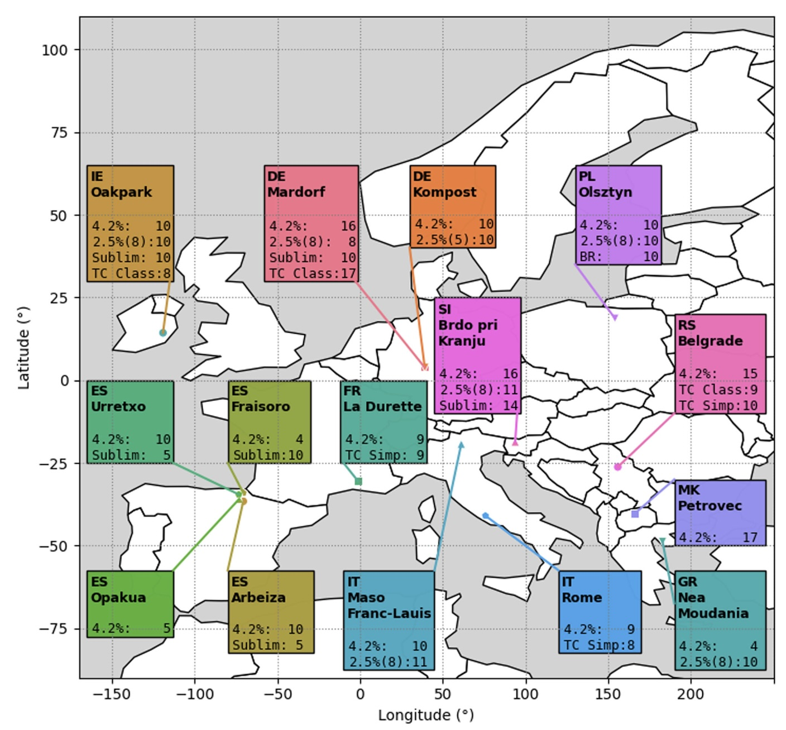
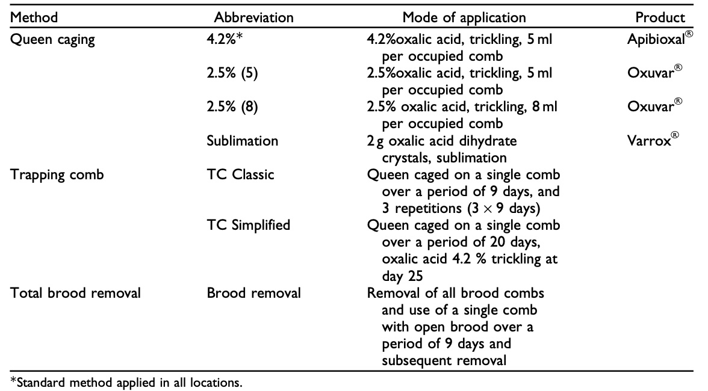
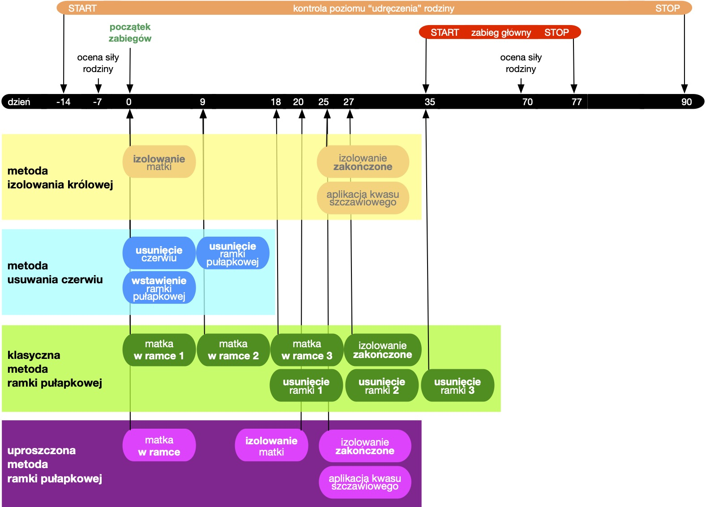
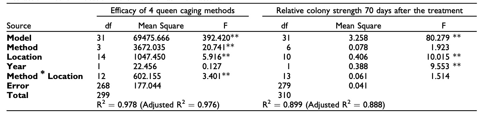
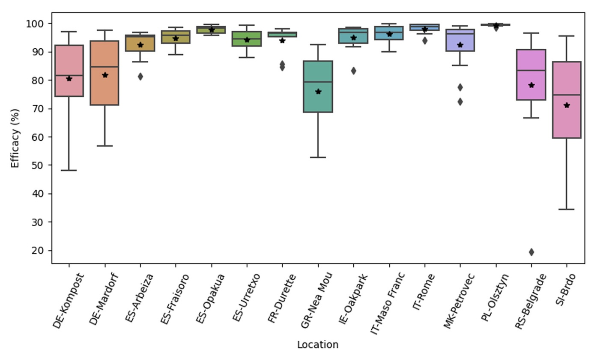
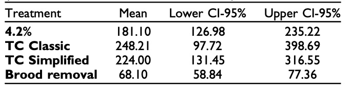
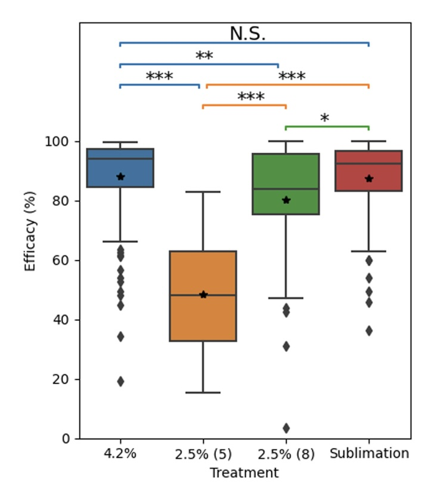
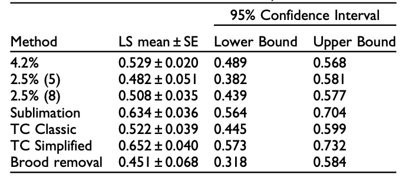
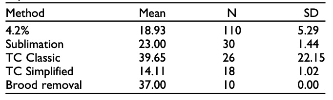

# Przerwanie czerwiu letniego jako zintegrowana strategia zarządzania dla skutecznej kontroli Varroa w Europie

To cite this article: Ralph Büchler , Aleksandar Uzunov , Marin Kovačić , Janez Prešern , Marco Pietropaoli , Fani Hatjina , Borce Pavlov , Leonidas Charistos , Giovanni Formato , Egoitz Galarza , Draiusz Gerula , Ales Gregorc , Valeria Malagnini , Marina Meixner , Nebojša Nedić , Zlatko Puškadija , Jorge Rivera-Gomis , Mira Rogelj Jenko , Maja Ivana Smodiš Škerl , Julien Vallon , Denis Vojt , Jerzy Wilde & Antonio Nanetti (2020) Summer brood interruption as integrated management strategy for effective Varroa control in Europe, Journal of Apicultural Research, 59:5, 764-773, DOI: 10.1080/00218839.2020.1793278
To link to this article: https://doi.org/10.1080/00218839.2020.1793278

> [!NOTE]
> Tłumaczenie AI tekstu: <https://www.researchgate.net/publication/343181331_Summer_brood_interruption_as_integrated_management_strategy_for_effective_Varroa_control_in_Europe> Dodałem podział na akapity oraz podtytuły, aby ułatwić czytanie i linkowanie do akapitów.

Większość strat rodzin pszczelich spowodowanych przez Varroa występuje jesienią lub zimą w wyniku podwyższonego poziomu infestacji Varroa i niewystarczającego stanu zdrowia dorosłych pszczół. Nawet przy początkowo niskiej infestacji Varroa wczesną wiosną, krytyczne poziomy infestacji roztoczy i wirusów mogą zostać osiągnięte przed zimą, jeśli rodziny pszczele nieprzerwanie wychowują czerw przez cały sezon. Aby przezwyciężyć to wyzwanie, pszczelarze mogą sztucznie przerwać produkcję czerwiu za pomocą odpowiednich procedur zarządzania, w zależności od rodzaju prowadzonej działalności pszczelarskiej. Aby ocenić ich skuteczność, związane z nimi obciążenie pracą i wpływ na rozwój kolonii, różne metody przerywania czerwiu (izolowanie matki z kombinacją z zabiegiem kwasem szczawiowym, całkowite usuwanie czerwiu, technika pułapki plastra) były testowane w ciągu dwóch sezonów w 11 lokalizacjach na 370 rodzinach w 10 krajach europejskich. Opracowano protokół mający na celu standaryzację stosowania tych metod w różnych warunkach środowiskowych. Skuteczność izolowania matki zależała od sposobu aplikacji kwasu szczawiowego i wahała się od 48,16% do 89,57% usunięcia roztoczy. Najwyższą skuteczność uzyskano przy zastosowaniu metody podawania 4,2% roztworu (89,57%) oraz sublimacji 2 g kwasu szczawiowego (średnio 88,25%) w okresie bez czerwiu. Skuteczność czysto biotechnicznych, pozbawionych chemikaliów metod pułapek plastrów i usuwania czerwiu nie różniła się znacząco od grup z izolowaniem matek. Wnioskujemy, że właściwe zastosowanie jednej z opisanych metod przerwania czerwiu może znacząco przyczynić się do skutecznej kontroli Varroa oraz do produkcji produktów pszczelich spełniających najwyższe standardy jakości i bezpieczeństwa żywności.

*Słowa kluczowe*: roztocz Varroa; kontrola biotechniczna; przerwanie czerwiu; straty rodzin.

## Wstęp

Roczne straty rodzin pszczelich w Europie wynoszą około 10–30% całkowitej populacji pszczół miodnych (Apis mellifera) i są powszechnie obserwowane w wielu krajach europejskich (Brodschneider i in., 2016; 2019; Chauzat i in., 2014). Większość strat ma miejsce w sezonie zimowym i jest ściśle związana z wysokim poziomem infestacji Varroa destructor w ulach w okresie wychowu pszczół zimowych jesienią poprzedniego roku (Hatjina i in., 2014; Meixner i in., 2014). Można to wyjaśnić negatywnym wpływem pasożytnictwa Varroa na rozwój ciał tłuszczowych i zawartość witellogeniny u pszczół zimowych (Amdam i in., 2004; Ramsey i in., 2019), co bezpośrednio wpływa na ich oczekiwaną długość życia. Strome zwiększenie śmiertelności zimowej zaobserwowano w rodzinach z krytycznymi poziomami infestacji (Genersch i in., 2010), spowodowanymi pięcioma do sześciu miesiącami ciągłego wychowu czerwiu (Martin, 2002).

W warunkach naturalnych sezonowe przerwanie czerwiu zwykle następuje w wyniku procesu rójki, co prowadzi do obniżenia poziomu Varroa w rodzinach zimujących (Fries i in., 2003; Ratti i in., 2016; Szabo, 2008), nawet bez stosowania środków chemicznych. Jednak we współczesnym pszczelarstwie naturalne rójki są zazwyczaj zapobiegane, aby utrzymać rodziny pszczele jak najsilniejsze przez cały sezon i zmaksymalizować zbiory miodu.

Aby uniknąć poważnych szkód w rodzinach pszczelich z powodu nadmiernego poziomu infestacji Varroa, wielu pszczelarzy musi leczyć swoje rodziny w okresie letnim, przerywając zbiór miodu (Martel i in., 2007; Wallner, 1999) w celu zachowania czasu karencji, ponieważ większość zarejestrowanych środków terapeutycznych może skutkować pozostałościami w produktach ulowych. Ponadto po intensywnych zabiegach akarycydowych obserwowano nawracające problemy z odpornością (Milani, 1999; Mozes-Koch i in., 2000; Sammataro i in., 2005; Thompson i in., 2002). Wreszcie, większość zarejestrowanych leków nie wpływa na roztocza Varroa znajdujące się w komórkach czerwiu, a ich skuteczność nie jest wystarczająca w rodzinach, które wychowywały czerw przez cały sezon (Gregorc i in., 2016).

**Rysunek 1. Mapa uczestniczących pasiek.** Wszystkie metody stosowane w pasiekach są przedstawione razem z liczbą rodzin pszczelich przypadającą na każdą metodę. 4,2%: izolowanie matki z zakrapianiem 5 ml 4,2% kwasu szczawiowego; 2,5% (5): izolowanie matki z zakrapianiem 5 ml 2,5% kwasu szczawiowego; 2,5% (8): izolowanie matki z zakrapianiem 8 ml 2,5% kwasu szczawiowego; Sublim: sublimacja 2 g kwasu szczawiowego; TC (Class/Simp): pułapkowanie czerwiu (klasyczne/uproszczone); BR: usuwanie czerwiu. 4,2% było stosowane jako standardowe leczenie we wszystkich pasiekach.

Roztocza Varroa infestujące czerw mogą być zwalczane tylko za pomocą środków parujących, takich jak kwas mrówkowy (Fries, 1991; Rosenkranz i in., 2010). Jednak szybkość parowania zależy od temperatury i wilgotności wewnątrz i na zewnątrz ula, co wpływa na skuteczność leczenia (Calderone, 1999; Underwood & Currie, 2003). W niesprzyjających warunkach środowiskowych pszczelarze ryzykują albo zaszkodzeniem swoim pszczołom (Bolli i in., 1993; Satta i in., 2005), albo uzyskaniem niewystarczającej skuteczności w zwalczaniu roztoczy (Calderone, 1999; Eguaras i in., 2003).

**Tabela 1. Przegląd testowanych metod.**

Niezawodne i skuteczne leczenie można łatwiej osiągnąć w rodzinach bez czerwiu. W związku z tym wymuszone przerwanie czerwiu może być przydatnym narzędziem do poprawy skuteczności leczenia i ograniczenia okresów ciągłego wzrostu populacji roztoczy. Co więcej, jeśli pszczelarze chcą całkowicie unikać stosowania chemikaliów lub muszą leczyć pszczoły w długich sezonach pożytków, mogą połączyć kontrolowane przerwanie czerwiu z użyciem pułapek plastra (Maul i in., 1988). Aby to zrobić, pozostawia się trochę otwartego czerwiu w rodzinach pozbawionych czerwiu, co przyciąga większość roztoczy obecnych na dorosłych pszczołach. Czerw można następnie usunąć z ula razem z uwięzionymi roztoczami.

W tym szeroko zakrojonym badaniu porównaliśmy efekt różnych metod kontrolowanego przerywania czerwiu w połączeniu z kontrolą roztoczy za pomocą środków chemicznych lub wyłącznie biotechnicznych pod względem ich skuteczności, wpływu na rozwój rodziny oraz praktyczności i obciążenia pracą. We wszystkich zaangażowanych pasiekach używano izolowania matki na 25 dni w połączeniu z podaniem 4,2% roztworu kwasu szczawiowego na koniec okresu izolacji jako standardowej metody leczenia (Nanetti i in., 2011). W odniesieniu do różnych rejestracji między krajami izolowanie matki było również łączone z różnymi stężeniami, dawkami i sposobami aplikacji kwasu szczawiowego. Ponadto w niektórych pasiekach testowano użycie klatek na ramki pełnej wielkości, aby ograniczyć produkcję czerwiu do pojedynczych pułapek plastra i całkowitego usuwania czerwiu, co można przeprowadzić bez konieczności wyszukiwania matki i wielokrotnego manipulowania nią.

## Materiały i metody

Badanie przeprowadzono w sezonach 2016–2017 i 2017–2018 w 10 krajach europejskich i 15 lokalizacjach (Rysunek 1), obejmując łącznie 370 rodzin pszczelich reprezentujących różne populacje europejskich pszczół miodnych. Aby uzyskać porównywalne dane, projekt eksperymentalny wymagał, aby każdy uczestnik posiadał pasiekę składającą się z co najmniej 20 naturalnie zainfekowanych rodzin w pełnym rozmiarze oraz utworzenia dwóch lub kilku grup składających się z co najmniej dziesięciu rodzin każda. Dane dotyczące siły rodzin i poziomu infestacji roztoczami u pszczół musiały być mierzone na początku eksperymentu, aby móc rozdzielić rodziny na jednorodne grupy.

**Rysunek 2. Oś czasu eksperymentu.** Przedstawiono cztery główne metody: izolowanie matki (złoty), usuwanie czerwiu (niebieski), klasyczna metoda pułapkowania czerwiu (zielony) i uproszczona metoda pułapkowania czerwiu (fioletowy). Trzecie badanie Liebefelda (nie pokazane) zostało przeprowadzone przed zimą, ale nie ma ustalonego punktu czasowego.

### Metoda bazowa

Skuteczność różnych metod zwalczania Varroa porównano z metodą standardową, polegającą na izolowaniu matki pszczelej i aplikacji 5 ml roztworu kwasu szczawiowego o stężeniu 4,2% na każdą zajętą ramkę (Tabela 1 i Rysunek 2). Opracowano ujednolicony protokół testowy zawierający szczegółowe informacje o metodach i ich stosowaniu, który został opublikowany na stronie internetowej COLOSS (Kopia jest dostępna jako materiał dodatkowy online).

Krótko mówiąc, w tej metodzie matka pszczela była izolowana na 25 dni w specjalnej klatce o wymiarach 5,0 x 7,5 x 2,5 cm (<http://www.apimobru.com/>), która była umieszczona w ramce plastra. W momencie wypuszczenia matki (25. dzień) podano roztwór kwasu szczawiowego (Tabela 1).

### Metoda ramek pułapkowych (TC)

Metoda ramek pułapkowych (TC) została zastosowana na dwa różne sposoby: w wersji klasycznej i uproszczonej. W wersji klasycznej TC matka pszczela była zamykana na pustej ramce w celu wyprodukowania ograniczonej liczby otwartych komórek czerwiu. Po 9 dniach matka była przenoszona na pustą ramkę, a pierwsza ramka pozostawała w komorze czerwiowej jako ramka pułapkowa na roztocza. W 18. dniu pierwotna ramka pułapkowa, która była już zasklepiona, została usunięta z ula, a druga ramka pułapkowa pozostawała na swoim miejscu, podczas gdy matka była zamykana na trzeciej ramce. Matka została ostatecznie wypuszczona w dniu 27, kiedy druga ramka pułapkowa została usunięta z ula. Trzecia ramka pułapkowa pozostawała w gnieździe czerwiowym do dnia 35, kiedy to została usunięta. **W tej grupie nie stosowano żadnego chemicznego leczenia przeciw Varroa.**

### Uproszczona metoda ramek pułapkowych

W przypadku uproszczonej metody ramek pułapkowych, matka również była zamykana na jednej ramce, ale pozostawała tam przez 20 dni. Po tym czasie ramka pełna zasklepionego czerwiu była usuwana, a matka była przenoszona do klatki, jak w eksperymentach z izolacją matek, aby zapobiec składaniu jaj w gnieździe czerwiowym. W dniu 25, po wygryzieniu się całego czerwiu trutowego, matka była wypuszczana, a 5 ml roztworu kwasu szczawiowego o stężeniu 4,2% na zajętą ramkę było stosowane jak w grupie leczenia standardowego.

### Całkowite usuwanie czerwiu

W przypadku metody całkowitego usuwania czerwiu wszystkie ramki z czerwiem były usuwane w dniu 0, z wyjątkiem jednej ramki z otwartym czerwiem, która pozostała jako ramka pułapkowa na Varroa. Została ona usunięta w dniu 9, gdy cały czerw był już zasklepiony. Podobnie jak w klasycznej metodzie ramek pułapkowych, **w tej grupie nie stosowano żadnego chemicznego leczenia przeciw Varroa**.

### Pomiary

Aby zbadać liczbę przeżywających roztoczy, wszystkie rodziny pszczele otrzymały leczenie przy użyciu pasków Apistan®, Apivar®, Apitraz®, Bayvarol® lub CheckMite® w 35. dniu od rozpoczęcia leczenia, na okres 42 dni (leczenie krytyczne), zgodnie z instrukcjami na etykiecie. Opad roztoczy na lepkie podkładki dolne, aby uniknąć usuwania lub rozpraszania roztoczy przez innych drapieżników, był regularnie liczony od początku leczenia (dzień 0) do 14 dni po zakończeniu leczenia krytycznego (dzień 90) (Calderone, 1999). Dane te były używane do obliczania skuteczności protokołów izolacji matek (kumulacyjny opad roztoczy przed leczeniem krytycznym w stosunku do całkowitego opadu roztoczy do 14 dni po jego zakończeniu) oraz leczenia z użyciem ramek pułapkowych. Testowane leczenia i leczenia krytyczne musiały być zsynchronizowane między wszystkimi grupami w tej samej pasiece. Data rozpoczęcia w każdej lokalizacji była ustalana w zależności od zbioru miodu, który musiał być zakończony przed leczeniem kwasem szczawiowym w 25. dniu.

Przeżywalność matek i rodzin pszczelich była monitorowana do następnej wiosny. Aby sprawdzić wpływ na rozwój rodzin, liczba dorosłych pszczół miodnych była szacowana zgodnie z metodą Liebefelda (Imdorf et al., 1987, 2019) przed leczeniem i 70 dni po leczeniu. Stosunek liczby pszczół w 70. dniu do liczby pszczół przed leczeniem był używany do oceny podatności pszczół oraz wpływu różnych metod leczenia na rozwój rodzin.

Na koniec, aby porównać obciążenie pracą związane z różnymi metodami, mierzono czas pracy potrzebny na każdą rodzinę pszczelą w celu wykonania wszystkich czynności związanych z każdym leczeniem.

Zorganizowano kilka warsztatów i szkoleń terenowych, aby ujednolicić i zharmonizować metodologię wśród zespołów badawczych zaangażowanych w projekt.

Dane były analizowane za pomocą modelu ANOVA SPSS-GLM, uwzględniając lokalizację (pasiekę), sezon (rok) oraz leczenie jako czynniki stałe. Średnie skorygowane były używane do porównania skuteczności różnych leczeń przy użyciu testu post-hoc Bonferroniego. W porównaniu wskaźników infestacji po leczeniu, dane dotyczące opadu roztoczy były logarytmowane, aby osiągnąć normalność, a ANOVA jednoczynnikowa była używana do określenia różnic między metodami. Wykresy były tworzone w Pythonie 3 z użyciem pakietów Seaborn i Matplotlib, a mapa została stworzona przy użyciu pakietu Geopandas.

**Tabela 2. Analiza GLM skuteczności i względnej siły rodzin pszczelich 70 dni po leczeniu.** Metoda, lokalizacja i rok oraz interakcja między metodą a lokalizacją były modelowane jako czynniki stałe.

## Rezultaty

Skuteczność leczenia kwasem szczawiowym po zamknięciu matki była istotnie zależna (p < 0,01) od zastosowanej metody, lokalizacji oraz interakcji metoda x lokalizacja, ale nie od roku (Tabela 2).

### Metoda bazowa

Średnia skorygowana skuteczność standardowej metody z użyciem kwasu szczawiowego o stężeniu 4,2% wynosiła 89,57 ± 1,24% (średnia ± SE) i wahała się od 99,84 ± 4,41% do 70,94 ± 3,34%. W 10 z 15 lokalizacji odnotowano skuteczność wyższą niż 90% (Rysunek 3).

### Sublimacja

Skuteczność metody sublimacji była podobna, ze skorygowaną średnią wartością 88,25 ± 1,79 i zakresem od 98,78 ± 4,21% do 72,37 ± 3,58%.

> [!NOTE]
> Skorygowana średnia skuteczność dla metody z kwasem szczawiowym o stężeniu 2,5% (8 ml) wynosiła 80,60 ± 2,16%, z najwyższą skutecznością 98,29 ± 4,41 i najniższą 67,63 ± 4,88.

### Kwas szczawiowy 2.5%

Zastosowanie metody z kwasem szczawiowym o stężeniu 2,5% (5 ml) wykazało najniższą skuteczność (48,16 ± 3,25%) z zakresem od 39,74 ± 4,41 do 56,58 ± 4,41.

> [!NOTE]
> Najwyższą skuteczność uzyskano przy użyciu metod 4,2% (5 ml) i sublimacji, które były znacznie bardziej efektywne niż stosowanie niższych stężeń kwasu szczawiowego (Rysunek 4).

### Pułapki

Skuteczność metod TC Classic, TC Simplified i usuwania czerwiu została porównana ze standardowym leczeniem 4,2% na podstawie poziomów infestacji po leczeniu.

> [!NOTE]
> Największy spadek roztoczy po leczeniu krytycznym zaobserwowano przy metodzie TC Classic, a najmniejszy przy metodzie usuwania czerwiu (Tabela 3), jednak te różnice nie były istotne (F (3, 221) = 0,916, p = 0,434).

### Utrzymanie siły rodziny

Skorygowana średnia względnej siły kolonii 70 dni po leczeniu wynosiła 0,544 ± 0,016, co oznacza, że 54,4 ± 1,6% pszczół było obecnych w koloniach 70 dni po rozpoczęciu eksperymentu. Siła kolonii była istotnie zależna od lokalizacji i roku, ale nie od różnych metod leczenia (Tabela 2). W tendencji, najniższa względna siła kolonii została zanotowana dla metody 2,5% (5 ml), a najwyższa dla TC Simplified i sublimacji (Tabela 4).

> [!NOTE]
> Nie zaobserwowano strat kolonii z powodu osłabienia związanego z leczeniem lub infestacją roztoczy podczas następnego okresu zimowego.

### Pracochłonność

Podczas naszego eksperymentu największy nakład pracy był potrzebny do wykonania metod TC Classic i usuwania czerwiu, podczas gdy zamykanie matki z metodą aplikacji i sublimacji było najmniej pracochłonne (Tabela 5).

## Dyskusja

Opracowano kilka technik biotechnicznych, które mają na celu systematyczne przerywanie cyklu rozrodczego roztoczy lub usuwanie znacznej liczby roztoczy bez swarzenia. 

Opracowano kilka technik biotechnicznych, które systematycznie przerywają cykl rozrodczy roztoczy lub usuwają znaczną liczbę roztoczy bez potrzeby swarzenia. Pierwszą z tych metod, która została opublikowana, była metoda „plastra pułapki" (Maul et al., 1988), w której matka pszczoły jest sekwencyjnie izolowana na 3-4 plastrach przez około 28 dni, które są usuwane wraz z zainwadowanymi roztoczami po zapieczętowaniu czerwiu. Aby uprościć procedurę, niektórzy pszczelarze zmniejszają liczbę pułapek lub umieszczają matkę w małych klatkach bez plastrów. Aby osiągnąć tymczasowe przerwanie czerwiu, metody te są obecnie szeroko stosowane przez małych i dużych pszczelarzy w kilku krajach, takich jak Włochy (Allais et al., 2010; Pietropaoli et al., 2010) i Niemcy (Büchler & Uzunov, 2016). Chociaż klasyczna technika pułapki na czerwiec może być stosowana do kontrolowania infestacji roztoczy Varroa bez użycia jakichkolwiek leków, uproszczone środki techniczne są zazwyczaj łączone z pojedynczą aplikacją kwasu szczawiowego (Nanetti et al., 2011) lub tymolu (Giacomelli et al., 2016), które są znane jako bardzo skuteczne leczenie przeciwko roztoczom Varroa w koloniach bez czerwiu (Nanetti et al., 2003; 2011). Ponadto, stosowanie środków przeciwko Varroa w połączeniu z techniką tymczasowego przerwania czerwiu pozwala uniknąć negatywnych skutków leczenia na czerwiu. Techniki te mogą pomóc pszczelarzom uniknąć użycia syntetycznych leków, co jest szczególnie istotne dla producentów ekologicznych.

> [!NOTE]
> W UE ogólnie zachęca się do stosowania kwasów organicznych, ponieważ nie pozostawiają one istotnych pozostałości wpływających na jakość produktów pszczelarskich, ani w sposób sensoryczny, ani ilościowy (Bogdanov et al., 2002; Parlament Europejski, 2018; Moosbeckhofer et al., 2003).

**Rysunek 3. Skuteczność izolowania matki i podawania 4,2% kwasu szczawiowego w różnych lokalizacjach w latach 2016 i 2017.** Skróty pasiek znajdują się na Rysunku 1. Pozioma linia w polu przedstawia medianę. Pole (box) pokazuje pierwszy i trzeci kwartyl. Wąsy (whiskers) rozciągają się do 1,5-krotności rozstępu międzykwartylowego (IQR). Diamenty oznaczają wartości odstające, które znajdują się poza 1,5-krotnością IQR. Dodatkowo gwiazdki oznaczają wartości średnie.

**Tabela 3. Średni opad roztoczy na rodzinę po krytycznym leczeniu (wartości średnie z 95% przedziałem ufności).**

W naszym badaniu uwzględniono trzy znane metody przerwania czerwiu i przetestowano je po raz pierwszy na szerokim zakresie geograficznym w całej Europie, aby je porównać i zrozumieć najlepszą opcję do zasugerowania pszczelarzom.

Wyniki osiągnięte w naszym badaniu potwierdzają ich duży potencjał w zakresie skutecznej i terminowej kontroli infestacji roztoczy.

Nalewanie 5 ml roztworu kwasu szczawiowego o stężeniu 4,2% (Apibioxal VR) na zajętą ramkę, stosowane jako standardowe leczenie we wszystkich badawczych pasiekach, było bardzo skuteczne i niezawodne w większości pasiek. Efekt niższych stężeń kwasu szczawiowego okazał się mniej efektywny. Zgodne z ustaleniami Gregorc et al. (2016), którzy osiągnęli tylko 24% śmiertelności roztoczy poprzez nalewanie roztworu kwasu szczawiowego o stężeniu 2,9% na rodziny bez czerwiu. Nie stwierdzono statystycznej różnicy w skuteczności między nalewaniem 5 ml roztworu kwasu szczawiowego o stężeniu 4,2% (89,57±1,24%) a sublimacją 2 g kwasu szczawiowego w postaci kryształków (88,25±1,79%). Podobne wyniki osiągnięto w innych badaniach podczas zimy (Coffey & Breen, 2016). Ostatecznie skuteczność metod pułapki na ramki (TC Classic i TC Simplified) oraz całkowitego usuwania czerwiu (Brood removal), mierzone opadem roztoczy po krytycznym leczeniu, była porównywalna ze standardowym leczeniem 4,2%.

**Rysunek 4. Skuteczność różnych metod izolowania matki (zobacz Rysunek 1 dla skrótów).** Znaczące różnice między metodami, ustalone na podstawie testu post-hoc Bonferroniego, są oznaczone. Pozioma linia w polu przedstawia medianę. Pole (box) pokazuje pierwszy i trzeci kwartyl. Wąsy (whiskers) rozciągają się do 1,5-krotności rozstępu międzykwartylowego (IQR). Diamenty oznaczają wartości odstające, które znajdują się poza 1,5-krotnością IQR. Dodatkowo gwiazdki oznaczają wartości średnie.

**Tabela 4. Względna siła rodziny pszczelej 70 dni po leczeniu jako procent pszczół, które pozostały w rodzinie (skorygowane wartości średnie ± błąd standardowy, 95% przedziały ufności).**

**Tabela 5. Średnie obciążenie pracą w minutach na rodzinę pszczelą przy wdrażaniu różnych metod.**

Podczas gdy silna redukcja infestacji roztoczy w grupach TC Classic i Brood removal została osiągnięta bez użycia jakichkolwiek leków, spekulujemy, że połączenie z kwasem szczawiowym może nawet poprawić ich skuteczność.

Choć pszczelarze mogą martwić się o negatywne skutki długotrwałego umieszczania matki w klatce, nie stwierdzono zwiększonej śmiertelności matek z powodu leczenia w klatce podczas dwóch sezonów eksperymentu. Jednak nawet gdyby takie straty wystąpiły, mogłyby zostać łatwo naprawione wiosną i latem przez wprowadzenie nowej matki, podczas gdy straty matek w późnym lecie, jesieni lub zimą często prowadzą do utraty rodziny. Prawie wszystkie matki przeżyły okres umieszczania w klatce w dobrym stanie (dane nie przedstawione) i wznowiły normalne składanie jaj zaraz po uwolnieniu, podobnie jak wcześniej zgłosili Rivera-Gomis et al. (2017). 

Rozwój rodzin eksperymentalnych zazwyczaj spełniał lokalne oczekiwania, z pewnymi istotnymi efektami środowiskowymi w zależności od lokalizacji pasieki i sezonu. Gregorc et al. (2017) nie znaleźli istotnego wzrostu śmiertelności pszczół po nalewaniu roztworów kwasu szczawiowego o stężeniu 3,0 – 3,7% w porównaniu do pszczół kontrolnych nieleczonych w warunkach laboratoryjnych. Jednak zauważyliśmy niewielką tendencję do lepszej tolerancji pszczół na stosowanie kwasu szczawiowego poprzez sublimację niż przez nalewanie (również zgłoszoną przez Al Toufailia et al., 2015), ale ostatecznie nie było istotnych różnic między żadnymi z metod leczenia (patrz Tabela 4).

> [!NOTE]
> Co ciekawe, nawet całkowite usunięcie czerwiu nie spowodowało trwałego osłabienia rodzin, co zostało dobrze skompensowane, zgodnie z oczekiwaniami pszczelarzy, w ciągu około dwóch miesięcy po leczeniu.

Optymalizacja momentu stosowania techniki umieszczania matki w klatce w ciągu roku została opisana przez Lodesani et al. (2019). Zarządzanie roztoczami Varroa przy użyciu techniki umieszczania matki w klatce wczesną porą (późna zima/wczesna wiosna) mogło zmniejszyć poziom infestacji bez wywoływania negatywnych konsekwencji dla zbiorów miodu czy sezonowego rozwoju i wydajności rodziny pszczelej. 

Ponadto, umieszczanie matki w klatce może być stosowane jako technika kontrolowania rozwoju rodziny w ciągu roku, z różnych powodów, takich jak regulacja rozwoju rodziny w zależności od przepływu nektaru czy kontrolowanie swarzenia (Forster, 1969; Simpson, 1958). Mimo że taka praktyka może wydawać się na pierwszy rzut oka nieintuicyjna, pokazano, że proste praktyki przerywania czerwiu, takie jak dzielenie rodziny, mogą zmniejszyć straty zimowe w USA (Haber et al., 2019). Zarządzanie czerwiem (usuwanie/redistribucja) jest zatem kluczowym aspektem prawidłowego zarządzania rodziną, ponieważ jest związane z dynamiką populacji Varroa.

Terminowe umieszczanie matki w klatce, uwzględniające kwitnienie głównego przepływu nektaru latem, mogłoby uwolnić część siły roboczej pszczół od zajmowania się czerwiem, pozwalając im zająć się zbieraniem nektaru. Niestety, w naszym badaniu nie udało się zmierzyć wpływu testowanych technik na wydajność miodu. Pozytywny wpływ usuwania czerwiu podczas głównego przepływu na zbiory miodu w ciągu następnych 14 dni odnotowano w Niemczech (Büchler & Uzunov, 2016), jednak mogą występować różnice regionalne i sezonowe, które należy wziąć pod uwagę. Dlatego konieczne są dodatkowe badania w celu lepszego zrozumienia wpływu umieszczania matki w klatce i obecności feromonów czerwiu na produkcję miodu oraz optymalizacji momentu przerwania czerwiu w lokalnych warunkach.

> [!NOTE]
> Jednym z głównych czynników ograniczających szerokie przyjęcie tych metod może być czas potrzebny na zlokalizowanie matki i indywidualny poziom doświadczenia wymagany do obsługi matki. 

W naszym badaniu, z heterogeniczną grupą badaczy o różnych poziomach doświadczenia w pszczelarstwie i w zmiennych warunkach pszczelarskich, realistyczne średnie oszacowanie czasu roboczego potrzebnego do zastosowania metody 4,2% wynosi mniej niż 20 minut. Jednak pszczelarze, którzy chcą uniknąć poszukiwania matki, mogą zdecydować się na zastosowanie techniki całkowitego usuwania czerwiu, choć jest ona bardziej czasochłonna.

Istnieją pewne techniczne wyzwania związane z metodami przerywania czerwiu. Jednym z aspektów jest ryzyko rabunków, szczególnie w czasie braku nektaru. Szczególnie całkowite usuwanie czerwiu, które wymaga przenoszenia wielu ramek między ulami, niesie ze sobą ryzyko przyciągania poszukiwaczy z sąsiednich rodzin. Jako odpowiednie środki ostrożności należy utrzymywać liczbę rodzin pszczelich w pasiece na możliwie najniższym poziomie, a manipulacje w ulu powinny być przeprowadzane w okresach bez intensywnego lotu pszczół (np. wczesnym rankiem, pod koniec dnia lub podczas deszczowych dni). Kolejnym aspektem jest dalsze wykorzystanie ramek z czerwiem usuniętych podczas metod całkowitego usuwania czerwiu i pułapek na roztocza. Mogą być one przechowywane w rodzinach zbierających czerwień lub, jako mniej czasochłonna opcja, mogą być po prostu przetopione w celu zbioru wosku. Aby uniknąć rabunków, rodziny zbierające czerwień powinny być umieszczane w osobnej pasiece, poza zasięgiem lotu rodzin dawców. Gdy wszystkie pszczoły się wyklują, rodziny zbierające czerwień mogą być traktowane środkami chemicznymi w zwykły sposób. Ogólnie rzecz biorąc, jedną rodzinę z dwóch do trzech rodzin dawców można w ten sposób łatwo odbudować.

Wybór najodpowiedniejszej metody zależy od indywidualnych umiejętności, wielkości pasieki, dostępnego czasu pracy na ul oraz specyficznych celów produkcyjnych pszczelarza. 

Całkowite usuwanie czerwiu jest prawdopodobnie metodą preferowaną przez pszczelarzy, którzy chcą uniknąć poszukiwania matki lub chcą połączyć leczenie z budowaniem dodatkowych rodzin. Całkowite usuwanie czerwiu połączone z użyciem pułapki na roztocza oraz klasyczna technika pułapki na roztocza jest szczególnie interesujące dla producentów ekologicznych, którzy dążą do minimalizacji użycia leków. 

Z drugiej strony, operacje na dużą skalę mogą preferować uproszczoną metodę pułapki na roztocza lub technikę umieszczania matki w klatce w połączeniu z zastosowaniem kwasu oksalowego, ponieważ te metody są mniej czasochłonne. 

> [!NOTE]
> Biorąc pod uwagę podobną skuteczność metody kroplowej i sublimacji, wybór metody aplikacji kwasu oksalowego zależy głównie od krajowego statusu rejestracji prawnej, doświadczenia pszczelarza i kosztów leczenia na ul.

Poza krótkoterminowym potencjałem testowanych sezonowych metod przerywania czerwiu w celu redukcji strat zimowych rodzin, mogą one dodatkowo przyczynić się do długoterminowego rozwiązania problemu Varroa. Konsekwentne stosowanie sezonowego przerywania czerwiu i kontroli roztoczy ma duży potencjał do zrezygnowania z potrzeby leczenia zimowego. Jest to wspierane przez długoletnie doświadczenia w zarządzaniu rodzinami trutowymi bez leczenia zimowego w kilku stacjach unasienniania niemieckiego stowarzyszenia hodowców „Arbeitsgemeinschaft Toleranzzucht” (Büchler et al., 2010) oraz przez wyniki badań Seeley i Smith (2015), którzy zidentyfikowali niskie dryfowanie (DeGrandi-Hoffman et al., 2016; Nolan & Delaplane, 2017) i redukcję infestacji roztoczy podczas procesu naturalnego swarzenia jako warunki wstępne dla udanego przezimowania rodzin bez leczenia.

Infestacja Varroa podczas etapu poczwarki jest znana z tego, że obniża rozwój plemników, zdolności lotu i długość życia trutni (Bubalo et al., 2005; Duay et al., 2003). Różnice w infestacji roztoczy wpływają na kondycję trutni, co skutkuje wyższą reprodukcją mniej podatnych rodzin (Büchler et al., 2006). Uważamy, że jest to główny powód, dla którego dobór naturalny w populacjach nieleczonych faworyzuje kolonie odporne na roztocza, co widać po szybkim rozwoju odporności na roztocza w kilku nieleczonych, naturalnych populacjach pszczół miodnych na całym świecie (Locke, 2016). 

W przeciwieństwie do tego, regularne leczenie zimowe może zniweczyć ten efekt doboru naturalnego i zamiast tego wspierać reprodukcję najbardziej intensywnie leczonych rodzin. Ogólne przejście z leczenia terapeutycznego zimą na kontrolę roztoczy opartą na przerywaniu czerwiu latem może zatem przyczynić się do szerszego wprowadzenia lokalnie przystosowanych, odpornych rodzin oraz zrównoważonej kontroli Varroa.

etc.
