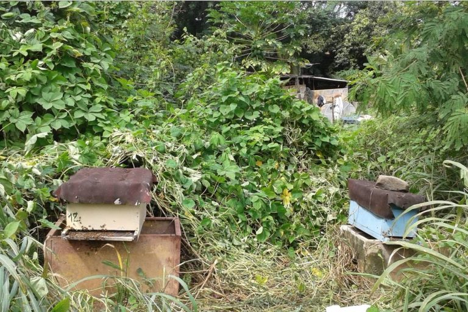
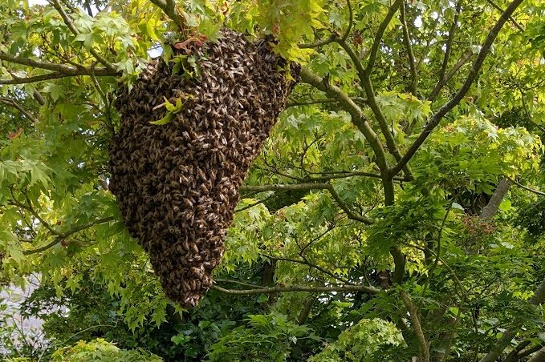
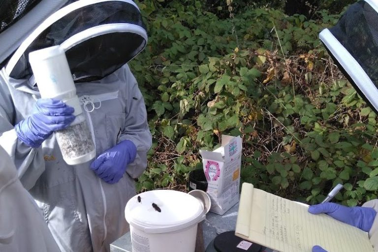

= Zmień się w hodowcę pszczół odpornych na warrozę

Autor: www.varroaresistant.uk
Zródło: https://www.varroaresistant.uk/advice/
Tłumaczenie: R.Styczynski z pomocą ChatGPT
 

Uwaga: Porady mogą ulegać zmianie, ale poniższe wskazówki opierają się na najnowszych wynikach badań naukowych i doświadczeniach pszczelarzy.

== Historia odporności na warrozę

Odporność na warrozę poza Azją po raz pierwszy pojawiła się u pszczół afrykanizowanych (Africanised Honeybees, AHB) w Brazylii. Początkowo uważano, że jest to związane z mniej zjadliwym typem Varroa, jednak później tę teorię obalono. AHB szybko rozprzestrzeniły się na północ przez Ameryki, docierając do Stanów Zjednoczonych. Badania przeprowadzone w Meksyku i Brazylii w latach 90. wykazały wysoki poziom niepłodności roztoczy w koloniach AHB, choć przyczyna tego zjawiska była nieznana. Inne sugerowane mechanizmy odporności, takie jak „grooming” (czyszczenie), zyskały popularność, ale cierpiały z powodu wad w projektach badań. Pomijano również fakt, że Varroa stosuje chemiczne naśladownictwo zapachu pszczół.

W koloniach Rona Hoskinsa sugerowano, że wirus zdeformowanych skrzydeł typu B (DWV-B) powoduje odporność przez mechanizm „superinfekcyjnego wykluczenia”, ale i ta teoria została obalona, ponieważ szeroko zakrojone badania wykazały obecność DWV-B w większości kolonii w Wielkiej Brytanii. Hodowcy pszczół próbowali selekcjonować pszczoły odporne na warrozę, ale większość prób zakończyła się niepowodzeniem, ponieważ mechanizm odporności wciąż pozostawał nieznany. Niektórzy hodowcy stosowali test nakłuwania szpilką lub test zamrażania czerwia, aby sprawdzić, które kolonie usuwają martwy czerw. Głównym błędem w tym podejściu było to, że Varroa nie zabija czerwia, więc chemiczne sygnały od martwego i żywego zainfekowanego czerwia są różne. Hodowcy wybierali pszczoły wykrywające martwy czerw, a nie roztocza Varroa.

W okresie poprzedzającym odkrycie związku między ponownym zasklepianiem komórek a odpornością w 2018 roku zaczęto badać populacje odpornych pszczół. W RPA i na Kubie decyzje o zaprzestaniu leczenia spowodowały pojawienie się odpornych populacji w ciągu 5–8 lat. W lesie Arnot w stanie Nowy Jork Tom Seeley monitorował powrót odpornych dzikich pszczół miodnych, a we Francji badano dwie inne populacje odporne. W Wielkiej Brytanii i innych krajach niewielka liczba pszczelarzy zarządzała swoimi koloniami bez leczenia, w tym Hudsonowie z północnej Walii oraz Ron Hoskins z grupy Swindon Honey Bee Conservation.

Po przełomowym badaniu z 2018 roku możemy teraz wyjaśnić, jak trzy cechy związane z odpornością są powiązane oraz jak tłumaczą odporność we wszystkich wspomnianych przypadkach. Liczba pszczelarzy w Wielkiej Brytanii, którzy nie stosują leczenia od ponad 6 lat, nadal rośnie. Jeśli chcesz do nich dołączyć i uniezależnić się od leczenia chemicznego, czytaj dalej.

== 1. Nie leczyć i pozwolić pszczołom samodzielnie rozwiązać problem

To podejście może działać bardzo dobrze na dużą skalę, jak to miało miejsce na Kubie i w RPA, ale w Wielkiej Brytanii charakteryzuje się wysokim wskaźnikiem niepowodzeń, szczególnie w przypadku małej liczby uli. Istnieją w Wielkiej Brytanii przypadki, gdzie to podejście zadziałało – na przykład kolonie, które zostały opuszczone z powodu choroby pszczelarza lub innych przyczyn, a następnie odkryte jako wciąż żywe po kilku latach. Nie zawsze jednak można mieć pewność, czy jest to ta sama kolonia, czy też nowy rój, który osiedlił się w ulu.

Ron Hoskins ze Swindon Honeybee Conservation Group jest jedyną znaną osobą w Wielkiej Brytanii, która odniosła sukces stosując to podejście, mimo początkowych strat w koloniach. Jednak równocześnie dziesiątki, a nawet setki pszczelarzy, którzy zdecydowali się nie stosować leczenia, stracili wszystkie swoje kolonie.

== 2. Zbieranie/kupowanie odpornych pszczół

Zbieranie dzikich rojów odpornych pszczół to doskonały sposób na uzyskanie odpornych kolonii i jest często stosowane. Tak rozpoczęła działalność grupa z północnej Walii, a także wielu pszczelarzy na Hawajach. Kluczem jest dostęp do lokalizacji, gdzie dzikie kolonie przetrwały przez wiele lat. Należy jednak pamiętać, że nie wszystkie kolonie żyjące w drzewach lub budynkach przebywały tam przez długi czas.

Innym sposobem jest zakup rodziny pszczelej, odkładu lub matek od lokalnego pszczelarza, który posiada dobrze ugruntowaną populację odpornych pszczół, czyli takich, które nie były leczone przez 10 lub więcej lat. Chociaż obecnie nikt nie oferuje takiej usługi, mamy nadzieję, że w przyszłości sytuacja się zmieni.

== 3. Stopniowe redukowanie leczenia

Dla pszczelarzy, którzy nie mają dostępu do odpornych dzikich lub zarządzanych kolonii, jest to najlepsza opcja. Jeden z członków naszej grupy (Steve Riley) skutecznie stosuje to podejście. Nie istnieje jednak uniwersalny sposób, który będzie odpowiedni dla każdego pszczelarza.

Obecne podstawowe zalecenie to zmniejszenie intensywności leczenia poprzez:

- Zredukowanie liczby zabiegów o połowę w stosunku do tego, co obecnie stosujesz.
- Przejście na mniej intensywne metody leczenia, np. zastąpienie leczenia kwasem szczawiowym posypywaniem cukrem pudrem, lub zmiana leczenia rocznego na półroczne.

W każdym przypadku ważne jest jednak monitorowanie poziomu roztoczy i podejmowanie działań (leczenie lub usunięcie kolonii) w przypadku wykrycia wysokiego poziomu roztoczy.

== Porady dotyczące realizacji każdej opcji

== 1.	Nie leczyć i pozwolić pszczołom samodzielnie rozwiązać problem

Zalety:
- Łatwe
- Wystarczy czekać
- Naśladuje to, co dzieje się (lub dzieje się obecnie) w naszych dzikich koloniach
- Może się zdarzyć przypadkowo

Wady:
- Musi być stosowane na dużą skalę
- Potencjalnie lata wysokich strat rodzin pszczelich
- Mało prawdopodobne, aby działało w Wielkiej Brytanii
- Całkowicie nieodpowiednie dla jakichkolwiek operacji komercyjnych

Ponieważ ta opcja nie jest realna dla pszczelarzy w Wielkiej Brytanii, nie warto omawiać jej zbyt szczegółowo. Jedyny przypadek, w którym może działać, to sytuacja, gdy pszczelarz posiada kilkadziesiąt kolonii, a część z nich zostaje umieszczona w oddzielnych pasiekach i nie jest leczona. Każdą kolonię, która upadnie, należy usunąć i zastąpić, dzieląc najsilniejsze przetrwałe kolonie. Proces ten trwa do momentu, gdy roczna śmiertelność kolonii zrówna się z tą w koloniach leczonych. Ponieważ ta metoda leży między opcjami 1 i 3, jest omawiana w obu kontekstach.

== 2. Zbieranie lub kupowanie odpornych pszczół

Zalety:
- Brak czasu oczekiwania.
- Darmowe, jeśli zbiera się dziki rój lub otrzymuje się odporne pszczoły lub matkę.

Wady:
- Brak wiarygodnego sposobu na stwierdzenie, czy dzika kolonia jest odporna.
- Obecnie brak dostawców ustabilizowanych odpornych pszczół w Wielkiej Brytanii (oczekuje się, że to się zmieni).
- Koszt, jeśli pszczoły lub matki są kupowane.

Zbieranie odpornych pszczół

Kolonie żyjące na wolności mogą stanowić rezerwuar odpornych na warrozę pszczół, które można wykorzystać w pszczelarstwie.

Jest to dobrze ugruntowana, powszechna i prawdopodobnie najłatwiejsza metoda rozpoczęcia pszczelarstwa z odpornymi pszczołami. Stephen widział na Hawajach pszczelarza, który w ciągu kilku lat zwiększył liczbę uli z 5 do 200, rozmieszczając skrzynki na roje w pobliskich górskich lasach. Największa grupa pszczelarzy w Wielkiej Brytanii, którzy nie stosują leczenia, również zaczęła, gdy Clive i Shan Hudson zbierali roje z otaczającego lasu, a następnie dzielili kolonie i przekazywali je innym członkom lokalnego stowarzyszenia pszczelarskiego. Obecnie około 100 pszczelarzy na półwyspie Llyn w północnej Walii zarządza ponad 500 koloniami bez leczenia warrozy. Innym przykładem jest Joe Ibbertson, który badał i zbierał roje z długoletnich dzikich kolonii.

We wszystkich powyższych przykładach pszczelarze mieli dostęp do lokalnych, dobrze ugruntowanych dzikich kolonii. Wiosną 2010 roku przeprowadzono badanie dzikich kolonii w całej Anglii. Sugerowano, że głównym źródłem dzikich kolonii były zarządzane kolonie, co stanowi problem. W obszarach, gdzie dzikie kolonie przewyższają liczebnie kolonie zarządzane, stają się one odporne poprzez naturalną selekcję, jak miało to miejsce w wielu miejscach. Podobnie w regionach, gdzie zarządzane pszczoły są głównie odporne, dzikie kolonie również będą odporne. Sukces tej metody zależy od lokalizacji. Jedną z opcji jest zebranie dzikiego roju i poszukiwanie oznak odporności. Poziomy roztoczy powinny być monitorowane, a jeśli staną się wysokie, należy podjąć działania w celu zarządzania nimi.

Kupowanie odpornych pszczół

Kupowanie lokalnych pszczół powinno być zawsze preferowaną opcją.

Obecnie w Wielkiej Brytanii można kupić pszczoły uznawane za „odporne”, ale niepotwierdzone przez hodowców. Z dostępnych informacji wynika, że większość hodowców stosuje testy usuwania martwego czerwia lub reklamuje pszczoły selekcjonowane pod kątem VSH. Jak wspomniano wcześniej, testy zamrażania czerwia i nakłuwania nie wybierają pszczół odpornych na warrozę. Sprawdź źródło i dowiedz się, czy oferują wiarygodne dowody na to, że ich kolonie przetrwały co najmniej 6 lat bez leczenia przed zakupem. Uważamy, że to minimalny wymóg, aby można było twierdzić, że pszczoły są odporne. Szacujemy na podstawie ostatnich badań, że około 3 000 pszczelarzy w całej Anglii i Walii zarządza odpornymi koloniami przez 6 lat lub dłużej. Obecnie bardzo niewielu sprzedaje matki lub odkłady lokalnym pszczelarzom, ale mamy nadzieję, że w najbliższej przyszłości to się zmieni.

Jeśli kupisz odporne pszczoły i przeniesiesz je na obszar, gdzie otaczająca populacja pszczół nie jest odporna, musisz monitorować przyszłe pokolenia, aby upewnić się, że radzą sobie z roztoczami. Odporność na warrozę wydaje się być bardzo dziedziczna, ale większość pszczelarzy nie ma kontroli nad lokalną populacją trutni, które będą wpływać na geny przyszłych pokoleń.

== 3. Stopniowe zmniejszanie leczenia

Zalety:
- Używasz swoich własnych rodzin pszczelich.
- Możesz dostosować proces – uczynić go prostym lub bardziej złożonym, w zależności od swoich preferencji.
- Redukujesz koszty i czas poświęcony na leczenie.

Wady:
- Proces trwa kilka lat.
- Wymaga zwiększonego monitorowania roztoczy.

Badania wykazały, że każda populacja pszczół, niezależnie od rasy, środowiska, typu ula itp., może stać się odporna. Wszystko, czego Twoje pszczoły potrzebują, to CZAS, aby nauczyć się kojarzyć unikalny zapach zainfekowanej komórki z obecnością Varroa. Tak jak wszystkie wyuczone zachowania, robotnice potrzebują czasu, aby dokonać tego skojarzenia. Wiemy od francuskiego zespołu badawczego, że wszystkie pszczoły są w stanie wykryć unikalne związki chemiczne produkowane w zainfekowanych komórkach, ale tylko pszczoły odporne otwierają komórki, aby je zbadać.

Jeśli wybierasz to podejście, Twoją rolą jako pszczelarza jest zmniejszenie liczby zabiegów w taki sposób, aby pozostawić wystarczającą liczbę roztoczy, aby pszczoły mogły się uczyć, ale nie na tyle, aby wpłynąć na zdrowie kolonii. Jak osiągniesz ten cel, zależy od wielu czynników, takich jak liczba rodzin, czas zabiegów i ich rodzaj.

Ogólne wskazówki:
1.	Zredukuj leczenie:
- Jeśli stosujesz kwas szczawiowy lub mrówkowy, przejdź na mniej efektywne biotechniczne metody, takie jak:
- Posypywanie cukrem pudrem.
- Izolacja matki.
- Usuwanie trutowiny.
- Alternatywnie zmniejsz liczbę zabiegów chemicznych o połowę.

2.	Zrezygnuj z leczenia zimowego:
- Zabiegi zimowe nie mają wpływu na przeżywalność zimowli, ponieważ jest ona zdeterminowana przez stopień inwazji czerwia przeznaczonego na pszczoły zimowe jesienią poprzedniego roku.

3.	Zmniejsz częstotliwość zabiegów:
- Jeśli leczysz raz w roku, przejdź na leczenie co dwa lata.

4.	Monitoruj poziomy roztoczy:
- Szczególnie przed produkcją czerwia zimowego pod koniec sierpnia i lecz tylko w razie potrzeby.

Podsumowanie:
- Podwój liczbę kontroli Varroa.
- Zredukuj liczbę zabiegów Varroa o połowę.
- Zarządzaj rodzinami, które mają wysokie poziomy roztoczy.

== Przykłady pszczelarzy

Poniżej znajduje się seria przykładów napisanych przez pszczelarzy, opisujących, jak zaczęli zarządzać odpornymi pszczołami.

== Szwecja

Erik Osterlund
Erik jest główną siłą napędową w działaniach mających na celu rozwój pszczół miodnych odpornych na warrozę w Szwecji. Najnowsze informacje na temat sytuacji w Szwecji zostały przedstawione podczas ostatniego spotkania pszczelarzy nie stosujących leczenia, które odbyło się 9 listopada 2024 roku. Aby zobaczyć aktualizację, kliknij w poniższy link: kliknij tutaj: https://www.varroaresistant.uk/wp-content/uploads/go-x/u/13e9d47f-e711-4582-a1bc-ecb71aaba357/Swedish-conf-summary.pdf

== Wielka Brytania

Joe Ibberston
Joe nie leczy swoich pszczół od 14 lat i prowadzi badania nad dzikimi koloniami na posiadłości Broughton Estate. Joe napisał szczegółowy artykuł, poparty danymi, który został opublikowany w magazynie Bee Craft w październiku 2024 roku. Aby przeczytać pełny artykuł, kliknij w poniższy link: kliknij tutaj: https://www.varroaresistant.uk/wp-content/uploads/go-x/u/9c8c9a64-c59d-4edc-9fbe-e9e76100860a/Joe-BeeCraft-Article-Version-3.pdf

== Przykłady pszczelarzy z Walii

Clive i Shân Hudson (Lleyn & Eifionydd BKA)

Mieszkamy w Snowdonii, w północno-zachodniej Walii, i jesteśmy entuzjastycznymi pszczelarzami od 1985 roku. Warrozę znaleźliśmy w naszych ulach w 1998 roku i stosowaliśmy leczenie chemiczne, dopóki nie zauważyliśmy dwóch rzeczy:
	1.	Liczba roztoczy w naszych ulach zmniejszała się z roku na rok.
	2.	Znaleźliśmy długowieczne kolonie w budynkach i drzewach, które przetrwały bez leczenia.

Na początku stosowaliśmy paski Bayvarol przez dziewięć sezonów, aż roztocza uodporniły się na chemikalia. Następnie zaczęliśmy używać 2 łyżeczek kryształów tymolu na szmatce umieszczonej na ramkach z czerwiem. W 2009 roku leczono tymolem niektóre ule, a inne pozostawiono bez leczenia. Nie zauważyliśmy różnicy między koloniami, więc od tego czasu nie stosujemy żadnego leczenia. Nadal widzimy warrozę w ulach, ale coraz rzadziej; nie stanowi ona problemu, a my cieszymy się pszczelarstwem tak samo jak przed pojawieniem się warrozy.

Jesteśmy członkami Lleyn & Eifionydd BKA, gdzie większość członków nie stosuje środków przeciw warrozie. Więcej informacji o naszych doświadczeniach bez leczenia można znaleźć na naszej stronie: https://beemonitor.org.

James McMullon (Lleyn & Eifionydd BKA)

Zainteresowałem się pszczelarstwem i jako pierwszy krok dołączyłem do lokalnego stowarzyszenia Lleyn & Eifionydd Beekeepers, uczestnicząc w moim pierwszym spotkaniu w październiku 2018 roku. W 2019 roku otrzymałem mentora, George’a Burgessa, który miał 50 lat doświadczenia. Spotykaliśmy się w pasiece stowarzyszenia na kilku sesjach szkoleniowych w sezonie, a także pomagałem mu w jego trzech pasiekach przy każdej okazji.

Zauważyłem od czasu do czasu pszczoły z wirusem zdeformowanych skrzydeł i kredowy czerw w słabszych rodzinach. Na szczęście w naszym regionie od ponad 10 lat nie stosuje się leczenia warrozy, a kolonie są w stanie same sobie z nią poradzić. Latem 2019 roku otrzymałem swoją pierwszą rodzinę jako odkład z pasieki stowarzyszenia, a drugą jako pełny ul od George’a. Dwie kolonie wyprodukowały około 15 funtów miodu w pierwszym roku i przetrwały zimę z syropem na jesień i ciastem cukrowym w styczniu/lutym 2020.

W sezonie 2020 podzieliłem jedną z kolonii, aby kontrolować rojenie (druga została odnowiona pod koniec roku), a także kupiłem dwie kolejne kolonie od lokalnego pszczelarza, który rezygnował. Wszystkie pięć rodzin przetrwało zimę. Nigdy nie leczyłem warrozy i nie wiem, jak to robić. Gdybym zauważył kolonię poważnie cierpiącą na wirus zdeformowanych skrzydeł, nie ratowałbym jej chemikaliami, tylko pozwoliłbym pszczołom samej sobie poradzić lub wyginąć.

W zeszłym roku miałem 14 uli w dwóch pasiekach (przejąłem pięć istniejących kolonii w drugiej pasiece) i wyprodukowałem około 400 funtów miodu. Zredukowałem liczbę kolonii do 10 na zimę. W połowie lutego 2023 wszystkie były wciąż aktywne.

John E Owen (Glamorgan do Haverfordwest)

Pszczoły hoduję od 50 lat i prowadzę ponad 80 rodzin w sześciu pasiekach od Vale of Glamorgan do Haverfordwest w Walii. Od 6 lat nie stosuję leczenia.

Zainspirowało mnie do tego spotkanie pasiekowe prowadzone przez Clive’a i Shân Hudson z Llyn & Eifionydd Beekeepers w północno-zachodniej Walii oraz informacja, że pszczelarze w RPA nigdy nie rozpoczęli leczenia warrozy, a obecnie nie stanowi ona tam większego problemu. Monitorowanie warrozy i leczenie zajmowało mi tyle czasu i nie przynosiło efektów, że postanowiłem przestać. Przez pierwsze trzy lata straty zimowe wynosiły do 20%, ale teraz ustabilizowały się na poziomie około 10%. Większy problem stanowi dla mnie kredowy czerw w jednej z pasiek, prawdopodobnie z powodu pszczół sprowadzonych na ten teren.

Rozmnażam rodziny, które dobrze sobie radzą, radzą sobie z warrozą, mają niską skłonność do rojenia i są łagodne w obsłudze. Ważne dla mnie jest to, aby były to pszczoły rodzime lub bliskie rodzimym, dostosowane do walijskich warunków. Rodziny, które nie spełniają tych kryteriów, są przez mnie wymieniane na matki z odpowiednich linii. Używam głównie uli narodowych z pełnymi dennymi deskami, co pomaga w rozwoju czerwiu w chłodniejszych warunkach.

Sprzedaję miód oraz odkłady bez leczenia na miejscu.
Kontakt: John E Owen – eifionow@gmail.com.

== Przykłady pszczelarzy z Anglii

Rhona Toft (Foragers Bee & Honey Co, Worcestershire)

Mój mąż Richard i ja mieszkamy w południowej części Worcestershire i zaczęliśmy pszczelarstwo jako hobby w 2000 roku. Warroza była już dobrze zadomowiona w Wielkiej Brytanii, więc stosowaliśmy się do zaleceń i używaliśmy środków chemicznych do zwalczania Varroa. W tym czasie uczyłam ekologicznego ogrodnictwa i stosowanie chemii w ulach mi nie odpowiadało. Zaczęłam także zauważać dziko żyjące kolonie w budynkach i często byłam wzywana do zbierania rojów z takich miejsc. Jak te pszczoły przetrwały bez środków chemicznych?

W 2007 roku przestaliśmy stosować środki chemiczne i wszystkie nasze kolonie przetrwały pierwszą zimę. To przekonało mnie do pracy nad rozwojem odpornej populacji. Zwiększyliśmy monitorowanie i stosowaliśmy biotechniczne metody kontroli, takie jak posypywanie cukrem pudrem. Kolonie z dużą liczbą roztoczy były przeszczepiane na czyste ramki, a trutowina była usuwana. Kolonie z niską liczbą roztoczy były używane do hodowli matek i trutni.

Dziś rzadko monitorujemy roztocza i podejmujemy działania wobec Varroa. Regularnie obserwujemy odkrywanie komórek, kanibalizm poczwarek i wysoką częstotliwość ponownego zasklepiania czerwiu. W 2022 roku interweniowaliśmy tylko w przypadku jednej kolonii. Obecnie prowadzimy do 80 uli jako małą firmę: www.foragershoney.co.uk.

Steve Riley (Westerham Beekeepers)

Grupa siedmiu pszczelarzy z Westerham rozpoczęła w 2017 roku projekt poszukiwania pszczół odpornych na warrozę. „Zawsze czuliśmy się niekomfortowo stosując chemiczne środki w naszych ulach i coraz bardziej interesowało nas, dlaczego pszczoły miodne potrafią przetrwać bez interwencji pszczelarzy”. Aby przeczytać pełną historię, kliknij tutaj: https://westerham.kbka.org.uk.

Grace Evans (Lincolnshire)

Zebrałam rój z komina, gdzie pszczoły, według właściciela, mieszkały przez około 20 lat. Było to we wrześniu; nie leczyłam ich, a one przetrwały zimę bez problemu. Od tamtej pory hoduję pszczoły z tego źródła i obecnie mam ponad 100 uli. Nie leczyłam warrozy przez 10 lat. Nie muszę martwić się leczeniem, mogę zbierać miód, kiedy chcę, bez obawy o chemikalia w ulu. Zauważam czasami odkrywanie komórek i martwe poczwarki przy wejściu. Bardzo rzadko widuję Varroa. Jestem także członkiem Bee Farmers Association: Fenapiaries.com.

Joe Ibbertson – Historia bez leczenia

Nigdy nie leczyłem pszczół i to z kilku powodów. Mieszkając w Niemczech w pobliżu dużych obszarów naturalnych, jako młody człowiek obserwowałem dziko żyjące kolonie. Wiedziałem, że pszczoły muszą adaptować się do nowych szkodników i patogenów, inaczej nie przetrwałyby.

Moje podejście było proste – naśladować naturę. Zbierając roje z dzikich kolonii w moim rejonie, szybko zbudowałem populację. Straty w zimie zdarzały się, ale w ostatnich sześciu latach średnia wyniosła 12,6% (w porównaniu z 18,4% w moim regionie). Najbardziej fascynujące było obserwowanie takich zachowań jak odkrywanie komórek, usuwanie poczwarek, niska liczba roztoczy i ponowne zasklepianie czerwiu.

Moje pierwsze kolonie pochodziły z dzikiego gniazda w drzewie. Naturalna selekcja w dzikich koloniach oraz świadomość zdrowia moich kolonii pozwoliły mi osiągnąć sukces w pszczelarstwie.

Przykłady pszczelarzy z Anglii

Gareth Trehearn (Manchester)

Zacząłem swoją przygodę z pszczelarstwem, uczestnicząc w dwudniowym kursie zorganizowanym przez lokalne stowarzyszenie pszczelarskie. Skontaktowałem się z lokalnym pszczelarzem i zaoferowałem pomoc w zamian za naukę. Kilka miesięcy później, kiedy zacząłem pomagać w jego pasiece, nagle zachorował, a ja przejąłem opiekę nad jego ulami na resztę sezonu. To mnie wciągnęło!

Zdobyłem miejsce na nieużytkach, aby trzymać pszczoły, i postanowiłem pozyskać pszczoły przez zbieranie rojów zamiast kupowania odkładów. W krótkim czasie miałem cztery ule. Moim pierwotnym celem, by nie stosować chemii ani karmienia cukrem, było produkowanie czystego miodu dla rodziny. Obecnie mam 100 uli, które pochodzą z rojów lub podziałów moich najmocniejszych rodzin, i nie zauważam niepokojących strat ani chorób.

Strona internetowa: www.manchesterhoneycompany.com

Dr Fred J Ayres (Lune Valley, Lancashire)

Pszczelarstwem zainteresowałem się w 2000 roku, uczestnicząc w kilku kursach. W 2006 roku przestałem stosować środki chemiczne, widząc, że lokalne dzikie kolonie dobrze radzą sobie z Varroa bez leczenia. Utrzymuję 8 rodzin w mojej pasiece domowej, gdzie straty były minimalne.

W 2016 roku pomogłem założyć klub Lune Valley Beekeepers, promujący minimalną ingerencję i pszczelarstwo bez leczenia w dobrze izolowanych ulach. Klub liczy ponad 60 członków, z których żaden nie stosuje leczenia. Prowadzimy monitorowanie strat rodzin i promujemy lokalną hodowlę zdrowych pszczół.

Strona internetowa: www.lunevalleybeekeepers.co.uk

Patrick Laslett (Norfolk)

Prowadzę 40-50 rodzin w Norfolk bez leczenia. Jedna z moich pasiek nie była leczona od niemal 10 lat, a reszta od pięciu. W latach 90. zacząłem od chemicznych metod, ale z czasem zrezygnowałem z leczenia i skupiłem się na metodzie przeszczepiania czerwiu, aby kontrolować Varroa.

Od kilku lat zauważam „łysy czerw” w moich rodzinach i zaczynam wybierać pszczoły z takimi cechami. Zbieram i oceniam wszystkie roje, które mogą pochodzić zarówno od pszczół sąsiadów, jak i od dzikich kolonii.

Strona internetowa: www.miteout.co.uk
Kanał YouTube: Honey Bees For Sale

Monica Barlow (Broadstone Bees, South Wales)

Prowadzę badania nad pszczołami w naturalnej pasiece od 2011 roku. Kolonie są dziko żyjące, ale ich gniazda są sztucznie stworzone. Badamy ich aktywność, przeżywalność i rojenie, starając się zrozumieć, czy odporne pszczoły mogą przetrwać w typowym krajobrazie Walii Południowej.

Od początku obserwacji w 2011 roku, 23 kolonie przetrwały co najmniej dwie zimy. Projekt potwierdza, że pszczoły miodne w Walii Południowej mogą przeżyć warrozę bez leczenia i dokarmiania.

Więcej szczegółów: Kliknij tutaj: https://www.varroaresistant.uk/wp-content/uploads/go-x/u/8cd06fbf-6fc9-4210-a23c-e009bd67f0ad/Broadstone-Bees-case-study-2024.pdf

== Norwegia

Dr. Melissa Oddie – Norweskie Stowarzyszenie Pszczelarzy

Dr Melissa Oddie jest pierwszą osobą, która powiązała ponowne zasklepianie czerwiu (recapping) z odpornością na Varroa. Odkrycie to stało się kluczowe dla zrozumienia mechanizmu odporności na roztocza. Jej osobista droga odkrywania i zrozumienia odporności na Varroa to fascynująca historia.

Kliknij tutaj, aby przeczytać pełną historię: https://www.varroaresistant.uk/wp-content/uploads/go-x/u/44485551-8c9f-4938-a9a9-5af503ecb4da/Oddie_2023_Breeding-Balance_Martinws.docx

